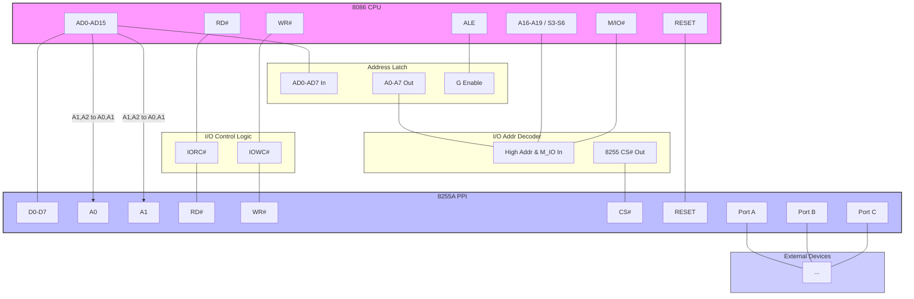

## 📖 微机系统与接口 - 课程概述

*   **本门课程安排:**
    *   **第一部分:** 80X86CPU 微机原理与接口技术 (理论28学时, 实验16学时)
    *   **第二部分:** 8051单片机及其应用 (理论20学时, 配套课程设计1周1学分)
*   **先修课程:**
    *   数字电路
    *   计算机基础知识
    *   程序设计基础

*(案例展示：温室电炉控制系统、AI音箱等说明了基于控制器的智能系统是本课程知识的应用领域)*

---

## 📚 第1章 计算机基础

---
### 1.1 微型计算机的发展

1.  **微型计算机的诞生与发展:**
    *   **标志:** 1971年，美国Intel公司研制出 **Intel 4004** 微处理器芯片。
        *   特点：4位，集成2300晶体管，每秒6万次运算。
    *   **核心:** 以4004为核心组成的MCS-4计算机是世界上第一台微型计算机。
2.  **微机概念:** 💻
    *   以大规模、超大规模集成电路构成的 **微处理器 (CPU)** 为核心。
    *   配以 **存储器**、**输入/输出设备** 及 **系统总线** 所组成的计算机。
3.  **发展阶段划分标志:** 📈
    *   **字长** 和 **微处理器型号**。

---

### 1.2 微型计算机的常用术语 (重点掌握)

1.  **位 (bit):** 
    *   计算机表示数据的 **最小最基本** 单位。
    *   取值为 0 或 1 的二进制位。
    *   单位符号: `b`。
2.  **字节 (Byte):**
    *   由 **8个二进制位** 组成。
    *   通常作为计算机 **存储器容量** 的基本单位。
    *   单位符号: `B`。
    *   容量单位换算:
        *   $1KB = 1024 B = 2^{10} B$
        *   $1MB = 1024 KB = 2^{20} B$
        *   $1GB = 1024 MB = 2^{30} B$
        *   $1TB = 1024 GB = 2^{40} B$
3.  **字长 (Word Length):** 📏
    *   微处理器 **一次** 可以处理的二进制数的位数。
    *   通常取决于CPU内部 **通用寄存器** 的位数和 **数据总线** 的宽度。
    *   常见字长：4位、8位、16位、32位等。
    *   **例:** 8086是16位微处理器，8088是准16位微处理器。
4.  **主频 (Clock Speed):** ⏱️
    *   即主时钟频率，表示微处理器的 **运行速度**。
    *   单位: 赫兹 (Hz)。
    *   主频越高，运行速度越快。

---

### 1.3 计算机中数据的编码 (重点掌握)

*   **基本原则:** 计算机中的数据都采用 **二进制** 形式编码。

1.  **常用的进制数:**
    *   日常: 十进制 (D)
    *   计算机硬件: 二进制 (B)
    *   编程中常用: 十进制 (D)、十六进制 (H)
    *   **例:** 56D (十进制), 01011101B (二进制), 5DH (十六进制)
2.  **整数的表示:**
    *   **带符号整数 (Signed):** 最高位为 **符号位** (0为正, 1为负)，其余为数值位。
        *   格式: `符号位 | 数值部分` (如: $D_f D_{n-2} ... D_1 D_0$)
    *   **无符号整数 (Unsigned):** 所有二进制位都是 **数值位**。
        *   格式: `数值部分` (如: $D_{n-1} D_{n-2} ... D_1 D_0$)
    *   常见位数 `n`: 8, 16, 32, 64。
    *   二进制加减法规则: 逢2进1，借1当2。
3.  **带符号数的编码方案 (原码, 反码, 补码):** 👍
    *   **原码 ([X]原):** 符号位 + 数值的绝对值的二进制。
        *   8位原码: `[+0]原 = 00000000`, `[-0]原 = 10000000` (0有两种表示)
        *   数值范围 (8位): -127 ~ +127
    *   **反码 ([X]反):**
        *   正数: 反码与原码相同。
        *   负数: 符号位不变，数值位按位取反。
        *   8位反码: `[+0]反 = 00000000`, `[-0]反 = 11111111` (0仍有两种表示)
        *   数值范围 (8位): -127 ~ +127
    *   **补码 ([X]补):** ⭐ **计算机中实际使用的编码方案** ⭐
        *   **正数:** 补码与原码相同。
        *   **负数:** 补码 = 反码 + 1。
        *   8位补码: `[0]补 = [+0]补 = [-0]补 = 00000000` (0的表示唯一)
        *   数值范围 (8位): **-128 ~ +127** (比原码、反码多表示一个负数)
        *   **运算规则:** 符号位参与运算，逢2进1，借1当2。
        *   **优点:** 可以将 **减法运算转换为加法运算**，简化硬件设计 (只需加法器)。
            *   $\boxed{[X+Y]_{补} = [X]_{补} + [Y]_{补}}$
            *   $\boxed{[X-Y]_{补} = [X]_{补} + [-Y]_{补}}$
        *   **注意:** 程序中的带符号数由编译系统自动转换为补码。
4.  **计算机中常用的其他编码:**
    *   **ASCII码 (美国信息交换标准代码):** 🔡
        *   用于表示 **西文字符** (字母、数字、符号、控制符)。
        *   键盘输入、显示器显示的内容通常是字符，其内部表示为ASCII码。
        *   关键字符组：'0'~'9', 'A'~'Z', 'a'~'z', 回车, 换行等。
    *   **BCD码 (Binary Coded Decimal - 二进制编码的十进制):**
        *   用 **4位二进制数** 表示 **一位十进制数** (0~9)。
        *   常用的是 **8421 BCD码**。
        *   **两种格式:**
            *   **压缩BCD码 (Packed BCD):** 一个字节(8位)存放 **两位** 十进制数。
                *   例: (4256)D = `0100 0010 0101 0110 B` (压缩BCD)
            *   **非压缩BCD码 (Unpacked BCD):** 一个字节(8位)存放 **一位** 十进制数，高4位通常为0。
                *   例: (4256)D = `0000 0100 0000 0010 0000 0101 0000 0110 B` (非压缩BCD)
        *   **运算规则:** 在4位内部按二进制运算，位组之间按十进制逢十进一。

---

### 1.4 微型计算机的系统组成 (重点掌握)

1.  **系统层级:** (见图 Page 19, 20) 🏗️
    *   **微型计算机系统 (Microcomputer System):** 硬件系统 + 软件系统
    *   **微型计算机 (Microcomputer):** 通常指硬件系统 (也称微机、主机)
    *   **微处理器 (Microprocessor - CPU):** 核心芯片
2.  **硬件系统组成:**
    *   **微处理器 (CPU):** 核心部件
        *   **运算器 (ALU):** 数据加工处理 (算术运算: 加减乘除; 逻辑运算: 与或非)。核心是 **加法器**。
        *   **控制器 (CU):** 指挥中心。功能: **取指令、分析指令(译码)、执行指令**。
        *   **寄存器组 (Registers):** CPU内部高速存储单元。功能: **暂存常用数据**，减少访问内存次数，**缩短执行时间**。💾
    *   **存储器 (Memory):** 🧠
        *   **功能:** 存放程序和数据 (以二进制码形式)。
        *   **组成:** 若干存储单元，每单元通常存放8位二进制 (1字节)。
        *   **地址 (Address):** 存储单元的编号。
        *   **内容 (Content):** 存储单元中存放的信息。
        *   **基本操作:** 读操作、写操作。
        *   **读写过程:** (见图 Page 29) CPU通过地址总线指定单元地址，通过控制总线发出读/写信号，通过数据总线传输数据。
    *   **输入/输出 (I/O) 接口:** 🔌
        *   **功能:** 连接 **外设** 和 **CPU**，完成信号电平转换、数据缓冲、地址译码等。
        *   **I/O端口 (Port):** I/O接口中的寄存器，用于存放数据，每个端口有 **唯一地址**。
        *   **常见接口卡:** 显示卡、声卡、网卡、USB接口等。
    *   **输入/输出 (I/O) 设备 (外部设备 / 外设):** ⌨️🖱️🖥️🖨️
        *   **输入设备:** 键盘、鼠标、扫描仪等。
        *   **输出设备:** 显示器(CRT)、打印机、绘图仪等。
    *   **系统总线 (System Bus):** 连接CPU、内存、I/O接口的信息传输通道 (一组公用导线)。
        *   **地址总线 (AB - Address Bus):**
            *   **功能:** 传递 **地址** 信息。
            *   **方向:** **单向** (CPU -> 内存/I/O接口)。
            *   **作用:** 决定CPU可访问的 **内存容量** 大小。
                *   $\boxed{N \text{ 条地址线可访问 } 2^N \text{ 个存储单元}}$
                *   例: 16条 -> $2^{16}$ = 64 KB； 20条 -> $2^{20}$ = 1 MB。
        *   **数据总线 (DB - Data Bus):**
            *   **功能:** 传递 **数据** 信息。
            *   **方向:** **双向**。
            *   **宽度:** 决定一次能传送的数据位数 (与字长相关)。
        *   **控制总线 (CB - Control Bus):**
            *   **功能:** 传递 **控制信号** 和时序信号。
            *   **方向:** **双向** (有CPU发出的控制信号如读/写，也有送向CPU的信号如中断请求)。
3.  **软件系统组成:** 💻
    *   **系统软件:** 操作系统 (OS)、系统实用程序 (如编译程序、诊断程序等)。
    *   **应用软件:** 为解决用户特定问题而编制的程序。

---

### 1.5 微型计算机的工作过程 (重点掌握)

1.  **核心任务:** 计算机工作就是 **执行程序**。 ⚙️
2.  **程序存储:**
    *   程序是 **指令** 的序列。
    *   指令以 **二进制代码** 形式，按 **顺序** 存放在内存的 **连续区域** 中。
3.  **计算机工作的过程 (指令执行周期):** 🔄 (见图 Page 36)
    *   计算机按照 **顺序**，一条条地 **执行指令**。
    *   **指令执行的基本步骤 (循环进行):**
        1.  **取指令 (Fetch):** CPU根据程序计数器(PC)中的地址，从内存读取指令到指令寄存器。
        2.  **分析指令 (Decode):** CPU的控制器对指令进行译码，确定操作类型和操作数地址。
        3.  **执行指令 (Execute):** 控制器发出操作命令，由运算器等部件完成指令规定的操作，并将结果存回寄存器或内存。
### ✅ 本章学习要求总结

*   **【了解】**
    *   计算机发展概况。
*   **【掌握】**
    *   **编码方案:** 带符号数原码、反码、**补码** (重点理解补码原理及优点)；西文字符 **ASCII码**；**BCD码** (压缩与非压缩)。
    *   **基本概念:** 位、字节、字、**字长**。
    *   **理解:** 现代微机中带符号数用 **补码** 表示，字符用 **ASCII码** 表示。
    *   **系统组成:** **CPU (运算器、控制器、寄存器)、存储器、I/O接口、I/O外设、系统总线 (地址、数据、控制)**。
    *   **理解:** 通过 **三总线结构图** 理解CPU访问存储器与外设的工作流程。
    *   **工作原理:** **执行程序** 的过程，即 **取指令 -> 译码 -> 执行指令** 的不断循环。
*   **【作业布置】**
    *   P20 习题 4, 5, 6, 7, 10, 12
---

## 📚 第2章 微处理器的结构和工作模式

---
### 2.1 8086 CPU的内部结构和存储器组织

#### 2.1.1 8086 CPU内部结构及工作过程

**1. 8086/8088 CPU特点**

*   **8086 CPU 特点:**
    *    16根数据总线：可并行传送16位数据。
    *    20根地址总线：能寻址 $2^{20} = 1\text{MB}$ 的内存空间。
    *    I/O端口：用低16位地址线访问，可访问 $2^{16} = 64\text{K}$ 个I/O端口。
*   **8088 CPU 特点:**
    *    内部结构与8086基本相同。
    *    指令队列：8086为6字节，8088为4字节。
    *    外部数据总线：8086为16位，8088为8位。

**2. 8086的内部结构 (⭐ 掌握)**

8086 CPU由两部分组成：

*   **总线接口单元 (Bus Interface Unit, BIU):**
    *   **职责:** 负责CPU与内存和I/O端口间的数据交换。
    *   **功能:**
        *   取指令，送到指令队列。
        *   执行指令时取操作数，送到EU去执行。
        *   执行完指令后存操作数。
*   **指令执行单元 (Execution Unit, EU):**
    *   **职责:** 负责执行指令。
    *   **功能:**
        *   从BIU的指令队列中取指令，送到EU控制器，经译码分析后执行指令。
        *   包含 **算术逻辑单元 (Arithmetic Logic Unit, ALU)**，完成各种算术和逻辑运算。

**3. 8086 CPU的工作过程 (流水线技术 ⭐ 掌握)**

*   **并行工作:** BIU负责取指令和数据传送，EU负责指令译码和执行。
*   **指令队列:** BIU将预取的指令放入队列（8086为6字节），EU可以从队列中直接取指令执行。
*   **流水线 (Pipeline):** 取指令和执行指令可以重叠进行（除JMP、CALL等转移指令外），BIU在EU执行指令且不访问总线时，可以继续预取后续指令填充队列，提高了程序的运行速度。
*   **工作步骤概述:**
    1.  BIU从CS:IP指向的地址取指令，放入指令队列。
    2.  EU从指令队列取指令，译码执行。
    3.  若EU执行指令需要访问内存/IO，则通知BIU进行读写操作。
    4.  若EU执行指令不需访问总线，且队列未满，BIU继续取下一条指令。
    5.  若遇JMP/CALL指令，清空队列，BIU从新地址取指令。
    6.  ALU执行运算，结果状态影响标志寄存器FLAGS。

#### 2.1.2 8086 CPU内部寄存器 ⭐ (重点掌握)

 内部寄存器用于存放操作数、地址、中间结果等，速度快。8088与8086内部寄存器完全相同。

**1. 数据寄存器 (4个16位)**

*   **AX (Accumulator):** 累加器。常用，乘除法有专门用途。可分为 AH (高8位), AL (低8位)。
*   **BX (Base):** 基址寄存器。可存放偏移地址。可分为 BH, BL。
*   **CX (Count):** 计数寄存器。循环指令中作计数器。可分为 CH, CL。
*   **DX (Data):** 数据寄存器。乘除法、I/O操作有专门用途。可分为 DH, DL。

**2. 地址指针和变址寄存器 (4个16位)**

*   **SP (Stack Pointer):** 堆栈指针。与SS配合使用，指向栈顶。
*   **BP (Base Pointer):** 基址指针。与SS配合使用，访问堆栈段中的数据。
*   **SI (Source Index):** 源变址寄存器。可作通用寄存器，可存放偏移地址。串操作中与DS配合指向源串。
*   **DI (Destination Index):** 目的变址寄存器。可作通用寄存器，可存放偏移地址。串操作中与ES配合指向目的串。
*   **作用:** 主要存放段内偏移地址 (Offset)，与段寄存器配合访问内存。用于堆栈、字符串、内存访问。

**3. 段寄存器 (4个16位) ⭐ (掌握)**

*   **CS (Code Segment):** 代码段寄存器。存放代码段的段基地址。
*   **DS (Data Segment):** 数据段寄存器。存放数据段的段基地址。
*   **SS (Stack Segment):** 堆栈段寄存器。存放堆栈段的段基地址。
*   **ES (Extra Segment):** 附加段寄存器。存放附加数据段的段基地址。
*   **作用:** 存放逻辑段的起始地址（段基地址/段基址），是高16位。

**4. 指令指针寄存器 (1个16位) ⭐ (重点掌握)**

*   **IP (Instruction Pointer):** 指令指针。存放 **下一条** 要执行指令的 **偏移地址**。
*   **寻址:** 与CS配合决定下一条指令的物理地址 (CS:IP)。
*   **修改:** 程序运行时，BIU每取出1字节指令，IP自动+1。用户程序 **不能** 直接访问IP，由BIU自动修改或转移指令修改。

**5. 标志寄存器 (1个16位) ⭐ (重点掌握)**

*   **FLAGS:** 包含9个有意义的标志位。
    *   **状态标志 (6个):** 反映ALU运算结果的特征。
        *   **CF (Carry Flag):** 进位标志。无符号数运算最高位产生进/借位时CF=1。`STC`置1, `CLC`清0, `CMC`取反。
        *   **PF (Parity Flag):** 奇偶标志。结果低8位中'1'的个数为偶数时PF=1。
        *   **AF (Auxiliary Carry Flag):** 辅助进位标志。字节运算时，D3->D4有进/借位时AF=1。用于BCD运算调整 (`DAA`, `DAS`)。
        *   **ZF (Zero Flag):** 零标志。运算结果为0时ZF=1。
        *   **SF (Sign Flag):** 符号标志。运算结果最高位为1时SF=1 (表示负数，对有符号数)。
        *   **OF (Overflow Flag):** 溢出标志。有符号数运算结果超出表示范围时OF=1。
            *   字节: -128 ~ +127
            *   字: -32768 ~ +32767
    *   **控制标志 (3个):** 由程序设置，控制CPU操作模式。
        *   **TF (Trap Flag):** 陷阱标志。TF=1时，CPU单步执行（用于调试）。
        *   **IF (Interrupt Flag):** 中断允许标志。IF=1允许CPU响应可屏蔽中断(INTR)。`STI`置1, `CLI`清0。
        *   **DF (Direction Flag):** 方向标志。用于串操作指令。DF=0地址递增(SI++, DI++)，DF=1地址递减(SI--, DI--)。`CLD`清0, `STD`置1。
*   **重要提示:**
    *   程序员需根据数据类型（有符号/无符号/BCD）关注相应的标志位。
    *   ZF, PF可用于所有类型。

#### 2.1.3 8086/8088 CPU的引脚功能 (了解)

*   **AD15~AD0 (8086) / AD7~AD0 (8088):** 地址/数据复用总线，双向，三态。**分时**传送地址和数据。ALE信号用于锁存地址。
*   **A19/S6~A16/S3 (8086) / A19~A8 (8088):** 地址/状态复用总线。传送高位地址或状态信息 (S4S3指示当前段寄存器)。
*   **RD#:** 读信号 (低电平有效)。
*   **WR#:** 写信号 (低电平有效)。
*   **M/IO# (8086) / IO/M# (8088):** 选择访问内存或I/O端口。
*   **CLK:** 时钟输入。
*   **RESET:** 复位信号 (高电平有效)。复位后 CS=FFFFH, IP=0000H。
*   **INTR:** 可屏蔽中断请求。
*   **NMI:** 非屏蔽中断请求。
*   **INTA#:** 中断响应 (低电平有效)。
*   **ALE:** 地址锁存允许。
*   **DT/R:** 数据发送/接收，控制数据总线方向。
*   **DEN#:** 数据允许 (低电平有效)，控制数据收发器。
*   **BHE/S7 (8086 only):** 高字节允许 (低电平有效)，用于选择内存奇地址体 (高字节 D15~D8)。
*   **MN/MX#:** 选择最小/最大工作模式。

#### 2.1.4 8086的存储器组织 ⭐ (重点掌握)

**1. 物理地址与逻辑地址 (⭐ 掌握)**

*   **物理地址:** CPU与内存单元交互使用的 **唯一** 地址，8086/8088为20位 (00000H - FFFFFH, 1MB)。
*   **逻辑地址:** 程序中使用的地址形式，由 **段地址 (Segment)** 和 **偏移地址 (Offset)** 组成，格式为 `段地址:偏移地址` (均为16位)。
    *   段地址 (段基址): 定义一个逻辑段的起始位置 (高16位)。
    *   偏移地址: 段内相对于段起始地址的距离 (16位)。
*   **地址转换 (⭐ 核心公式):** BIU中的地址加法器完成转换。
    $\boxed{物理地址 = 段地址 \times 16 + 偏移地址}$
    (相当于段地址左移4位再加偏移地址)
    *   例如：逻辑地址 1234H:0025H
        物理地址 = 1234H * 16 + 0025H = 12340H + 0025H = 12365H

**2. 内存分段管理 (⭐ 掌握)**

*   **目的:** 将1MB内存空间划分为多个逻辑段，方便管理。
*   **段:** 一个逻辑段最大容量 $2^{16} = 64\text{KB}$。段内地址连续。
*   **段寄存器:** CS, DS, SS, ES 分别存放代码段、数据段、堆栈段、附加段的段基址。
*   **段的关系:** 各段可以独立、连续、部分重叠或完全重叠。
*   **默认段与偏移组合 (⭐ 掌握):**
    *   `CS:IP`  ➡️ 取指令
    *   `SS:SP` / `SS:BP` ➡️ 堆栈操作
    *   `DS:BX` / `DS:SI` / `DS:DI` / `DS:[立即数]` ➡️ 默认数据访问
    *   `ES:DI` ➡️ 串操作目的地址

**3. 堆栈的设置和操作 (⭐ 掌握)**

*   **堆栈:** 内存中开辟的特殊数据区，用于临时保存数据（如返回地址、中断现场、局部变量）。
*   **设置:** 由 `SS:SP` 决定堆栈段的位置和栈顶。SS存段基址，SP存栈顶偏移地址。最大64KB。
*   **操作:**
    *   遵循 **后进先出 (LIFO)** 原则。
    *   `PUSH` (入栈): 先将SP减2 (16位操作)，然后将数据存入SS:SP指向的字单元。
    *   `POP` (出栈): 先从SS:SP指向的字单元取出数据，然后将SP加2。
    *    堆栈向 **低地址方向** 增长。SP始终指向栈顶元素。

**4. 8086存储器的分体结构 (奇偶存储体)**

*   **目的:** 配合16位数据总线，提高访问速度。
*   **结构:** 1MB空间分为两个8位存储体 (各512KB)。
    *   **偶地址体 (Even Bank):** 存放偶地址单元 (0, 2, 4...)，连接数据线 D7~D0，由地址线 **A0=0** 选中。
    *   **奇地址体 (Odd Bank):** 存放奇地址单元 (1, 3, 5...)，连接数据线 D15~D8，由信号线 **BHE=0** (低有效) 选中。
*   **访问:**
    *   **访问偶地址字节:** A0=0, BHE=1 (选中偶体，低字节有效)。
    *   **访问奇地址字节:** A0=1, BHE=0 (选中奇体，高字节有效)。
    *   **访问字 (起始于偶地址):** A0=0, BHE=0 (同时选中两体，16位数据一次完成)。
    *   **访问字 (起始于奇地址):** 需要 **两次** 字节访问 (先奇地址高字节，再偶地址低字节，效率低)。

**5. 8088存储器结构**

*   **结构:** 8位外部数据总线，1MB内存被视为 **一个整体** 的8位存储体。
*   **寻址:** 由 A19~A0 直接寻址字节单元。
*   **访问:** 每次只能读/写 **一个字节**。访问一个字需要两次总线操作。
*   **速度:** 通常比8086慢，尤其是在进行字操作时。

---

### 2.2 8086的工作模式和总线操作

#### 2.2.0💡 工作模式概述

*   **选择:** 8086 CPU 有两种工作模式：最小模式和最大模式，通过 `MN/MX` 引脚电平选择。
    *   `MN/MX` 接高电平 (+5V) ➡️ **最小模式**
    *   `MN/MX` 接地 (0V) ➡️ **最大模式**
*   **最小模式:**
    *   适用于 **单处理器** 系统。
    *   所有控制信号 **直接由CPU产生**。
*   **最大模式:**
    *   适用于 **多处理器** 系统，例如包含 **协处理器** (如 8087 浮点运算协处理器)。
    *   某些控制信号由 **外部的总线控制器 (8288)** 产生。

---

#### 2.2.1 最小模式系统 ⭐ (熟悉原理图和主要信号)

**1. 系统配置图 (见幻灯片图2.10)**

*   **核心硬件:**
    *   8086 CPU (工作在最小模式)
    *   存储器 (RAM/ROM)
    *   I/O接口芯片
    *   **时钟发生器 (8284A):** 提供系统所需的 `CLK` 时钟信号、`READY` 同步信号和 `RESET` 复位信号。
    *   **地址锁存器 (如 3片 74LS373):**
        *  作用：分离 **地址/数据总线 (AD15-AD0)** 和 **地址/状态总线 (A19/S6-A16/S3)** 上的地址信息。
        *   原理：利用 `ALE` (地址锁存允许) 信号，在T1周期的前半段锁存CPU发出的地址信号 (A19-A0) 和 `BHE` 信号。
        *   缓冲功能：同时也起到缓冲驱动的作用。
    *   **双向数据总线收发器 (如 2片 74LS245 for 8086, 1片 for 8088):**
        *    作用：缓冲和控制数据总线的 **数据传输方向**。
        *   控制：方向由 `DT/R` (数据发送/接收) 信号控制，使能由 `DEN` (数据允许) 信号控制。

**2. 主要信号连接与功能**

*   CPU的 `AD15-AD0`, `A19/S6-A16/S3`, `BHE/S7` 先连接到地址锁存器 (74LS373)。
*   锁存器输出构成完整的20位地址总线 (A19-A0) 和 `BHE` 信号，连接到存储器和I/O芯片。
*   CPU的 `AD15-AD0` 同时连接到数据收发器 (74LS245) 的一侧。
*   收发器的另一侧构成系统的数据总线 (D15-D0)，连接到存储器和I/O芯片。
*   CPU直接产生 `M/IO`, `RD`, `WR`, `ALE`, `DT/R`, `DEN` 等控制信号。

---

#### 2.2.2 最大模式系统

**1. 系统配置图 (见幻灯片图2.7)**

*    **主要区别:**
    *   CPU工作在最大模式 (`MN/MX` 接地)。
    *   **增加了总线控制器 (8288):** CPU不再直接提供 `ALE`, `DEN`, `DT/R`, `M/IO`, `WR`, `RD`, `INTA` 等信号，而是输出状态信号 `S2, S1, S0` 给8288，由8288解码产生 **系统总线控制信号** (如 `MRDC`, `MWTC`, `IORC`, `IOWC`, `INTA` 等) 和 `ALE`, `DEN`, `DT/R`。
*   **其他硬件:** 时钟发生器(8284A)、地址锁存器(74LS373)、数据收发器(74LS245)、存储器、I/O接口等与最小模式类似。

---

#### 2.2.3 总线操作时序 ⭐ (掌握基本概念和读/写周期)

**1. 基本概念**

*   **时钟周期 (T周期 / T状态):**
    *  CPU工作的最基本时间单位，是时钟频率 `fCLK` 的倒数：$T = 1 / f_{CLK}$。
    *   例如：`fCLK` = 5MHz, 则 $T = 1 / (5 \times 10^6) = 0.2 \mu s = 200 ns$。
*   **总线周期 (Bus Cycle):**
    *   CPU通过总线 **完成一次** 对存储器或I/O端口的 **读/写操作** 所需的时间。
    *   一个基本的总线周期通常包含 **4个时钟周期 (T1, T2, T3, T4)**。
    *   在T3和T4之间可能插入一个或多个 **等待周期 (Tw)**，用于与慢速设备同步 (`READY` 信号控制)。
*   **指令周期 (Instruction Cycle):**
    *    CPU **执行一条指令** 所需的全部时间。
    *   一个指令周期可能包含 **一个或多个** 总线周期 (取指令、读操作数、写结果等)。

**2. 最小模式下的读总线周期 (见幻灯片图2.17)**

*   **目的:** 从存储器或I/O端口读出一个字节或字的数据。
*   **过程 (4个T状态):**
    *   **T1状态 (地址/状态输出):**
        *   CPU输出20位地址 (`A19-A0`) 和 `BHE` 到复用总线 (`A19/S6-A16/S3`, `AD15-AD0`, `BHE/S7`)。
        *   `M/IO` 信号有效，指示是访问内存 (高) 还是I/O (低)。
        *   `ALE` 信号有效 (高电平)，通知地址锁存器锁存地址和`BHE`。
        *   `DT/R` 信号置低，准备接收数据。
    *   **T2状态 (数据准备):**
        *   地址线 (`AD15-AD0`) 变为高阻态，准备接收数据。
        *   `A19/S6-A16/S3` 和 `BHE/S7` 总线上传送状态信息 (S6-S3, S7)。
        *   **后半周期:** `RD` 信号变为低电平有效，选中存储器或I/O端口进行读操作。
        *   `DEN` 信号变为低电平有效，使能数据收发器接收数据 (`G=0`)。
    *   **T3状态 (数据读入):**
        *   数据通过数据总线 (`D15-D0`)，经数据收发器 (74LS245)，出现在 `AD15-AD0` 线上，被CPU读入。
        *   CPU采样 `READY` 信号，若为低，则在T3后插入等待周期 `Tw`。
    *   **T4状态 (周期结束):**
        *   `RD` 和 `DEN` 信号恢复为无效状态 (高电平)。
        *   总线上的数据和状态信号维持一小段时间后撤销。
        *   读总线周期结束。

**3. 最小模式下的写总线周期 (见幻灯片图2.18)**

*   **目的:** 把CPU的数据写入存储单元或I/O端口。
*   **过程 (与读周期类似，但控制信号和数据方向不同):**
    *   **T1状态 (地址/状态输出):**
        *   同读周期，输出地址和`BHE`，`M/IO` 有效，`ALE` 锁存地址。
        *   `DT/R` 信号置高，准备发送数据。
    *   **T2状态 (数据输出):**
        *   地址/状态线 (`A19/S6-A16/S3`, `BHE/S7`) 输出状态信号。
        *   CPU将要写的数据送到 `AD15-AD0`。
        *   `WR` 信号变为低电平有效，通知存储器或I/O端口准备写入。
        *   `DEN` 信号变为低电平有效，使能数据收发器发送数据。
    *   **T3状态 (数据写入):**
        *   数据稳定在总线上，被写入目标单元。
        *   CPU采样 `READY` 信号，可能插入 `Tw`。
    *   **T4状态 (周期结束):**
        *   `WR` 和 `DEN` 信号恢复为无效状态 (高电平)。
        *   CPU撤销总线上的数据。
        *   写总线周期结束。

---
###  ✅ 本章学习要求总结 

*   **【了解】:**
    *   CPU引脚功能和工作模式、工作时序。
*   **【掌握】:**
    *   ✅ **8086内部结构:** EU和BIU的分工，并行流水线技术。
    *   ✅ **内部寄存器:** 各组寄存器的名称、位数、基本功能， **重点掌握FLAGS各位含义和IP的作用**。
    *   ✅ **存储组织:** 分段管理模式，物理地址、逻辑地址 (段地址、偏移地址) 的概念及转换关系 ( **核心公式** )，理解逻辑段的四大类型 (代码/数据/堆栈/附加)， **掌握堆栈段进出数据的操作规则 (PUSH/POP, SP变化)**。
    *   ✅ **最小模式总线:** 理解CPU如何通过外围芯片引出三大总线，熟悉主要引脚信号 (20位地址线，8088是8位数据线，8086是16位数据线)，常用控制信号 (RD, WR, IO/M, MN/MX, BHE)。
---

## 📚 第3章 8086的寻址方式和指令系统

---
### 3.0 指令基础 (Instruction Basics)

*   **指令定义**: 计算机的指令通常包含 **操作码 (Opcode)** 和 **操作数 (Operand)** 两部分。
    *   操作码：指出操作的性质 (做什么)。
    *   操作数：给出操作的对象 (对谁做)。
*   **寻址方式 (Addressing Mode)**: 指令中说明操作数所在地址的方法。
*   **操作数个数**: 指令可分为单操作数、双操作数、无操作数。
*   **双操作数指令**:
    *   用逗号 `,` 分隔。
    *   右边是 **源操作数 (Source Operand)**。
    *   左边是 **目的操作数 (Destination Operand)**。
    *   ➡️ **格式**: `指令 目的操作数, 源操作数`
*   **例子**: `MOV AX, BX`
    *   含义: 将寄存器 BX 的内容传送到寄存器 AX 中。即 $AX \leftarrow BX$。

---

### 3.1 8086的寻址方式⭐ （重点掌握）

8086 微处理器提供了多种灵活的寻址方式，主要可以分为以下几类：

1.  **立即数寻址 (Immediate Addressing)** 🚀
    *   特点: 操作数直接在指令中给出，作为指令的一部分。
    *   速度: 直接从指令队列取数，执行速度较快。
2.  **寄存器寻址 (Register Addressing)** 🚄
    *   特点: 操作数存放在 CPU 内部的寄存器中。
    *   速度: 不需要访问内存，执行速度最快。
3.  **存储器寻址 (Memory Addressing)** 🐢
    *   特点: 操作数存放在存储器中，指令提供计算操作数地址的信息。
    *   速度: 需要访问内存，执行速度较慢。又可细分为多种形式。
4.  **I/O 端口寻址 (I/O Port Addressing)** 🔌
    *   特点: 用于访问外部设备的 I/O 端口。

*   **说明**: 下面主要以 `MOV` 指令的 **源操作数** 为例来说明各种寻址方式。8088 的指令与 8086 完全兼容，寻址方式也完全相同。

#### 3.1.1 立即寻址方式 (Immediate Addressing)

*   **定义**: 操作数是一个 8 位或 16 位的 **常数** (称为立即数)，直接包含在指令代码中。
*   **例 3.1**: `MOV AL, 26H`
    *   📝 说明: 将 8 位立即数 `26H` 送到 `AL` 寄存器中。
*   **例 3.2**: `MOV CX, 2A50H`
    *   📝 说明: 将 16 位立即数 `2A50H` 送到 `CX` 寄存器中 (`CH` ← `2AH`, `CL` ← `50H`)。
*   **要点**:
    *   立即数可以送到寄存器，也可以送到存储单元。
    *   ⚠️ **立即数只能作源操作数**，不能作目的操作数。
    *   ⚠️ 如果 16 进制立即数以字母 A~F 开头， **前面必须加数字 0**，以区分符号地址。
    *   **例子**: 将 `FF00H` 送到 `AX`，应写成 `MOV AX, 0FF00H`。

#### 3.1.2 寄存器寻址方式 (Register Addressing)

*   **定义**: 操作数存放在指令指定的寄存器中。
*   **可用的寄存器**:
    *   **16 位**: `AX`, `BX`, `CX`, `DX`, `SI`, `DI`, `SP`, `BP`
    *   **8 位**: `AH`, `AL`, `BH`, `BL`, `CH`, `CL`, `DH`, `DL`
*   **例 3.3**: `MOV DX, AX`
    *   📝 设执行前 `AX=3A68H`, `DX=18C7H`。
    *   📝 执行后: `DX` ← `AX`，即 `DX=3A68H`。`AX` 的内容保持不变 (`AX=3A68H`)。
*   **例 3.4**: `MOV CL, AH`
    *   📝 说明: 将 `AH` 寄存器中的 8 位数据传送到 `CL` 寄存器。
*   **注意**:
    *   🚨 **源操作数和目的操作数的长度 (位数) 必须一致**，否则汇编时会出错。
    *   **错误例子**: `MOV CX, AH`
    *   ❓ 原因: 虽然 `CX` (16位) 可以容纳 `AH` (8位) 的数据，但汇编器不知道应将 `AH` 的内容放入 `CH` 还是 `CL`。

#### 3.1.3 存储器寻址方式 (Memory Addressing)⭐ (重点掌握)

*   **定义**: 操作数存放在存储器中，指令用不同的方法给出存储单元的 **有效地址 EA (Effective Address)**，即 **偏移地址**。物理地址由段地址和偏移地址共同决定。
*   **物理地址计算**: 物理地址 (Physical Address) $PA = \text{段基址} \times 16 + \text{有效地址 (EA)}$。段基址通常由段寄存器 (DS, SS, CS, ES) 提供。 $\times 16$ 等效于左移 4 位 (即 $\times 10H$)。
*   **主要形式**:
    1.  直接寻址方式 (Direct Addressing)
    2.  寄存器间接寻址方式 (Register Indirect Addressing)
    3.  寄存器相对寻址方式 (Register Relative Addressing)
    4.  基址变址寻址方式 (Base Indexed Addressing)
    5.  相对基址变址寻址方式 (Relative Base Indexed Addressing)

**1. 直接寻址方式 (Direct Addressing)**

*   **特点**: 操作数的有效地址 EA 直接在指令中以数值形式给出。通常用 `[]` 将地址括起来。
*   **默认段**: 数据默认存放在 **数据段 (Data Segment)**，段地址由 **DS** 寄存器提供。
*   **物理地址**: $\boxed{PA = DS \times 16 + EA}$ (EA 为指令中给出的地址)
*   **例 3.5**: `MOV AX, [2000H]`
    *   📝 说明: 有效地址 `EA = 2000H`。将数据段中偏移地址为 `2000H` 的 **字** (16位) 单元内容送到 `AX`。 (低字节地址 `2000H` 内容送 `AL`，高字节地址 `2001H` 内容送 `AH`)。
    *   (参考图 3.2: 若 `DS=3000H`，则 $PA = 3000H \times 16 + 2000H = 32000H$。若 `(32000H)=34H`, `(32001H)=12H`，则 `AX=1234H`)。
*   **例 3.6**: `MOV AH, [2000H]`
    *   📝 说明: 有效地址 `EA = 2000H`。将数据段中偏移地址为 `2000H` 的 **字节** (8位) 单元内容送到 `AH`。
*   **段超越前缀 (Segment Override Prefix)**: 如果数据不在默认的 DS 段，可以在指令中指定段寄存器。
    *   **例 3.7**: `MOV AX, ES:[500H]`
    *   📝 说明: 从 **附加段 (Extra Segment)** 获取数据，段地址由 **ES** 提供。物理地址 $PA = ES \times 16 + 500H$。
*   **变量/符号地址**: 可以使用变量名 (符号地址) 代替数值地址。变量名代表了它所关联的存储单元的偏移地址。
    *   **例 3.10**:
        ```assembly
        AREA1 DW 0867H ; 定义一个字变量 AREA1，其内容为 0867H
        ...
        MOV AX, AREA1  ; 等价于 MOV AX, [偏移地址(AREA1)]
        ; 或者写成 MOV AX, [AREA1]
        ```
    *   📝 说明: 将 `AREA1` 所在存储单元的一个字 (内容 `0867H`) 取出送到 `AX`。执行后 `AX = 0867H`。

**2. 寄存器间接寻址方式 (Register Indirect Addressing)**

*   **特点**: 操作数的有效地址 EA 存放在指令指定的 **间接寻址寄存器** 中。
*   **可用寄存器**: `BX`, `BP`, `SI`, `DI`。寄存器名外必须加 `[]`。
*   **约定**:
    *   **约定 1**: 如果使用 `BX`, `SI`, 或 `DI`，则默认段寄存器是 **DS**。
        *   $\boxed{PA = DS \times 16 + [BX]}$
        *   $\boxed{PA = DS \times 16 + [SI]}$
        *   $\boxed{PA = DS \times 16 + [DI]}$
        *   **例 3.11**: `MOV BX, [SI]`
            *   📝 设 `DS=1000H`, `SI=2000H`, 内存 `(12000H)=8BH`, `(12001H)=31H`。
            *   $PA = 1000H \times 16 + 2000H = 12000H$。
            *   执行后，将 `12000H` 处的一个字 `318BH` 送入 `BX`，即 `BX=318BH`。 (参考图 3.3)
    *   **约定 2**: 如果使用 `BP`，则默认段寄存器是 **SS** (堆栈段)。
        *   $\boxed{PA = SS \times 16 + [BP]}$
        *   **例子**: `MOV AX, [BP]` 访问堆栈段中 `BP` 指向的字。
*   **段超越**: 同样可以使用段超越前缀来指定非默认段。
    *   **例子**: `MOV BX, DS:[BP]` (强制使用 DS 段访问 BP 指向的地址)
    *   **例子**: `MOV AX, ES:[SI]` (使用 ES 段访问 SI 指向的地址)

**3. 寄存器相对寻址方式 (Register Relative Addressing)**

*   **特点**: 有效地址 EA 是 **间接寻址寄存器** (`BX`, `BP`, `SI`, `DI`) 的内容与一个 **8 位或 16 位位移量 (Displacement)** 之和。
*   **表示**: `MOV reg, 位移量[寄存器]` 或 `MOV reg, [寄存器 + 位移量]`
*   **默认段**: 规则同寄存器间接寻址 (即 `BX, SI, DI` 默认 DS，`BP` 默认 SS)。
*   **物理地址**:
    *   若用 SI: $\boxed{PA = DS \times 16 + [SI] + \text{位移量}}$
    *   若用 BP: $\boxed{PA = SS \times 16 + [BP] + \text{位移量}}$ (其他类似)
*   **例 3.12**: `MOV BX, COUNT[SI]` (假设 `COUNT` 是一个值为 `4000H` 的位移量)
    *   📝 设 `DS=3000H`, `SI=2000H`, `COUNT=4000H`, 内存 `(36000H)=78H`, `(36001H)=56H`。
    *   $EA = [SI] + COUNT = 2000H + 4000H = 6000H$。
    *   $PA = DS \times 16 + EA = 3000H \times 16 + 6000H = 36000H$。
    *   执行后，`BX` ← `(36000H)` 的字内容，即 `BX = 5678H`。 (参考图 3.4)
    *   也可写成 `MOV BX, [SI + COUNT]` 或 `MOV BX, [COUNT + SI]`。

**4. 基址变址寻址方式 (Base Indexed Addressing)**

*   **特点**: 有效地址 EA 是一个 **基址寄存器 (`BX` 或 `BP`)** 的内容与一个 **变址寄存器 (`SI` 或 `DI`)** 的内容之和。
*   **表示**: `MOV reg, [基址寄存器][变址寄存器]` 或 `MOV reg, [基址寄存器 + 变址寄存器]`
*   **默认段**:
    *   若基址寄存器是 `BX`，默认段寄存器是 **DS**。
        *   $\boxed{PA = DS \times 16 + [BX] + [SI]}$
        *   $\boxed{PA = DS \times 16 + [BX] + [DI]}$
    *   若基址寄存器是 `BP`，默认段寄存器是 **SS**。
        *   $\boxed{PA = SS \times 16 + [BP] + [SI]}$
        *   $\boxed{PA = SS \times 16 + [BP] + [DI]}$
*   **例 3.13**: `MOV AX, [BX][SI]`
    *   📝 设 `DS=3000H`, `BX=1200H`, `SI=0500H`, 内存 `(31700H)=CDH`, `(31701H)=ABH`。
    *   $EA = [BX] + [SI] = 1200H + 0500H = 1700H$。
    *   $PA = DS \times 16 + EA = 3000H \times 16 + 1700H = 31700H$。
    *   执行后，`AX` ← `(31700H)` 的字内容，即 `AX = ABCDH`。 (参考图 3.5)

**5. 相对基址变址寻址方式 (Relative Base Indexed Addressing)**

*   **特点**: 有效地址 EA 是 **基址寄存器 (`BX` 或 `BP`)** 内容、 **变址寄存器 (`SI` 或 `DI`)** 内容以及一个 **8 位或 16 位位移量** 三者之和。
*   **表示**: `MOV reg, 位移量[基址寄存器][变址寄存器]` 或 `MOV reg, [基址寄存器 + 变址寄存器 + 位移量]` 等。
*   **默认段**: 规则同基址变址寻址 (即 `BX` 默认 DS，`BP` 默认 SS)。
*   **物理地址**:
    *   若用 BX+SI: $\boxed{PA = DS \times 16 + [BX] + [SI] + \text{位移量}}$
    *   若用 BP+DI: $\boxed{PA = SS \times 16 + [BP] + [DI] + \text{位移量}}$ (其他类似)
*   **例 3.14**: `MOV AX, MASK[BX][SI]` (假设 `MASK` 是值为 `0200H` 的位移量)
    *   📝 设 `DS=2000H`, `BX=1500H`, `SI=0300H`, `MASK=0200H`, 内存 `(21A00H)=BFH`, `(21A01H)=26H`。
    *   $EA = [BX] + [SI] + MASK = 1500H + 0300H + 0200H = 1A00H$。
    *   $PA = DS \times 16 + EA = 2000H \times 16 + 1A00H = 21A00H$。
    *   执行后，`AX` ← `(21A00H)` 的字内容，即 `AX = 26BFH`。 (参考图 3.6)

**存储器间接寻址规则总结 (Slide 23)**:

1.  ✅ 只有 `BX`, `BP`, `SI`, `DI` 可以出现在 `[]` 内用于计算 EA。
2.  ❌ `BX` 和 `BP` 不能 **同时** 出现在一个 `[]` 内。
3.  ❌ `SI` 和 `DI` 也不能 **同时** 出现在一个 `[]` 内。
4.  ➕ 方括号 `[]` 内的各项是相加关系，不同写法可能等价。
    *   例如: `6[BX][SI]`, `[BX+6][SI]`, `[BX+SI+6]` 都是合法的相对基址变址寻址，表示 $EA = [BX] + [SI] + 6$。
5.  🗺️ **默认段规则**:
    *   如果 `[]` 内包含 `BP`，则默认段是 **SS**。
    *   其他情况 (只含 `BX`, `SI`, `DI` 或其组合)，默认段是 **DS**。
    *   (可以使用段超越前缀改变默认段)。

#### 3.1.4 I/O 端口寻址方式 (I/O Port Addressing)

*   **用途**: 用于 CPU 与外部设备 (通过 I/O 接口电路上的端口) 之间的数据传输 (使用 `IN`, `OUT` 指令)。
*   **8086 支持两种 I/O 端口寻址**:

**1. 直接端口寻址 (Direct Port Addressing)**

*   **特点**: 端口地址是一个 **8 位** 的立即数 (范围 00 ~ FFH)，直接写在指令中。
*   **例 3.15**: `IN AL, 63H`
    *   📝 说明: 从端口地址为 `63H` 的端口读入一个字节数据到 `AL` 寄存器。即 $AL \leftarrow \text{端口}(63H)$。

**2. 间接端口寻址 (Indirect Port Addressing)**

*   **特点**: 端口地址是 **16 位** 的 (范围 0000 ~ FFFFH)，该地址预先存放在 **DX** 寄存器中。
*   **例 3.16**:
    ```assembly
    MOV DX, 213H   ; 将 16 位端口地址 213H 送入 DX
    IN AL, DX      ; 从 DX 指定的端口 (213H) 读入字节到 AL
    OUT DX, AL     ; 将 AL 中的内容送给端口 (213H)
    ```
    *   📝 说明: $AL \leftarrow \text{端口}(DX)$，这里 $DX=213H$。

---

### 3.3 8086的指令系统⭐ （重点掌握）

#### 📦 3.3.1 数据传送指令⭐ (重点掌握)

这类指令负责在寄存器、内存单元和I/O端口之间传送数据。

**1. 通用数据传送指令 (General Purpose Data Transfer)**

*   **1) `MOV` 传送指令 (Move)**
    *   格式: `MOV 目的, 源`
    *   功能: $\boxed{目的操作数 \leftarrow 源操作数}$
    *   操作数:
        *   源: 立即数, 通用寄存器, 段寄存器 (除CS), 存储单元
        *   目的: 通用寄存器, 段寄存器 (除CS), 存储单元
    *   ❗注意:
        *   `CS` 不能作为目的操作数。
        *   **源和目的不能同时为存储单元。
        *   段寄存器（如`DS`, `ES`, `SS`）不能直接用立即数赋值，通常需要通过通用寄存器（如`AX`）中转。例如：`MOV AX, DATA_SEG_ADDR; MOV DS, AX`。
        *   至少有一个操作数需要明确指出操作的数据大小（字节或字），可通过寄存器名（如`AL` vs `AX`）或`BYTE PTR`/`WORD PTR`伪指令指定。
        *   `OFFSET` 操作符用于获取标号（内存地址）的偏移地址，而不是内容。例如 `MOV DX, OFFSET ARRAY` 是将 `ARRAY` 的偏移地址送入 `DX`。

*   **2) `PUSH` 进栈指令 (Push Word onto Stack)**
    *   格式: `PUSH 源`
    *   功能: 将源操作数（字）压入堆栈。
    *   操作:
        1.  $SP \leftarrow SP - 2$
        2.  将源操作数（16位）存入 `SS:SP` 指向的堆栈顶部。
    *   操作数: 16位通用寄存器, 段寄存器, 内存字单元。
    *   ❗注意: 源操作数不能是立即数。

*   **3) `POP` 出栈指令 (Pop Word off Stack)**
    *   格式: `POP 目的`
    *   功能: 从堆栈顶部弹出一个字到目的操作数。
    *   操作:
        1.  将 `SS:SP` 指向的堆栈顶部字数据送入目的操作数。
        2.  $SP \leftarrow SP + 2$
    *   操作数: 16位通用寄存器, 段寄存器 (除CS), 内存字单元。
    *   ❗注意: 目的操作数不能是`CS`。

*   **4) `XCHG` 交换指令 (Exchange)**
    *   格式: `XCHG 目的, 源`
    *   功能: $\boxed{目的操作数 \leftrightarrow 源操作数}$
    *   操作数: 寄存器与寄存器之间, 寄存器与存储单元之间。
    *   ❗注意:
        *   不能直接交换两个存储单元的内容。
        *   段寄存器不能参与交换。

*   **5) `XLAT` 表转换指令 (Table Lookup-Translation)**
    *   格式: `XLAT` 或 `XLAT 转换表` （转换表名是可选的，仅作注释）
    *   功能: 查表转换字节代码。 $\boxed{AL \leftarrow [DS:BX + AL]}$
    *   隐式操作数: `BX` 包含转换表的基地址, `AL` 包含要转换的值（作为查表位移量）。
    *   ❗注意:
        *   使用前必须设置好 `BX` 和 `AL`。
        *   该指令只处理字节操作。
        *   表格最大256字节。

**2. 输入输出指令 (Input and Output)**

*   **1) `IN` 输入指令 (Input)**
    *   格式:
        *   `IN AL, 端口地址` (8位端口, $00-FFH$)
        *   `IN AX, 端口地址` (16位端口, $00-FFH$)
        *   `IN AL, DX` (8位端口, $0000-FFFFH$)
        *   `IN AX, DX` (16位端口, $0000-FFFFH$)
    *   功能: 从指定I/O端口读取数据到累加器 (`AL` 或 `AX`)。
    *   ❗注意: 端口地址大于 $FFH$ 时，必须先将端口地址放入 `DX` 寄存器，再使用 `IN AL/AX, DX` 格式。

*   **2) `OUT` 输出指令 (Output)**
    *   格式:
        *   `OUT 端口地址, AL` (8位端口, $00-FFH$)
        *   `OUT 端口地址, AX` (16位端口, $00-FFH$)
        *   `OUT DX, AL` (8位端口, $0000-FFFFH$)
        *   `OUT DX, AX` (16位端口, $0000-FFFFH$)
    *   功能: 将累加器 (`AL` 或 `AX`) 中的数据输出到指定I/O端口。
    *   ❗注意: 端口地址大于 $FFH$ 时，必须先将端口地址放入 `DX` 寄存器。

**3. 地址目标传送指令 (Address Object Transfers)**

*   **1) `LEA` 取有效地址指令 (Load Effective Address)**
    *   格式: `LEA 目的, 源`
    *   功能: 将源操作数（存储单元）的 **偏移地址** 送到目的寄存器。 $\boxed{目的寄存器 \leftarrow OFFSET 源}$
    *   操作数: 源必须是存储单元标号或地址表达式, 目的是16位通用寄存器（除段寄存器）。
    *   ❗注意: `LEA` 取的是地址，而 `MOV` 取的是地址中的内容。 `LEA BX, TABLE` 等价于 `MOV BX, OFFSET TABLE`。

*   **2) `LDS` 将双字送到寄存器和DS指令 (Load Pointer using DS)**
    *   格式: `LDS 目的, 源`
    *   功能: 从源操作数（内存地址）加载一个32位数（双字）到指定的目的寄存器和`DS`段寄存器。
    *   操作: $\boxed{目的寄存器 \leftarrow [源地址]}$ , $\boxed{DS \leftarrow [源地址+2]}$
    *   操作数: 源是内存双字单元, 目的是16位通用寄存器 (常用`SI`)。
    *   ❗注意: 不能使用段寄存器作为目的操作数。

*   **3) `LES` 将双字送到寄存器和ES指令 (Load Pointer using ES)**
    *   格式: `LES 目的, 源`
    *   功能: 类似于`LDS`，但加载的是`ES`段寄存器。
    *   操作: $\boxed{目的寄存器 \leftarrow [源地址]}$ , $\boxed{ES \leftarrow [源地址+2]}$
    *   操作数: 源是内存双字单元, 目的是16位通用寄存器 (常用`DI`)。

**4. 标志传送指令 (Flag Transfers)**

*   **1) `LAHF` 标志送到AH指令 (Load AH from Flags)**
    *   格式: `LAHF`
    *   功能: 将标志寄存器`FLAGS`的低8位传送到`AH`寄存器。 $\boxed{AH \leftarrow FLAGS_{7..0}}$

*   **2) `SAHF` AH送标志寄存器 (Store AH into Flags)**
    *   格式: `SAHF`
    *   功能: 将`AH`寄存器的内容传送到`FLAGS`寄存器的低8位。 $\boxed{FLAGS_{7..0} \leftarrow AH}$

*   **3) `PUSHF` 标志入栈指令 (Push Flags onto Stack)**
    *   格式: `PUSHF`
    *   功能: 将整个16位`FLAGS`寄存器压入堆栈。
    *   操作: $SP \leftarrow SP - 2$, $[SS:SP] \leftarrow FLAGS$

*   **4) `POPF` 标志出栈指令 (Pop Flags off Stack)**
    *   格式: `POPF`
    *   功能: 从堆栈顶部弹出一个字到`FLAGS`寄存器。
    *   操作: $FLAGS \leftarrow [SS:SP]$, $SP \leftarrow SP + 2$

---

#### ➕ 3.3.2 算术运算指令（掌握）

处理四种类型的数：无符号二进制，带符号二进制（补码），无符号压缩BCD，无符号非压缩BCD。影响标志位 `CF, OF, PF, SF, ZF, AF` (除非特别说明)。

**1. 加法指令 (Addition)**

*   **1) `ADD` 加法指令**
    *   格式: `ADD 目的, 源`
    *   功能: $\boxed{目的 \leftarrow 目的 + 源}$

*   **2) `ADC` 带进位的加法指令 (Addition with Carry)**
    *   格式: `ADC 目的, 源`
    *   功能: $\boxed{目的 \leftarrow 目的 + 源 + CF}$
    *   ❗注意: 主要用于多字节（或多字）加法运算。

*   **3) `INC` 增量指令 (Increment)**
    *   格式: `INC 目的`
    *   功能: $\boxed{目的 \leftarrow 目的 + 1}$
    *   ❗注意: **不影响** `CF` 标志位！这是与`ADD 目的, 1` 的主要区别。

*   **4) `AAA` 加法的ASCII调整指令 (ASCII Adjust for Addition)**
    *   格式: `AAA`
    *   功能: 对`AL`中两个非压缩BCD数或ASCII数加法后的结果进行调整。
    *   用法: 通常在`ADD`或`ADC`之后使用。
    *   操作: 检查`AL`低4位，如果>9或`AF`=1，则`AL`+6, `AH`+1, `AF`=1, `CF`=1；否则`AF`=0, `CF`=0。最后将`AL`高4位清零。
    *   ❗注意: 操作数在`AL`，结果影响`AL`, `AH`, `AF`, `CF`。

*   **5) `DAA` 加法的十进制调整指令 (Decimal Adjust for Addition)**
    *   格式: `DAA`
    *   功能: 对`AL`中两个压缩BCD数加法后的结果进行调整。
    *   用法: 通常在`ADD`或`ADC`之后使用。
    *   操作:
        1.  如果`AL`低4位 > 9 或 `AF`=1, 则 `AL` ← `AL` + 06H, `AF`=1。
        2.  如果`AL`高4位 > 9 或 `CF`=1, 则 `AL` ← `AL` + 60H, `CF`=1。
    *   ❗注意: 操作数在`AL`，结果影响`AL`, `AF`, `CF`, `PF`, `SF`, `ZF`。

**2. 减法指令 (Subtraction)**

*   **1) `SUB` 减法指令**
    *   格式: `SUB 目的, 源`
    *   功能: $\boxed{目的 \leftarrow 目的 - 源}$

*   **2) `SBB` 带借位的减法指令 (Subtract with Borrow)**
    *   格式: `SBB 目的, 源`
    *   功能: $\boxed{目的 \leftarrow 目的 - 源 - CF}$
    *   ❗注意: 主要用于多字节（或多字）减法运算。

*   **3) `DEC` 减量指令 (Decrement)**
    *   格式: `DEC 目的`
    *   功能: $\boxed{目的 \leftarrow 目的 - 1}$
    *   ❗注意: **不影响** `CF` 标志位！

*   **4) `NEG` 取负指令 (Negate)**
    *   格式: `NEG 目的`
    *   功能: 求目的操作数的补码（取反加1）。 $\boxed{目的 \leftarrow 0 - 目的}$
    *   ❗注意: 若结果为0，`CF`=0；否则`CF`=1。影响`OF, SF, ZF, AF, PF`。

*   **5) `CMP` 比较指令 (Compare)**
    *   格式: `CMP 目的, 源`
    *   功能: 计算 `目的 - 源`，仅根据结果设置标志位，**不保存结果**。
    *   ❗注意: 用于比较两数大小，常后跟条件转移指令。

*   **6) `AAS` 减法的ASCII调整指令 (ASCII Adjust for Subtraction)**
    *   格式: `AAS`
    *   功能: 对`AL`中两个非压缩BCD数或ASCII数减法后的结果进行调整。
    *   用法: 通常在`SUB`或`SBB`之后使用。
    *   操作: 检查`AL`低4位，如果>9或`AF`=1，则`AL`-6, `AH`-1, `AF`=1, `CF`=1；否则`AF`=0, `CF`=0。最后将`AL`高4位清零。

*   **7) `DAS` 减法的十进制调整指令 (Decimal Adjust for Subtraction)**
    *   格式: `DAS`
    *   功能: 对`AL`中两个压缩BCD数减法后的结果进行调整。
    *   用法: 通常在`SUB`或`SBB`之后使用。
    *   操作:
        1.  如果`AL`低4位 > 9 或 `AF`=1, 则 `AL` ← `AL` - 06H, `AF`=1。
        2.  如果`AL`高4位 > 9 或 `CF`=1, 则 `AL` ← `AL` - 60H, `CF`=1。

**3. 乘法指令 (Multiply)**

*   **1) `MUL` 无符号数乘法指令**
    *   格式: `MUL 源`
    *   功能: 无符号数乘法。
    *   操作:
        *   字节: $\boxed{AX \leftarrow AL \times 源_{byte}}$
        *   字: $\boxed{DX:AX \leftarrow AX \times 源_{word}}$ (DX存高位字, AX存低位字)
    *   操作数: 源可以是寄存器或内存单元；另一个乘数隐含在`AL`或`AX`中。
    *   标志位: `CF` 和 `OF`。如果结果的高半部分（`AH`或`DX`）不为0，则 `CF=OF=1`；否则 `CF=OF=0`。

*   **2) `IMUL` 带符号数乘法指令 (Integer Multiply)**
    *   格式: `IMUL 源`
    *   功能: 带符号数（补码）乘法。
    *   操作: 与`MUL`类似，但进行的是带符号运算。
    *   标志位: `CF` 和 `OF`。如果结果的高半部分（`AH`或`DX`）**不是**低半部分（`AL`或`AX`）的符号扩展，则 `CF=OF=1`；否则 `CF=OF=0`。

*   **3) `AAM` 乘法的ASCII调整指令 (ASCII Adjust for Multiply)**
    *   格式: `AAM`
    *   功能: 将`AL`中的二进制乘积（假定是两个非压缩BCD数相乘的结果，<100）调整为两个非压缩BCD数，分别存入`AH`（十位）和`AL`（个位）。
    *   用法: 通常在`MUL`之后使用（乘数需先屏蔽高4位）。
    *   操作: $\boxed{AH \leftarrow AL / 10}$ , $\boxed{AL \leftarrow AL \pmod{10}}$
    *   ❗注意:
        *   用于非压缩BCD乘法。
        *   在`MUL`之前，通常需要用 `AND AL, 0FH` 和 `AND BL, 0FH` 清除非BCD位。
        *   8086没有压缩BCD乘法调整指令。

**4. 除法指令 (Division)**

*   **1) `DIV` 无符号数除法指令**
    *   格式: `DIV 源`
    *   功能: 无符号数除法。
    *   操作:
        *   字节: $\boxed{AL \leftarrow AX / 源_{byte}}$ (商), $\boxed{AH \leftarrow AX \pmod{ 源_{byte}}}$ (余数)
        *   字: $\boxed{AX \leftarrow DX:AX / 源_{word}}$ (商), $\boxed{DX \leftarrow DX:AX \pmod{ 源_{word}}}$ (余数)
    *   操作数: 源(除数)是寄存器或内存单元；被除数隐含在`AX`(字节)或`DX:AX`(字)。
    *   ❗注意:
        *   若被除数只有8位，需先将`AH`清零 (`MOV AH, 0`)。
        *   若被除数只有16位，需先将`DX`清零 (`XOR DX, DX`)。
        *   如果商超过了`AL`(8位)或`AX`(16位)的容量，或除数为0，会引发 **0号中断** (除法错误)。
    *   标志位: 所有算术标志位状态**未定义**。

*   **2) `IDIV` 带符号数除法指令 (Integer Division)**
    *   格式: `IDIV 源`
    *   功能: 带符号数（补码）除法。
    *   操作: 与`DIV`类似，但进行的是带符号运算。余数的符号与被除数相同。
    *   ❗注意:
        *   带符号除法前，需要进行 **符号扩展** 以设置好被除数。
        *   字节除法：若被除数在`AL`，用 `CBW` 指令将 `AL` 符号扩展到 `AH`。
        *   字除法：若被除数在`AX`，用 `CWD` 指令将 `AX` 符号扩展到 `DX`。
        *   同样存在除法错误中断（商溢出或除零）。
    *   标志位: 所有算术标志位状态**未定义**。

*   **3) `CBW` 把字节转换为字指令 (Convert Byte to Word)**
    *   格式: `CBW`
    *   功能: 将`AL`中的字节按符号位扩展到`AH`，形成一个字在`AX`中。 $\boxed{AX \leftarrow sign\_extend(AL)}$
    *   ❗注意: 用于`IDIV`字节除法前准备被除数。无操作数，不影响标志位。

*   **4) `CWD` 把字转换为双字指令 (Convert Word to Double Word)**
    *   格式: `CWD`
    *   功能: 将`AX`中的字按符号位扩展到`DX`，形成一个双字在`DX:AX`中。 $\boxed{DX:AX \leftarrow sign\_extend(AX)}$
    *   ❗注意: 用于`IDIV`字除法前准备被除数。无操作数，不影响标志位。

*   **5) `AAD` 除法的ASCII调整指令 (ASCII Adjust for Division)**
    *   格式: `AAD`
    *   功能: 在 **除法之前** 将`AX`中两个非压缩BCD数（`AH`为十位，`AL`为个位）调整为一个二进制数存入`AL`，并将`AH`清零。
    *   用法: 在`DIV`之前使用。
    *   操作: $\boxed{AL \leftarrow AH \times 10 + AL}$ , $\boxed{AH \leftarrow 0}$
    *   ❗注意: 是除法前调整，与其他ASCII调整指令不同。

---

#### 💡 3.3.3 逻辑运算和移位指令（掌握）

对操作数进行按位操作。

**1. 逻辑运算指令 (Logical Operations)**

*   **1) `NOT` 取反指令 (Logical Not)**
    *   格式: `NOT 目的`
    *   功能: $\boxed{目的 \leftarrow \neg 目的}$ (按位取反)
    *   操作数: 寄存器 或 存储单元。

*   **2) `AND` 逻辑与指令 (Logical AND)**
    *   格式: `AND 目的, 源`
    *   功能: $\boxed{目的 \leftarrow 目的 \land 源}$ (按位与)
    *   标志位: `CF=0`, `OF=0`, `SF`, `ZF`, `PF`反映结果, `AF`未定义。
    *   用途: 常用于**屏蔽**（清零）某些位（与0相与）。

*   **3) `OR` 逻辑或指令 (Logical OR)**
    *   格式: `OR 目的, 源`
    *   功能: $\boxed{目的 \leftarrow 目的 \lor 源}$ (按位或)
    *   标志位: 同`AND`。
    *   用途: 常用于**置位**某些位（与1相或）。

*   **4) `XOR` 异或操作指令 (Exclusive OR)**
    *   格式: `XOR 目的, 源`
    *   功能: $\boxed{目的 \leftarrow 目的 \forall 源}$ (按位异或)
    *   标志位: 同`AND`。
    *   用途: 常用于**翻转**某些位（与1异或），或将寄存器清零（`XOR AX, AX`）。

*   **5) `TEST` 测试指令 (Test)**
    *   格式: `TEST 目的, 源`
    *   功能: 计算 `目的 \land 源`，仅根据结果设置标志位，**不保存结果**。
    *   标志位: 同`AND`。
    *   用途: 常用于测试某些位是否为1或0，而不改变操作数本身。

**2. 移位指令 (Shift)**

移位次数可以是 1，或者由 `CL` 寄存器的值指定（当次数 > 1时，**需先 MOV CL, count**）。最大移位次数31。

*   **1) `SAL` / `SHL` 算术/逻辑左移指令**
    *   格式: `SAL/SHL 目的, 计数值`
    *   功能: 将目的操作数左移指定位数。
    *   操作: 最高位 (MSB) 移入 `CF`，最低位 (LSB) 补 0。
    *   ❗注意: `SAL` 和 `SHL` 功能完全相同。相当于乘以 $2^{计数值}$。

*   **2) `SHR` 逻辑右移指令**
    *   格式: `SHR 目的, 计数值`
    *   功能: 将目的操作数逻辑右移指定位数。
    *   操作: 最低位 (LSB) 移入 `CF`，最高位 (MSB) 补 0。
    *   ❗注意: 用于**无符号数**除以 $2^{计数值}$。

*   **3) `SAR` 算术右移指令**
    *   格式: `SAR 目的, 计数值`
    *   功能: 将目的操作数算术右移指定位数。
    *   操作: 最低位 (LSB) 移入 `CF`，最高位 (MSB) **保持不变**（符号位扩展）。
    *   ❗注意: 用于**带符号数**除以 $2^{计数值}$。

**3. 循环移位指令 (Rotate)**

移位次数可以是 1 或由 `CL` 指定。

*   **1) `ROL` 循环左移指令**
    *   格式: `ROL 目的, 计数值`
    *   功能: 循环左移。
    *   操作: 最高位 (MSB) 移入 `CF` **并且** 移到 最低位 (LSB)。

*   **2) `ROR` 循环右移指令**
    *   格式: `ROR 目的, 计数值`
    *   功能: 循环右移。
    *   操作: 最低位 (LSB) 移入 `CF` **并且** 移到 最高位 (MSB)。

*   **3) `RCL` 通过进位位循环左移**
    *   格式: `RCL 目的, 计数值`
    *   功能: 带进位循环左移。
    *   操作: `CF` 移入 LSB，MSB 移入 `CF`。（形成一个9位或17位的循环环）

*   **4) `RCR` 通过进位位循环右移**
    *   格式: `RCR 目的, 计数值`
    *   功能: 带进位循环右移。
    *   操作: `CF` 移入 MSB，LSB 移入 `CF`。（形成一个9位或17位的循环环）

---

#### 📜 3.3.4 字符串处理指令（掌握）

用于处理内存中连续存放的数据块（字符串）。

**❗ 字符串指令的约定:**

1.  **源串地址:** 隐含使用 `DS:SI`。
2.  **目的串地址:** 隐含使用 `ES:DI`。
3.  **地址增减:** 由方向标志 `DF` 控制：
    *   `DF=0` (用 `CLD` 指令设置): 每次操作后 `SI` 和 `DI` **递增** (字节操作+1, 字操作+2)。
    *   `DF=1` (用 `STD` 指令设置): 每次操作后 `SI` 和 `DI` **递减** (字节操作-1, 字操作-2)。
4.  **串长度:** 通常由 `CX` 寄存器指定要处理的元素个数（字节数或字数）。
5.  **操作单位:** 指令名可以加后缀 `B` (字节) 或 `W` (字) 来明确，如 `MOVSB`, `MOVSW`。若不加，则需通过操作数（内存变量）类型判断。

**重复前缀 (Repeat Prefixes):**

可加在字符串指令前，使指令重复执行 `CX` 次，每次执行后 `CX` 自动减1。

*   **`REP`:** 无条件重复，直到 `CX=0`。用于 `MOVS`, `STOS`, `LODS` (但 `REP LODS` 意义不大)。
*   **`REPE` / `REPZ`:** 当 `ZF=1` (相等/结果为零) 且 `CX≠0` 时重复。用于 `CMPS`, `SCAS`。
*   **`REPNE` / `REPNZ`:** 当 `ZF=0` (不相等/结果非零) 且 `CX≠0` 时重复。用于 `CMPS`, `SCAS`。

**基本字符串指令:**

*   **1) `MOVS` 字符串传送 (Move String)**
    *   格式: `MOVS 目的串, 源串` (或 `MOVSB`, `MOVSW`)
    *   功能: $\boxed{[ES:DI] \leftarrow [DS:SI]}$，然后根据`DF`更新`SI`, `DI`。
    *   用途: 与`REP`连用实现内存块复制。

*   **2) `CMPS` 字符串比较 (Compare String)**
    *   格式: `CMPS 目的串, 源串` (或 `CMPSB`, `CMPSW`)
    *   功能: 计算 $\boxed{[DS:SI] - [ES:DI]}$，设置标志位，然后根据`DF`更新`SI`, `DI`。不保存结果。
    *   用途: 与`REPE`/`REPNE`连用实现字符串比较。

*   **3) `SCAS` 字符串扫描 (Scan String)**
    *   格式: `SCAS 目的串` (或 `SCASB`, `SCASW`)
    *   功能: 计算 $\boxed{AL/AX - [ES:DI]}$，设置标志位，然后根据`DF`更新`DI`。不保存结果。
    *   用途: 与`REPE`/`REPNE`连用在字符串中搜索特定字符/字（需先将待搜索值放入`AL`/`AX`）。

*   **4) `LODS` 数据串装入 (Load String)**
    *   格式: `LODS 源串` (或 `LODSB`, `LODSW`)
    *   功能: $\boxed{AL/AX \leftarrow [DS:SI]}$，然后根据`DF`更新`SI`。
    *   ❗注意: `REP LODS` 通常无意义，因为每次加载都会覆盖 `AL/AX`。

*   **5) `STOS` 数据串存储 (Store String)**
    *   格式: `STOS 目的串` (或 `STOSB`, `STOSW`)
    *   功能: $\boxed{[ES:DI] \leftarrow AL/AX}$，然后根据`DF`更新`DI`。
    *   用途: 与`REP`连用实现内存块初始化（需先将初始值放入`AL`/`AX`）。

---

#### ↪️ 3.3.5 控制转移指令（掌握）

改变程序默认的顺序执行流程。

**1. 无条件转移和过程调用指令**

*   **1) `JMP` 无条件转移指令 (Jump)**
    *   格式: `JMP 目的`
    *   功能: 无条件地将程序执行权转移到 `目的` 地址。
    *   类型:
        *   **段内 (Near):** 目标地址在当前代码段内，只修改 `IP`。
            *   **直接:** `JMP label` (编译器计算偏移量)。
                *   短转移 (SHORT): 目标在-128到+127字节内，指令中使用8位偏移量。`JMP SHORT label`。
                *   近转移 (NEAR): 目标在-32K到+32K字节内，指令中使用16位偏移量。`JMP label` 或 `JMP NEAR PTR label`。
            *   **间接:** `JMP reg16` 或 `JMP mem_word` (目标地址在寄存器或内存字中)。
        *   **段间 (Far):** 目标地址在其他代码段，同时修改 `CS` 和 `IP`。
            *   **直接:** `JMP FAR PTR label` (指令中包含目标的`CS:IP`)。
            *   **间接:** `JMP mem_dword` (目标`CS:IP`在内存双字中)。

*   **2) `CALL` 过程调用指令 (Call)**
    *   格式: `CALL 目的`
    *   功能: 调用一个子程序（过程）。
    *   操作:
        1.  **保存返回地址:** 将 `CALL` 指令的下一条指令地址压栈。
            *   段内调用 (Near): 压入 `IP` ($SP \leftarrow SP-2$, $[SS:SP] \leftarrow IP$)。
            *   段间调用 (Far): 压入 `CS` 和 `IP` ($SP \leftarrow SP-2$, $[SS:SP] \leftarrow CS$; $SP \leftarrow SP-2$, $[SS:SP] \leftarrow IP$)。
        2.  **转移:** 跳转到 `目的` 地址开始执行子程序（寻址方式同`JMP`）。
    *   过程定义: 使用 `PROC` 和 `ENDP` 伪指令定义，如 `MyProc PROC NEAR ... RET MyProc ENDP`。

*   **3) `RET` 过程返回指令 (Return)**
    *   格式: `RET` 或 `RET n`
    *   功能: 从子程序返回到调用者。
    *   操作:
        *   `RET` (Near): 从堆栈弹出返回地址到 `IP` ($IP \leftarrow [SS:SP]$, $SP \leftarrow SP+2$)。
        *   `RET` (Far): 从堆栈弹出返回地址到 `IP` 和 `CS` ($IP \leftarrow [SS:SP]$, $SP \leftarrow SP+2$; $CS \leftarrow [SS:SP]$, $SP \leftarrow SP+2$)。
        *   `RET n`: 在弹出返回地址后，再将 `SP` 增加 `n` 字节 ($SP \leftarrow SP + n$)。`n`必须是偶数。用于清除调用者压栈传递给子程序的参数。

**2. 条件转移指令 (Conditional Transfer)**

根据上一条指令执行后设置的标志位状态来决定是否跳转。 **所有条件转移都是段内短转移** (范围-128到+127字节)。

*   格式: `J<条件> 标号`
*   **1) 直接标志转移:** 根据单个标志位的状态跳转。
    *   `JC` / `JNC`: CF=1 / CF=0 (有/无进位)
    *   `JZ` / `JE`: ZF=1 / ZF=0 (结果为零/相等)
    *   `JNZ` / `JNE`: ZF=0 / ZF=1 (结果非零/不相等)
    *   `JS` / `JNS`: SF=1 / SF=0 (结果为负/非负)
    *   `JO` / `JNO`: OF=1 / OF=0 (有/无溢出)
    *   `JP` / `JPE`: PF=1 / PF=0 (偶/奇校验)
    *   `JNP` / `JPO`: PF=0 / PF=1 (奇/偶校验)

*   **2) 间接标志转移 (用于比较后):** 根据多个标志位的组合状态跳转。
    *   **无符号数比较 (基于 CF, ZF):**
        *   `JA` / `JNBE`: > / 不小于等于 (CF=0 and ZF=0)
        *   `JAE` / `JNB`: >= / 不小于 (CF=0)
        *   `JB` / `JNAE`: < / 不大于等于 (CF=1)
        *   `JBE` / `JNA`: <= / 不大于 (CF=1 or ZF=1)
    *   **带符号数比较 (基于 SF, OF, ZF):**
        *   `JG` / `JNLE`: > / 不小于等于 (SF=OF and ZF=0)
        *   `JGE` / `JNL`: >= / 不小于 (SF=OF)
        *   `JL` / `JNGE`: < / 不大于等于 (SF≠OF)
        *   `JLE` / `JNG`: <= / 不大于 (SF≠OF or ZF=1)

**3. 循环控制指令 (Iteration Control)**

基于`CX`计数器的条件转移指令，用于控制循环。也都是短转移。

*   **1) `LOOP` 循环指令**
    *   格式: `LOOP 标号`
    *   操作: $\boxed{CX \leftarrow CX - 1}$。若 $CX \neq 0$，则跳转到 `标号`。

*   **2) `LOOPE` / `LOOPZ` 相等/为零时循环**
    *   格式: `LOOPE 标号` 或 `LOOPZ 标号`
    *   操作: $\boxed{CX \leftarrow CX - 1}$。若 $CX \neq 0$ **且** $ZF=1$，则跳转到 `标号`。

*   **3) `LOOPNE` / `LOOPNZ` 不相等/非零时循环**
    *   格式: `LOOPNE 标号` 或 `LOOPNZ 标号`
    *   操作: $\boxed{CX \leftarrow CX - 1}$。若 $CX \neq 0$ **且** $ZF=0$，则跳转到 `标号`。

*   **4) `JCXZ` 若CX为0跳转**
    *   格式: `JCXZ 标号`
    *   操作: 若 $CX = 0$，则跳转到 `标号`。
    *   ❗注意: **不修改** `CX` 的值。常用于在循环开始前检查`CX`是否为0，避免执行0次循环。

**4. 中断指令 (Interrupt)**

*   **1) `INT n` 软件中断指令**
    *   格式: `INT n` ($n$ 为中断类型号, 0-255)
    *   功能: 产生一个软件中断。
    *   操作: 压栈 `FLAGS`, `CS`, `IP` ($TF=0, IF=0$)，然后从中断向量表地址 $4 \times n$ 处取出中断服务程序的入口地址 (`CS:IP`)并跳转。

*   **2) `INTO` 溢出中断指令**
    *   格式: `INTO`
    *   功能: 如果溢出标志位 `OF=1`，则产生 **类型4** 中断。
    *   ❗注意: 通常放在带符号算术运算之后，检查溢出。

*   **3) `IRET` 中断返回指令**
    *   格式: `IRET`
    *   功能: 从中断服务程序返回。
    *   操作: 从堆栈弹出 `IP`, `CS`, `FLAGS`。

---

#### ⚙️ 3.3.6 处理器控制指令（了解）

用于控制处理器状态。

**1. 标志操作指令**

直接设置或清除某些标志位。

*   `CLC`: 清除进位标志 ($\boxed{CF \leftarrow 0}$)
*   `STC`: 设置进位标志 ($\boxed{CF \leftarrow 1}$)
*   `CMC`: 进位标志取反 ($\boxed{CF \leftarrow \neg CF}$)
*   `CLD`: 清除方向标志 ($\boxed{DF \leftarrow 0}$), 用于字符串操作地址递增。
*   `STD`: 设置方向标志 ($\boxed{DF \leftarrow 1}$), 用于字符串操作地址递减。
*   `CLI`: 清除中断允许标志 ($\boxed{IF \leftarrow 0}$), 禁止可屏蔽中断。
*   `STI`: 设置中断允许标志 ($\boxed{IF \leftarrow 1}$), 允许可屏蔽中断。

**2. 停机指令和空操作指令**

*   `HLT`: 停机指令 (Halt)。CPU进入暂停状态，直到收到外部中断 (NMI, INTR若IF=1) 或复位信号。
*   `NOP`: 空操作指令 (No Operation)。占用3个时钟周期，但不执行任何操作。常用于延时或占位。
---

#### 📊 8086 指令系统摘要表

| 名称                          | 格式                 | 功能概要                                                                        | 标志位 (CF,ZF,SF,OF,PF,AF) | 注意                                               |
| :-------------------------- | :----------------- | :-------------------------------------------------------------------------- | :---------------------- | :----------------------------------------------- |
| **数据传送指令**                  |                    |                                                                             |                         | *除 SAHF, POPF 外，一般不影响标志位*                        |
| `MOV` (Move)                | `MOV 目的, 源`        | $\boxed{目的 \leftarrow 源}$                                                   | -                       | 源/目的不能同时为内存；不能`MOV`立即数到段寄存器；`CS`不能作目的。           |
| `PUSH` (Push)               | `PUSH 源`           | 压栈: $\boxed{SP \leftarrow SP-2, [SP] \leftarrow 源}$                         | -                       | 源不能是立即数；只能是16位操作。                                |
| `POP` (Pop)                 | `POP 目的`           | 出栈: $\boxed{目的 \leftarrow [SP], SP \leftarrow SP+2}$                        | -                       | 目的不能是`CS`；只能是16位操作。                              |
| `XCHG` (Exchange)           | `XCHG 目的, 源`       | $\boxed{目的 \leftrightarrow 源}$                                              | -                       | 源/目的不能同时为内存；不能用段寄存器。                             |
| `XLAT` (Translate)          | `XLAT`             | 查表: $\boxed{AL \leftarrow [DS:BX+AL]}$                                      | -                       | `BX`=表基址, `AL`=偏移量；仅字节操作。                        |
| `IN` (Input)                | `IN AL/AX, 端口/DX`  | $\boxed{AL/AX \leftarrow I/O端口}$                                            | -                       | 端口 > FFH 时需用 `DX`。                               |
| `OUT` (Output)              | `OUT 端口/DX, AL/AX` | $\boxed{I/O端口 \leftarrow AL/AX}$                                            | -                       | 端口 > FFH 时需用 `DX`。                               |
| `LEA` (Load Eff Addr)       | `LEA 目的, 源`        | $\boxed{目的 \leftarrow OFFSET 源}$                                            | -                       | 源必须是内存地址；目的为16位通用寄存器。                            |
| `LDS` (Load DS & Ptr)       | `LDS 目的, 源`        | $\boxed{目的 \leftarrow [源], DS \leftarrow [源+2]}$                            | -                       | 源为内存双字；目的为16位通用寄存器。                              |
| `LES` (Load ES & Ptr)       | `LES 目的, 源`        | $\boxed{目的 \leftarrow [源], ES \leftarrow [源+2]}$                            | -                       | 源为内存双字；目的为16位通用寄存器。                              |
| `LAHF` (Load AH Flags)      | `LAHF`             | $\boxed{AH \leftarrow Flags_{LowByte}}$                                     | - (目的AH改变)              |                                                  |
| `SAHF` (Store AH Flags)     | `SAHF`             | $\boxed{Flags_{LowByte} \leftarrow AH}$                                     | AHF (SF,ZF,AF,PF,CF ✓)  |                                                  |
| `PUSHF` (Push Flags)        | `PUSHF`            | 压栈: $\boxed{[SP] \leftarrow Flags}$                                         | -                       |                                                  |
| `POPF` (Pop Flags)          | `POPF`             | 出栈: $\boxed{Flags \leftarrow [SP]}$                                         | 全部 ✓                    |                                                  |
| **算术运算指令**                  |                    |                                                                             |                         |                                                  |
| `ADD` (Add)                 | `ADD 目的, 源`        | $\boxed{目的 \leftarrow 目的 + 源}$                                              | ✓,✓,✓,✓,✓,✓             |                                                  |
| `ADC` (Add with Carry)      | `ADC 目的, 源`        | $\boxed{目的 \leftarrow 目的 + 源 + CF}$                                         | ✓,✓,✓,✓,✓,✓             | 用于多字节加法。                                         |
| `INC` (Increment)           | `INC 目的`           | $\boxed{目的 \leftarrow 目的 + 1}$                                              | -,✓,✓,✓,✓,✓             | **不影响 CF**。                                      |
| `AAA` (ASCII Adjust Add)    | `AAA`              | 非压缩BCD加法调整                                                                  | U,U,U,U,U,✓             | 用于 `ADD/ADC` 后；操作数隐含 `AL`, 结果影响 `AL, AH`。        |
| `DAA` (Decimal Adjust Add)  | `DAA`              | 压缩BCD加法调整                                                                   | U,✓,✓,U,✓,✓             | 用于 `ADD/ADC` 后；操作数隐含 `AL`。                       |
| `SUB` (Subtract)            | `SUB 目的, 源`        | $\boxed{目的 \leftarrow 目的 - 源}$                                              | ✓,✓,✓,✓,✓,✓             |                                                  |
| `SBB` (Sub with Borrow)     | `SBB 目的, 源`        | $\boxed{目的 \leftarrow 目的 - 源 - CF}$                                         | ✓,✓,✓,✓,✓,✓             | 用于多字节减法。                                         |
| `DEC` (Decrement)           | `DEC 目的`           | $\boxed{目的 \leftarrow 目的 - 1}$                                              | -,✓,✓,✓,✓,✓             | **不影响 CF**。                                      |
| `NEG` (Negate)              | `NEG 目的`           | $\boxed{目的 \leftarrow 0 - 目的}$ (求补码)                                        | ✓(1除非结果0),✓,✓,✓,✓,✓     |                                                  |
| `CMP` (Compare)             | `CMP 目的, 源`        | 比较 $\boxed{目的 - 源}$，只影响标志位                                                  | ✓,✓,✓,✓,✓,✓             | 不改变操作数。                                          |
| `AAS` (ASCII Adjust Sub)    | `AAS`              | 非压缩BCD减法调整                                                                  | U,U,U,U,U,✓             | 用于 `SUB/SBB` 后；操作数隐含 `AL`, 结果影响 `AL, AH`。        |
| `DAS` (Decimal Adjust Sub)  | `DAS`              | 压缩BCD减法调整                                                                   | U,✓,✓,U,✓,✓             | 用于 `SUB/SBB` 后；操作数隐含 `AL`。                       |
| `MUL` (Multiply Unsigned)   | `MUL 源`            | 无符号乘法: $AX \leftarrow AL \times src_B$ 或 $DX:AX \leftarrow AX \times src_W$ | ✓,U,U,✓,U,U             | CF=OF=1 如果高半部非零。                                 |
| `IMUL` (Integer Multiply)   | `IMUL 源`           | 带符号乘法: $AX \leftarrow AL \times src_B$ 或 $DX:AX \leftarrow AX \times src_W$ | ✓,U,U,✓,U,U             | CF=OF=1 如果高半部不是符号扩展。                             |
| `AAM` (ASCII Adjust Mul)    | `AAM`              | 乘法调整: $AH \leftarrow AL/10, AL \leftarrow AL \pmod{10}$                     | U,✓,✓,U,✓,U             | 用于 `MUL` 非压缩BCD后 (先屏蔽高4位)。                       |
| `DIV` (Divide Unsigned)     | `DIV 源`            | 无符号除法: $AL,AH \leftarrow AX/src_B$ 或 $AX,DX \leftarrow DX:AX/src_W$         | U,U,U,U,U,U             | 除法错误中断 (商溢出/除零)。                                 |
| `IDIV` (Integer Divide)     | `IDIV 源`           | 带符号除法: $AL,AH \leftarrow AX/src_B$ 或 $AX,DX \leftarrow DX:AX/src_W$         | U,U,U,U,U,U             | 除法错误中断；需先 `CBW/CWD`。                             |
| `AAD` (ASCII Adjust Div)    | `AAD`              | 除法前调整: $AL \leftarrow AH \times 10 + AL, AH \leftarrow 0$                   | U,✓,✓,U,✓,U             | 用于 `DIV` 非压缩BCD **之前**。                          |
| `CBW` (Convert B to W)      | `CBW`              | $\boxed{AH \leftarrow sign\_ext(AL)}$                                       | -                       | 用于 `IDIV` 字节操作前。                                 |
| `CWD` (Convert W to D)      | `CWD`              | $\boxed{DX \leftarrow sign\_ext(AX)}$                                       | -                       | 用于 `IDIV` 字操作前。                                  |
| **逻辑与移位指令**                 |                    |                                                                             |                         |                                                  |
| `NOT` (Not)                 | `NOT 目的`           | $\boxed{目的 \leftarrow \neg 目的}$ (按位取反)                                      | -                       |                                                  |
| `AND` (And)                 | `AND 目的, 源`        | $\boxed{目的 \leftarrow 目的 \land 源}$                                          | 0,✓,✓,0,✓,U             | CF=0, OF=0。                                      |
| `OR` (Or)                   | `OR 目的, 源`         | $\boxed{目的 \leftarrow 目的 \lor 源}$                                           | 0,✓,✓,0,✓,U             | CF=0, OF=0。                                      |
| `XOR` (Exclusive Or)        | `XOR 目的, 源`        | $\boxed{目的 \leftarrow 目的 \forall 源}$                                        | 0,✓,✓,0,✓,U             | CF=0, OF=0。                                      |
| `TEST` (Test)               | `TEST 目的, 源`       | 测试 $\boxed{目的 \land 源}$，只影响标志位                                              | 0,✓,✓,0,✓,U             | CF=0, OF=0；不改变操作数。                               |
| `SHL`/`SAL` (Shift Left)    | `SHL/SAL 目的, cnt`  | 逻辑/算术左移                                                                     | ✓,✓,✓,✓,✓,U             | MSB->CF, LSB<-0；SHL=SAL。                         |
| `SHR` (Shift Logical R)     | `SHR 目的, cnt`      | 逻辑右移                                                                        | ✓,✓,✓,✓,✓,U             | LSB->CF, MSB<-0。                                 |
| `SAR` (Shift Arith R)       | `SAR 目的, cnt`      | 算术右移                                                                        | ✓,✓,✓,✓,✓,U             | LSB->CF, MSB保持不变 (符号扩展)。                         |
| `ROL` (Rotate Left)         | `ROL 目的, cnt`      | 循环左移                                                                        | ✓,-,-,✓,-,-             | MSB->CF & LSB。                                   |
| `ROR` (Rotate Right)        | `ROR 目的, cnt`      | 循环右移                                                                        | ✓,-,-,✓,-,-             | LSB->CF & MSB。                                   |
| `RCL` (Rotate Carry L)      | `RCL 目的, cnt`      | 带进位循环左移                                                                     | ✓,-,-,✓,-,-             | MSB->CF, CF->LSB。                                |
| `RCR` (Rotate Carry R)      | `RCR 目的, cnt`      | 带进位循环右移                                                                     | ✓,-,-,✓,-,-             | LSB->CF, CF->MSB。                                |
| **串操作指令**                   |                    |                                                                             |                         | *使用 DS:SI, ES:DI, CX, DF 约定*                     |
| `MOVS` (Move String)        | `MOVS(B/W)`        | 传送串: $\boxed{[ES:DI] \leftarrow [DS:SI]}$                                   | -                       | `REP MOVSB/W` 用于块移动。                             |
| `CMPS` (Compare String)     | `CMPS(B/W)`        | 比较串: $\boxed{[DS:SI] - [ES:DI]}$, 影响标志                                      | ✓,✓,✓,✓,✓,✓             | `REPE/REPNE CMPSB/W` 用于串比较。                      |
| `SCAS` (Scan String)        | `SCAS(B/W)`        | 扫描串: $\boxed{AL/AX - [ES:DI]}$, 影响标志                                        | ✓,✓,✓,✓,✓,✓             | `REPE/REPNE SCASB/W` 用于串搜索 (先 `MOV AL/AX, key`)。 |
| `LODS` (Load String)        | `LODS(B/W)`        | 装载串: $\boxed{AL/AX \leftarrow [DS:SI]}$                                     | -                       | `REP LODS` 意义不大。                                 |
| `STOS` (Store String)       | `STOS(B/W)`        | 存储串: $\boxed{[ES:DI] \leftarrow AL/AX}$                                     | -                       | `REP STOSB/W` 用于块填充 (先 `MOV AL/AX, value`)。      |
| **控制转移指令**                  |                    |                                                                             |                         |                                                  |
| `JMP` (Jump)                | `JMP 目标`           | 无条件跳转                                                                       | -                       | 近/远，直接/间接。                                       |
| `Jcc` (Conditional Jump)    | `Jcc 标号`           | 条件跳转 (见下述具体条件)                                                              | (见下)                    | 18种条件，**总是短转移** (-128到+127字节)。                   |
| *直接标志转移*                    |                    |                                                                             |                         |                                                  |
| JC / JNC                    |                    | 有进位 (CF=1) / 无进位 (CF=0) 时转移                                                 | `CF=1` / `CF=0`         |                                                  |
| JZ / JE                     |                    | 结果为零/相等 (ZF=1) 时转移                                                          | `ZF=1`                  |                                                  |
| JNZ / JNE                   |                    | 结果非零/不相等 (ZF=0) 时转移                                                         | `ZF=0`                  |                                                  |
| JS / JNS                    |                    | 结果为负 (SF=1) / 结果非负 (SF=0) 时转移                                               | `SF=1` / `SF=0`         |                                                  |
| JO / JNO                    |                    | 有溢出 (OF=1) / 无溢出 (OF=0) 时转移                                                 | `OF=1` / `OF=0`         |                                                  |
| JP / JPE                    |                    | 偶校验 (PF=1) 时转移                                                              | `PF=1`                  | (Parity Even)                                    |
| JNP / JPO                   |                    | 奇校验 (PF=0) 时转移                                                              | `PF=0`                  | (Parity Odd)                                     |
| *间接标志转移 (无符号比较）*            |                    |                                                                             |                         |                                                  |
| JA / JNBE                   |                    | 大于 / 不小于等于 (CF=0 and ZF=0) 时转移                                              | `CF=0 and ZF=0`         | (Above / Not Below Equal)                        |
| JAE / JNB                   |                    | 大于等于 / 不小于 (CF=0) 时转移                                                       | `CF=0`                  | (Above Equal / Not Below)                        |
| JB / JNAE                   |                    | 小于 / 不大于等于 (CF=1) 时转移                                                       | `CF=1`                  | (Below / Not Above Equal)                        |
| JBE / JNA                   |                    | 小于等于 / 不大于 (CF=1 or ZF=1) 时转移                                               | `CF=1 or ZF=1`          | (Below Equal / Not Above)                        |
| *间接标志转移 (带符号比较):*           |                    |                                                                             |                         |                                                  |
| JG / JNLE                   |                    | 大于 / 不小于等于 (SF=OF and ZF=0) 时转移                                             | `(SF=OF) and ZF=0`      | (Greater / Not Less Equal)                       |
| JGE / JNL                   |                    | 大于等于 / 不小于 (SF=OF) 时转移                                                      | `SF=OF`                 | (Greater Equal / Not Less)                       |
| JL / JNGE                   |                    | 小于 / 不大于等于 (SF≠OF) 时转移                                                      | `SF≠OF`                 | (Less / Not Greater Equal)                       |
| JLE / JNG                   |                    | 小于等于 / 不大于 (SF≠OF or ZF=1) 时转移                                              | `(SF≠OF) or ZF=1`       | (Less Equal / Not Greater)                       |
| `LOOP` (Loop)               | `LOOP 标号`          | $\boxed{CX \leftarrow CX-1}$, 若 $CX \neq 0$ 则跳转                             | -                       | 短转移。                                             |
| `LOOPE`/`LOOPZ` (Loop Eq)   | `LOOPE/Z 标号`       | $\boxed{CX \leftarrow CX-1}$, 若 $CX \neq 0$ 且 $ZF=1$ 则跳转                    | -                       | 短转移。                                             |
| `LOOPNE`/`LOOPNZ` (Loop NE) | `LOOPNE/NZ 标号`     | $\boxed{CX \leftarrow CX-1}$, 若 $CX \neq 0$ 且 $ZF=0$ 则跳转                    | -                       | 短转移。                                             |
| `JCXZ` (Jump CX Zero)       | `JCXZ 标号`          | 若 $\boxed{CX = 0}$ 则跳转                                                      | -                       | 短转移；不改变 CX。                                      |
| `CALL` (Call)               | `CALL 目标`          | 调用子程序 (压栈返回地址)                                                              | -                       | 近/远。                                             |
| `RET` (Return)              | `RET` / `RET n`    | 从子程序返回 (弹栈返回地址 [+n])                                                        | -                       | 近/远。                                             |
| `INT` (Interrupt)           | `INT 类型号`          | 软件中断                                                                        | - (压栈Flags, 清TF/IF)     |                                                  |
| `INTO` (Int on Overflow)    | `INTO`             | 若 $\boxed{OF=1}$ 则 INT 4                                                    | - (若中断发生同INT)           |                                                  |
| `IRET` (Interrupt Return)   | `IRET`             | 从中断返回 (弹栈IP, CS, Flags)                                                     | 全部 ✓ (从堆栈恢复)            |                                                  |
| **处理器控制指令**                 |                    |                                                                             |                         |                                                  |
| `CLC` (Clear Carry)         | `CLC`              | $\boxed{CF \leftarrow 0}$                                                   | 0,-,-,-,-,-             |                                                  |
| `STC` (Set Carry)           | `STC`              | $\boxed{CF \leftarrow 1}$                                                   | 1,-,-,-,-,-             |                                                  |
| `CMC` (Complement Carry)    | `CMC`              | $\boxed{CF \leftarrow \neg CF}$                                             | ✓,-,-,-,-,-             |                                                  |
| `CLD` (Clear Direction)     | `CLD`              | $\boxed{DF \leftarrow 0}$ (地址递增)                                            | -                       | 用于串操作。                                           |
| `STD` (Set Direction)       | `STD`              | $\boxed{DF \leftarrow 1}$ (地址递减)                                            | -                       | 用于串操作。                                           |
| `CLI` (Clear Interrupt)     | `CLI`              | $\boxed{IF \leftarrow 0}$ (关中断)                                             | -                       | 屏蔽 INTR 中断。                                      |
| `STI` (Set Interrupt)       | `STI`              | $\boxed{IF \leftarrow 1}$ (开中断)                                             | -                       | 允许 INTR 中断。                                      |
| `HLT` (Halt)                | `HLT`              | 暂停 CPU                                                                      | -                       | 等待中断或复位。                                         |
| `NOP` (No Operation)        | `NOP`              | 空操作                                                                         | -                       | 占用时钟周期，无实际操作。                                    |
**说明:**
*   **名称:** 指令助记符 (英文全称)
*   **格式:** 指令的基本语法结构，`目的` 代表目的操作数，`源` 代表源操作数，`标号` 代表跳转目标地址，`端口` 代表I/O端口地址，`类型号` 代表中断类型号。
*   **功能:** 指令作用的简要概括。
*   **标志位:** 指令执行后对主要算术和状态标志位的影响。
    *   `✓`: 表示该标志位受影响，其值根据运算结果确定。
    *   `0`: 表示该标志位被清零。
    *   `1`: 表示该标志位置位。
    *   `-`: 表示该标志位不受影响。
    *   `U`: 表示该标志位状态未定义或在提供的资料中未明确说明。
    *   `AHF`: LAHF/SAHF 只影响低8位标志 (SF, ZF, AF, PF, CF)。
    *   `(见下)` / `(见上)`: 特指 `Jcc` 指令，其对标志位无影响，但跳转行为依赖于标志位状态，具体条件见下方/上方列表。
*   **注意:** 使用该指令时的重要说明或易错点。
---

### ✅ 本章学习要求总结

*   **【掌握】**
    *   **基本概念:** **指令** (操作码、操作数)、**指令系统** 的概念、**指令格式** (单操作数、双操作数、无操作数，源操作数与目的操作数)。
    *   **寻址方式 (重点):**
        *   理解寻址方式是指令中确定操作数位置的方法。
        *   掌握8086的主要寻址方式分类：**立即数寻址**、**寄存器寻址**、**存储器寻址**、**I/O端口寻址**。
        *   **立即数寻址:** 操作数直接在指令中给出 (常数)；只能作源操作数；以字母开头的16进制数前需加0 (如 `0FF00H`)。
        *   **寄存器寻址:** 操作数在CPU内部寄存器中 (速度最快)；注意源和目的寄存器长度必须一致 (如 `MOV CX, AH` 错误)。
        *   **存储器寻址:** 操作数在内存中，指令给出确定内存单元 **有效地址(EA)** 的方法。
            *   **直接寻址:** 指令中直接给出EA (如 `MOV AX, [2000H]`) 或使用变量名 (如 `MOV AX, VAR1` 或 `MOV AX, [VAR1]`)；默认段为 `DS`。
            *   **寄存器间接寻址:** EA 在寄存器 `BX`, `BP`, `SI`, `DI` 中 (如 `MOV AX, [SI]`)；寄存器名外必须加 `[]`；默认段规则：`BX/SI/DI` 用 `DS`，`BP` 用 `SS`。
            *   **寄存器相对寻址:** EA = 寄存器内容 + 8/16位位移量 (如 `MOV AX, COUNT[SI]` 或 `MOV AX, [SI+COUNT]`)；默认段规则同上。
            *   **基址变址寻址:** EA = 基址寄存器 (`BX` 或 `BP`) + 变址寄存器 (`SI` 或 `DI`) (如 `MOV AX, [BX][SI]`)；默认段规则：`BX` 用 `DS`，`BP` 用 `SS`。
            *   **相对基址变址寻址:** EA = 基址寄存器 + 变址寄存器 + 8/16位位移量 (如 `MOV AX, MASK[BX][SI]` 或 `MOV AX, [BX+SI+MASK]`)；默认段规则同上。
            *   **间接寻址规则:** `[]` 内只能是 `BX, BP, SI, DI` 的组合；`BX` 与 `BP` 不能同时出现，`SI` 与 `DI` 不能同时出现；`[]` 内包含 `BP` 时默认段为 `SS`，否则为 `DS`。
            *   **段超越前缀:** 可以显式指定段寄存器 (如 `MOV AX, ES:[SI]`)。
        *   **I/O端口寻址:**
            *   **直接端口寻址:** 8位端口地址 (00-FFH) 直接在 `IN`/`OUT` 指令中给出 (如 `IN AL, 63H`)。
            *   **间接端口寻址:** 16位端口地址 (0000-FFFFH) 先放入 `DX`，再通过 `DX` 访问 (如 `MOV DX, 213H; IN AL, DX`)。
    *   **指令系统 (熟悉六大类指令的功能、格式、操作数类型、对标志位的影响):**
        *   **数据传送:** `MOV`, `PUSH`, `POP`, `XCHG`, `XLAT`, `IN`, `OUT`, `LEA`, `LDS`, `LES`, `LAHF`, `SAHF`, `PUSHF`, `POPF`。
        *   **算术运算:** `ADD`, `ADC`, `SUB`, `SBB`, `INC`, `DEC`, `NEG`, `CMP`, `MUL`, `IMUL`, `DIV`, `IDIV`；以及相应的BCD/ASCII调整指令 (`AAA`, `DAA`, `AAS`, `DAS`, `AAM`, `AAD`)；符号扩展指令 (`CBW`, `CWD`)。
        *   **逻辑与移位:** `NOT`, `AND`, `OR`, `XOR`, `TEST`；移位 (`SAL`/`SHL`, `SHR`, `SAR`)；循环移位 (`ROL`, `ROR`, `RCL`, `RCR`)。
        *   **串操作:** 理解 `DS:SI`, `ES:DI`, `DF`, `CX` 的约定；重复前缀 (`REP`, `REPE/Z`, `REPNE/NZ`)；`MOVS`, `CMPS`, `SCAS`, `LODS`, `STOS`。
        *   **控制转移:** `JMP` (段内/段间, 直接/间接), `CALL`/`RET` (近/远), 条件跳转 `Jcc`, 循环 `LOOP`/`LOOPE/Z`/`LOOPNE/NZ`, `JCXZ`, 中断 `INT`, `INTO`, `IRET`。
        *   **处理器控制:** 标志操作 (`CLC`, `STC`, `CMC`, `CLD`, `STD`, `CLI`, `STI`), `HLT`, `NOP`。

*   **【作业布置】**
    *   P113 习题 1、2、5、6、7、8、10、11、12、14、15。
## 📜 第4章 汇编程序设计

---
### 4.1 完整的汇编语言源程序框架⭐ （重点掌握）

一个典型的汇编语言源程序通常包含以下几个部分：

*   **数据段 (DATA SEGMENT):** 用于存放程序中使用的变量和数据。
    ```assembly
    DATA SEGMENT
        X DB ?     ; 定义一个字节变量 X，初始值未知
        Y DW ?     ; 定义一个字变量 Y，初始值未知
    DATA ENDS
    ```
*   **附加段 (EXTRA SEGMENT):** 可选段，用于存放额外的数据，常用于字符串操作的目的串。
    ```assembly
    EXTRA SEGMENT
        ALPHA DB ?
        BETA DW ?
    EXTRA ENDS
    ```
*   **堆栈段 (STACK SEGMENT):** 用于程序运行时的堆栈空间，存放临时数据、返回地址等。
    ```assembly
    STACK SEGMENT PARA STACK 'STACK' ; 定义堆栈段，类型为STACK
        DB 100 DUP(?)        ; 定义100字节的堆栈空间，初始值未知
    STACK ENDS
    ```
*   **代码段 (CODE SEGMENT):** 包含程序的执行指令。
    ```assembly
    CODE SEGMENT
        ASSUME CS:CODE, DS:DATA, ES:EXTRA, SS:STACK ; 设定段寄存器与逻辑段的关联

    START: ; 程序入口点标号
        ; --- 初始化段寄存器 ---
        MOV AX, DATA      ; 获取数据段的段地址
        MOV DS, AX        ; 设置 DS 指向数据段
        MOV AX, EXTRA     ; 获取附加段的段地址 (如果使用了)
        MOV ES, AX        ; 设置 ES 指向附加段 (如果使用了)

        ; --- 程序主体指令 ---
        ... ...

        ; --- 程序结束，返回DOS ---
        MOV AH, 4CH       ; DOS 功能号 4CH: 结束程序
        INT 21H           ; 调用DOS中断

    CODE ENDS
    END START ; 结束整个源程序，并指定程序入口点为 START
    ```

**✨ 源程序结构要点总结:**

1.  **逻辑段定义:** 至少需要定义代码段 (`CODE`)，通常也需要数据段 (`DATA`) 和堆栈段 (`STACK`)。附加段 (`EXTRA`) 根据需要定义。
2.  **`ASSUME` 语句:** 告诉汇编器逻辑段与段寄存器的**约定**关系，例如 `ASSUME CS:CODE, DS:DATA`。这**不会**自动加载段寄存器。
3.  **段寄存器赋值:** 程序开始时必须显式加载 `DS` 和 `ES` (如果用到)。通常通过 `AX` 中转，例如 `MOV AX, DATA; MOV DS, AX`。`CS` 和 `IP` 由加载程序（或操作系统）根据 `END` 语句指定的入口点设置。`SS` 和 `SP` 通常由链接器或操作系统根据 `STACK` 段的定义自动设置。
4.  **入口标号:** 主程序的第一条可执行指令处需要定义一个标号（如 `START`），并在 `END` 语句中指明。
5.  **返回DOS:** 程序正常结束的标准方式是使用 `INT 21H` 的 `4CH` 功能调用。
6.  **`END` 语句:** 标志源程序的结束，并且必须指定程序的入口点标号（如 `END START`）。

**🔄 标准序语句返回DOS:**

另一种返回DOS的方式是将主程序定义为一个 `FAR` 过程，通过 `RET` 指令返回。这种方式在早期DOS程序中常见，需要手动保存和恢复 `DS`。

```assembly
CODE SEGMENT
    ASSUME CS:CODE, DS:DATA, ES:EXTRA, SS:STACK
START PROC FAR          ; 定义主程序为远程过程
    PUSH DS             ; 保存调用者(DOS)的DS
    MOV AX, 0           ; 清零AX用于 PUSH AX，提供一个0的返回码
    PUSH AX             ; 压入返回码
    MOV AX, DATA        ; 初始化DS, ES
    MOV DS, AX
    MOV AX, EXTRA
    MOV ES, AX
    ; ... 程序主体 ...
    RET                 ; 通过远程返回指令结束程序并返回DOS
START ENDP
CODE ENDS
END START
```

**⚙️ 操作系统加载程序时的准备工作:**

当汇编、链接后的 `.EXE` 文件被执行时，操作系统（如DOS）会做以下准备：

1.  **程序段前缀区 (PSP):** 在程序加载前建立一个256字节的PSP，存放程序相关信息。PSP的起始地址（偏移0）处有一条 `INT 20H` 指令 (旧的返回DOS方式)。
2.  **DS/ES 初始化:** `DS` 和 `ES` 寄存器被设置为指向PSP的起始地址。**这就是为什么我们程序开始时需要重新设置DS和ES指向我们自己的数据段和附加段。**
3.  **CS:IP 初始化:** `CS` 设置为代码段的基地址，`IP` 设置为 `END` 语句指定的入口标号的偏移地址。
4.  **SS:SP 初始化:** 如果定义了 `STACK` 类型的堆栈段，链接器 `LINK` 会自动设置 `SS:SP` 指向栈底；否则操作系统会自动分配堆栈。

---

### 4.2 DOS系统功能调用（掌握）
---
DOS (Disk Operating System) 提供了一系列中断服务程序，其中 `INT 21H` 是最常用也最重要的一个，它包含了大量的子功能，用于处理文件操作、输入输出、内存管理等。调用这些功能的通用步骤是：

1.  将 **子功能号** 放入 `AH` 寄存器。
2.  根据具体功能的要求，将 **入口参数** 放入指定的寄存器（如 `DL`, `DX`, `AL` 等）。
3.  执行 `INT 21H` 指令。
4.  根据需要，从指定的寄存器（如 `AL`）获取 **出口参数** 或检查执行结果。

本课程（根据课件内容）主要要求掌握以下几个基本输入输出和程序控制相关的 `INT 21H` 功能：

| 功能号 (AH) | 作用 (Purpose)             | 入口参数 (Input Parameters)                                         | 出口参数 / 注意点 (Output / Notes)                                                                                                                                                                                                                                                                           |
| :------- | :----------------------- | :-------------------------------------------------------------- | :---------------------------------------------------------------------------------------------------------------------------------------------------------------------------------------------------------------------------------------------------------------------------------------------------- |
| **01H**  | ⌨️ **键盘输入单个字符 (带回显)**    | `AH = 01H`                                                      | **出口:** `AL = 输入字符的ASCII码` <br/> **注意:** 程序会暂停等待用户按键。输入的字符会显示在屏幕上。如果输入的是扩展字符（如功能键），AL 会是 0，需要再次调用 01H 或其他功能获取扩展码。可以响应 `Ctrl+C` 中断程序。                                                                                                                                                                  |
| **02H**  | 🖥️ **屏幕输出单个字符**         | `AH = 02H` <br/> `DL = 要输出字符的ASCII码`                            | **注意:** 将 `DL` 中的字符显示在当前光标位置，然后光标后移一位。这是最基础的字符输出方式。`DL` 中必须是字符的ASCII码。                                                                                                                                                                                                                                |
| **09H**  | 📝 **屏幕输出字符串**           | `AH = 09H` <br/> `DS:DX = 指向要输出字符串的内存地址`                        | **注意:** 字符串必须以美元符号 `'$'` 作为结束标志，`'$'` 本身不会被显示。字符串可以包含控制字符，例如 `0DH` (回车) 和 `0AH` (换行)。需要确保 `DS` 段寄存器正确指向包含字符串的数据段。                                                                                                                                                                                     |
| **0AH**  | ⌨️📝 **键盘输入字符串 (存入缓冲区)** | `AH = 0AH` <br/> `DS:DX = 指向输入缓冲区的内存地址` <br/> **缓冲区结构:** (见注意点) | **缓冲区结构:** <br/> - `[偏移 0]` (字节): 缓冲区的最大容量 (MaxLen)，由程序员设置。<br/> - `[偏移 1]` (字节): 实际读入的字符数 (ActualLen)，由 DOS 填充，不包括末尾的回车符。<br/> - `[偏移 2]` (字节): 开始存放实际输入的字符序列。<br/> **注意:** 用户输入以回车 (`Enter`) 结束。DOS 会自动处理退格键等编辑。实际输入的字符数存储在第 2 字节，字符本身从第 3 字节开始存放，最后的回车符 (0DH) 也存储在缓冲区内（但不计入 ActualLen）。需要确保缓冲区足够大。 |
| **4CH**  | 🚪 **程序终止 (返回 DOS)**     | `AH = 4CH` <br/> `AL = 返回码 (Exit Code)`                         | **注意:** 这是推荐的标准程序退出方式。`AL` 中的返回码可以被父进程（如批处理文件）通过 `ERRORLEVEL` 检测。通常 `AL = 0` 表示程序正常结束。                                                                                                                                                                                                                |


**总结:**

*   **输入:** 主要用 `01H` (单字符) 和 `0AH` (字符串)。
*   **输出:** 主要用 `02H` (单字符) 和 `09H` (字符串)。
*   **控制:** 主要用 `4CH` (结束程序)。

---
#### 示例 1: 显示星号 `*` (使用功能号 02H)

此示例演示如何调用 DOS 功能 02H 在屏幕上当前光标位置显示单个字符。

```assembly
; 准备调用功能号 02H
MOV DL, '*'   ; 将要显示字符 '*' 的 ASCII 码放入 DL 寄存器
MOV AH, 02H  ; 将功能号 02H (显示字符) 放入 AH 寄存器
INT 21H     ; 执行 INT 21H 中断调用，DOS 会将 DL 中的字符显示出来
```

*   **说明:**
    *   功能号 `02H` 用于输出单个字符。
    *   要输出的字符的 ASCII 码必须放在 `DL` 寄存器中。

#### 示例 2: 显示 "Try again." 并回车换行 (使用功能号 09H)

此示例演示如何定义一个包含文本、回车和换行符的字符串，并使用 DOS 功能 09H 将其显示在屏幕上。

```assembly
; 1. 定义数据段和字符串变量
DATA SEGMENT
    MESS DB 'Try again.', 0DH, 0AH, '$'
    ; MESS 是一个字节变量 (DB)
    ; 'Try again.' 是要显示的文本
    ; 0DH 是回车符 (Carriage Return) 的 ASCII 码
    ; 0AH 是换行符 (Line Feed) 的 ASCII 码
    ; '$' 是字符串结束标志，对于功能号 09H 是必需的，它本身不会显示
DATA ENDS

; 2. 在代码段中设置段寄存器并调用功能号 09H
CODE SEGMENT
    ASSUME CS:CODE, DS:DATA ; 关联段寄存器和段名

START: ; 程序入口点
    ; 初始化 DS 寄存器指向数据段
    MOV AX, DATA    ; 获取数据段的段地址
    MOV DS, AX      ; 将段地址放入 DS

    ; 准备调用功能号 09H
    MOV DX, OFFSET MESS ; 将字符串 MESS 的偏移地址放入 DX 寄存器
                        ; OFFSET 操作符获取标号的偏移地址
    MOV AH, 09H         ; 将功能号 09H (显示字符串) 放入 AH 寄存器
    INT 21H            ; 执行 INT 21H 中断调用，DOS 会显示 DS:DX 指向的 '$' 结尾字符串

    ; ... (程序的其他部分，例如使用 4CH 功能结束程序)

CODE ENDS
END START ; 指定程序入口点为 START
```

*   **说明:**
    *   功能号 `09H` 用于输出以 `'$'` 结尾的字符串。
    *   字符串的 **段地址** 需要在 `DS` 寄存器中，**偏移地址** 需要在 `DX` 寄存器中 (`DS:DX` 指向字符串首地址)。
    *   `OFFSET` 操作符用于获取变量（如 `MESS`）在其所在段内的偏移地址。
    *   字符串必须以 `'$'` 字符结束。
    *   ❗ **注意点:** 如果希望显示后换行，必须在字符串数据中显式地包含回车符 (`0DH`) 和换行符 (`0AH`)。
---

### 4.3 汇编程序的上机处理过程（了解）

将汇编语言源程序转换成可执行文件的基本步骤：

1.  **编辑 (Edit):** 使用文本编辑器创建或修改汇编源程序，保存为 `.ASM` 文件。
    *   `源程序.ASM`
2.  **汇编 (Assemble):** 使用汇编器 (如 `MASM`) 将 `.ASM` 文件翻译成机器语言的目标文件 (`.OBJ`)。此过程会检查语法错误并生成目标代码和符号表。
    *   `MASM 源程序.ASM` -> `源程序.OBJ`
3.  **链接 (Link):** 使用链接器 (如 `LINK`) 将一个或多个 `.OBJ` 文件以及可能需要的库文件组合起来，解析外部引用，分配内存地址，生成可执行文件 (`.EXE`)。
    *   `LINK 源程序.OBJ` -> `源程序.EXE`
4.  **执行 (Execute):** 在操作系统环境下运行 `.EXE` 文件。
    *   `源程序.EXE` -> 运行并产生结果。

流程图:
汇编语言源程序 (`.ASM`) → `[编辑]` → 汇编语言源文件 → `[汇编 MASM]` → 机器语言目标文件 (`.OBJ`) → `[连接 LINK]` → 机器语言执行文件 (`.EXE`) → `[执行]` → 结果

---

### 4.4 常用知识点⭐ （重点掌握）

**伪指令 (Pseudo-instructions):** 指示汇编器如何工作的指令，不直接翻译成机器码。

*   **段定义:** `SEGMENT`, `ENDS`
*   **段关联:** `ASSUME`
*   **程序结束:** `END`
*   **数据定义:**
    *   `DB` (Define Byte): 定义字节数据。
    *   `DW` (Define Word): 定义字数据。
    *   `DD` (Define Double word): 定义双字数据。
*   **重复操作:** `DUP`
    *   `DB 10 DUP(?)` ; 定义10个字节，初始值未知。
    *   `DW 5 DUP(0)` ; 定义5个字，初始值为0。
    *   `DB 3 DUP(1, 2)` ; 定义 `1, 2, 1, 2, 1, 2` 共6个字节。
*   **设置地址计数器:** `ORG address`
    *   `ORG 2000H` ; 指示后续代码或数据从当前段的偏移地址 `2000H` 开始存放。主要用于调试时方便查看内存。
*   **符号常量定义:** `EQU` (Equate)
    *   `COUNT EQU 10` ; 定义符号 `COUNT` 的值为10。`EQU` **不分配**存储空间，只是简单的文本替换。
*   **地址计数器:** `$`
    *   表示当前指令或数据所在的偏移地址。
    *   `COUNT EQU $-NUM1` ; 计算从 `NUM1` 开始到当前位置的字节数（即 `NUM1` 数组的长度）。
    *   `LEN EQU ($-VAR1)/2` ; 计算 `VAR1` 数组包含的 **字** 的个数 (因为 `VAR1` 是 `DW` 定义的)。 ❗ **注意点:** 需根据数据类型（DB/DW）调整除数。
*   **未知数据:** `?`
    *   在 `DB`, `DW`, `DD` 中表示该数据项的值是未知的，汇编器会为其分配空间，但不进行初始化。

**变量和标号属性:**

*   **变量属性:**
    1.  **段地址:** 变量所在逻辑段的基地址。
    2.  **偏移地址:** 变量在段内的相对地址。
    3.  **类型:** 变量的数据类型 (Byte, Word, Dword)。
*   **标号属性:** (类似变量)
    1.  **段地址:** 标号所在逻辑段的基地址。
    2.  **偏移地址:** 标号在段内的相对地址。
    3.  **类型:** 标号的距离属性 (Near 或 Far)。

**操作符 (Operators):** 获取变量或标号的属性。

1.  `OFFSET`: 取 **偏移地址**。
    *   `MOV AX, OFFSET VAR1` ; $\boxed{AX \leftarrow VAR1的偏移地址}$
2.  `SEG`: 取 **段地址**。
    *   `MOV AX, SEG VAR1` ; $\boxed{AX \leftarrow VAR1所在段的段地址}$ (通常需要先 `MOV DS, AX`)
3.  `TYPE`: 取 **类型**。
    *   返回变量类型的字节数： `DB` 返回 1, `DW` 返回 2, `DD` 返回 4。
    *   返回标号的类型值： `NEAR` 返回 -1 (FFFFH), `FAR` 返回 -2 (FFFEH)。
    *   `MOV AX, TYPE VAR1` ; 如果 `VAR1 DW ?`, 则 $\boxed{AX \leftarrow 2}$
4.  `LENGTH`: 取 **长度** (数组元素的个数)。
    *   仅用于 `DUP` 定义的数组。返回 `DUP` 前面的重复次数。
    *   `BUFFER DW 100 DUP(?)`
    *   `MOV AX, LENGTH BUFFER` ; $\boxed{AX \leftarrow 100}$ (数组有100个 **字** 元素)
5.  `SIZE`: 取 **内存字节数** (数组总大小)。
    *   等于 $\boxed{LENGTH \times TYPE}$。
    *   `BUFFER DW 100 DUP(?)`
    *   `MOV AX, SIZE BUFFER` ; $\boxed{AX \leftarrow 100 \times 2 = 200}$ (数组共占200字节)
6.  `PTR`: **临时修改类型属性**。
    *   用于在指令中临时改变内存操作数的类型。
    *   `SUM DW 5612H`
    *   `MOV AL, BYTE PTR SUM` ; 将 `SUM` 视为字节，取低字节 $\boxed{AL \leftarrow 12H}$
    *   `MOV BL, BYTE PTR SUM+1` ; 取 `SUM` 的高字节 $\boxed{BL \leftarrow 56H}$
    *   ❗ **注意点:** `PTR` 用于解决指令要求和变量定义类型不匹配的问题，或访问字/双字变量的部分字节。
---
### 4.5 分支结构编程 ⭐ （重点掌握）

分支结构是程序设计中根据特定条件执行不同代码路径的基础。汇编语言通过比较指令（如 `CMP`）和条件跳转指令（如 `JE`, `JNE`, `JA`, `JB` 等）来实现。

#### 4.5.1 两分支结构 (IF-ELSE)

这是最基本的分支，根据一个条件的真假选择两条路径之一执行。

**示例：比较 AL 和 BL 的值**

*   **目标:** 如果 `AL == BL`，则将 'Y' 存入 DL；否则，将 'N' 存入 DL。最后通过 DOS 功能调用显示 DL 中的字符。
*   **流程图逻辑:**
    ```mermaid
    graph TD
        A[开始] --> B{AL == BL?};
        B -- Y --> C[DL ← 'Y'];
        B -- N --> D[DL ← 'N'];
        C --> E[MOV AH, 2 / INT 21H 输出字符];
        D --> E;
        E --> F[结束];
    ```
*   **实现方法一 (课件 P14):** 先判断相等 (`JE`)，再处理不等 (`JNE`)。
    ```assembly
    CMP AL, BL      ; 比较 AL 和 BL
    JE  LP1         ; 如果相等 (ZF=1), 跳转到 LP1
    JNE LP2         ; 如果不相等 (ZF=0), 跳转到 LP2 (理论上 JE 之后若不跳，必然执行下一句，此处 JNE 可省略，直接写 LP2 的代码)

    LP1: MOV DL, 'Y' ; 相等路径
         JMP EXIT    ; 跳转到出口

    LP2: MOV DL, 'N' ; 不等路径
         ; JMP EXIT  ; 这里可以省略，因为顺序执行就是 EXIT

    EXIT: MOV AH, 2   ; DOS 功能调用：显示字符
          INT 21H
          ; ... 程序其他部分或结束
    ```
    *   **说明:**
        *   `CMP AL, BL`: 比较 AL 和 BL，影响标志寄存器（特别是零标志位 ZF）。
        *   `JE LP1` (Jump if Equal): 如果 AL 等于 BL (ZF=1)，跳转到标签 `LP1`。
        *   `JNE LP2` (Jump if Not Equal): 如果 AL 不等于 BL (ZF=0)，跳转到标签 `LP2`。
        *   `JMP EXIT`: 无条件跳转到标签 `EXIT`，用于跳过另一分支的代码。在 `LP2` 后面的 `JMP EXIT` 通常可以省略（如课件 P14 中被注释掉了），因为代码会自然执行到 `EXIT`。

*   **实现方法二 (课件 P15):** 先处理一种情况，再用条件跳转处理另一种情况。
    ```assembly
    CMP AL, BL      ; 比较 AL 和 BL
    JE  LP1         ; 如果相等 (ZF=1), 跳转到 LP1

    ; 不相等时执行的代码 (N 路径)
    MOV DL, 'N'
    JMP EXIT        ; 跳转到出口

    LP1: MOV DL, 'Y' ; 相等路径 (Y 路径)
         ; JMP EXIT  ; 这里可以省略

    EXIT: MOV AH, 2   ; DOS 功能调用：显示字符
          INT 21H
          ; ... 程序其他部分或结束
    ```
    *   **说明:** 这种写法更常见，利用了条件跳转指令决定是否 *跳过* 某个代码块。

#### 5.2 多分支结构与习题

通过组合 `CMP` 和条件跳转，可以实现更复杂的多路分支（类似 IF-ELSE IF-ELSE）。

---

**📝 习题 1 (课件 P16):**

*   **问题:** 假设 AL 存放一个十六进制数（值范围 $0 \sim 9$, $A \sim F$）。编程将其转换为对应的 ASCII 字符码。例如：若 $AL=05H$，则转换为 $AL = \text{'5'}$ (35H)；若 $AL=0BH$ (十进制 11)，则转换为 $AL = \text{'B'}$ (42H)。
*   **分析:**
    *   数字 '0'~'9' 的 ASCII 码是 30H~39H。
    *   字母 'A'~'F' 的 ASCII 码是 41H~46H。
    *   如果 AL 的值 $\le 9$，则 $ASCII = AL + 30H$。
    *   如果 AL 的值 $> 9$ (即 $A \sim F$, 十进制 $10 \sim 15$)，则 $ASCII = AL + 37H$ (因为 'A' 是 41H，而 A 对应的值是 0AH，所以 $41H - 0AH = 37H$)。
*   **实现代码 (参考 P16 右侧较优代码):**
    ```assembly
    CMP AL, 9       ; 比较 AL 和 9
    JA  LP1         ; 如果 AL > 9 (无符号比较), 跳转到 LP1 (处理 A-F)

    ; 处理 0-9 的情况
    ADD AL, 30H     ; AL = AL + 30H (或用 OR AL, 30H)
    JMP EXIT        ; 跳转到结束

    LP1: ADD AL, 37H     ; 处理 A-F 的情况, AL = AL + 37H

    EXIT: ; AL 中现在是转换后的 ASCII 码
          ; ... 可以接显示代码 MOV DL, AL / MOV AH, 2 / INT 21H
    ```
    *   **关键指令:** `CMP`, `JA` (Jump if Above, 无符号大于则跳转), `ADD` (加法), `JMP`。课件中提到 `ADD AL, 30H` 处也可用 `OR AL, 30H`，这是利用了数字 0-9 的高半字节为 0 的特性。

---

**📝 习题 2 (课件 P17):**

*   **问题:** 假设 AL 存放一个字符数据。编程实现：若为大写字母 ('A'~'Z')，则转换为对应的小写字母；否则不转换。例如：若 $AL = \text{'B'}$ (42H)，则转换为 $AL = \text{'b'}$ (62H)；若 $AL = \text{'5'}$ (35H)，则不变。
*   **分析:**
    *   大写字母 'A' 到 'Z' 的 ASCII 码范围是 41H 到 5AH。
    *   小写字母 'a' 到 'z' 的 ASCII 码范围是 61H 到 7AH。
    *   同一个字母的大小写 ASCII 码相差 20H ('a' - 'A' = 61H - 41H = 20H)。
    *   需要判断 AL 是否在 'A' 和 'Z' 之间。
*   **流程图逻辑 (课件 P17 右侧):**
    ```mermaid
    graph TD
        Start --> CheckA{AL < 'A'?};
        CheckA -- Y --> Exit;
        CheckA -- N --> CheckZ{AL > 'Z'?};
        CheckZ -- Y --> Exit;
        CheckZ -- N --> Convert[AL ← AL + 20H];
        Convert --> Process[处理/后续代码];
        Exit --> Process;
        Process --> End;
    ```
*   **实现代码 (参考 P17 左侧):**
    ```assembly
    CMP AL, 'A'     ; 比较 AL 和 'A'
    JB  EXIT        ; 如果 AL < 'A' (无符号比较, Below), 跳转到 EXIT

    CMP AL, 'Z'     ; 比较 AL 和 'Z'
    JA  EXIT        ; 如果 AL > 'Z' (无符号比较, Above), 跳转到 EXIT

    ; AL 在 'A' 到 'Z' 之间，执行转换
    ADD AL, 20H     ; AL = AL + 20H (转换为小写)

    EXIT: ; AL 中现在是结果字符
          ; ... 可以接显示代码或后续处理
    ```
    *   **关键指令:** `CMP`, `JB` (Jump if Below, 无符号小于则跳转), `JA` (Jump if Above, 无符号大于则跳转), `ADD`。

---

#### 5.3 三分支结构 (IF-ELSE IF-ELSE)

**示例 例4.36 (课件 P18):**

*   **问题:** 设某学生的英语成绩（0-100范围）已存放在 AL 寄存器中。根据成绩打印等级：低于 60 分打印 'F'；高于等于 85 分打印 'G'；否则（即 >= 60 且 < 85）打印 'P'。
*   **流程图 (课件 P18 右侧):**
    ```mermaid
    graph TD
        Start --> Input[AL ← 英语成绩]
        Input --> Check60{AL < 60?};
        Check60 -- Y --> PrintF[打印 'F'];
        Check60 -- N --> Check85{AL ≥ 85?};
        Check85 -- Y --> PrintG[打印 'G'];
        Check85 -- N --> PrintP[打印 'P'];
        PrintF --> End;
        PrintG --> End;
        PrintP --> End;
        End --> Finish[结束];
    ```
*   **实现代码 (参考 P19):**
    ```assembly
    CMP AL, 60      ; 比较 AL 和 60
    JB  LP1         ; 如果 AL < 60 (无符号), 跳转到 LP1 (打印 F)

    CMP AL, 85      ; 比较 AL 和 85 (此时已知 AL >= 60)
    JAE LP2         ; 如果 AL >= 85 (无符号), 跳转到 LP2 (打印 G)

    ; JB LP3         ; 如果 AL < 85 (此时已知 AL >= 60 且 AL < 85) -> P19的写法
    ; 实际上这里可以直接写打印 P 的代码, 因为 JAE 不跳转就意味着 AL < 85

    LP3: MOV DL, 'P' ; >=60 且 <85, 打印 P (P19 的标签)
         JMP EXIT

    LP1: MOV DL, 'F' ; <60, 打印 F
         JMP EXIT

    LP2: MOV DL, 'G' ; >=85, 打印 G
         ; JMP EXIT  ; 可省略

    EXIT: MOV AH, 2   ; DOS 功能调用，显示 DL 中的字符
          INT 21H
          ; ...
    ```
    *   **关键指令:** `CMP`, `JB` (无符号小于), `JAE` (Jump if Above or Equal, 无符号大于等于), `MOV`, `JMP`。
    *   **注意:** P19 的代码中 `JAE LP2` 之后使用了 `JB LP3` 跳转到 `LP3` 打印 'P'，这在逻辑上是正确的，因为不满足 `>= 85` 意味着 `< 85`。也可以直接在 `JAE LP2` 指令后放置打印 'P' 的代码并跳转到 `EXIT`。

---

**📝 习题 3 (课件 P21):**

*   **问题:** 变量 X 的值是带符号数，范围 $-128 \sim +127$。根据 X 的正负符号，给变量 Y 赋值：如果 X > 0，Y = 1；如果 X < 0，Y = -1；如果 X = 0，Y = 0。
*   **分析:** 这需要进行 **带符号数** 的比较。需要将 X 与 0 比较，并使用带符号跳转指令。课件分析提示可以使用 `JGE` (大于等于) / `JLE` (小于等于)，或者 `JG` (大于) / `JL` (小于) / `JE` (等于)。
*   **实现代码 (参考 P21):**
    ```assembly
    MOV AL, X       ; 将 X 的值放入 AL (假设 X 是字节变量)
    CMP AL, 0       ; 比较 AL 和 0 (带符号比较)
    JG  LP1         ; 如果 AL > 0 (符号位 SF=0 且 ZF=0), 跳转到 LP1
    JL  LP2         ; 如果 AL < 0 (符号位 SF=1), 跳转到 LP2
    JE  LP3         ; 如果 AL = 0 (零标志 ZF=1), 跳转到 LP3 (或者 JG/JL 都不跳就表示等于0)

    LP1: MOV AL, 1       ; X > 0, Y = 1
         JMP EXIT
    LP2: MOV AL, -1      ; X < 0, Y = -1 (即 FFH)
         JMP EXIT
    LP3: MOV AL, 0       ; X = 0, Y = 0
         ; JMP EXIT ; 可省略

    EXIT: MOV Y, AL       ; 将结果存入 Y (假设 Y 是字节变量)
    ```
    *   **关键指令:** `MOV`, `CMP` (执行带符号比较), `JG` (Jump if Greater, 带符号大于), `JL` (Jump if Less, 带符号小于), `JE` (Jump if Equal)。

---

**📝 习题 4 (课件 P22):**

*   **问题:** 数据段有一个字节数组 `buffer`，包含若干带符号数。编程统计其中负数的个数，结果存入变量 `NEG`。
    `buffer db 56, -78, 3, 41, -90, 66, 0, -100, 123`
    `count equ $-buffer`
    `NEG db ?`
*   **分析:** 需要遍历数组 `buffer`。对每个元素进行带符号比较，判断是否小于 0。用一个计数器（如 AL）来累计负数的数量。使用循环结构 (`LOOP`) 和变址寄存器 (`SI`)。
*   **实现代码 (参考 P22):**
    ```assembly
    MOV SI, 0       ; SI = 数组索引/偏移地址，初始为 0
    MOV AL, 0       ; AL = 负数计数器，初始化为 0
    MOV CX, count   ; CX = 循环次数，即数组元素个数
    ; count equ $-buffer 计算了 buffer 的长度

    LP: CMP buffer[SI], 0  ; 比较当前元素 buffer[SI] 和 0 (带符号)
        JGE NEXT        ; 如果 buffer[SI] >= 0 (带符号), 跳转到 NEXT (跳过计数)

        ; 如果 buffer[SI] < 0
        INC AL          ; 负数计数器 AL 加 1

    NEXT: INC SI          ; 索引 SI 加 1，指向下一个字节元素
          LOOP LP         ; CX 减 1，若 CX 不为 0 则跳转回 LP

    MOV NEG, AL     ; 将最终计数值存入 NEG 变量
    ```
    *   **关键指令:** `MOV`, `CMP` (带符号比较), `JGE` (Jump if Greater or Equal, 带符号大于等于), `INC` (加1), `LOOP` (循环控制)。

*   **修改:** 如果 `buffer` 数组类型改为 `dw` (字类型)，程序如何修改？
    *   **分析:**
        1.  元素大小变为字 (word, 2字节)。
        2.  比较指令需要操作字：`CMP WORD PTR buffer[SI], 0`。
        3.  索引 `SI` 每次需要增加 2：`ADD SI, 2` 或 `INC SI` 两次。
        4.  循环次数 `CX` 仍然是元素的个数 (`count` 如果是按字节算需要除以2，但 `count equ $-buffer` 计算的是字节数，如果定义改为 `buffer dw ...`，则 `count equ ($-buffer)/2` 更合适，或者保持 `count` 为字节数，循环内部判断是否结束）。假设 `count` 已正确设置为 `dw` 元素的个数。
    *   **修改后的关键部分:**
        ```assembly
        ; ... 初始化 SI=0, AX=0 (用 AX 计数可能更好，以防负数超过127个), CX=元素个数 ...
        LP: CMP WORD PTR buffer[SI], 0 ; 比较字类型元素
            JGE NEXT
            INC AX          ; 用 AX 计数
        NEXT: ADD SI, 2         ; 索引加 2
              LOOP LP
        ; ... MOV NEG, AX (如果 NEG 也改为 DW) ...
        ```

---

分支结构是实现程序逻辑控制的关键，熟练掌握 `CMP` 和各种条件跳转指令（区分有符号 `JG/JL/JGE/JLE` 和无符号 `JA/JB/JAE/JBE`）非常重要。
### 4.6 子程序设计（了解）

子程序（过程）是完成特定功能的独立程序段。

**使用场景:**

1.  **代码复用:** 多次重复使用的程序段。
2.  **模块化:** 将复杂程序分解为功能模块。
3.  **中断服务:** 中断服务程序必须是子程序结构 (使用 `IRET` 返回)。

**子程序定义:**

*   **伪指令:** `PROC` (定义过程开始) 和 `ENDP` (定义过程结束)。
    ```assembly
    SubName PROC [NEAR/FAR] ; NEAR(段内) 或 FAR(段间)
        ... ; 子程序指令
        RET ; 返回指令
    SubName ENDP
    ```
*   **返回指令:**
    *   `RET`: 用于常规子程序返回。
    *   `IRET`: 用于中断服务程序返回。

**子程序调用与返回:**

1.  **主调程序:** 使用 `CALL SubName` 指令调用子程序。
2.  **`CALL` 执行:**
    *   保存返回地址到堆栈 (`IP` 或 `CS:IP`)。
    *   跳转到子程序 `SubName` 的入口地址。
3.  **子程序:** 执行功能代码。
4.  **`RET` 执行:**
    *   从堆栈恢复返回地址到 `IP` (或 `CS:IP`)。
    *   程序流程回到 `CALL` 指令的下一条指令继续执行。

**现场保护与恢复:**

*   **问题:** 子程序可能会修改主调程序正在使用的寄存器。
*   **解决:** 在子程序 **开始** 时，使用 `PUSH` 指令将需要使用的、且不想影响主程序的寄存器值压入堆栈（保护现场）；在子程序 **结束** (`RET` 之前)，使用 `POP` 指令按 **相反顺序** 将这些寄存器值从堆栈弹出，恢复到原来的状态（恢复现场）。
    ```assembly
    MySub PROC NEAR
        PUSH AX     ; 保护 AX
        PUSH BX     ; 保护 BX
        ...         ; 子程序内部可以使用 AX, BX
        POP BX      ; 恢复 BX (顺序与 PUSH 相反)
        POP AX      ; 恢复 AX
        RET
    MySub ENDP
    ```
    ❗ **易错点:** `PUSH` 和 `POP` 的顺序必须相反，且数量必须匹配，否则会破坏堆栈平衡，导致 `RET` 失败。

**参数传递:**

主调程序向子程序传递数据（入口参数），子程序向主调程序返回结果（出口参数）的方式：

1.  **寄存器传递:** 简单、高效，适用于少量参数。约定好哪些寄存器用于传递参数。**（掌握）**
2.  **存储单元传递:** 使用约定的内存变量（全局变量）传递，适用于大量数据。
3.  **堆栈传递:** 调用前将参数压栈，子程序通过 `BP` 访问堆栈中的参数。灵活，适用于参数数量可变的情况（如高级语言）。

**程序布局:**

子程序可以放在主程序代码段之前或之后。

*   **布局1 (子程序在后):** (推荐，结构清晰)
    ```assembly
    CODE SEGMENT
    ASSUME CS:CODE, DS:DATA
    MAIN: ; 主程序入口点
        ...
        CALL MYSUB
        ...
        MOV AH, 4CH ; 主程序结束
        INT 21H
    ; --- 子程序定义 ---
    MYSUB PROC NEAR
        ...
        RET
    MYSUB ENDP
    CODE ENDS
    END MAIN ; 指定 MAIN 为程序入口
    ```
*   **布局2 (子程序在前):**
    ```assembly
    CODE SEGMENT
    ASSUME CS:CODE, DS:DATA
    ; --- 子程序定义 ---
    MYSUB PROC NEAR
        ...
        RET
    MYSUB ENDP
    ; --- 主程序 ---
    MAIN: ; 主程序入口点
        ...
        CALL MYSUB
        ...
        MOV AH, 4CH ; 主程序结束
        INT 21H
    CODE ENDS
    END MAIN ; 指定 MAIN 为程序入口
    ```
    ❗ **潜在问题 (布局2):** 如果主程序代码不是紧跟在子程序 `ENDP` 之后开始，并且没有跳转到主程序入口，或者主程序执行完毕后没有明确的结束程序指令 (`INT 21H` 或 `RET` for FAR PROC)，程序流可能会意外地“掉落”并执行子程序之后的代码，或者从 `MAIN` 顺序执行到子程序代码中。布局1通常能更好地避免这种逻辑错误。

**示例: 数组累加子程序 (例4.46)**

*   **功能:** 计算一个无符号字节数组的和（结果为字）。
*   **入口参数 (寄存器传递):**
    *   `SI`: 数组首地址 (偏移)。
    *   `CX`: 数组长度 (元素个数)。
    *   `BX`: 存放结果的内存单元地址 (偏移)。
*   **子程序 `SUM`:**
    ```assembly
    SUM PROC NEAR
        PUSH AX         ; 保护现场 (AX 用于累加)
        XOR AX, AX      ; AX清零 (同时清零AL和AH, 比 MOV AH, 0 更常用)
    LOOP1:
        ADD AL, [SI]    ; 累加当前元素到 AL (无符号字节加法)
        ADC AH, 0       ; 将进位加到 AH (处理累加超过255的情况)
        INC SI          ; 指向下一个元素
        LOOP LOOP1      ; 循环 CX 次
        MOV [BX], AX    ; 将结果 (AH:AL) 存到 BX 指向的内存字单元
        POP AX          ; 恢复现场
        RET
    SUM ENDP
    ```
    ❗ **注意点:**
        *   使用 `AX` (AH:AL) 来存放累加和，因为字节数组累加可能超过255。`AL` 存低8位和，`AH` 存高8位（进位）。
        *   `ADD AL, [SI]` 可能产生进位 (`CF=1`)，`ADC AH, 0` 将 `CF` 的值加到 `AH` 上，实现了16位累加。
        *   `LOOP` 指令自动处理 `CX` 减一和判断跳转。
        *   现场保护 `PUSH AX` 和恢复 `POP AX` 很重要，确保子程序不破坏调用者可能正在使用的 `AX`。

---

## 📚 第5章 半导体存储器

### 🎯 本章学习目标

*   了解半导体存储器的**分类** 🗂️
*   掌握半导体存储器的**主要指标** 📏
*   熟悉典型**存储芯片**的结构和功能 칩
*   理解存储器的**连接与扩充**方法 🔌

---

### 1. 存储器的分类 🗂️

*   **存储器的作用**: 用来存储微型计算机工作时使用的信息（程序和数据）的部件。计算机的信息记忆功能依赖于存储器。

*   **存储器层次结构**: (P2 图示)
    *   **CPU** 🧠
    *   **Cache (高速缓冲存储器)** ⚡
    *   **主存储器 (内存)** 💾
    *   **辅助存储器 (外存)** 💿
    *   **大容量存储器** 🗄️
    *   **规律**: <font color="orange">越靠近CPU的存储器速度越快，但容量通常越小，成本越高</font>。
![[Pasted image 20250603222750.png]]
*   **内存 vs 外存**: (P3)
    *   **<font color="orange">外存</font>**: 能长期保存信息，断电不丢失（如硬盘、光盘、U盘）。
    *   **<font color="orange">内存</font> (主存)**: 通常指主板上的存储部件（如内存条），用于存放**当前正在执行**的数据和程序。速度快，但一般是**易失**的，关闭电源或断电后数据会丢失。
    *   **访问时间对比**:
        *   外存: **毫秒 (ms)** 级 (硬盘 9-10ms, 光盘 80-120ms)
        *   内存: **纳秒 (ns)** 级 (SRAM Cache 1-5ns, EPROM 100-400ns, DRAM 几十ns)

*   **半导体存储器的分类**: (P4)
    *   内存为了与CPU速度匹配，通常采用速度较快的**半导体存储器**。
    *   按数据保存特性和读写过程，可分为两大类：
        *   **RAM (Random Access Memory, 随机存取存储器)**:
            *   **SRAM (Static RAM, 静态RAM)**: 存储单元基于触发器。
            *   **DRAM (Dynamic RAM, 动态RAM)**: 存储单元基于电容。
        *   **ROM (Read Only Memory, 只读存储器)**:
            *   **掩膜型ROM (Mask ROM)**: 生产时写入。
            *   **PROM (Programmable ROM)**: 用户可一次性编程。
            *   **EPROM (Erasable PROM)**: 紫外线可擦除。
            *   **EEPROM ($E^2$PROM, Electrically Erasable PROM)**: 电可擦除。
            *   **快擦写存储器 (Flash Memory)**: 电可擦除，块擦除。

*   **RAM 详解**: (P5)
    *   **特点**: 存储单元的内容可**读出**也可**写入**。断电后信息丢失，具有 **<font color="orange">易失性</font>** (Volatility)。
    *   **SRAM**:
        *   基本单元: 6个MOS管构成的**双稳态触发器**。
        *   特点: **读写速度快**，<font color="orange">不需刷新</font>，集成度低，功耗较大，成本高。
        *   应用: 主要用于**高速缓冲存储器 (Cache)**。
    *   **DRAM**:
        *   基本单元: 利用MOS管控制的**栅极电容**充放电存储信息。
        *   特点: **集成度高**，功耗小，成本低。但电容会泄漏，需要**定期刷新** (Refresh) 才能保持信息，读写速度相对较慢。
        *   应用: 主要用作计算机的**主存储器 (内存条)**。

| 类型   | 组成单元       | 速度  | 集成度 | 刷新  | 应用       |
| :--- | :--------- | :-- | :-- | :-- | :------- |
| SRAM | 触发器        | 快   | 低   | 不需要 | Cache    |
| DRAM | 栅极电容 + MOS | 慢   | 高   | 需要  | 主内存(大容量) |

*   **ROM 详解**: (P6)
    *   **特点**: 在正常工作状态下，信息**只能读出，不能写入** (或写入受限制)。断电后信息**不丢失**，具有 **<font color="orange">非易失性</font>** (Non-volatility)。
    *   **应用**: 常用于存放固定的程序 (如BIOS、引导程序、嵌入式系统固件) 和参数表。
    *   **写入方式分类**:
        1.  **掩膜ROM**: 生产制造时直接写入内容，用户无法修改。
        2.  **PROM**: 用户可以用编程器写入一次，之后不能修改。
        3.  **EPROM**: 可以用紫外线照射擦除窗口，清除全部内容后重新编程。
        4.  **EEPROM / Flash Memory**: 可以用电信号擦除和写入，可在线修改。Flash通常按块擦除，速度更快，成本更低，寿命相对较短。

---

### 2. 半导体存储器的主要指标 📏

*   **<font color="orange">存储容量</font>** (Capacity): (P7)
    *   定义: 一块存储器芯片所能存储的**二进制位数 (bit)**。
    *   计算公式: $\boxed{\text{存储器容量} = \text{存储单元数} \times \text{每单元数据位数}}$
    *   **存储单元数**: 由地址线的数量决定，若有 $n$ 根地址线，则有 $2^n$ 个存储单元。
    *   **每单元数据位数 (字长)**: 由数据线的数量决定。
    *   **单位**: 通常用 K、M、G 等表示单元数 ($1K = 2^{10} = 1024$, $1M = 2^{20}$, $1G = 2^{30}$)，容量单位常用 KB, MB, GB (Byte = 8 bits)。
    *   **示例**:
        *   一个芯片有2048个单元，每单元8位，则容量为 $2048 \times 8 \text{ bits} = 2K \times 8 \text{ bits} = 2KB$。
        *   Intel 2114 芯片容量为 $1K \times 4$ 位 (地址线10根 $2^{10}=1K$, 数据线4根)。
        *   Intel 6264 芯片容量为 $8K \times 8$ 位 (地址线13根 $2^{13}=8K$, 数据线8根)。

*   **<font color="orange">存取速度</font>** (Access Speed): (P7)
    *   定义: 主要指**存取时间 (Access Time)**，即从CPU给出有效的存储器地址开始，到存储器**稳定输出有效数据**所需的时间。对于写操作，指完成写入所需的时间。
    *   单位: 通常是纳秒 (ns)。

*   **其他指标**: (P7)
    *   **集成度**: 单位面积硅片上集成的存储单元数量。
    *   **功耗**: 存储器工作时消耗的功率。
    *   **可靠性**: 存储器正常工作的能力和寿命。
    *   **价格**: 单位容量的价格。

---

### 3. 存储芯片的介绍 칩

*   **内部基本结构**: (P8 图示)
    *   **<font color="orange">存储体 (Memory Array/Matrix)</font>**: 由大量基本存储单元按矩阵排列组成，用于存储数据。
    *   **<font color="orange">外围电路 (Peripheral Circuits)</font>**:
        *   **地址译码器 (Address Decoder)**: 将输入的地址信号转换为选中特定存储单元的信号（行选、列选）。
        *   **读/写驱动电路**: 根据读/写控制信号，驱动存储单元进行读或写操作。
        *   **三态数据缓冲器 (Tri-state Data Buffer)**: 连接芯片内部数据线和外部数据总线，具有高阻态功能，便于多个芯片挂接在同一总线上。
        *   **控制电路**: 接收CPU的控制信号（如片选$\overline{CS}$、读$\overline{OE}$、写$\overline{WE}$），协调芯片内部各部件工作。

*   **[例] Intel 6116 芯片**: (P9) - (注: 6116 是一款 2K×8位的静态RAM芯片)
    *   **引脚信号**:
        *   **地址线**: $A_0 \sim A_{10}$ (11根，对应 $2^{11}=2048=2K$ 个单元)
        *   **数据线**: $I/O_0 \sim I/O_7$ (8根，双向，每单元8位)
        *   **控制信号**:
            *   $\mathbf{\overline{CS}}$ (Chip Select / Chip Enable, $\overline{CE}$): 片选信号，低电平有效。选中芯片时才响应其他信号。
            *   $\mathbf{\overline{WE}}$ (Write Enable): 写使能信号，低电平有效，表示进行写操作。
            *   $\mathbf{\overline{OE}}$ (Output Enable): 输出使能信号，低电平有效，表示允许数据从芯片输出（读操作）。
        *   **电源**: $V_{CC}$, GND
    *   **工作方式 (逻辑电平)**:
        *   **读操作**: $\overline{CS}=0, \overline{OE}=0, \overline{WE}=1$
        *   **写操作**: $\overline{CS}=0, \overline{OE}=1, \overline{WE}=0$ (注意：$\overline{OE}$通常在写操作时置高电平，防止数据冲突)
        *   **高阻态 (未选中)**: $\overline{CS}=1$ (此时数据线呈高阻态，与总线断开)
						![[Pasted image 20250605115537.png]]
---

### 4. 存储器的连接与扩充 🔌

*   **CPU与存储器的连接**: (P10)
    *   核心是CPU的**系统总线** (地址总线、数据总线、控制总线) 与存储器芯片对应引脚的连接。
    *   关键在于**存储器芯片地址分配**和**片选 ($\overline{CS}$) 信号的产生**。

*   **存储器与系统总线的连接**: (P10)
    1.  **地址总线**:
        *   CPU地址总线中的<font color="orange">低位地址线</font>**连接到存储芯片的地址输入端，用于选择芯片**内部的存储单元。连接线数等于芯片地址线数 (如6116连A0-A10)。
        *   CPU地址总线中的<font color="orange">高位地址线</font>用于<font color="orange">片选译码</font>**，产生片选信号 $\overline{CS}$，用于选择**不同的存储芯片。
    2.  **数据总线**:
        *   CPU的数据总线连接到存储芯片的数据 I/O 端。连接线数取决于CPU数据总线宽度 (8086: 16位, 8088: 8位) 和芯片的数据位数。
    3.  **控制总线**:
        *   CPU的读信号 ($\overline{RD}$ 或类似信号) 通常连接到存储芯片的**输出使能 $\overline{OE}$**。
        *   CPU的写信号 ($\overline{WR}$ 或类似信号) 通常连接到存储芯片的**写使能 $\overline{WE}$**。
        *   CPU的访存/访IO信号 ($IO/\overline{M}$ 或 $M/\overline{IO}$) 通常参与片选译码逻辑，确保只有在访问存储器时才选中存储芯片。

*   **存储器容量扩充方法**: 当单个存储芯片的容量或位数不能满足系统要求时，需要使用多个芯片进行扩充。
    *   **<font color="orange">位数扩充 (位扩展)</font>**: (P11-P12)![[Pasted image 20250605115945.png]]
        *   **目的**: 增加存储器系统的**数据位数 (字长)**。当芯片的数据位数小于系统数据总线宽度时采用。
        *   **方法**: 将多个芯片**并联**工作。
            *   地址线: 所有芯片的地址线**并联**，连接到CPU的低位地址线。
            *   片选线 ($\overline{CS}$): 所有芯片的片选线**并联**，由同一个片选信号控制。
            *   读写控制线 ($\overline{OE}, \overline{WE}$): 所有芯片的对应控制线**并联**。
            *   数据线: **分组连接**。例如，用2片1K×4构成1K×8系统，一片接CPU的D0-D3，另一片接CPU的D4-D7。
        *   **[例]** 用 1K×4 的RAM芯片 (如2114) 组成 1K×8 的存储系统。
            *   需要芯片数: $8 / 4 = 2$ 片。
            *   连接见 P12 图示。

    *   **<font color="orange">字数扩充 (字扩展)</font>**: (P13-P14)![[Pasted image 20250605120107.png]]
        *   **目的**: 增加存储器系统的**存储单元数量 (地址空间)**。当芯片的存储单元数小于系统所需地址空间时采用。
        *   **方法**:
            *   地址线: 所有芯片的**低位地址线** (片内地址) **并联**。
            *   数据线: 所有芯片的数据线**并联**。
            *   读写控制线 ($\overline{OE}, \overline{WE}$): 所有芯片的对应控制线**并联**。
            *   片选线 ($\overline{CS}$): **<font color="orange">分别由高位地址线译码产生</font>**，每个芯片分配一个独立的地址范围，同一时间只有一个芯片被选中。
        *   **[例]** 用 2K×8 的EPROM芯片 (如2716) 组成 8K×8 的存储器系统。
            *   需要芯片数: $8K / 2K = 4$ 片。
            *   2716有11根地址线 ($2^{11}=2K$)。CPU需要13根地址线来寻址8K ($2^{13}=8K$)。
            *   连接: CPU的A0-A10接所有芯片的A0-A10。CPU的D0-D7接所有芯片的D0-D7。$\overline{OE}$ (接$\overline{RD}$), $\overline{CE}$ (即$\overline{CS}$) 分别控制。CPU的**A11, A12** (高位地址线) 通过一个**2-4译码器**产生4个独立的片选信号，分别接到4片2716的$\overline{CE}$端。见 P14 图示 (图中是8088系统，M/IO参与译码)。

    *   **<font color="orange">位字双重扩充</font>**: (P15)![[Pasted image 20250605120554.png]]
        *   当芯片的位数和字数都不满足要求时，同时进行位扩展和字扩展。
        *   **[例]** 用 256×4 位的存储芯片组成 1K×8 (1KB)位的RAM。
            *   字数扩展: $1K / 256 = 4$ 倍。
            *   位数扩展: $8 / 4 = 2$ 倍。
            *   总芯片数: $4 \times 2 = 8$ 片。
            *   连接: 8片芯片分成4组，每组2片 (位扩展)。CPU低位地址线 (A0-A7, $2^8=256$) 接所有芯片。CPU高位地址线 (A8, A9, $2^2=4$) 通过译码器选择4组中的一组 (字扩展)。每组内的2片芯片，一片接D0-D3，一片接D4-D7，片选和控制线并联。见 P15 图示。

*   **存储器芯片片选端的处理 (译码方法)**: (P16-P17) - 决定如何用高位地址线产生 $\overline{CS}$ 信号。
    1.  **<font color="orange">全译码法</font>**:
        *   定义: **所有**未被芯片内部使用的CPU高位地址线都参与译码，产生片选信号。
        *   优点: 每个芯片的地址范围**唯一确定**，地址空间没有浪费和重叠。
        *   缺点: 译码电路**复杂**，成本较高。
    2.  **<font color="orange">部分译码法</font>**:
        *   定义: 只用**部分**高位地址线参与译码，其余高位地址线不使用 (悬空或固定)。
        *   优点: 译码电路**简单**。
        *   缺点: 未参与译码的地址线状态无关，会导致**地址重叠 (Aliasing)**，即一个物理存储单元对应多个逻辑地址，浪费地址空间。
    3.  **<font color="orange">线选法</font>**:
        *   定义: 高位地址线**不经过译码器**，直接 (或经反相器) 连接到存储芯片的片选端。每根线选一条或一组芯片。
        *   优点: **最简单**，无需译码器。
        *   缺点: 地址重叠**严重**，可选择的芯片数量受地址线数量限制，需要软件保证每次只选中一个芯片。

*   **译码器示例: 74LS138**: (P18)![[Pasted image 20250605120721.png]]
    *   功能: 3线-8线译码器。根据3个输入地址线 (A, B, C) 的状态，在8个输出端 ($\overline{Y0} \sim \overline{Y7}$) 中选择一个输出**低电平**。
    *   使能端: 有三个使能端 ($G1, \overline{G2A}, \overline{G2B}$)。只有当 $G1=1$ 且 $\overline{G2A}=0$ 且 $\overline{G2B}=0$ 时，译码器才工作。否则所有输出端均为高电平。

*   **地址译码实例分析**:
    *   **[例 P19]**: 2764 (8K×8 EPROM) 的地址范围确定。![[Pasted image 20250605120746.png]]
        *   2764需要A0-A12 (13根地址线)。
        *   74LS138译码器输入为A13, A14, A15。
        *   使能条件: $\overline{G2B}=0$ (接 $\overline{MEMR}$，低有效表示内存读), $G2A=0$ (接地?), $G1=1$ (由A19-A16经与非门产生，假设A19-A16=1111时G1=1)。
        *   译码器选中 $\overline{Y5}$ 输出 (低电平) 连接到 2764 的 $\overline{CS}$ 端。
        *   $\overline{Y5}$ 有效条件: $A15 A14 A13 = 101$ (二进制)。
        *   地址范围: $A19..A16 = 1111$, $A15 A14 A13 = 101$。其余A0-A12任意。
	    *  地址为 $1111 \, 101 x \, xxxx \, xxxx \, xxxx_B = FA000H \sim FBFFFH$。

    *   **[例 P20-P26]**: 用 6116 (2K×8) 组成 8KB RAM (8088系统, 16位地址, 8位数据)。
        *   **1. 芯片数**: $8KB / 2KB = 4$ 片。
        *   **2. 地址/数据线**: 6116需 A0-A10 (11根), D0-D7 (8根)。CPU提供A0-A15 (16根), D0-D7 (8根)。
        *   **3. 地址范围 & 4. 连接 (全译码 P21-22)**:
            *   CPU A0-A10 接所有芯片 A0-A10。
            *   CPU A11-A15 (5根) 接 5-32译码器 (图中未画全)。假设用其输出 $\overline{Y0}, \overline{Y1}, \overline{Y2}, \overline{Y3}$ 分别接4片 6116 的 $\overline{CS}$。
            *   假设译码器使能条件满足。
            *   片1 ($\overline{Y0}$): A15-A11 = 00000. 范围: $0000 \, 0xxx \, xxxx \, xxxx_B = \mathbf{0000H \sim 07FFH}$ (2K)。
            *   片2 ($\overline{Y1}$): A15-A11 = 00001. 范围: $0000 \, 1xxx \, xxxx \, xxxx_B = \mathbf{0800H \sim 0FFFH}$ (2K)。
            *   片3 ($\overline{Y2}$): A15-A11 = 00010. 范围: $0001 \, 0xxx \, xxxx \, xxxx_B = \mathbf{1000H \sim 17FFH}$ (2K)。
            *   片4 ($\overline{Y3}$): A15-A11 = 00011. 范围: $0001 \, 1xxx \, xxxx \, xxxx_B = \mathbf{1800H \sim 1FFFH}$ (2K)。
            *   **结果**: 地址范围连续，无重叠。
        *   **3. 地址范围 & 4. 连接 (部分译码 P23-24)**:
            *   CPU A0-A10 接所有芯片 A0-A10。
            *   CPU A14, A15 接 2-4译码器，输出接 $\overline{CS}$。A11, A12, A13 **未使用** (地址线悬空或有默认状态，这里假设为 'don't care'，图中未明确)。
            *   片1 ($\overline{Y0}$): A15=0, A14=0. 范围: $00xxx \, xxxx \, xxxx \, xxxx_B$。若 * (未用线) 为0，则起始 $00000H$。最低范围: $\mathbf{0000H \sim 07FFH}$。但 $0800H \sim 3FFFH$ 中的很多地址也会选中它 (地址重叠)。
            *   片2 ($\overline{Y1}$): A15=0, A14=1. 范围: $01xxx \, xxxx \, xxxx \, xxxx_B$。最低范围: $\mathbf{4000H \sim 47FFH}$ (假设未用线为0)。
            *   片3 ($\overline{Y2}$): A15=1, A14=0. 范围: $10xxx \, xxxx \, xxxx \, xxxx_B$。最低范围: $\mathbf{8000H \sim 87FFH}$。
            *   片4 ($\overline{Y3}$): A15=1, A14=1. 范围: $11xxx \, xxxx \, xxxx \, xxxx_B$。最低范围: $\mathbf{C000H \sim C7FFH}$。
            *   **结果**: 地址范围不连续，存在大量地址重叠。P24 指出每个芯片有8个地址重叠区 (因为有3根地址线未参与译码 $2^3=8$)。
        *   **3. 地址范围 & 4. 连接 (线选法 P25-26)**:
            *   CPU A0-A10 接所有芯片 A0-A10。
            *   CPU A14, A13, A12, A11 直接 (经逻辑门) 连接到4片芯片的 $\overline{CS}$ 端。图中 A14->$\overline{CS1}$, A13->$\overline{CS2}$, A12->$\overline{CS3}$, A11->$\overline{CS4}$ (假设是低有效选择)。A15 **未使用**。
            *   片1: A14=0. (假设 A15=0, A13=1, A12=1, A11=1)。地址: $x \, 1 \, 1 \, 1 \, 0xxx \, xxxx \, xxxx_B = \mathbf{7000H \sim 77FFH}$。
            *   片2: A13=0. (假设 A15=0, A14=1, A12=1, A11=1)。地址: $x \, 1 \, 1 \, 0 \, 1xxx \, xxxx \, xxxx_B = \mathbf{6800H \sim 6FFFH}$。
            *   片3: A12=0. (假设 A15=0, A14=1, A13=1, A11=1)。地址: $x \, 1 \, 0 \, 1 \, 1xxx \, xxxx \, xxxx_B = \mathbf{5800H \sim 5FFFH}$。
            *   片4: A11=0. (假设 A15=0, A14=1, A13=1, A12=1)。地址: $x \, 0 \, 1 \, 1 \, 1xxx \, xxxx \, xxxx_B = \mathbf{3800H \sim 3FFFH}$。
            *   **结果**: 地址范围不连续，地址重叠 (P26 指出每个芯片有2个重叠区，因为A15未用 $2^1=2$)。

*   **易错点**: 地址范围计算时，务必注意哪些地址线用于片内寻址，哪些用于片选译码，哪些未被使用（在部分译码和线选法中导致重叠）。**IO/M#连接译码器片选端，WR#连接译码器WE#，RD#连接译码器OE#。**

---

### 5. 作业 ✍️

*   习题: P193 15
*   自学: P182 例题 5.6, 5.7 (勘误: 存储芯片 2732 4K\*8 构成 16K\*8 存储系统), 5.8

---

### ✨ 本章总结 ✨

本章我们系统学习了半导体存储器：

1.  了解了存储器的**层次结构**和**内存/外存**的区别。
2.  掌握了半导体存储器的主要**分类**：**RAM** (SRAM, DRAM) 和 **ROM** (Mask ROM, PROM, EPROM, EEPROM, Flash)，理解了它们的**工作原理**、**特点** (易失/非易失, 刷新需求) 及**应用场景**。
3.  学习了衡量存储器的**主要指标**：**存储容量**、**存取速度**等，并掌握了容量的计算方法。
4.  熟悉了存储芯片的**内部结构**（存储体、译码器、控制电路、数据缓冲器）和典型芯片的**引脚功能**（以6116为例）。
5.  重点掌握了**存储器的连接与扩充**技术：
    *   理解了 CPU 与存储器通过**三总线**连接的基本原理。
    *   学会了**位数扩展**和**字数扩展**的方法及其电路连接方式。
    *   理解了产生**片选信号**的三种主要方法：**全译码、部分译码、线选法**，并分析了它们的优缺点及**地址重叠**问题。

## 💻第6章 I/O接口与8255 

### 主要内容:

*   6.1.1 I/O接口的功能 ✨
*   6.1.2 I/O端口及其寻址方式 🗺️
*   6.1.3 CPU与外设间的数据传送方式 🚀

---
### 6.1 I/O接口的功能

1.  **采用I/O接口的必要性** 🤔
    *   计算机与外设间交换数据、状态和控制命令的过程统称为<font color="orange">通信</font> (Communication)。
    *   CPU与外设的信息交换，与CPU和存储器交换数据类似，也通过数据总线，在控制信号作用下完成。
    *   **对比**：
        *   ✅ CPU与存储器：速度在同一数量级，存储器有数据缓冲能力，数据交换方便。
        *   ❌ CPU与外设：速度、信号电平、信号格式、时序等存在差异，直接交换复杂得多。

2.  **计算机与外设间信息交换存在的问题** 🤯
    *   1) <font color="orange">速度不匹配</font>：CPU速度远高于外设，且不同外设速度差异大。
    *   2) <font color="orange">信号电平不匹配</font>：CPU常用TTL电平，外设（尤其是机电设备）常有自己的电源和信号电平系统，不一定能被TTL驱动或兼容。
    *   3) <font color="orange">信号格式不匹配</font>：CPU常传送并行数据（8/16/32位），外设信息格式多样（模拟量、数字量、开关量；电流量、电压量；串行、并行）。
    *   4) <font color="orange">时序不匹配</font>：外设通常有自己独立的定时和控制逻辑，与CPU时序不一致。
    *   **结论**：输入输出设备<font color="orange">不能</font>直接与CPU的系统总线相连，必须通过设置专门的<font color="orange">接口(Interface)</font>电路来解决这些问题。

3.  **接口的功能** 💪
    *   1) 设置<font color="orange">数据缓冲</font>解决速度不匹配问题 缓存：通过锁存器、三态缓冲器等，配合联络信号，暂存数据，在需要时完成传送。
    *   2) 设置<font color="orange">电平转换</font>电路解决电平不一致问题 ⚡：例如串行通信中常用MAX232/MAX233等芯片进行电平转换（详见第9章）。
    *   3) 设置<font color="orange">信息转换</font>逻辑满足各自格式要求 🔄：例如，使用A/D转换器将外设的模拟量转为数字量给计算机处理，使用D/A转换器将计算机输出的数字信号转为模拟信号驱动外设。
    *   4) 设置<font color="orange">时序控制</font>电路同步CPU和外设的工作 ⏳：接口接收CPU的命令/控制/定时信号，控制外设；同时将外设状态/应答信号返回CPU。常用<font color="orange">握手联络(handshaking)</font>信号保证同步。
    *   5) 提供<font color="orange">地址译码</font>电路 📍：计算机系统常有多个外设，每个外设接口内有多个端口（用于不同信息交换），接口电路通过地址译码电路选中目标<font color="orange">端口</font>。其I/O地址由该译码电路提供。
    *   6) 提供<font color="orange">I/O控制、读/写控制及中断控制</font>等逻辑 🕹️。

4.  **接口电路总结**
    *   I/O接口电路是外设与计算机之间传送信息的<font color="orange">交接部件</font>，起<font color="orange">协调</font>作用。每个外设都需要通过接口电路才能与主机相连。
    *   随着VLSI技术发展，出现了许多通用<font color="orange">可编程接口芯片</font>，方便构成接口电路。

### 6.2 I/O端口及其寻址方式

1.  **I/O端口** 🚪
    *   CPU与外设通信时，主要传送三类信息：<font color="orange">数据信息</font>、<font color="orange">状态信息</font>和<font color="orange">控制信息</font>。
    *   在接口电路中，这些信息分别暂存在不同的寄存器中。这些寄存器及其控制逻辑统称为<font color="orange">I/O端口(Port)</font>。CPU可对端口中的信息直接进行读写。
    *   **一般接口电路构成图示**：
        *   CPU (AB, DB, CB) <--> 接口电路 (地址译码, 数据缓冲, 控制电路) <--> 外设
        *   接口电路内部逻辑对应到端口：
            *   地址译码 --> 端口选择
            *   数据缓冲 --> 数据端口
            *   控制电路 --> 状态端口 & 控制端口

    *   **端口的分类**：
        *   <font color="orange">数据端口</font> (Data Port)
        *   <font color="orange">状态端口</font> (Status Port)
        *   <font color="orange">控制端口</font> (Control Port) / 命令端口 (Command Port)

2.  **I/O端口的分类详解** 📊
    *   1) **数据端口 (Data Port)**
        *   功能：存放外设送往CPU的数据，或CPU输出到外设的数据。
        *   长度：一般为1~2字节。
        *   主要作用：<font color="orange">数据缓冲</font>。
    *   2) **状态端口 (Status Port)**
        *   功能：指示外设的当前状态。
        *   内容：包含若干<font color="orange">状态位</font>，CPU可读取这些位来测试或检查外设状态，决定程序流程。
        *   **常用的状态位**：
            *   **准备就绪位 (Ready)** ✅:
                *   输入端口：1表示数据已准备好，等待CPU读取；读后清0。
                *   输出端口：1表示输出数据寄存器已空，可接收CPU下一个数据；新数据到达后清0。
            *   **忙碌位 (Busy)** ⏳:
                *   表明输出设备是否能接受数据。
                *   1表示外设正忙于I/O传送，CPU暂时不能发送新数据。
                *   0表示外设处于<font color="orange">空闲状态</font>，允许CPU送下一个数据到输出口。传送完成后该位清0。
            *   **错误位 (Error)** ❌:
                *   数据传送中发生错误时置1，CPU检测到后进行处理。
                *   可设多个错误位表示不同性质错误，如<font color="orange">奇偶校验错</font>、<font color="orange">溢出错</font>等。
    *   3) **命令端口 (Command Port) / 控制端口 (Control Port)**
        *   功能：存放CPU向接口发出的各种<font color="orange">命令</font>和<font color="orange">控制字</font>，用于控制接口或设备的动作。
        *   常见命令位：<font color="orange">启动位</font>、<font color="orange">停止位</font>、<font color="orange">允许中断位</font>等。
    *   **注意点** 💡:
        *   数据端口通常含8位（对应字节数据交换）。
        *   状态口和命令口可能只包含1位或几位信息。
        *   不同外设的状态口/命令口<font color="orange">可以共用</font>一个端口地址（通过不同位区分）。
        *   常用D触发器和三态缓冲器构成状态端口和命令端口。

3.  **I/O端口的寻址方法**  ADDRESSING
    *   1) **存储器映象寻址方式 (Memory Mapped I/O)** 🗺️➡️💾
        *   方法：把I/O端口看作存储单元，与内存单元<font color="orange">统一编址</font>。
        *   特点：所有访问存储器的指令都可访问I/O端口，无需专门I/O指令。
        *   优点：✅ CPU指令集不需包含专门I/O指令，简化设计；✅ 可用功能强大的访存指令对I/O进行灵活操作。
        *   缺点：❌ I/O端口占用存储器地址空间。
        *   例子：Motorola MC6800, MC68000, MC6805系列CPU。
    *   2) **I/O单独编址方式 (Isolated I/O / I/O Mapped I/O)** 🗺️➡️💻
        *   方法：I/O端口地址<font color="orange">单独编址</font>，形成独立的I/O地址空间，不占用存储空间。
        *   特点：使用专门的<font color="orange">IN/OUT指令</font>访问。
        *   优点：✅ 输入输出指令与访存指令明显分开，程序清晰可读性好；✅ I/O指令短，执行快；✅ I/O端口不占内存空间；✅ I/O地址译码电路较简单。
        *   缺点：❌ 指令系统需专门IN/OUT指令，其功能不如访存指令强；❌ CPU需提供额外硬件信号（如M/IO#）区分访存和访I/O。
        *   例子：Intel 8086/8088系统。
    *   **图示对比**：
        *   统一编址：内存空间一部分划给I/O。
            ```
            FFFFF +-------------+
                  |   内存部分  |
                  +-------------+ } 存储器空间
                  |    I/O部分   |
            00000 +-------------+
            ```
        *   独立编址：内存空间和I/O空间独立。
            ```
            FFFFF +-------------+      FFFF +---------+
                  |             |           |   I/O   |
                  |   内存空间   |      0    +---------+
                  |             |           (I/O空间)
            00000 +-------------+
                  (内存空间)
            ```
    *   **易错点** ⚠️：注意区分两种编址方式的指令使用和地址空间占用情况。Memory Mapped I/O使用访存指令，占用内存地址；Isolated I/O使用IN/OUT指令，使用独立的I/O地址空间。

### 6.3 CPU与外设间的数据传送方式

主要有三种方式：

1.  **程序控制方式 (软件)** 👨‍💻
    *   数据传送在程序控制下完成。
    *   分为：
        *   <font color="orange">无条件传送</font> (Unconditional Transfer)
        *   <font color="orange">条件传送</font> (Conditional Transfer) / 查询方式 (Polling)

2.  **中断方式 (软件)** ⚡️🔔
    *   外设准备好后发出<font color="orange">中断请求</font>，CPU响应中断后，在<font color="orange">中断服务程序</font>中完成数据传送。

3.  **直接存储访问DMA方式 (硬件)** 🚚💨
    *   直接存储器存取 (Direct Memory Access)。
    *   由<font color="orange">DMA控制器</font>(DMAC)临时接管总线控制权，实现外设与存储器之间<font color="orange">直接</font>进行高速、批量数据传送，无需CPU干预。

---

**1. 程序控制方式详解**

*   **1) 无条件传送方式** (也称<font color="orange">同步传送方式</font>)
    *   特点：主要用于对简单外设的操作，硬件软件需求少。假设外设<font color="orange">总是</font>准备好的（输入数据一直有效，输出设备一直能接收）。
    *   过程：需要I/O时，直接执行IN/OUT指令，指令执行后立即进行数据传送。
    *   **例子**：
        *   **最简单输入口** (图6.1)：用按键开关状态作输入。开关经74LS244三态缓冲器接到数据总线。CPU执行IN指令即可随时读取开关状态 (1-断开, 0-闭合)。
        *   **最简单输出口** (图6.2)：用LED点亮/熄灭作输出。数据经74LS273锁存器驱动8个LED。CPU执行OUT指令将控制字送到锁存器，控制LED亮灭 (1-亮, 0-灭)。可随时改变LED状态。

*   **2) 条件传送方式** (也称<font color="orange">查询式传送方式</font>) ❓
    *   原因：CPU与外设交换数据通常<font color="orange">不满足</font>无条件传送的条件（即外设并非总准备好）。
    *   过程：传送前，CPU先执行IN指令读取外设<font color="orange">状态端口</font>，检查其状态位（如Ready/Busy）。如果外设未准备好（如数据未到或正忙），CPU需<font color="orange">反复执行</font>读状态指令，不断检测，直到外设准备好/不忙时，才执行数据传送指令。
    *   **查询式输入** (图6.3, 图6.4)![[Pasted image 20250605194124.png]]
        *   **电路**：包括输入数据口（锁存器+缓冲器）和状态口（D触发器+三态门，产生<font color="orange">READY</font>信号）。
        *   **工作过程**：
            1.  输入设备准备好数据，发选通信号，数据打入锁存器，同时置位D触发器 (Q=1, READY=1)。
            2.  CPU执行IN指令读状态口 (CS1, RD有效)，读取READY信号 (Q端高电平)。
            3.  CPU检测到READY=1，执行IN指令读数据口 (CS2, RD有效)，数据经缓冲器送上总线进入累加器。同时D触发器清0 (Q=0, READY=0)，一次传送完毕。
            4.  重复此过程传送后续数据。
        *   **程序段示例** (图6.5)：
            ```assembly
            MOV BX, 0           ; 初始化内存地址指针
            MOV CX, COUNT_1     ; 设置传送字节数
            READ_S1:
                IN   AL, PORT_S1  ; 读入状态位到AL
                TEST AL, 01H      ; 测试READY位(假设在bit 0)是否为1(TEST执行与)
                JZ   READ_S1      ; 若为0 (未准备好), 跳转回去继续查询
            ; --- 数据准备好 ---
                IN   AL, PORT_IN  ; 从数据口读入数据到AL
                MOV  [BX], AL     ; 将数据存入内存缓冲区
                INC  BX           ; 修改地址指针
                LOOP READ_S1      ; 循环处理下一个字节
            ; --- 全部传送完 ---
                ...               ; 结束
            ```
    *   **查询式输出** (图6.5, 图6.6)![[Pasted image 20250605194731.png]]
        *   **电路**：包括输出数据口（锁存器）和状态口（D触发器+三态门，产生<font color="orange">BUSY</font>信号）。
        *   **工作过程**：
            1.  CPU准备输出数据，先执行IN指令读状态口，检查<font color="orange">BUSY</font>状态 (D触发器Q端，假设在D1位读入)。BUSY=1表示外设忙，BUSY=0表示空闲。
            2.  若外设不忙 (BUSY=0)，CPU执行OUT指令选中数据口 (CS2, WR有效)，数据写入锁存器送往外设。同时，WR信号的后沿使D触发器翻转，置Q=1 (BUSY=1)，表示外设开始处理数据，变忙。
            3.  输出设备取走数据后，送回一个应答信号(ACK)，将D触发器清0 (BUSY=0)，允许CPU送下一个数据。
        *   **程序段示例** (图6.7)：
            ```assembly
            MOV CX, COUNT_2     ; 设置传送字节数
            READ_S2:
                IN   AL, PORT_S2  ; 读入状态位到AL
                TEST AL, 02H      ; 测试BUSY位 (假设在bit 1) 是否为1?
                JNZ  READ_S2      ; 若为1 (忙), 跳转回去继续查询
            ; --- 外设不忙 ---
                MOV  AL, data     ; 取待输出数据到AL (假设数据已准备好)
                OUT  PORT_OUT, AL ; 向数据口输出数据
                LOOP READ_S2      ; 循环处理下一个字节
            ; --- 全部传送完 ---
                ...               ; 结束
            ```
    *   **注意点** ⚠️：查询方式虽然能保证数据同步，但CPU需要花费大量时间循环等待，<font color="orange">效率很低</font>。

---

**2. 中断方式** ⚡️🔔

*   **动机**：查询方式效率低下。例如，键盘输入每秒5字符，每字符200,000µs，而CPU读一次键盘只需10µs，大量时间 (99.99%) 被浪费在查询等待上。
*   **原理**：
    *   CPU平时执行主程序。
    *   当输入设备准备好数据，或输出端口空闲时，<font color="orange">外设主动向CPU发出中断请求</font>。
    *   CPU响应中断后，暂停当前程序，转去执行对应的<font color="orange">中断服务程序</font>。
    *   在中断服务程序中，用IN/OUT指令完成一次数据交换。
    *   中断服务程序执行完毕后，CPU返回原来被中断的程序继续执行。
*   **优点**：CPU无需等待，提高了CPU利用率。
*   **细节**：有关中断的概念、过程、硬件和软件实现将在[[#📚 第8章 中断和8259A]]详细介绍。

---

**3. DMA方式 (Direct Memory Access)** 🚚💨
![[Pasted image 20250605195307.png]]
*   **动机**：对于高速I/O设备（如磁盘）或需要成组数据交换时，即使是中断方式，CPU频繁介入处理中断和数据传送，也可能显得<font color="orange">太慢</font>。
*   **定义**：<font color="orange">直接存储器存取</font>方式。在存储器和外设之间建立起<font color="orange">直接的高速数据传送通道</font>。
*   **核心部件**：<font color="orange">DMA控制器 (DMAC)</font>。
*   **过程** (图解见Page 31)：
    1.  外设需要DMA传送时，通过DMAC向CPU发出总线请求 (如通过HRQ信号)。
    2.  CPU在适当时候（如当前总线周期结束）放弃对地址总线、数据总线和相关控制总线的<font color="orange">控制权</font>，并通过一个信号（如HLDA）通知DMAC。
    3.  DMAC<font color="orange">临时接管总线</font>，直接控制外设和存储器之间进行高速、成批的数据传送，<font color="orange">无需CPU干预</font>。
    4.  DMA传送结束（或被暂停）后，DMAC<font color="orange">释放总线</font>，将控制权交还给CPU。
*   **DMAC功能**：
    *   能给出访问内存所需的<font color="orange">地址信息</font>，并能自动修改地址指针。
    *   能设定和修改本次传送的<font color="orange">字节数</font>（计数器）。
    *   能向存储器和外设发出相应的<font color="orange">读/写控制信号</font>。
    *   传送结束后能<font color="orange">释放总线</font>。
*   **复杂度**：需要增设DMAC，硬件电路比前两种方式更复杂。
*   **例子**：8237A是典型的DMA控制器，其工作原理和使用方法将在**第11章**介绍。

---

### 📝 本章学习总结

本章主要介绍了计算机系统中I/O接口的基本概念、功能和实现方式。

1.  **为何需要I/O接口？** 💡
    *   CPU与外设在速度、电平、格式、时序上存在显著<font color="orange">不匹配</font>，无法直接连接。
    *   I/O接口作为中间层，起到<font color="orange">适配和缓冲</font>的作用。

2.  **I/O接口的核心功能** 💪
    *   数据缓冲、电平转换、信息格式转换、时序控制、地址译码、提供控制逻辑。

3.  **I/O端口** 🚪
    *   是接口中用于暂存<font color="orange">数据、状态、控制</font>信息的寄存器及其逻辑。
    *   分为数据端口、状态端口（含Ready/Busy/Error等状态位）、命令/控制端口。

4.  **I/O端口编址方式** 🗺️
    *   **存储器映象 (统一编址)**：I/O口视为内存，用访存指令访问，占内存空间。
    *   **I/O单独编址 (独立编址)**：I/O有独立地址空间，用IN/OUT指令访问，不占内存空间。

5.  **CPU与外设数据传送方式** 🚀
    *   **程序控制方式** (软件)：
        *   **无条件传送**：简单，用于“永远就绪”的外设。
        *   **条件（查询）传送**：CPU反复查询外设状态，效率低。
    *   **中断方式** (软件)：外设主动通知CPU，CPU响应后执行中断服务程序传送数据，效率较高。
    *   **DMA方式** (硬件)：由DMAC控制，实现内存与外设直接高速批量传送，CPU基本不参与，效率最高，硬件最复杂。

---

## 📚 第7章 可编程并行接口8255

### 1. 并行通信与并行接口 ↔️

*   **<font color="orange">并行通信</font>**
    *   **定义**: 将数据的各位（例如一个字节的8位）<font color="orange">同时</font>在多根并行传输线上进行传输。
    *   **特点**: 数据的各位同时由源到达目的地。
    *   **适用场景**: 适合于外部设备与微机之间进行<font color="orange">近距离、大量和快速</font>的信息交换。
    *   **图示**:
        ```mermaid
        graph LR
            Source[源] -- D0 (0) --> Target[目标]
            Source -- D1 (1) --> Target
            Source -- D2 (0) --> Target
            Source -- D3 (1) --> Target
            Source -- D4 (0) --> Target
            Source -- D5 (1) --> Target
            Source -- D6 (1) --> Target
            Source -- D7 (0) --> Target
        ```

*   **<font color="orange">并行接口</font>**
    *   **作用**: 连接CPU与并行外设，实现两者间的并行通信。
    *   **功能**: 在信息传送过程中起到<font color="orange">输出锁存</font>或<font color="orange">输入缓冲</font>的作用。
    *   **例子**: 8位三态缓冲器、8位锁存器、<font color="orange">8255接口芯片</font>。

### 2. 8255A的内部结构和引脚 ⚙️

8255A是一种通用的可编程并行接口芯片。

*   **主要组成部分**:
    *   **数据总线缓冲器**: 8位双向三态缓冲器，连接CPU数据总线 ($D_0 \sim D_7$)。
    *   **读写控制逻辑**: 接收CPU的控制信号 ($\overline{RD}, \overline{WR}, A_1, A_0, \overline{CS}, RESET$)，控制芯片内部操作。
    *   **A组控制 & B组控制**: 根据CPU写入的控制字，决定端口的工作方式和输入/输出方向。
    *   **三个并行端口**:
        *   **端口A (PA)**: 8位数据端口 ($PA_0 \sim PA_7$)。
        *   **端口B (PB)**: 8位数据端口 ($PB_0 \sim PB_7$)。
        *   **端口C (PC)**: 8位数据端口 ($PC_0 \sim PC_7$)，可分为<font color="orange">高4位 (PC4-PC7)</font>和<font color="orange">低4位 (PC0-PC3)</font>。

*   **引脚分组**:
    *   **与CPU接口**: $D_0 \sim D_7, \overline{RD}, \overline{WR}, A_1, A_0, \overline{CS}, RESET$。
    *   **与外设接口**: $PA_0 \sim PA_7, PB_0 \sim PB_7, PC_0 \sim PC_7$。

*   **内部结构图**: (参考课件 P3)![[Pasted image 20250424213504.png]]


### 3. 8255A内部组成详解 🧩

1.  **<font color="orange">与外设接口部分</font>** 🔌
    *   包含三个8位的输入输出端口：<font color="orange">端口A、端口B、端口C</font>。
    *   相应信号线：$PA_7 \sim PA_0, PB_7 \sim PB_0, PC_7 \sim PC_0$。
    *   所有端口都是8位，都可以作为输入或输出，但功能上各有特色。

2.  **<font color="orange">与微处理器接口部分</font>** 💻
    *   主要完成与CPU之间的数据传送及逻辑控制。

3.  **<font color="orange">内部控制部分</font>** ⚙️
    *   由<font color="orange">A组</font>和<font color="orange">B组</font>两组控制电路组成。
    *   主要作用是根据CPU送来的<font color="orange">控制字</font>决定两组端口的工作方式。
        *   **A组**: 控制<font color="orange">端口A</font>和<font color="orange">端口C的高4位 (PC4-PC7)</font>。
        *   **B组**: 控制<font color="orange">端口B</font>和<font color="orange">端口C的低4位 (PC0-PC3)</font>。
    *   也可根据控制字的要求对<font color="orange">端口C</font>按位进行<font color="orange">置位</font>或<font color="orange">复位</font>。

### 4. 8255A端口选择和基本操作 🖱️

CPU通过地址线 $A_1, A_0$ 和控制信号 $\overline{RD}, \overline{WR}, \overline{CS}$ 来选择端口并进行读写操作。

| A1 | A0 | $\overline{RD}$ | $\overline{WR}$ | $\overline{CS}$ | 操作                   | 说明                 |
| :-: | :-: | :-------------: | :-------------: | :-------------: | :--------------------- | :------------------- |
| 0  | 0  |        0        |        1        |        0        | 端口A → 数据总线     | 读端口A (输入)      |
| 0  | 1  |        0        |        1        |        0        | 端口B → 数据总线     | 读端口B (输入)      |
| 1  | 0  |        0        |        1        |        0        | 端口C → 数据总线     | 读端口C (输入)      |
| 0  | 0  |        1        |        0        |        0        | 数据总线 → 端口A     | 写端口A (输出)      |
| 0  | 1  |        1        |        0        |        0        | 数据总线 → 端口B     | 写端口B (输出)      |
| 1  | 0  |        1        |        0        |        0        | 数据总线 → 端口C     | 写端口C (输出)      |
| 1  | 1  |        1        |        0        |        0        | 数据总线 → 控制寄存器 | 写控制字             |
| X  | X  |        X        |        X        |        1        | 数据总线为三态 (高阻) | 8255未被选中        |
| 1  | 1  |        0        |        1        |        0        | 非法操作             | 不能读控制寄存器      |
| X  | X  |        1        |        1        |        0        | 数据总线为三态 (高阻) | 无读写操作           |

*   **注意点**: $\overline{CS}$ 必须为<font color="orange">低电平</font>有效，8255A才会被选中。

### 5. 8255A的工作方式 🛠️

8255A有三种基本工作方式：

*   **<font color="orange">方式0</font>：基本输入输出方式（基本IO）** 🔢
    *   适用于<font color="orange">无条件传送</font>和<font color="orange">查询方式</font>的接口电路。
    *   A, B, C三个端口都可以作为输入或输出数据端口（C端口可按高4位和低4位分别定义）。

*   **<font color="orange">方式1</font>：选通输入输出方式（选通IO）** 🤝
    *   适用于<font color="orange">查询</font>和<font color="orange">中断方式</font>的接口电路。
    *   A, B端口作为输入或输出数据端口。
    *   C端口的位用于提供给A口和B口的<font color="orange">应答联络信号</font>（握手信号）。

*   **<font color="orange">方式2</font>：双向选通传送方式（双向IO）** ↔️(了解)
    *   适用于与<font color="orange">双向传送数据</font>的外设连接，支持查询和中断方式。
    *   <font color="orange">只有端口A</font>可以工作于方式2，可以双向操作（输入/输出数据）。
    *   端口C的部分位作为端口A的<font color="orange">应答信号</font>。
    *   端口B可以工作在方式0或方式1。

### 6. 8255A的编程 ⌨️

对8255A编程主要包括两个阶段：

1.  **<font color="orange">初始化编程</font>** 🚀
    *   **目的**: 设定各个数据端口的工作方式、输入/输出方向。
    *   **方法**: 通过程序向<font color="orange">控制端口</font>写入一个<font color="orange">方式选择控制字</font>。
    *   **控制端口地址**: 由 $A_1 A_0 = 11$ 选定。

2.  **<font color="orange">工作过程中</font>** 🔄
    *   **目的**: 实现CPU与外设之间的数据读写。
    *   **方法**: CPU通过<font color="orange">输入/输出指令</font>对选定的数据端口进行读写操作。
    *   **数据端口地址**:
        *   端口A: $A_1 A_0 = 00$
        *   端口B: $A_1 A_0 = 01$
        *   端口C: $A_1 A_0 = 10$

### 7. 控制字格式 📝

8255A有两种控制字，通过最高位 $D_7$ 来区分。

1.  **<font color="orange">方式选择控制字</font>** ($D_7=1$)
    *   用于初始化时设置端口的工作方式和I/O方向。
    *   格式：
```
MSB                                      LSB
        +---+---+---+---+---+---+---+---+
        | 1 | D6| D5| D4| D3| D2| D1| D0|
        +---+---+---+---+---+---+---+---+
          |   |   |   |   |   |   |   |
          |   +---+   |   |   |   |   +-- PC0-PC3 方向 (0:输出, 1:输入) - 方式0时
          |     |     |   |   |   +------ PB 方向 (0:输出, 1:输入)
          |     |     |   |   +---------- B组方式 (0:方式0, 1:方式1)
          |     |     |   +-------------- PC4-PC7 方向 (0:输出, 1:输入) - 方式0时
          |     |     +------------------ PA 方向 (0:输出, 1:输入)
          |     +------------------------ A组方式 (00:方式0, 01:方式1, 1x:方式2)
          +------------------------------ 方式选择控制字标志 (必须为1)
	 
```
*   **易错点**: 注意端口C的方向设置仅在对应组工作于<font color="orange">方式0</font>时有效。在方式1或方式2下，C端口的位有特定功能。

2.  **<font color="orange">端口C按位置位/复位控制字</font>** ($D_7=0$) 📌
    *   用于在程序执行过程中，单独设置或清除端口C的某一位，而不影响其他位。
    *   格式：
        ```
        MSB                                      LSB
        +---+---+---+---+---+---+---+---+
        | 0 | X | X | X | D3| D2| D1| D0|
        +---+---+---+---+---+---+---+---+
          |   |   |   |   |   |   |   |
          |   |   |   |   +---+---+   +-- 置位/复位值 (0:复位, 1:置位)
          |   |   |   |       |      
          |   |   |   |       +---------- 选择PC哪一位 (000:PC0 ... 111:PC7)
          |   |   |   +------------------ 不用 (X)
          |   +---+---------------------- 不用 (X)
          +------------------------------ C口按位置位/复位标志 (必须为0)
        ```

### 8. 8255A控制字举例 ✅

*   **[例1]** 设8255A端口地址为280H~283H。要求工作于<font color="orange">方式0</font>，<font color="orange">A口输入</font>，<font color="orange">B口输出</font>，<font color="orange">C口上半口(PC4-7)输入</font>，<font color="orange">下半口(PC0-3)输出</font>。[[#3.1.4 I/O 端口寻址方式 (I/O Port Addressing)]]
    *   **分析**:
        *   $D_7=1$ (方式选择)
        *   $D_6 D_5=00$ (A组方式0)
        *   $D_4=1$ (A口输入)
        *   $D_3=1$ (C口上半部输入)
        *   $D_2=0$ (B组方式0)
        *   $D_1=0$ (B口输出)
        *   $D_0=0$ (C口下半部输出)
    *   **方式选择控制字**: $1001 \, 1000_B = \boxed{98H}$
    *   **初始化代码**:
        ```assembly
        MOV DX, 283H  ; 控制端口地址
        MOV AL, 98H   ; 方式选择控制字
        OUT DX, AL    ; 写入控制字
        ```

*   **[例2]** 承上例，要使<font color="orange">C口的PC3置1</font>，而<font color="orange">PC0置0</font>。
    *   **分析**: 使用端口C按位置位/复位控制字 ($D_7=0$)。
        *   置位PC3: 选择位=011 ($D_3 D_2 D_1$), 置位值=1 ($D_0$). 控制字 = $0xxx \, 0111_B = \boxed{07H}$
        *   复位PC0: 选择位=000 ($D_3 D_2 D_1$), 复位值=0 ($D_0$). 控制字 = $0xxx \, 0000_B = \boxed{00H}$
    *   **操作代码**:
        ```assembly
        MOV DX, 283H  ; 控制端口地址
        ; 置位 PC3
        MOV AL, 07H
        OUT DX, AL
        ; 复位 PC0
        MOV AL, 00H
        OUT DX, AL
        ```

### 9. 方式0详解 (基本输入输出方式) 🔢

*   **<font color="orange">无条件传送方式</font>**
    *   不使用联络信号（握手信号），也不使用中断。
    *   端口A、端口B可定义为输入或输出。
    *   端口C可分成高4位和低4位两个部分，每部分可独立定义为输入或输出。
    *   **特点**:
        *   所有<font color="orange">输出口</font>均有<font color="orange">锁存</font>能力。
        *   <font color="orange">输入口</font>只有<font color="orange">缓冲</font>能力，<font color="orange">无锁存</font>能力。（即CPU读取时必须保证外部数据稳定）。

*   **<font color="orange">查询传送方式</font>** 🤔❓
    *   端口A、端口B仍作为数据端口与外设相连。
    *   端口C的上半部和/或下半部的<font color="orange">若干位</font>被用作<font color="orange">状态查询位</font>或<font color="orange">控制信号位</font>。
    *   这些C口位用于提供与外设的应答联络信号（例如，查询外设是否准备好接收数据，或数据是否已准备好被CPU读取）。

### 10. 方式0应用实例 💡

*   **[例1] 开关与LED控制 (P12-13)**
    *   **硬件**: 8255A (280H-283H)，端口B & C下部接开关，端口A & C上部接LED。
    *   **要求**: 方式0，A口和C口上半部输出，B口和C口下半部输入。读开关状态，对应点亮LED。
    *   **控制字**: $1000 \, 0011_B = \boxed{83H}$ (A出, C高出, B入, C低入, 方式0)
    *   **编程思路**:
        1.  初始化8255A (写入83H到283H)。
        2.  循环:
            *   读B口 (开关状态) -> 存入某个寄存器 (如AL)。
            *   处理数据 (可能需要组合/移位，如将C口低4位状态移到高4位)。
            *   写A口 (控制LED)。
            *   写C口 (控制LED)。
            *   跳转回循环开始。
    *   **代码片段 (P13)**:[[#💡 3.3.3 逻辑运算和移位指令（掌握）]]
        ```assembly
        ; 初始化
        MOV DX, 283H
        MOV AL, 83H
        OUT DX, AL      ; 写方式选择控制字
        LL:
        MOV DX, 281H    ; B口地址
        IN AL, DX       ; 读B口 (K0-K7)
        MOV DX, 280H    ; A口地址
        OUT DX, AL      ; 写A口 (控制L0-L7, 假设直接对应)
        MOV DX, 282H    ; C口地址
        IN AL, DX       ; 读C口 (获取低4位 K8-K11)
        ; --- 数据处理 ---
        MOV CL, 4
        SHL AL, CL      ; 将低4位移到高4位, 用于控制C口高4位LED
        ; --- 输出到C口高位 ---
        OUT DX, AL      ; 写C口 (控制L8-L11)
        JMP LL          ; 实时检测循环
        ```

*   **[例2] 监控与报警系统 (P14-16)** 🚨
    *   **硬件**: 8088+8255，端口A输入(监控点)，PB7输出(启动控制)，PC0输出(报警灯)。地址1020H-1023H。
    *   **要求**: PB7输出高电平启动。监控端口A，任一位为高电平(异常)时，PC0控制信号灯亮灭3次。
    *   **控制字**: 假设A组方式0输入，B组方式0输出，C组方式0输出。 $D_7=1, D_6D_5=00, D_4=1, D_3=0, D_2=0, D_1=0, D_0=0$。 即 $1001 \, 0000_B = \boxed{90H}$。（课件P15控制字`1001x000B`中的x表示D3，C口高4位方向，这里设为输出0）。
    *   **编程思路**:
        1.  初始化8255A (写入90H到1023H)。
        2.  启动外设: 置位PB7 (读B口->OR 80H->写B口)。
        3.  循环监测: 读A口，检查是否为0。若为0，继续监测。
        4.  报警: 若A口非0，循环3次: 置位PC0 (写控制字01H到1023H) -> 延时 -> 复位PC0 (写控制字00H到1023H) -> 延时。
    *   **代码片段 (P15-16)**:
        ```assembly
        START:
        ; 初始化
        MOV DX, 1023H
        MOV AL, 90H     ; 方式控制字 (假设 x=0)
        OUT DX, AL
        ; 启动外设 (置位PB7)
        MOV DX, 1021H     ; B口地址
        IN AL, DX         ; 读B口原始状态 - 注意：这里直接OR可能更好
        ; OR AL, 80H     ; 强制PB7为1. 课件做法是读取再OR
        ; --- 课件做法(更安全，保留其他位状态) ---
        OR AL, 80H       ; 将AL的D7位置1
        OUT DX, AL       ; 写回B口, PB7=1
        ; 监测
        WAIT:
        MOV DX, 1020H     ; A口地址
        IN AL, DX         ; 读监测点状态
        CMP AL, 0         ; 是否全为0?
        JE WAIT           ; 如果是，继续等待
        ; 报警
        MOV CX, 3         ; 闪烁3次
        MOV DX, 1023H     ; 控制端口地址 (用于位操作)
        ; --- 也可以用C口地址1022H直接写数据, 但位操作更精确 ---
        L1:
        ; 置位PC0 (灯亮)
        MOV AL, 00000001B ; C口位操作控制字: 置位PC0 (01H)
        OUT DX, AL
        CALL DELAY
        ; 复位PC0 (灯灭)
        MOV AL, 00000000B ; C口位操作控制字: 复位PC0 (00H)
        OUT DX, AL
        CALL DELAY
        LOOP L1           ; 循环3次
        ; 报警结束可以考虑返回监测 JMP WAIT 或其他处理
        ; ... (DELAY子程序省略) ...
        ```

*   **[例3] 开关与七段数码管 (P17-19)** 🔢➡️📟
    *   **硬件**: 8255A (60H-63H)，端口A接4个开关(输入0-F)，端口B接七段数码管。
    *   **要求**: 方式0，A口输入，B口输出。读取开关值，查表，在数码管上显示对应数字。
    *   **控制字**: $1001 \, 0000_B = \boxed{90H}$ (A入, B出, 方式0)
    *   **编程思路**:
        1.  定义数码管段码表 `TABLE`。
        2.  初始化8255A (写入90H到63H)。
        3.  设置DS指向数据段。
        4.  循环:
            *   读A口 (开关状态)。
            *   屏蔽高4位 (`AND AL, 0FH`)。
            *   设置BX指向段码表基址。
            *   使用 `XLAT` 指令查表，得到段码。
            *   写B口，显示数字。
            *   (可选) 检查键盘输入以退出程序。
            *   (可选) 加入延时。
            *   跳转回循环开始。
    *   **关键指令**: `XLAT` (查表转换)。

### 11. 8086系统中8255端口地址确定 🗺️

*   **背景**: 8086有16位数据总线 ($D_0 \sim D_{15}$)。8255是8位接口芯片 ($D_0 \sim D_7$)。
	![[Pasted image 20250605214322.png]]
*   **连接方式与地址**:
    *   **情况1: 8255 $D_0 \sim D_7$ 连接到 CPU $D_0 \sim D_7$ (低8位)**
        *   CPU访问时，使用<font color="orange">偶地址</font>。
        *   CPU的 $A_0$ 线通常用于区分高低字节，此时 $A_0=0$。
        *   CPU的 $A_1, A_2$ (或其他地址线) 连接到8255的 $A_0, A_1$ 来选择内部端口。
    *   **情况2: 8255 $D_0 \sim D_7$ 连接到 CPU $D_8 \sim D_{15}$ (高8位)**
        *   CPU访问时，使用<font color="orange">奇地址</font>。
        *   CPU的 $A_0=1$ (结合 $\overline{BHE}$ 信号选择高字节)。
        *   CPU的 $A_1, A_2$ (或其他地址线) 连接到8255的 $A_0, A_1$。

*   **例子 (P20-21)**:
    *   **连接**: 8255 $D_0 \sim D_7$ 接 CPU $D_0 \sim D_7$。CPU $A_1, A_2$ 接 8255 $A_0, A_1$。地址译码电路(74LS138)根据 CPU 地址线 $A_7, A_6, A_5, A_4, A_3, A_0$ 等产生片选信号 $\overline{CS}$ (连接到 $Y_4$)。
    *   **译码条件 (根据P21文字)**: 当 $A_7 A_6 A_5 = 111$ 且 $A_4 A_3 A_0 = 100$ 时，$Y_4$ 输出低电平，选中8255A。
    *   **端口地址计算**:
        *   CPU地址格式: $A_7 A_6 A_5 A_4 A_3 A_2 A_1 A_0 = 111 \, 10 \, A_1(8255) \, A_0(8255) \, 0$
        *   端口A ($A_1 A_0=00$): $1111 \, 0000_B = \boxed{F0H}$
        *   端口B ($A_1 A_0=01$): $1111 \, 0010_B = \boxed{F2H}$
        *   端口C ($A_1 A_0=10$): $1111 \, 0100_B = \boxed{F4H}$
        *   控制口 ($A_1 A_0=11$): $1111 \, 0110_B = \boxed{F6H}$
    *   **注意点**: 在16位系统中，8位外设的地址<font color="orange">奇偶性</font>取决于它连接到数据总线的高8位还是低8位。

### 12. 作业 ✍️

*   P220 习题 2, 3, 7, 8, 10, 11, 13
*   P271 习题 2, 3, 4, 6, 7, 8

---

### ✨ 本章总结 ✨

本章我们学习了可编程并行接口芯片 **8255A**：

1.  了解了**并行通信**的基本概念及其与串行通信的区别。
2.  掌握了 **8255A 的内部结构**，包括数据总线缓冲器、读写控制逻辑、A/B组控制逻辑以及三个重要的端口 A、B、C。
3.  学习了 **8255A 的三种工作方式**：方式0（基本I/O）、方式1（选通I/O）和方式2（双向选通I/O），以及它们的适用场景。
4.  重点掌握了 **8255A 的编程方法**：
    *   **初始化**: 使用**方式选择控制字** ($D_7=1$) 设置各端口的工作方式和I/O方向。
    *   **数据传输**: 使用标准输入/输出指令读写数据端口。
    *   **C口位操作**: 使用**端口C按位置位/复位控制字** ($D_7=0$) 单独控制C口的某一位。
5.  通过**具体实例**加深了对方式0应用的理解，包括开关检测、LED控制、数码管显示、简单监控报警等。
6.  理解了在 **8086 (16位) 系统**中，8255A 端口地址的确定方法，特别是**偶地址**和**奇地址**的概念。

8255A 是微机接口技术中非常重要的一个芯片，灵活掌握其工作原理和编程方法是进行并行接口设计的关键。

---

## 📚 第8章 中断和8259A

### §8.1 中断

#### 8.1.1 中断概念和分类

1.  **中断的定义和功能** 💡
    *   **<font color="orange">中断定义</font>**: 计算机在执行正常程序过程中，因遇到内部或外部的**紧急事件**或**预定事件**，<font color="orange">暂时中止</font>当前程序的执行，转而去执行为该事件准备的**中断处理程序**，处理完毕后<font color="orange">自动返回</font>到原来被中止的程序处（断点）继续执行，这个过程称为**中断 (Interrupt)**。
    *   **中断功能** ✨:
        *   实现CPU与外设**并行工作**，提高CPU利用率。
        *   实现**实时处理**，如及时响应现场数据，避免丢失。
        *   处理**故障和错误**，如电源掉电、奇偶校验错、运算溢出等。
        *   提供**系统调用**途径，通过 `INT n` 指令调用操作系统或BIOS提供的服务程序（中断服务程序），方便控制标准外设（例如 `INT 21H` 是DOS系统功能调用）。

2.  **中断源和中断分类** 🔍
    *   **<font color="orange">中断源</font>**: 引起中断的原因或发出中断请求的来源。![[Pasted image 20250424213924.png]]
    *   **8086中断分类**: 主要分为两大类：
        *   **1) <font color="orange">外部中断</font> (硬件中断)**: 由CPU外部事件引起，通过CPU的特定引脚引入。
            *   **<font color="orange">NMI</font> (Non-Maskable Interrupt, 不可屏蔽中断)(类型2)**: 通过NMI引脚引入，优先级高，不受中断标志位IF的影响，通常用于处理紧急事件（如电源掉电、存储器校验错）。
            *   **<font color="orange">INTR</font> (Interrupt Request, 可屏蔽中断)**: 通过INTR引脚引入，受CPU标志寄存器中的**中断允许标志位 <font color="orange">IF</font>** 控制。`IF=1` 时CPU才允许响应INTR请求，`IF=0` 时则禁止（屏蔽）响应。通常由外部设备（通过中断控制器如8259A）发出请求。
        *   **2) <font color="orange">内部中断</font> (软件中断或异常)**: 由CPU内部事件引起，在CPU执行指令期间产生。
            *   **<font color="orange">除法错中断</font> (类型0)**: 执行除法指令（`DIV`, `IDIV`）时，若除数为0或结果商超出目标寄存器容量。
            *   **<font color="orange">单步中断</font> (类型1)**: 当标志寄存器中的**陷阱标志位 <font color="orange">TF</font>=1** 时，每执行完一条指令就产生一次中断。主要用于程序调试（Debug中的T命令）。
            *   **<font color="orange">溢出中断</font> (类型4)**: 执行 `INTO` (Interrupt on Overflow) 指令时，若标志寄存器中的**溢出标志位 <font color="orange">OF</font>=1**，则产生中断。用于检查带符号数运算是否溢出。
            *   **<font color="orange">软件中断指令</font> (INT n, 类型n)**: 执行 `INT n` 指令直接引发的中断，`n` 是中断类型号 (0-255)。用于程序调用预设的中断服务程序（如BIOS/DOS功能）。
            *   **<font color="orange">断点中断</font> (类型3)**: 执行 `INT 3` 指令引发的中断。指令码只有一个字节，常用于在程序中设置断点进行调试（Debug中的G命令）。

    *   **中断源图示 (P5)**: 展示了CPU内部中断源（除法错、单步、INT n、INTO）和外部中断源（NMI、INTR）。INTR通常连接到<font color="orange">8259A</font>**可编程中断控制器**，8259A再连接多个外部设备中断请求线（IR0-IR7），如时钟、键盘、COM口、硬盘、软盘、打印机等。8259A负责管理这些外部中断请求，根据优先级选择一个送到CPU的INTR引脚。

3.  **中断向量表** 🗺️
    *   **中断响应与返回概述**:
        *   CPU响应中断时，会自动保护现场：将**FLAGS**寄存器、**CS**（代码段寄存器）、**IP**（指令指针寄存器）的值依次压入**堆栈**。
        *   然后，CPU根据<font color="orange">中断类型号 n</font> 找到对应的**中断服务程序入口地址**（称为<font color="orange">中断向量</font>）。
        *   跳转到中断服务程序执行。
        *   中断服务程序结束时，执行 **`IRET`** (Interrupt Return) 指令，CPU会自动从堆栈中弹出IP、CS、FLAGS的值，恢复现场，返回到被中断程序的断点处继续执行。
        *   寻找中断向量是中断处理的关键环节。
    *   **中断向量表结构**:
        *   8086 CPU支持 **256** 种中断（类型号 $n=0 \sim FFH$）。
        *   每种中断对应一个4字节的中断向量，包含中断服务程序的入口地址（`CS:IP`）。
        *   这256个中断向量（共 $256 \times 4 = 1024$ Bytes = 1KB）集中存放在内存的**最低地址区域**：$\boxed{00000H \sim 003FFH}$。这个区域称为**中断向量表 (Interrupt Vector Table, IVT)**。
        *   每个中断向量的存放格式是：低地址存 **IP** (偏移地址)，高地址存 **CS** (段基址)。即：`[n*4]` 存 IP低8位，`[n*4+1]` 存 IP高8位，`[n*4+2]` 存 CS低8位，`[n*4+3]` 存 CS高8位。
    *   **查找中断向量**: 给定中断类型号 $n$，其中断向量在IVT中的起始地址为 $\boxed{Addr = n \times 4}$。
    *   **专用中断向量**: 类型号 0 到 4 由CPU内部固定定义，其向量分别存放在 $00H, 04H, 08H, 0CH, 10H$ 开始的单元。
    *   **中断向量表示例**:
        *   **[例8.1]** 类型号 $n=44H$，中断服务程序入口地址为 `3600:2000H`。
            *   向量存放地址 = $44H \times 4 = 110H$。(计算: $44H = 01000100B$，左移两位 $0100010000B = 110H$)
            *   在内存地址 $0110H$ 开始的4个字节中存放：
                *   $0110H$: $00H$ (IP低位)
                *   $0111H$: $20H$ (IP高位)
                *   $0112H$: $00H$ (CS低位)
                *   $0113H$: $36H$ (CS高位)
        *   **[例8.2]** 在中断向量表中，地址 $0040H$ 处内容为 $240BH$，地址 $0042H$ 处内容为 $D169H$。
            *   向量起始地址为 $0040H$。
            *   对应的中断类型号 $n = 40H / 4 = 10H$。(计算: $40H = 01000000B$，右移两位 $00010000B = 10H$)
            *   中断服务程序的入口地址为 $CS:IP = D169:240BH$。

4.  **中断优先级和中断嵌套** 🚦
    *   **中断优先级**: 当多个中断同时请求时，CPU响应中断的优先次序。通常根据中断源的**重要性**和**实时性**来排定。
    *   **8086中断优先级 (从高到低)**:
        1.  **内部中断**: 除法错、`INT n`、`INTO` (最高级，彼此间无优先级，按查询顺序)
        2.  **NMI** (次高级)
        3.  **INTR** (较低级，其内部优先级由8259A管理)
        4.  **单步中断 (TF)** (最低级)
    *   **<font color="orange">中断嵌套</font>**: 一个**高优先级**的中断请求打断了正在执行的**低优先级**中断服务程序的过程。
    *   **实现中断嵌套**:
        *   CPU进入任何中断服务程序后，硬件会**自动清除IF标志位** (`IF=0`)，即**关中断**，阻止了其他可屏蔽中断(INTR)的响应。
        *   如果希望允许更高优先级的可屏蔽中断嵌套，中断服务程序必须在适当的时候（通常在保护好现场之后）执行 **`STI`** (Set Interrupt Flag) 指令，将 `IF` 置1，即**开中断**。
        *   **注意点**: NMI是不可屏蔽的，无论IF是0还是1，只要NMI请求到达，就能中断当前正在执行的程序（包括其他中断服务程序）。

#### 8.1.2 中断的响应与处理过程

**8086的中断响应与处理流程**  主要分为三个阶段：
![[Pasted image 20250424214028.png]]
1.  **<font color="orange">中断查询</font>** (Interrupt Query) ❓
    *   CPU在**每条指令执行结束**后，按特定顺序检查是否有中断请求发生：
        *   内部中断 (INT n, INTO, 除法错等)
        *   NMI
        *   INTR (仅当 `IF=1` 时检查)
        *   单步中断 (仅当 `TF=1` 时检查)
    *   如果没有中断请求，则继续执行下一条指令。
    *   如果检测到中断请求，并且优先级符合条件，则进入中断响应周期。

2.  **<font color="orange">中断响应</font>** (Interrupt Response) ✅
    *   CPU识别中断源并获取**中断类型号 n**。
        *   内部中断和NMI的类型号是固定的（0, 1, 3, 4, n for INT n; 2 for NMI）。
        *   对于**INTR**中断，CPU需要执行两个连续的 **($\overline{INTA}$ cycle)来从中断控制器（如8259A）获取类型号n (见P20, P21)：
            *   **第一个 $\overline{INTA}$ 周期**: CPU发出 $\overline{INTA}$ 信号，通知中断控制器请求已被响应，并使数据线浮空。LOCK信号有效，防止总线被占用。
            *   **第二个 $\overline{INTA}$ 周期**: CPU再次发出 $\overline{INTA}$ 信号，中断控制器将中断源对应的**类型号n**放到数据总线 $D_0 \sim D_7$ 上，CPU读取该类型号。
            *   **注意**: 8259A管理的中断源对应的类型号是可以通过编程设定的。
    *   CPU使用获取到的类型号n，计算出中断向量在IVT中的地址 ($Addr = n \times 4$)。

3.  **<font color="orange">中断处理与返回</font>** (Interrupt Handling and Return) ⚙️➡️↩️
    *   **(1) 硬件自动操作 (保护现场:三个入栈，两个清除)**: (P22)
        *   将**标志寄存器 (FLAGS)** 的内容压入堆栈。
        *   **清除 IF 和 TF 标志位** (`IF=0`, `TF=0`)。清IF是为了**关中断**，防止在进入服务程序时尚未准备好时被其他INTR中断打扰；清TF是为了避免以单步方式执行中断服务程序。
        *   将当前**代码段寄存器 (CS)** 的内容压入堆栈。
        *   将当前**指令指针 (IP)** 的内容（即下一条指令的地址，断点）压入堆栈。
    *   **(2) 软件操作 (执行中断服务程序)**: (P23)
        *   CPU从IVT中取出中断类型号n对应的**中断向量 (CS:IP)**，装入CS和IP寄存器，从而跳转到中断服务程序的入口地址开始执行。
        *   中断服务程序 (ISR) 通常由用户或系统编写，其任务包括：
            *   **保护现场**: 将ISR中需要用到的寄存器（AX, BX等）压栈保存。
            *   **中断服务**: 执行具体的中断处理任务。
            *   **(可选) 开中断**: 如果允许中断嵌套，执行 `STI` 指令。
            *   **恢复现场**: 将之前保存的寄存器从堆栈中弹出恢复。
    *   **(3) 执行中断返回指令 (`IRET`)**: (P23)
        *   从堆栈中依次弹出 **IP, CS, FLAGS** 的值，恢复到各自的寄存器中。
        *   **思考 (P23)**: 中断结束前不需要 `STI` 开中断，因为`IRET`会**自动恢复**中断发生前FLAGS寄存器的状态。如果中断前IF=1，`IRET`后IF依然为1；如果中断前IF=0，`IRET`后IF也恢复为0。
        *   CPU返回到主程序被中断的位置，继续执行下一条指令。

---

### ✨ 本节总结 ✨

本节我们学习了中断的基本概念及其在计算机系统中的重要作用。主要内容包括：

1.  **中断定义与功能**: 理解了中断是CPU响应内外部事件、暂停当前任务、处理事件并返回的过程，及其在提高效率、实时响应、错误处理和系统调用方面的重要意义。
2.  **中断源与分类**: 掌握了8086的中断来源（内/外部）和主要类型（硬件NMI/INTR、软件/异常），了解了各种中断（除法错、单步、溢出、INT n、INT 3）的触发条件和用途。特别关注了可屏蔽中断INTR与IF标志的关系，以及NMI的不可屏蔽特性。
3.  **中断向量表**: 学习了中断向量表的概念、作用（存放ISR入口地址）、在内存中的位置（00000H-003FFH）、结构（4字节/向量，IP在前CS在后）以及如何根据中断类型号查找中断向量。
4.  **中断优先级与嵌套**: 了解了8086内部中断的优先级排序规则，以及中断嵌套的概念（高优先级中断打断低优先级ISR），掌握了通过`STI`指令实现中断嵌套的方法。
5.  **中断响应与处理过程**: 详细学习了CPU从检测到中断请求到处理完成并返回的全过程，包括**查询、响应、处理与返回**三个阶段。重点理解了硬件自动完成的现场保护（压栈FLAGS, CS, IP；清IF, TF）和现场恢复（`IRET`指令弹栈）机制，以及INTR中断响应时获取类型号的 $\overline{INTA}$ 周期。

理解中断机制是深入学习微机原理与接口技术，特别是进行系统编程和驱动开发的基础。

---

##  第一章 51系列单片机的<font color="orange">硬件结构</font> 🏗️

### 1.1 MCS-51单片机<font color="orange">总体结构</font>

#### 1.1.1 MCS-51单片机总体结构框图及功能

MCS-51单片机是一个集成了多种功能部件的微型计算机系统。其主要组成部分通过<font color="orange">内部总线</font>连接。

**核心组成部件：**
					![[Pasted image 20250607192704.png]]

1.  🧠 **8位CPU (1)**: 中央处理单元，负责指令译码和执行运算。
2.  💾 **ROM (程序存储器) (2)**: 通常为 4KB ~ 8KB，用于<font color="orange">存放程序</font>和固定数据（如常数表）。掉电后内容<font color="orange">不丢失</font>。
3.  💾 **RAM (数据存储器) & SFR (3)**:
    *   RAM: 128B ~ 256B，用于<font color="orange">存放可变数据</font>、中间结果、堆栈等。掉电后内容<font color="orange">丢失</font>。
    *   SFR (特殊功能寄存器): 位于RAM的高地址区，用于控制和监视各功能部件的状态。
4.  🔌 **并行I/O接口 (4)**: 4个8位并行端口 (P0, P1, P2, P3)，共32条I/O线。
5.  ➡️ **串行接口 (5)**: 用于与其他设备进行<font color="orange">串行通信</font> (如TXD发送, RXD接收)。
6.  ⏱️ **定时器/计数器 (6)**: 通常有 T0, T1 (MCS-52还有T2)，可用于定时或对外部事件计数。计数脉冲输入通常是P3口的第二功能。
7.  🔔 **中断系统 (7)**: 处理内部和外部的中断请求 (如INT0, INT1)。
8.  ⏱️ **时钟源 (8)**: 由外部晶体 (XTAL1, XTAL2) 和内部电路产生<font color="orange">时钟信号</font>，为整个单片机提供工作时序基准。

**控制信号线：**

*   <font color="orange">RST</font>: 复位信号输入。
*   <font color="orange">EA</font>: 程序存储器访问允许控制。
*   <font color="orange">ALE</font>: 地址锁存允许信号输出。
*   <font color="orange">PSEN</font>: 程序存储器读选通信号输出。

✨ **P3口的第二功能**: P3口的引脚除了作为通用I/O外，还具有特殊功能，如串行收发、外部中断输入、定时器计数输入、读写控制信号(扩展时)等 (图中标*号所示)。

#### MCS-51单片机的基本组成详解

**1. 微处理器CPU** 🧠

*   CPU是单片机的核心，由<font color="orange">运算器</font>和<font color="orange">控制器</font>两大部分组成。
*   **(1) 控制器**:
    *   功能: 接收指令 -> 译码 -> 产生控制信号 -> 协调各部件工作。
    *   组成:
        *   <font color="orange">程序计数器 (PC)</font>: 存放下一条要执行指令的地址。
        *   指令寄存器: 暂存当前取出的指令。
        *   指令译码器: 对指令操作码进行译码。
        *   定时控制电路: 产生时序信号。
	*   **程序计数器 PC**:
	    *   ① 是一个<font color="orange">16位</font>的地址寄存器，可寻址64KB程序存储空间。
	    *   ② PC总是指向<font color="orange">下一条</font>待执行指令的存储单元地址。
	    *   ③ 程序控制类指令 (如跳转、调用) 可以改变PC的内容。
	    *   ④ 单片机<font color="orange">复位</font>后，`(PC) = 0000H`。
*   **(2) 运算器 ALU**:
    *   <font color="orange">算术逻辑单元 (ALU)</font>: 主要实现算术运算 (加减乘除) 和逻辑运算 (与或非异或)。包含布尔处理机能力。
    *   <font color="orange">累加器 (ACC)</font>: 8位寄存器，是CPU中<font color="orange">最频繁</font>使用的寄存器，用于存放操作数和运算结果。其地址为 E0H。
    *   <font color="orange">程序状态字 (PSW)</font>: 8位寄存器，用于寄存当前指令执行结果的一些<font color="orange">特征信息</font> (标志位)。其地址为 D0H。

**程序状态字 PSW (D0H)** 🚩

| 位   | D7  | D6  | D5  | D4  | D3  | D2  | D1  | D0  |
| :-- | :-: | :-: | :-: | :-: | :-: | :-: | :-: | :-: |
| 符号  | Cy  | AC  | F0  | RS1 | RS0 | OV  |  —  |  P  |

*   <font color="orange">Cy</font> (进位/借位标志, Carry): D7位。算术运算最高位(D7)产生进位或借位时Cy=1，否则Cy=0。在位操作中充当<font color="orange">位累加器</font>。
*   <font color="orange">AC</font> (辅助进位标志, Auxiliary Carry): D6位。也称半进位。算术运算低4位向高4位产生进位或借位时AC=1，否则AC=0 (主要用于BCD码调整)。
*   <font color="orange">F0</font> (用户标志): D5位。可由用户自由使用的一个软件标志位。
*   <font color="orange">RS1, RS0</font> (工作寄存器组选择): D4, D3位。用于选择当前使用的<font color="orange">工作寄存器组</font> (共4组，00:组0, 01:组1, 10:组2, 11:组3)。
*   <font color="orange">OV</font> (溢出标志, Overflow): D2位。仅对<font color="orange">带符号数</font>运算有意义。当8位带符号数运算结果超出 [-128, +127] 范围时OV=1，否则OV=0。
*   <font color="orange">P</font> (奇偶标志, Parity): D0位。根据累加器ACC中'1'的个数决定。ACC中'1'的个数为<font color="orange">奇数</font>时P=1，为<font color="orange">偶数</font>时P=0。

**2. 数据存储器 RAM** 📝

*   用于存放临时数据、中间结果、堆栈等。
*   MCS-51子系列 (如8051) 含 128B 片内数据RAM。
*   MCS-52子系列 (如8052) 含 256B 片内数据RAM。
*   掉电后内容会<font color="orange">丢失</font>。

**3. 程序存储器 ROM** 📚

*   用于存放程序代码和不经常改变的数据（如查找表）。
*   8051含有**4KB**的<font color="orange">掩膜型ROM</font> (Mask ROM)。
*   8751含有4KB的EPROM (可用紫外线擦除)。
*   8031<font color="orange">不含</font>片内ROM，必须外接程序存储器。
*   掉电后内容<font color="orange">不丢失</font>。

**4. 并行I/O口** ↔️

*   包含4个8位并行I/O口：P0, P1, P2, P3。

**5. 定时器/计数器** ⏱️

*   MCS-51子系列含有2个16位的定时器/计数器：T0 和 T1。

**6. 中断系统** 🔔

*   MCS-51子系列含有5个中断源 (INT0, TF0, INT1, TF1, RI/TI)。
*   只有<font color="orange">两级优先级</font>，可实现2级中断嵌套。

**7. 串行接口** 🔄

*   含有一个<font color="orange">全双工</font>的异步串行通信接口 (UART)。

**8. 时钟电路 OSC** 
*   产生时钟脉冲信号，是CPU及各部件工作的时序基准，是单片机的<font color="orange">最小时间单位</font>。

#### 1.1.2 MCS-51单片机<font color="orange">引脚</font>

*   **封装形式**:
    *   PDIP (普通双列直插式)：如 40脚 DIP 封装。
    *   PQFP/TQFP (薄型四方扁平封装)：适于SMT表面贴装焊接。

*   **主要引脚功能分类**:
    *   **1. 电源引脚**:
        *   `Vcc`: 电源正极 (通常 +5V)。
        *   `Vss` (或GND): 电源地。
    *   **2. 时钟电路引脚**:
        *   `XTAL1`, `XTAL2`: 外接晶体振荡器和微调电容，构成片内振荡电路。XTAL1是输入端，XTAL2是输出端。
        ```mermaid
        graph LR
            subgraph 8051 Clock Circuit
                XTAL1 --- C1 --- GND
                XTAL1 --- Crystal --- XTAL2
                XTAL2 --- C2 --- GND
            end
            C1[C1 30pf] -- To XTAL1 & GND --> GND
            C2[C2 30pf] -- To XTAL2 & GND --> GND
            Crystal[Crystal Oscillator]
            XTAL1 -- Input --> 8051[8051]
            XTAL2 -- Output --> 8051
        ```
        *   **注意点**: 两个电容 C1, C2 通常取 30pf 左右，用于稳定频率和帮助起振。
    *   **3. 控制信号引脚**:
        *   <font color="orange">RST</font>/VPD (Reset/Backup Power): 复位输入端。当此引脚出现<font color="orange">持续2个机器周期以上</font>的高电平时，单片机复位。VPD是备用电源输入（较少使用）。
        *   <font color="orange">ALE</font>/PROG# (Address Latch Enable/Programming Pulse):
            *   作为ALE: 在访问外部存储器时，输出正脉冲，用于<font color="orange">锁存P0口</font>送出的低8位地址。ALE信号以固定的频率 (时钟频率（对应震荡周期）的1/12，也就是机器频率) 输出。
            *   作为PROG: 在对EPROM进行编程时，作为编程脉冲输入。
        *   <font color="orange">PSEN#</font> (Program Store Enable): 程序存储器允许<font color="orange">输出</font>信号。当CPU从<font color="orange">片外</font>程序存储器读取指令或数据时，此引脚输出<font color="orange">低电平</font>有效信号，作为片外ROM的读选通信号。访问片内ROM或任何数据存储器时，PSEN<font color="orange">无效</font> (保持高电平)。
        *   <font color="orange">EA#</font>/VPP (External Access/Programming Power):
            *   作为EA: 控制程序存储器的访问范围。
                *   `EA = 1` (接高电平): CPU<font color="orange">先</font>从片内ROM (0000H开始) 取指令，当PC值超过片内ROM容量后，<font color="orange">自动转向</font>片外ROM取指令。对于没有片内ROM的型号(如8031)，即使EA=1也只访问片外ROM。
                *   `EA = 0` (接低电平): CPU<font color="orange">只</font>从片外ROM (从0000H开始) 取指令，即使片内有ROM也不访问。
            *   作为VPP: 在对EPROM编程时，提供编程所需的+12V或+21V电源。
    *   **4. 并行I/O口 P0 ~ P3端口引脚**:
        *   **P0口 (P0.0 ~ P0.7)**:
            *   结构: 8位<font color="orange">漏极开路 (Open-Drain)</font> 准双向I/O口。内部无上拉电阻。
            *   特点:
                *   ① 作通用I/O口:
                    *   作<font color="orange">输入</font>时，必须先向锁存器<font color="orange">写'1'</font> (使输出的两个MOS管都截止，引脚呈高阻态)，此时可读引脚电平。
                    *   作<font color="orange">输出</font>时，需要<font color="orange">外接上拉电阻</font>到Vcc，才能输出高电平。输出低电平时内部下拉MOS管导通。
                *   ② 扩展存储器或I/O时: 作为<font color="orange">地址/数据分时复用</font>总线 (AD0 ~ AD7)。在ALE信号作用下输出低8位地址，之后在读写信号控制下传输8位数据。
                *   ③ 带负载能力: 能以<font color="orange">吸收电流</font>方式驱动8个LS型TTL负载。
            *   **易错点**: P0口作输出<font color="orange">必须</font>外接上拉电阻才能正常输出高电平。作输入前<font color="orange">必须</font>先写1。
            ```mermaid
             graph TD
                 subgraph P0.i Pin Structure
                     InternalBus --> D_Latch[D Latch Q /Q]
                     D_Latch -- Q --> Mux1[MUX]
                     ControlSignal --> Mux1
                     AddressData --> Mux1

                     D_Latch -- /Q --> V1_Gate(G)
                     InternalBus --> ReadPinBuffer --> PinValue(Read Pin)
                     Mux1 --> V2_Gate(G)

                     Vcc -- Internal Connection --> V2_Source(S)
                     V2_Source -- V2(P-MOS) --> V2_Drain(D)
                     V2_Drain --> Pin(P0.i Pin)
                     V1_Gate --> V1(N-MOS) --> V1_Drain(D)
                     V1_Drain --> Pin
                     V1_Source(S) --> GND

                     Pin --> ExternalPullUp[External Pull-up Resistor] --> Vcc_Ext[Vcc]
                 end
                 ReadLatchBuffer --Reads Q --> LatchValue(Read Latch)
                 WriteLatch --> CLK(CLK) --> D_Latch
                 D_Latch -- Q --> ReadLatchBuffer
            ```
        *   **P1口 (P1.0 ~ P1.7)**:
            *   结构: 8位带<font color="orange">内部上拉电阻</font>的准双向I/O口。
            *   特点:
                *   主要用作<font color="orange">通用I/O口</font>。
                *   作输入时，同样需要先向锁存器<font color="orange">写'1'</font>，使内部上拉电阻生效，外部信号可以直接驱动引脚。
                *   作输出时，可以直接输出高低电平。
            *   **注意点**: 内部上拉电阻阻值较大，驱动能力有限。
            ```mermaid
             graph TD
                 subgraph P1.i Pin Structure
                     InternalBus --> D_Latch[D Latch Q /Q]
                     InternalBus --> ReadPinBuffer --> PinValue(Read Pin)
                     D_Latch -- /Q --> V1_Gate(G)

                     Vcc -- Internal Pull-up --> Pin(P1.i Pin)
                     V1_Gate --> V1(N-MOS) --> V1_Drain(D)
                     V1_Drain --> Pin
                     V1_Source(S) --> GND
                 end
                 ReadLatchBuffer --Reads Q --> LatchValue(Read Latch)
                 WriteLatch --> CLK(CLK) --> D_Latch
                 D_Latch -- Q --> ReadLatchBuffer
            ```
        *   **P2口 (P2.0 ~ P2.7)**:
            *   结构: 8位带<font color="orange">内部上拉电阻</font>的准双向I/O口。
            *   特点:
                *   ① 扩展存储器或I/O时: 作为<font color="orange">高8位地址总线</font> (A8 ~ A15) 输出。在访问外部存储器期间，P2口内容（地址）会保持稳定。
                *   ② 作通用I/O口: 使用方式与P1口<font color="orange">相同</font>。
        *   **P3口 (P3.0 ~ P3.7)**:
            *   结构: 8位带<font color="orange">内部上拉电阻</font>的准双向I/O口，且具有<font color="orange">第二功能</font>。
            *   特点:
                *   ① 作通用I/O口: 使用方式与P1口相同 (作输入前也要先写1)。
                *   ② 作<font color="orange">第二功能</font>: 每个引脚都有一个特定的第二功能，由内部相关的功能部件控制。当启用第二功能时，作为输出引脚由第二功能逻辑驱动，作为输入引脚将信号送给第二功能部件。
                    *   P3.0: RXD (串行数据接收)
                    *   P3.1: TXD (串行数据发送)
                    *   P3.2: INT0 (外部中断0输入)
                    *   P3.3: INT1 (外部中断1输入)
                    *   P3.4: T0 (定时器/计数器0外部输入)
                    *   P3.5: T1 (定时器/计数器1外部输入)
                    *   P3.6: WR# (外部数据存储器写选通，低有效)
                    *   P3.7: RD# (外部数据存储器读选通，低有效)
            *   **注意点**: 要使用第二功能，通常需要通过SFR进行配置。例如，要使用串行口，需要配置SCON寄存器。

### 1.2 MCS-51<font color="orange">存储器结构</font>及<font color="orange">位处理器</font>

#### 1.2.1 MCS-51存储器的<font color="orange">特点</font>

从用户角度看，MCS-51有三个<font color="orange">逻辑上独立</font>的存储空间：

1.  <font color="orange">程序存储器 (Program Memory)</font>:
    *   片内与片外<font color="orange">统一编址</font>，最大<font color="orange">64KB</font>。
    *   采用<font color="orange">16位地址</font> (0000H ~ FFFFH)。
    *   用于存放程序代码和只读数据 (如常数表)。
    *   访问指令: `MOVC` (常用于查表)。CPU取指令是自动访问此空间。
2.  <font color="orange">片内数据存储器 (Internal Data Memory)</font>:
    *   地址空间相对较小，标准51为<font color="orange">256B</font> (低128B RAM + 高128B SFR)。
    *   采用<font color="orange">8位地址</font>。
        *   RAM 地址范围: 51子系列 `00H ~ 7FH` / 52子系列 `00H ~ FFH`。
        *   SFR 地址范围: `80H ~ FFH` (与52系列高128B RAM地址重叠，访问方式不同)。
    *   用于存放变量、中间结果、堆栈等。
    *   访问指令: `MOV`。
3.  <font color="orange">片外数据存储器 (External Data Memory)</font>:
    *   可扩展最大<font color="orange">64KB</font>。
    *   采用<font color="orange">16位地址</font> (0000H ~ FFFFH)，通过 P0 (AD0-AD7) 和 P2 (A8-A15) 寻址。
    *   用于扩展RAM或连接外部I/O设备 (I/O与存储器统一编址方式)。
    *   访问指令: `MOVX`。

**地址重叠与区分**: ❗️
由于三个空间<font color="orange">独立编址</font>，相同的地址值可能指向不同的物理存储单元。CPU通过<font color="orange">不同的访问指令</font> (`MOV`, `MOVX`, `MOVC`) 来区分要访问的是哪个存储空间。

#### 1.2.2 <font color="orange">程序存储器</font> (ROM) 📚

*   **作用**: 存放程序和常数表，<font color="orange">掉电不丢失</font>。
*   **容量与扩展**: 8051片内有4KB ROM。无论是否有片内ROM，均可<font color="orange">扩展至64KB</font>。
*   **片内/外选择**: 由 <font color="orange">EA</font> 引脚电平决定。
    *   **`EA = 1` (高电平)**:
        *   先访问片内ROM: 地址范围 `0000H ~ 0FFFH` (对于4KB ROM)。
        *   超出片内范围后自动访问片外ROM: 地址范围 `1000H ~ FFFFH`。
    *   **`EA = 0` (低电平)**:
        *   <font color="orange">只访问片外ROM</font>: 地址范围 `0000H ~ FFFFH`。

*   **程序存储器<font color="orange">特殊用途单元</font> (中断向量)** 📍:
    在程序存储器的低地址区域，有一些单元被固定地用作特定事件的入口地址：
    *   `0000H`: <font color="orange">复位 (Reset)</font> 入口地址。单片机复位后，PC自动指向0000H，程序从此开始执行。
    *   `0003H`: 外部中断0 (<font color="orange">INT0</font>) 服务程序入口地址。
    *   `000BH`: 定时器0 (<font color="orange">T0</font>) 溢出中断服务程序入口地址。
    *   `0013H`: 外部中断1 (<font color="orange">INT1</font>) 服务程序入口地址。
    *   `001BH`: 定时器1 (<font color="orange">T1</font>) 溢出中断服务程序入口地址。
    *   `0023H`: 串行口 (<font color="orange">SIO</font>) 中断服务程序入口地址。
*   **注意点**: 这些入口地址之间空间很小，通常只存放一条<font color="orange">跳转指令</font> (如 `LJMP ISR_Address`)，跳转到实际的中断服务程序代码处。每个中断源对应<font color="orange">固定唯一</font>的入口地址。

#### 1.2.3 <font color="orange">数据存储器</font> (RAM) 📝
**MCS-51 片内RAM (00H - FFH) 结构及位寻址示意表 (针对256B RAM型号)**

| 字节地址           | D7 (MSB)            | D6                  | D5                  | D4                  | D3                    | D2                    | D1                   | D0 (LSB)             | 区域说明                                                                       |
| :------------- | :------------------ | :------------------ | :------------------ | :------------------ | :-------------------- | :-------------------- | :------------------- | :------------------- | :------------------------------------------------------------------------- |
| **00H-07H**    |                     |                     |                     |                     |                       |                       |                      |                      | **工作寄存器组 0 (R0-R7)**                                                       |
| **08H-0FH**    |                     |                     |                     |                     |                       |                       |                      |                      | **工作寄存器组 1 (R0-R7)**                                                       |
| **10H-17H**    |                     |                     |                     |                     |                       |                       |                      |                      | **工作寄存器组 2 (R0-R7)**                                                       |
| **18H-1FH**    |                     |                     |                     |                     |                       |                       |                      |                      | **工作寄存器组 3 (R0-R7)**                                                       |
| **20H**        | **07H**             | **06H**             | **05H**             | **04H**             | **03H**               | **02H**               | **01H**              | **00H**              | **RAM位寻址区 / 通用RAM**                                                        |
| **21H**        | **0FH**             | **0EH**             | **0DH**             | **0CH**             | **0BH**               | **0AH**               | **09H**              | **08H**              | **RAM位寻址区 / 通用RAM**                                                        |
| **22H**        | **17H**             | **16H**             | **15H**             | **14H**             | **13H**               | **12H**               | **11H**              | **10H**              | **RAM位寻址区 / 通用RAM**                                                        |
| **23H**        | **1FH**             | **1EH**             | **1DH**             | **1CH**             | **1BH**               | **1AH**               | **19H**              | **18H**              | **RAM位寻址区 / 通用RAM**                                                        |
| **24H**        | **27H**             | **26H**             | **25H**             | **24H**             | **23H**               | **22H**               | **21H**              | **20H**              | **RAM位寻址区 / 通用RAM**                                                        |
| **25H**        | **2FH**             | **2EH**             | **2DH**             | **2CH**             | **2BH**               | **2AH**               | **29H**              | **28H**              | **RAM位寻址区 / 通用RAM**                                                        |
| **26H**        | **37H**             | **36H**             | **35H**             | **34H**             | **33H**               | **32H**               | **31H**              | **30H**              | **RAM位寻址区 / 通用RAM**                                                        |
| **27H**        | **3FH**             | **3EH**             | **3DH**             | **3CH**             | **3BH**               | **3AH**               | **39H**              | **38H**              | **RAM位寻址区 / 通用RAM**                                                        |
| **28H**        | **47H**             | **46H**             | **45H**             | **44H**             | **43H**               | **42H**               | **41H**              | **40H**              | **RAM位寻址区 / 通用RAM**                                                        |
| **29H**        | **4FH**             | **4EH**             | **4DH**             | **4CH**             | **4BH**               | **4AH**               | **49H**              | **48H**              | **RAM位寻址区 / 通用RAM**                                                        |
| **2AH**        | **57H**             | **56H**             | **55H**             | **54H**             | **53H**               | **52H**               | **51H**              | **50H**              | **RAM位寻址区 / 通用RAM**                                                        |
| **2BH**        | **5FH**             | **5EH**             | **5DH**             | **5CH**             | **5BH**               | **5AH**               | **59H**              | **58H**              | **RAM位寻址区 / 通用RAM**                                                        |
| **2CH**        | **67H**             | **66H**             | **65H**             | **64H**             | **63H**               | **62H**               | **61H**              | **60H**              | **RAM位寻址区 / 通用RAM**                                                        |
| **2DH**        | **6FH**             | **6EH**             | **6DH**             | **6CH**             | **6BH**               | **6AH**               | **69H**              | **68H**              | **RAM位寻址区 / 通用RAM**                                                        |
| **2EH**        | **77H**             | **76H**             | **75H**             | **74H**             | **73H**               | **72H**               | **71H**              | **70H**              | **RAM位寻址区 / 通用RAM**                                                        |
| **2FH**        | **7FH**             | **7EH**             | **7DH**             | **7CH**             | **7BH**               | **7AH**               | **79H**              | **78H**              | **RAM位寻址区 / 通用RAM**                                                        |
| **30H-7FH**    |                     |                     |                     |                     |                       |                       |                      |                      | **通用RAM区 (用户堆栈区等)**                                                        |
| **80H (P0)**   | **P0.7 (`87H`)**    | **P0.6 (`86H`)**    | **P0.5 (`85H`)**    | **P0.4 (`84H`)**    | **P0.3 (`83H`)**      | **P0.2 (`82H`)**      | **P0.1 (`81H`)**     | **P0.0 (`80H`)**     | SFR: P0 (Port 0) / 高128B RAM                                               |
| **81H (SP)**   | **SP.7**            | **SP.6**            | **SP.5**            | **SP.4**            | **SP.3**              | **SP.2**              | **SP.1**             | **SP.0**             | SFR: SP (Stack Pointer, 不可位寻址) / 高128B RAM                                 |
| **82H (DPL)**  | **DPL.7**           | **DPL.6**           | **DPL.5**           | **DPL.4**           | **DPL.3**             | **DPL.2**             | **DPL.1**            | **DPL.0**            | SFR: DPL (DPTR Low Byte, 不可位寻址) / 高128B RAM                                |
| **83H (DPH)**  | **DPH.7**           | **DPH.6**           | **DPH.5**           | **DPH.4**           | **DPH.3**             | **DPH.2**             | **DPH.1**            | **DPH.0**            | SFR: DPH (DPTR High Byte, 不可位寻址) / 高128B RAM                               |
| **87H (PCON)** | **SMOD**            | **(RES)**           | **(RES)**           | **(RES)**           | **GF1**               | **GF0**               | **PD**               | **IDL**              | SFR: PCON (Power Control, SMOD可位寻址 `8FH` 但不常用, 其他位部分型号可位寻址或不可) / 高128B RAM |
| **88H (TCON)** | **TF1 (`8FH`)**     | **TR1 (`8EH`)**     | **TF0 (`8DH`)**     | **TR0 (`8CH`)**     | **IE1 (`8BH`)**       | **IT1 (`8AH`)**       | **IE0 (`89H`)**      | **IT0 (`88H`)**      | SFR: TCON (Timer Control) / 高128B RAM                                      |
| **89H (TMOD)** | **GATE1**           | **C/T1#**           | **M1_1**            | **M0_1**            | **GATE0**             | **C/T0#**             | **M1_0**             | **M0_0**             | SFR: TMOD (Timer Mode, 不可位寻址) / 高128B RAM                                  |
| **8AH (TL0)**  | **TL0.7**           | **TL0.6**           | **TL0.5**           | **TL0.4**           | **TL0.3**             | **TL0.2**             | **TL0.1**            | **TL0.0**            | SFR: TL0 (Timer 0 Low Byte, 不可位寻址) / 高128B RAM                             |
| **8BH (TL1)**  | **TL1.7**           | **TL1.6**           | **TL1.5**           | **TL1.4**           | **TL1.3**             | **TL1.2**             | **TL1.1**            | **TL1.0**            | SFR: TL1 (Timer 1 Low Byte, 不可位寻址) / 高128B RAM                             |
| **8CH (TH0)**  | **TH0.7**           | **TH0.6**           | **TH0.5**           | **TH0.4**           | **TH0.3**             | **TH0.2**             | **TH0.1**            | **TH0.0**            | SFR: TH0 (Timer 0 High Byte, 不可位寻址) / 高128B RAM                            |
| **8DH (TH1)**  | **TH1.7**           | **TH1.6**           | **TH1.5**           | **TH1.4**           | **TH1.3**             | **TH1.2**             | **TH1.1**            | **TH1.0**            | SFR: TH1 (Timer 1 High Byte, 不可位寻址) / 高128B RAM                            |
| **90H (P1)**   | **P1.7 (`97H`)**    | **P1.6 (`96H`)**    | **P1.5 (`95H`)**    | **P1.4 (`94H`)**    | **P1.3 (`93H`)**      | **P1.2 (`92H`)**      | **P1.1 (`91H`)**     | **P1.0 (`90H`)**     | SFR: P1 (Port 1) / 高128B RAM                                               |
| **98H (SCON)** | **SM0/FE (`9FH`)**  | **SM1 (`9EH`)**     | **SM2 (`9DH`)**     | **REN (`9CH`)**     | **TB8 (`9BH`)**       | **RB8 (`9AH`)**       | **TI (`99H`)**       | **RI (`98H`)**       | SFR: SCON (Serial Control) / 高128B RAM                                     |
| **99H (SBUF)** | **SBUF.7**          | **SBUF.6**          | **SBUF.5**          | **SBUF.4**          | **SBUF.3**            | **SBUF.2**            | **SBUF.1**           | **SBUF.0**           | SFR: SBUF (Serial Buffer, 不可位寻址) / 高128B RAM                               |
| **A0H (P2)**   | **P2.7 (`A7H`)**    | **P2.6 (`A6H`)**    | **P2.5 (`A5H`)**    | **P2.4 (`A4H`)**    | **P2.3 (`A3H`)**      | **P2.2 (`A2H`)**      | **P2.1 (`A1H`)**     | **P2.0 (`A0H`)**     | SFR: P2 (Port 2) / 高128B RAM                                               |
| **A8H (IE)**   | **EA (`AFH`)**      | **(RES)**           | **ES (`ADH`)**      | **ET1 (`ACH`)**     | **EX1 (`ABH`)**       | **ET0 (`AAH`)**       | **EX0 (`A9H`)**      | **(RES)**            | SFR: IE (Interrupt Enable) / 高128B RAM                                     |
| **B0H (P3)**   | **P3.7/RD (`B7H`)** | **P3.6/WR (`B6H`)** | **P3.5/T1 (`B5H`)** | **P3.4/T0 (`B4H`)** | **P3.3/INT1 (`B3H`)** | **P3.2/INT0 (`B2H`)** | **P3.1/TXD (`B1H`)** | **P3.0/RXD (`B0H`)** | SFR: P3 (Port 3) / 高128B RAM                                               |
| **B8H (IP)**   | **(RES)**           | **(RES)**           | **PS (`BDH`)**      | **PT1 (`BCH`)**     | **PX1 (`BBH`)**       | **PT0 (`BAH`)**       | **PX0 (`B9H`)**      | **(RES)**            | SFR: IP (Interrupt Priority) / 高128B RAM                                   |
| **D0H (PSW)**  | **CY (`D7H`)**      | **AC (`D6H`)**      | **F0 (`D5H`)**      | **RS1 (`D4H`)**     | **RS0 (`D3H`)**       | **OV (`D2H`)**        | **(RES)**            | **P (`D0H`)**        | SFR: PSW (Program Status Word) / 高128B RAM                                 |
| **E0H (ACC)**  | **ACC.7 (`E7H`)**   | **ACC.6 (`E6H`)**   | **ACC.5 (`E5H`)**   | **ACC.4 (`E4H`)**   | **ACC.3 (`E3H`)**     | **ACC.2 (`E2H`)**     | **ACC.1 (`E1H`)**    | **ACC.0 (`E0H`)**    | SFR: ACC (Accumulator A) / 高128B RAM                                       |
| **F0H (B)**    | **B.7 (`F7H`)**     | **B.6 (`F6H`)**     | **B.5 (`F5H`)**     | **B.4 (`F4H`)**     | **B.3 (`F3H`)**       | **B.2 (`F2H`)**       | **B.1 (`F1H`)**      | **B.0 (`F0H`)**      | SFR: B (B Register) / 高128B RAM                                            |


*   **作用**: 存放数据、中间运算结果、堆栈等。<font color="orange">掉电丢失</font>。
*   **片内RAM结构 (以标准8051为例)**: 分为低128B和高128B (SFR区)。
    *   **高128B (地址 80H ~ FFH)**: <font color="orange">特殊功能寄存器 (SFR)</font> 区。
    *   **低128B (地址 00H ~ 7FH)**: <font color="orange">RAM区</font>，进一步划分为3个小区：
        1.  <font color="orange">工作寄存器区</font> (00H ~ 1FH) ⚙️:
            *   包含4组工作寄存器 (Bank 0 ~ Bank 3)。
            *   每组8个寄存器，名为 R0 ~ R7。
            *   地址范围: 组0 (00H-07H), 组1 (08H-0FH), 组2 (10H-17H), 组3 (18H-1FH)。
            *   同一时刻CPU<font color="orange">只能使用其中一组</font>，由<font color="orange">PSW</font>寄存器中的<font color="orange">RS1, RS0</font>位选择。
            *   虽然名称都是R0-R7，但不同组的寄存器对应<font color="orange">不同</font>的RAM单元。
        2.  <font color="orange">可位寻址区</font> (20H ~ 2FH) ✨:
            *   共16个字节单元。
            *   可以按<font color="orange">字节</font>访问 (字节地址 20H ~ 2FH)。
            *   也可以按<font color="orange">位</font>访问，这16个字节共包含128个位。
            *   位的地址范围是 `00H ~ 7FH` (位地址)。位地址是 **从字节地址 20H 开始，依次向上** 为每个字节的8个位分配地址。  在一个字节内部，位的地址是 **从最低位 (D0) 到最高位 (D7) 依次分配** 的。
            *   **易错点**: 指令中地址形式相同 (如 20H)。通过<font color="orange">操作对象</font>区分是字节地址还是位地址。
                *   `MOV A, 20H` ; A是字节寄存器，20H是<font color="orange">字节地址</font>。
                *   `MOV C, 20H` ; C是位累加器(Cy)，20H是<font color="orange">位地址</font> (对应字节地址24H的第0位)。
        3.  <font color="orange">只能字节寻址的RAM区</font> (30H ~ 7FH) 📦:
            *   共80个字节。
            *   只能按<font color="orange">字节</font>访问。
            *   通常用作<font color="orange">用户数据缓冲区</font>和<font color="orange">堆栈区 (Stack)</font>。
            *   **堆栈**:
                *   按<font color="orange">"后进先出" (LIFO)</font> 原则存取数据。
                *   由<font color="orange">堆栈指针 SP</font> (一个8位SFR，地址81H) 指示栈顶位置。SP总是指向<font color="orange">最后压入堆栈的数据</font>所在的单元。
                *   PUSH操作：SP先<font color="orange">加1</font>，然后数据存入SP指向的单元。
                *   POP操作：先从SP指向的单元读出数据，然后SP<font color="orange">减1</font>。
                *   **定位栈区**: 通过给SP赋初值来设定堆栈的起始位置 (栈底)。复位后 `SP = 07H`，所以默认堆栈从08H开始向上生长。若 `MOV SP, #5FH`，则堆栈区为 `60H ~ 7FH`。

#### 1.2.4 <font color="orange">特殊功能寄存器 (SFR)</font> ⚙️

*   **位置**: 位于片内数据存储器的高128B地址空间 (`80H ~ FFH`)。
*   **数量**: 标准8051有<font color="orange">21个</font>SFR (地址不一定是连续的)。
*   **作用**: 大都是单片机内部各功能部件 (如I/O口, 定时器, 串行口, 中断系统等) 的<font color="orange">数据寄存器、控制寄存器或状态寄存器</font>。通过读写SFR来实现对这些功能部件的控制和状态监测。
*   **寻址**:
    *   每个SFR都有<font color="orange">固定</font>的<font color="orange">字节地址</font>和<font color="orange">名称</font> (如 ACC, PSW, P0, TMOD 等)。
    *   可以用字节地址或名称来访问 (汇编语言)。
    *   部分SFR还可以<font color="orange">按位寻址</font> (进行位操作)。
    *   **规律**: <font color="orange">可以位寻址</font>的SFR，其字节地址的<font color="orange">最低位</font>一定是<font color="orange">0H</font>或<font color="orange">8H</font>。 (如 P0=80H, TCON=88H, P1=90H, SCON=98H, P2=A0H, IE=A8H, P3=B0H, IP=B8H, PSW=D0H, ACC=E0H, B=F0H)。
    *   位地址有自己的编号，表示方式如 `P1.0`, `ACC.7`, `CY` (即PSW.7)。

**常用SFR列表 (部分)**:

| SFR名称 (地址)     | 位   | 英文缩写      | 存1 代表含义                       | 存0 代表含义                      |
| :------------- | :-- | :-------- | :---------------------------- | :--------------------------- |
| **PSW** (D0H)  | D7  | CY        | 有进位或借位发生                      | 无进位或借位                       |
|                | D6  | AC        | 低4位向高4位有进位或借位                 | 低4位向高4位无进位或借位                |
|                | D5  | F0        | 用户定义的标志位 (由软件定义其含义)           | 用户定义的标志位 (由软件定义其含义)          |
|                | D4  | RS1       | (与RS0共同)选择工作寄存器组 (具体见下)       | (与RS0共同)选择工作寄存器组 (具体见下)      |
|                | D3  | RS0       | (与RS1共同)选择工作寄存器组 (具体见下)       | (与RS1共同)选择工作寄存器组 (具体见下)      |
|                | D2  | OV        | 运算结果溢出 (对带符号数)                | 运算结果未溢出                      |
|                | D1  | —         | 未定义 (课件中为空白)                  | 未定义 (课件中为空白)                 |
|                | D0  | P         | 累加器A中“1”的个数为奇数 (奇校验)          | 累加器A中“1”的个数为偶数 (偶校验)         |
| **PCON** (87H) | D7  | SMOD      | 串行口方式1,2,3的波特率加倍              | 串行口方式1,2,3的波特率不加倍            |
|                | D3  | GF1       | 通用标志位1 (由软件定义其含义)             | 通用标志位1 (由软件定义其含义)            |
|                | D2  | GF0       | 通用标志位0 (由软件定义其含义)             | 通用标志位0 (由软件定义其含义)            |
|                | D1  | PD        | (写入1后)使单片机进入掉电模式              | (通常复位后或软件清零) 正常工作模式或非掉电模式    |
|                | D0  | IDL       | (写入1后)使单片机进入空闲模式              | (通常复位后或软件清零) 正常工作模式或非空闲模式    |
| **TCON** (88H) | D7  | TF1       | 定时器1溢出 (硬件置位)                 | 定时器1未溢出 (或已被软件/硬件清除)         |
|                | D6  | TR1       | 启动定时器1计数                      | 停止定时器1计数                     |
|                | D5  | TF0       | 定时器0溢出 (硬件置位)                 | 定时器0未溢出 (或已被软件/硬件清除)         |
|                | D4  | TR0       | 启动定时器0计数                      | 停止定时器0计数                     |
|                | D3  | IE1       | 外部中断1请求标志 (电平触发时需软件清, 跳变沿自动清) | 外部中断1未请求或已响应                 |
|                | D2  | IT1       | 外部中断1为跳变沿触发 (下降沿)             | 外部中断1为电平触发 (低电平)             |
|                | D1  | IE0       | 外部中断0请求标志 (电平触发时需软件清, 跳变沿自动清) | 外部中断0未请求或已响应                 |
|                | D0  | IT0       | 外部中断0为跳变沿触发 (下降沿)             | 外部中断0为电平触发 (低电平)             |
| **TMOD** (89H) | D7  | GATE (T1) | 定时器1的启动由TR1和外部中断INT1引脚共同控制    | 定时器1的启动仅由TR1控制               |
|                | D6  | C/T̅ (T1) | 定时器1为计数器模式 (对INT1引脚脉冲计数)      | 定时器1为定时器模式 (对内部机器周期计数)       |
|                | D5  | M1 (T1)   | (与M0共同)选择定时器1工作方式 (具体见下)      | (与M0共同)选择定时器1工作方式 (具体见下)     |
|                | D4  | M0 (T1)   | (与M1共同)选择定时器1工作方式 (具体见下)      | (与M1共同)选择定时器1工作方式 (具体见下)     |
|                | D3  | GATE (T0) | 定时器0的启动由TR0和外部中断INT0引脚共同控制    | 定时器0的启动仅由TR0控制               |
|                | D2  | C/T̅ (T0) | 定时器0为计数器模式 (对INT0引脚脉冲计数)      | 定时器0为定时器模式 (对内部机器周期计数)       |
|                | D1  | M1 (T0)   | (与M0共同)选择定时器0工作方式 (具体见下)      | (与M0共同)选择定时器0工作方式 (具体见下)     |
|                | D0  | M0 (T0)   | (与M1共同)选择定时器0工作方式 (具体见下)      | (与M1共同)选择定时器0工作方式 (具体见下)     |
| **IE** (A8H)   | D7  | EA        | CPU总中断允许 (开放所有已允许的单个中断)       | CPU总中断禁止 (屏蔽所有中断)            |
|                | D4  | ES        | 允许串行口中断                       | 禁止串行口中断                      |
|                | D3  | ET1       | 允许定时器1中断                      | 禁止定时器1中断                     |
|                | D2  | EX1       | 允许外部中断1                       | 禁止外部中断1                      |
|                | D1  | ET0       | 允许定时器0中断                      | 禁止定时器0中断                     |
|                | D0  | EX0       | 允许外部中断0                       | 禁止外部中断0                      |
| **IP** (B8H)   | D4  | PS        | 串行口中断为高优先级                    | 串行口中断为低优先级                   |
|                | D3  | PT1       | 定时器1中断为高优先级                   | 定时器1中断为低优先级                  |
|                | D2  | PX1       | 外部中断1为高优先级                    | 外部中断1为低优先级                   |
|                | D1  | PT0       | 定时器0中断为高优先级                   | 定时器0中断为低优先级                  |
|                | D0  | PX0       | 外部中断0为高优先级                    | 外部中断0为低优先级                   |
| **SCON** (98H) | D7  | SM0       | (与SM1共同)选择串行口工作方式 (具体见下)      | (与SM1共同)选择串行口工作方式 (具体见下)     |
|                | D6  | SM1       | (与SM0共同)选择串行口工作方式 (具体见下)      | (与SM0共同)选择串行口工作方式 (具体见下)     |
|                | D5  | SM2       | (方式2或3) 允许接收地址帧或特定数据帧(多机通信)   | (方式2或3) 允许接收所有数据帧 (或SM2功能禁用) |
|                | D4  | REN       | 允许串行接收                        | 禁止串行接收                       |
|                | D3  | TB8       | (方式2或3) 发送数据的第9位 (由软件置位)      | (方式2或3) 发送数据的第9位 (由软件置位)     |
|                | D2  | RB8       | (方式2或3) 接收数据的第9位 (由硬件置位)      | (方式2或3) 接收数据的第9位 (由硬件置位)     |
|                | D1  | TI        | 发送中断标志 (一帧数据发送完毕, 硬件置位)       | 发送未完成或标志已被软件清除               |
|                | D0  | RI        | 接收中断标志 (一帧数据接收完毕, 硬件置位)       | 接收未完成或标志已被软件清除               |

**组合位说明:**

*   **PSW (RS1, RS0) - 工作寄存器组选择:**
    *   RS1=0, RS0=0: 选择第0组工作寄存器 (00H-07H)
    *   RS1=0, RS0=1: 选择第1组工作寄存器 (08H-0FH)
    *   RS1=1, RS0=0: 选择第2组工作寄存器 (10H-17H)
    *   RS1=1, RS0=1: 选择第3组工作寄存器 (18H-1FH)
*   **TMOD (M1, M0) - 定时器/计数器工作方式选择 (T0和T1类似，T1无方式3):**
    *   M1=0, M0=0: 方式0 (13位定时/计数器)
    *   M1=0, M0=1: 方式1 (16位定时/计数器)
    *   M1=1, M0=0: 方式2 (8位自动重装初值的定时/计数器)
    *   M1=1, M0=1: 方式3 (T0: 两个独立的8位定时/计数器; T1: 在此方式下停止计数)
*   **SCON (SM0, SM1) - 串行口工作方式选择:**
    *   SM0=0, SM1=0: 方式0 (同步移位寄存器，波特率固定为fosc/12)
    *   SM0=0, SM1=1: 方式1 (10位异步收发，波特率可变)
    *   SM0=1, SM1=0: 方式2 (11位异步收发，波特率固定为fosc/32或fosc/64)
    *   SM0=1, SM1=1: 方式3 (11位异步收发，波特率可变)

**字节寻址寄存器整体功能 (课件中未逐位定义控制/状态功能):**

*   **ACC (E0H):** 累加器A，用于存放操作数和算术逻辑运算的结果。
*   **B (F0H):** 寄存器B，主要用于乘法和除法运算时存放另一个操作数或部分结果。
*   **SP (81H):** 堆栈指针，指向RAM中栈顶单元的地址。
*   **DPL (82H), DPH (83H):** 数据指针DPTR的低8位和高8位，合起来形成一个16位地址指针，用于寻址外部数据存储器或程序存储器中的表格数据。
*   **P0 (80H), P1 (90H), P2 (A0H), P3 (B0H):** 8位准双向I/O口。
    *   作为输出口时，写入的数据会驱动引脚电平。
    *   作为输入口时 (P1,P2,P3需先对其锁存器写1，P0为开漏，作输入时外部上拉后可读引脚电平)，可读取引脚电平状态。
    *   P3口各位还具有第二功能 (如串行通信、外部中断、定时器输入等)。
*   **TL0 (8AH), TH0 (8CH):** 定时器/计数器0的低8位和高8位计数寄存器。
*   **TL1 (8BH), TH1 (8DH):** 定时器/计数器1的低8位和高8位计数寄存器。
*   **SBUF (99H):** 串行数据缓冲器。物理上是两个独立的寄存器（一个发送，一个接收），但共用一个地址。写SBUF是写入发送缓冲器，读SBUF是读取接收缓冲器。
#### 1.2.5 <font color="orange">位处理器</font> ✨

*   **概念**: MCS-51单片机内部除了包含一个8位的CPU外，还集成了一个<font color="orange">位处理</font>部件 (布尔处理器)。
*   **组成**:
    *   位累加器 C (即PSW中的<font color="orange">Cy</font>标志位)
    *   可位寻址的RAM单元 (20H~2FH区, 共128位)
    *   可位寻址的SFR位
    *   所有I/O口的引脚 (32个)
    *   位操作指令系统 (如 SETB, CLR, CPL, ANL, ORL, MOV C,bit 等)
*   **功能**: 能够方便地对<font color="orange">单个位</font>进行操作 (置位、清零、取反、测试、位传送、位逻辑运算等)。
*   **意义**: 使得用软件来实现复杂的<font color="orange">逻辑控制</font>功能变得容易，这是MCS-51强大控制能力的重要体现，使其被称为“<font color="orange">万能数字电路</font>”。

### 1.3 MCS-51<font color="orange">工作方式</font>

#### 1.3.1 单片机<font color="orange">复位</font> 🔄

*   **作用**: 使单片机初始化到一个<font color="orange">确定</font>的起始状态。
*   **1. 复位方式**:
    *   <font color="orange">上电复位</font>: 利用简单的RC电路，在Vcc刚接通时，自动在RST引脚产生一个短暂的高电平脉冲。
    *   <font color="orange">按键脉冲复位</font>: 通过按键手动使RST引脚出现高电平脉冲。
*   **复位条件**: RST引脚必须保持<font color="orange">高电平</font>持续<font color="orange">至少2个机器周期</font>的时间。
*   **2. 复位状态**: 单片机复位后，内部主要部件的状态如下：
    *   `PC = 0000H` (程序从0000H地址开始执行)
    *   `SP = 07H` (堆栈指针指向07H，实际可用栈底为08H。 51单片机内部RAM的00H-07H区域通常是第0工作寄存器组（R0-R7）的默认位置。将SP初始化为07H，可以确保堆栈操作不会立即覆盖默认的工作寄存器。堆栈从08H开始向上使用，与工作寄存器区分开。)
    *   `P0 ~ P3 = FFH` (所有I/O口锁存器置1，引脚配置为<font color="orange">输入</font>模式)
    *   `PSW = 00H` (所有标志位清零，选择工作寄存器<font color="orange">第0组</font>)
    *   `ACC = 00H`, `B = 00H`, `DPTR = 0000H`
    *   定时器、串行口、中断系统相关的SFR也被初始化到特定状态 (通常是禁用状态)。
    *   ❗️ <font color="orange">片内RAM</font> (00H-7FH) 的内容<font color="orange">保持不变</font> (内容是随机的或上次运行残留的)。

#### 1.3.2 <font color="orange">程序执行</font>工作方式 ▶️

*   这是单片机的<font color="orange">主要工作方式</font>。
*   工作流程:
    1.  CPU根据<font color="orange">PC</font>指示的地址，从<font color="orange">程序存储器</font>中取出指令。
    2.  指令送入指令寄存器，并由指令译码器译码。
    3.  控制器产生相应的控制信号。
    4.  CPU执行指令要求的操作 (如数据传送、算术逻辑运算、程序跳转等)。
    5.  同时，PC自动<font color="orange">加1</font> (或被跳转指令修改)，指向下一条要执行的指令。
*   程序<font color="orange">起始地址</font>: 由于复位后 PC = 0000H，所以单片机总是从<font color="orange">0000H</font>单元开始执行程序。

#### 1.3.3 <font color="orange">节电工作方式</font> 🔋（了解）

*   **目的**: 降低单片机功耗，适用于电池供电等场合。
*   **控制**: 通过<font color="orange">PCON</font> (电源控制) 寄存器 (地址 87H) 中的特定位来控制进入节电模式。
    *   `PCON.0 (IDL)`: Idle Mode bit. `IDL=1` 进入<font color="orange">空闲</font>方式。
    *   `PCON.1 (PD)`: Power Down Mode bit. `PD=1` 进入<font color="orange">掉电</font>方式。
*   **两种节电模式**:
    *   **1. <font color="orange">掉电方式 (Power-Down Mode)</font>** 😴 (功耗最低: 5 ~ 50µA)
        *   **进入**: 执行指令使 PCON 的 PD 位 (PCON.1) 置1 (如 `ORL PCON, #02H`)。
        *   **状态**:
            *   片内<font color="orange">振荡器停止</font>工作。
            *   CPU及所有片内外设 (定时器、串行口、中断系统等) <font color="orange">完全停止</font>工作。
            *   片内<font color="orange">RAM</font>的内容可以通过<font color="orange">备用电源</font> (VPD引脚，电压<font color="orange">≥ 2V</font>) 来<font color="orange">保持</font>。SFR内容不保证。
        *   **退出**: <font color="orange">唯一</font>的方法是进行<font color="orange">硬件复位</font> (RST引脚加高电平脉冲)。复位后程序从0000H重新开始执行。
    *   **2. <font color="orange">空闲方式 (Idle Mode)</font>** ☕️ (功耗较低: 1.7 ~ 5mA)
        *   **进入**: 执行指令使 PCON 的 IDL 位 (PCON.0) 置1 (如 `ORL PCON, #01H`)。
        *   **状态**:
            *   CPU<font color="orange">暂停</font>工作 (停止取指令和执行指令)。
            *   但片内<font color="orange">振荡器继续</font>工作。
            *   所有<font color="orange">片内外设</font> (中断系统、定时器/计数器、串行口) 仍<font color="orange">继续正常工作</font>。
            *   片内RAM和SFR的内容<font color="orange">保持不变</font>。
        *   **退出**: 有两种方法：
            *   1) <font color="orange">任何允许的</font>中断请求发生: 硬件自动将IDL位清0，CPU被唤醒，先响应中断，中断服务程序返回后，<font color="orange">继续执行</font>进入空闲模式指令的下一条指令。
            *   2) <font color="orange">硬件复位</font>: 复位会使单片机完全重新初始化，程序从0000H开始执行，<font color="orange">不能</font>继续原来的程序流程。

### 1.4 MCS-51 单片机的<font color="orange">时序</font> ⏳

#### 1) 时钟 🕰️

*   时钟是计算机所有操作的时间基准，是计算机的工作节拍脉冲。
*   时钟脉冲由<font color="orange">时钟振荡器</font> (OSC) 产生。

#### 2) CPU时序

*   时序是指CPU执行指令时，所需控制信号在时间上的先后顺序和持续时间。
*   描述时序的四个基本时间单位：
	* 时钟周期：即时钟脉冲的周期，其值为时钟频率fosc的倒数。
	* 状态周期：每个状态周期由2个时钟 周期组成，用P1、P2表示。
	* 机器周期：包含6个状态周期，用S1~S6表示，是单片机最小的时间单位。时钟频率12MHz->机器周期1微秒。机器周期fosc/12。
	* 指令周期：执行一条指令的时间，是单片机中最大的时间单位。

##  第二章 指令系统 📝

### 2.1 指令系统简介

#### 1. 汇编语言指令的格式 📜
汇编语言指令通常由四个部分组成：

`[标号:] 操作码 [目的操作数][,源操作数][;注释]`

*   **🏷️ 标号 (Label):**
    *   是指令的符号地址，方便程序跳转或数据定位。
    *   由1~6个字符组成，第一个字符必须是英文字母。
    *   标号后用冒号 `:` 与操作码分开。
    *   <font color="orange">不是每条指令都需要标号</font>。
    *   例如: `LP1:`

*   **⚙️ 操作码 (Opcode):**
    *   规定指令进行何种操作的助记符。
    *   例如: `MOV`, `ADD`, `SJMP`

*   **🔢 操作数 (Operand):**
    *   参与操作的数据或数据的存储地址。
    *   51单片机指令中，有的含1个操作数，有的含2个，<font color="orange">最多含3个</font>。
    *   操作数之间必须用逗号 `,` 分开。
    *   也有些指令不含操作数 (如 `NOP`, `RET`)。
    *   例如: `A, R0` (A是目的操作数，R0是源操作数)

*   **💬 注释 (Comment):**
    *   以分号 `;` 开始，用于解释说明程序，便于阅读和理解。
    *   汇编器会忽略注释部分。
    *   例如: `; A ← R0` 表示将R0的内容传送给A。

**例如:**
`LP1: MOV A, R0 ; A ← R0`
这里，`LP1`是标号，`MOV`是操作码，`A`是目的操作数，`R0`是源操作数，`; A ← R0`是注释。

#### 2. MCS-51指令的分类 📚
MCS-51单片机共有110条指令，按指令的功能分类，可分为五大类：

1.  💾 **<font color="orange">数据传送类指令</font>:**
    *   用于在寄存器、内存单元之间传递数据。
    *   包括片内RAM、片外RAM、程序存储器的传送指令、交换及堆栈指令。
2.  ➕➖✖️➗ **<font color="orange">算术运算类指令</font>:**
    *   执行算术运算。
    *   包括加法、带进位加、带借位减、乘、除、加1、减1指令。
3.  💡 **<font color="orange">逻辑运算类指令</font>:**
    *   执行逻辑运算。
    *   包括逻辑与、或、异或、移位指令。
4.  🔄 **<font color="orange">程序控制类指令</font>:**
    *   控制程序的执行流程。
    *   包括无条件转移、条件转移、子程序调用、空操作指令。
5.  👆 **<font color="orange">位操作类指令</font>:**
    *   对单个位进行操作。
    *   包括位传送、位逻辑、位转移指令。

---

### 2.2 寻址方式

寻址方式是指指令中<font color="orange">寻找操作数或操作数地址</font>的方式。

#### 1. 🎯 <font color="orange">立即寻址</font>
*   **定义:** 指令中直接给出操作数本身，CPU直接从指令中获得操作数。该操作数称为<font color="orange">立即数</font>。
*   **标志:** 为区别于其它操作数，在立即数的前面加 `#` 号。
*   **例如:** `MOV A, #23H ; A ← 23H`
    *   指令的机器码为 (两字节指令):
        *   操作码: `74H`
        *   操作数: `23H`
*   **表示:** 在指令表中，常用 `#data` 表示8位立即数，用 `#data16` 表示16位立即数。
    *   例如: `MOV A, #data`

#### 2. 🏠 <font color="orange">直接寻址</font>
*   **定义:** 在指令中直接给出操作数的<font color="orange">存储地址</font>，这种寻址方式称为直接寻址。
*   **例如:** `MOV A, 23H ; A ← (23H)` (表示将地址23H单元的内容送A)
    *   图示： 内存M的23H单元存放着3AH，执行后，A的内容变为3AH。
*   **表示:** 在指令表中，常用 `direct` 表示直接地址 (一个8位地址)，访问<font color="orange">片内RAM (00H~7FH) 或者SFR</font> (特殊功能寄存器)。
    *   例如: `MOV A, direct`

#### 3. 📦 <font color="orange">寄存器寻址</font>
*   **定义:** 在指令中以寄存器的内容作为操作数。
*   **例如:** `MOV A, R0 ; A ← R0`
*   **表示:** 在指令表中，常用 `Rn` 表示工作寄存器 ($n = 0 \sim 7$)。
    *   例如: `ADD A, Rn ; A ← A+Rn`
*   **用于寄存器寻址的寄存器有:** `A`、`B`、`R0`~`R7`、`DPTR`、`C` (进位标志位)。

#### 4. ➡️📦 <font color="orange">寄存器间接寻址</font>
*   **定义:** 以寄存器的内容作为操作数的<font color="orange">地址</font>，从该地址单元取出的内容才是操作数。
*   **标志:** 间接寻址寄存器前加 `@` 符号。
*   **例如:** `MOV A, @R0 ; A ← (R0)` 或 `A ← [R0]` (表示R0内容所指向的地址单元的内容送A)
    *   若 `R0 = 38H`, `(38H) = 68H`, 则执行指令后 `A = 68H`。
*   **间址寄存器:** MCS-51中规定寄存器 `R0`、`R1`、`DPTR` 作为间址寄存器。
*   **表示:** 在指令表中，常用 `@Ri` 表示工作寄存器 ($i=0, 1$)。
*   **用途:** 访问片内RAM (`80H~0FFH`)、片外RAM、扩展I/O端口只能用寄存器间接寻址。
    *   例如: `MOVX A, @Ri ; i=0 或 1`
    *   例如: `MOVX A, @DPTR`

#### 5. 🗺️➕ <font color="orange">变址寻址</font>
*   **定义:** 以<font color="orange">基地址寄存器</font>的内容加上<font color="orange">变址寄存器</font>的内容，作为操作数的存储地址，从该地址单元取出的内容作为操作数。
*   **用途:** 主要用于访问ROM中的参数表 (查表操作)，或者进行重复搬移操作。
*   **例如:**
    *   `MOVC A, @A + PC ; A ← (A+PC)` 或 `A ← [A+PC]`
    *   `MOVC A, @A + DPTR ; A ← (A+DPTR)` 或 `A ← [A+DPTR]`
*   **寄存器:** 指令中 `PC`、`DPTR` 为基地址寄存器，`A` 为变址寄存器。

#### 6. ☝️ <font color="orange">位寻址</font>
*   **定义:** 在MCS-51单片机中，还可以对<font color="orange">位数据</font>进行操作。能进行位操作的位数据都有位地址。对位操作数的寻址，就是位寻址。
*   **位置:**
    *   片内RAM中的位寻址区 (字节地址 `20H~2FH`，对应位地址 `00H~7FH`)。
    *   一些特殊功能寄存器的位数据 (也有位名称，如 `P1.0`, `TR0`)。
*   **表示:** 在指令表中位数据用符号 `bit` 表示。
*   **例如:**
    *   `MOV C, 07H ; 07H是位地址。`
    *   `MOV C, P1.0 ; P1.0的位地址是90H。`
    *   `SETB TR0 ; TR0的位地址是8CH。`

---

### 🏛️ MCS-51 存储器结构

1.  **<font color="orange">程序存储器</font> (Program Memory):**
    *   用于存放程序代码和常数。
    *   MCS-51可访问高达64KB ($0000H \sim FFFFH$)。
    *   <font color="orange">片内ROM</font>: 当 $\overline{EA}=1$ (接高电平) 时，CPU从内部ROM $0000H$ 开始执行。若程序超出内部ROM容量，则自动转向外部ROM。
    *   <font color="orange">片外ROM</font>: 当 $\overline{EA}=0$ (接低电平) 时，CPU完全从外部ROM $0000H$ 开始执行。
    *   (图示：若 $\overline{EA}=1$，内部 $0000 \sim 0FFFH$ , 外部 $1000 \sim FFFFH$。若 $\overline{EA}=0$，全部外部 $0000 \sim FFFFH$ )

2.  **<font color="orange">内部数据存储器</font> (Internal Data Memory):**
    *   MCS-51标准型有128B (`00H~7FH`)。增强型(如8052)有256B (`00H~FFH`)。
    *   **低128B (`00H~7FH`):**
        *   **工作寄存器区 (`00H~1FH`):** 32个单元，分为4组 (Bank 0~3)，每组8个寄存器 (`R0~R7`)。当前工作的寄存器组由程序状态字PSW中的RS1, RS0位选择。
            *   0区: $00H \sim 07H$
            *   1区: $08H \sim 0FH$
            *   2区: $10H \sim 17H$
            *   3区: $18H \sim 1FH$
        *   **位寻址区 (`20H~2FH`):** 16个字节单元，共128位。这些位具有唯一的位地址 (`00H~7FH`)。
        *   **数据缓冲区/用户RAM区 (`30H~7FH`):** 80个字节单元，用作通用数据存储或堆栈区。
            *   <font color="orange">注意:</font> 堆栈需设于高端 (地址较大处)。
    *   **高128B (`80H~FFH`):**
        *   <font color="orange">特殊功能寄存器 (SFR)</font> 区。这些寄存器用于控制和监视单片机的各种功能。它们有固定的单元地址和名称。
        *   (52子系列中，高128B RAM与SFR区地址重叠，通过寻址方式区分。直接寻址访问SFR，间接寻址访问RAM。课件图示显示片内RAM覆盖SFR区，指52系列中此处可作为RAM使用)

3.  **<font color="orange">外部数据存储器</font> (External Data Memory):**
    *   用于扩展数据存储空间，最大可扩展64KB ($0000H \sim FFFFH$)。
    *   通过 `MOVX` 指令访问。

---

### 2.3 指令系统 (详细)

#### 1. 💾 数据传送类指令

##### 1.1 片内RAM传送指令 (`MOV`)
*   共15条。
*   **指令格式:** `MOV 目的操作数, 源操作数`
*   **<font color="orange">允许的MOV操作数类型组合</font> (源 $\rightarrow$ 目的):**
    *   `#data` $\rightarrow$ `A`, `Rn`, `direct`, `@Ri`
    *   `A` $\rightarrow$ `Rn`, `direct`, `@Ri`
    *   `Rn` $\rightarrow$ `A`, `direct`
    *   `direct` $\rightarrow$ `A`, `Rn`, `direct` (内存到内存), `@Ri`
    *   `@Ri` $\rightarrow$ `A`, `direct`
    *   (图示总结了这些关系)
*   **注意点:**
    *   不能直接在两个寄存器 `Rn` 之间传送数据 (需通过A或direct中转)。
    *   不能直接将立即数送给 `@Ri` (应先送给A或direct，再通过 `@Ri` 间接寻址)。
    *   `direct` 到 `direct` 的传送是允许的: `MOV direct1, direct2`。

*   **举例:**
    *   【例1】将片内RAM `20H`单元内容送`A`。
        *   方法1: `MOV A, 20H` (直接寻址)
        *   方法2: `MOV R0, #20H` \newline `MOV A, @R0` (寄存器间接寻址)
    *   【例2】将片内RAM `40H`单元的内容送`50H`单元。
        *   `MOV 50H, 40H ; (50H) ← (40H)`
    *   【例3】将`20H`开始的32个单元清0。
        ```assembly
        MOV A, #00H     ; A清0
        MOV R0, #20H    ; R0作地址指针
        MOV R7, #32     ; R7作循环计数器
        LP1: MOV @R0, A    ; 将R0指示的单元清0
             INC R0        ; 地址指针指向下一单元
             DJNZ R7, LP1  ; 计数器减1, 不为0则跳转到LP1
             SJMP $        ; 清0完毕, 暂停 (原地跳转)
        ```

##### 1.2 16位传送指令 (`MOV DPTR`)
*   1条。
*   **指令:** `MOV DPTR, #data16`
*   **功能:** 将一个16位立即数送给数据指针DPTR。
*   **例如:** `MOV DPTR, #2836H ; DPH ← 28H, DPL ← 36H`

##### 1.3 片外数据存储器传送指令 (`MOVX`)
*   <font color="orange">MOVX 指令用于CPU累加器A与片外RAM或扩展I/O口之间的数据传送。</font>
*   寻址方式：
    *   当片外RAM容量 $\le 256B$时，可采用8位地址，间址寄存器采用 `@Ri` ($i=0,1$)。
    *   当片外RAM容量 $> 256B$时，则采用16位地址，间址寄存器采用 `@DPTR`。
*   **只有以下4条指令:**
    *   `MOVX A, @Ri ; A ← [Ri]` (8位地址)
    *   `MOVX A, @DPTR ; A ← [DPTR]` (16位地址)
    *   `MOVX @Ri, A ; [Ri] ← A` (8位地址)
    *   `MOVX @DPTR, A ; [DPTR] ← A` (16位地址)
*   **注意点:** `MOVX` 指令的目的操作数或源操作数<font color="orange">必须有一个是累加器A</font>。
*   **举例:**
    *   【例4】将片外RAM `8000H`单元的内容送片内RAM `60H`。
        ```assembly
        MOV DPTR, #8000H  ; DPTR指向外部RAM地址
        MOVX A, @DPTR     ; 将外部RAM内容读入A
        MOV 60H, A        ; 将A的内容存入内部RAM 60H
        ```
    *   【例5】将 `2040H` 端口的内容(假定为`41H`)，读到片内RAM `20H`单元中。
        ```assembly
        MOV DPTR, #2040H
        MOVX A, @DPTR
        MOV 20H, A
        ; 执行结果: (20H) = 41H
        ```
    *   【例6】将片外RAM `2000H`单元的内容，传送到片外RAM `3FFFH`单元中。
        ```assembly
        MOV DPTR, #2000H
        MOVX A, @DPTR      ; 源数据读入A
        MOV DPTR, #3FFFH
        MOVX @DPTR, A      ; A中数据写入目的地址
        ```

##### 1.4 程序存储器数据传送指令 (`MOVC` - 查表指令)
*   <font color="orange">`MOVC` 指令用于从程序存储器(ROM)中读取数据到累加器A。</font>通常用于查表操作。
*   共2条:
    *   `MOVC A, @A + DPTR ; A ← CodeMem[(A) + (DPTR)]`
    *   `MOVC A, @A + PC ; A ← CodeMem[(A) + (PC)]`
        *   注意: 此处的PC值是 `MOVC` 指令执行后，指向<font color="orange">下一条指令的地址</font>。
*   **举例:**
    *   【例7】 <font color="orange">远程查表</font>: 查平方表程序，求出`20H`单元内容的平方值，保存到`21H`单元。
        ```assembly
        ...
        MOV A, 20H        ; 取20H单元内容到A (作为查表索引)
        MOV DPTR, #TABLE  ; DPTR指向TABLE基址
        MOVC A, @A+DPTR   ; 查表, 结果送A
        MOV 21H, A        ; 结果保存到21H
        HERE: SJMP HERE     ; 停机
        TABLE: DB 0,1,4,9,16,25,36,49,64,81 ; 平方表数据 (0^2 to 9^2)
        ```
    *   【例8】 <font color="orange">近程查表</font>: (假设20H内容为X, 求(X+4)的平方)
        ```assembly
        MOV A, 20H        ; 指令字节数: 2
        ADD A, #4         ; 指令字节数: 2 (索引调整)
        MOVC A, @A+PC     ; 指令字节数: 1 (PC为MOVC后下一条指令地址)
        MOV 21H, A        ; 指令字节数: 2
        SJMP $            ; 指令字节数: 2
        TABLE: DB 0,1,4,9,16,25,36,49,64,81 ; 表数据
        ; TABLE还可以如下定义 (DW定义字数据，高字节在前):
        ; TABLE: DW 0001H,0409H,1019H,2431H,4051H (这可能是另一个例子或数据格式)
        ```

```assembly
ORG 0000H
    LJMP MAIN

ORG 0030H  ; 主程序入口
MAIN:
    MOV A, 20H        ; 取20H单元内容到A (作为查表索引 X, 假设范围 0-9)

    ; 索引调整: X -> 2*X (因为每个表项是2字节)
    RL A              ; A = A * 2 (左移一位等于乘以2)

    MOV DPTR, #SQUARE_TABLE_WORD ; DPTR指向字数据平方表的基址

    ; 第一次查表: 读取平方值的低字节
    ; DPTR 已经加上了 2*X 的偏移，指向第X个表项的低字节
    MOVC A, @A+DPTR   ; A = (DPTR + 2*X) -> 平方值的低字节
    MOV 21H, A        ; 保存低字节到21H
    ; 准备读取高字节: DPTR需要指向下一个字节 (即高字节)
    ; 最稳妥的方法是：先获取基址+2X，再获取基址+2X+1
    MOV A, 20H        ; 再次取原始索引 X
    RL A              ; A = 2*X
    INC A             ; A = 2*X + 1 (指向高字节的偏移)
    ; 第二次查表: 读取平方值的高字节
    MOVC A, @A+DPTR   ; A = (DPTR + 2*X + 1) -> 平方值的高字节
    MOV 22H, A        ; 保存高字节到22H

HERE:
    SJMP HERE         ; 停机

; 字数据平方表 (0^2 to 9^2)
; 每个值是16位的，DW定义字，低字节在前，高字节在后
SQUARE_TABLE_WORD:
    DW 0     ; 0*0 = 0 (0000H)        |00H|0
    DW 1     ; 1*1 = 1 (0001H)        |01H|1  
    DW 4     ; 2*2 = 4 (0004H)        |00H|2
    DW 9     ; 3*3 = 9 (0009H)        |04H|3
    DW 16    ; 4*4 = 16 (0010H)       ...  ...
    DW 25    ; 5*5 = 25 (0019H)
    DW 36    ; 6*6 = 36 (0024H)
    DW 49    ; 7*7 = 49 (0031H)
    DW 64    ; 8*8 = 64 (0040H)
    DW 81    ; 9*9 = 81 (0051H)
    ; DW 100   ; 10*10 = 100 (0064H) - 如果需要更多

END
```
##### 1.5 交换指令 (`XCH`, `XCHD`, `SWAP`)
*   共5条，用于交换源操作数和目的操作数的内容。
*   **(1) 字节交换指令 (3条):**
    *   `XCH A, Rn ; A ↔ Rn`
    *   `XCH A, direct ; A ↔ (direct)`
    *   `XCH A, @Ri ; A ↔ (@Ri)`
    *   <font color="orange">注意:</font> 字节交换指令的一方必须是累加器A。
*   **(2) 半字节交换指令 (2条):**
    *   `XCHD A, @Ri ; A的低4位 ↔ (@Ri)的低4位` (A_L ↔ Ri_L)
    *   `SWAP A ; A的高4位 ↔ A的低4位` (A_L ↔ A_H)

##### 1.6 🥞 堆栈操作指令 (`PUSH`, `POP`)
*   共2条。堆栈是一组连续的存储单元，安排在<font color="orange">片内RAM</font>中。按“<font color="orange">先进后出 (LIFO)</font>”的原则存取数据。堆栈指针SP指示栈顶。
*   **进栈指令:** `PUSH direct`
    1.  $SP \leftarrow SP+1$ (SP先增1, 指向新的栈顶)
    2.  $(SP) \leftarrow (direct)$ (direct地址单元的内容压入SP所指的栈单元)
*   **出栈指令:** `POP direct`
    1.  $(direct) \leftarrow (SP)$ (SP所指栈顶单元的内容弹出到direct地址单元)
    2.  $SP \leftarrow SP-1$ (SP后减1, 指向新的栈顶)
*   **注意点:**
    *   单片机复位后 $SP=07H$，RS0=RS1=0，此时栈区落在第1组工作寄存器中，默认寄存器为寄存器组0，暂不冲突。但为避免之后数据冲突，通常都要对SP设定初值，一般设在RAM的较高地址区（通常为2FH）。
    *   栈操作指令通常在子程序和中断服务程序中，用于保护现场和恢复现场。

| 特性         | 8051 单片机 `PUSH`        | 8086 微处理器 `PUSH`                                    |
| :--------- | :--------------------- | :-------------------------------------------------- |
| **数据宽度**   | 1字节 (8位)               | 1字 (16位 / 2字节)                                      |
| **SP变化**   | `SP = SP + 1` (先增加SP)  | `SP = SP - 2` (先减少SP)                               |
| **堆栈生长方向** | 向上 (向高地址)              | 向下 (向低地址)                                           |
| **数据存储**   | 将8位数据存入SP指向的单元         | 将16位数据的低字节存入SP，高字节存入SP+1                            |
| **操作数举例**  | `PUSH ACC`, `PUSH 30H` | `PUSH AX`, `PUSH DS`, `PUSHF`, `PUSH WORD PTR [BX]` |
*   **举例:**
    *   【例9】设`SP=30H` (初始指向30H)，将现场`A=12H`, `DPTR=3456H`的内容进栈。
        ```assembly
        MOV SP, #30H  ; 设置栈底为30H (实际操作中SP会指向栈顶)
                      ; 通常SP应初始化为栈区最低地址减1，或直接设为栈区最高地址。
                      ; 假设这里#30H是希望的栈底下面一个单元。
        ; PUSH ACC (ACC的直接地址是E0H)
        ; PUSH DPL (DPL的直接地址是82H)
        ; PUSH DPH (DPH的直接地址是83H)
        ; 课件的例子更具体:
        MOV SP, #30H ; SP初始为30H
        PUSH ACC     ; 1. SP -> 31H, (31H) <- A (12H)
        PUSH DPL     ; 2. SP -> 32H, (32H) <- DPL (56H)
        PUSH DPH     ; 3. SP -> 33H, (33H) <- DPH (34H)
        ; 执行结果: SP=33H, (31H)=12H, (32H)=56H, (33H)=34H。栈顶是33H。
        ```
    *   【例10】将上例进栈内容出栈 (恢复现场)。
        ```assembly
        POP DPH      ; 1. DPH <- (33H) (34H), SP -> 32H
        POP DPL      ; 2. DPL <- (32H) (56H), SP -> 31H
        POP ACC      ; 3. ACC <- (31H) (12H), SP -> 30H
        ; 执行结果: SP=30H, A=12H, DPTR=3456H。
        ; 注意数据出栈顺序与进栈顺序相反。
        ```

#### 2. ➕➖✖️➗ 算术运算指令
*   算术运算指令包括加、减、乘、除四则运算，运算结果对PSW的`Cy` (进位)、`AC` (辅助进位)、`OV` (溢出)状态标志位产生影响。
*   <font color="orange">但加1和减1指令对这些标志位不产生影响</font>。P (奇偶)标志位通常也会受影响 (如果结果在A中)。

##### 2.1 加法指令
*   **(1) 不带进位的加法指令 (`ADD`) (4条):**
    *   `ADD A, Rn`
    *   `ADD A, direct`
    *   `ADD A, @Ri`
    *   `ADD A, #data`
    *   功能: $(A) \leftarrow (A) + (源操作数)$
    *   【例11】已知`A=B5H`, `R1=96H`。执行指令: `ADD A, R1`
        ```
          B5H  ->  1011 0101 (A)
        + 96H  ->  1001 0110 (R1)
        --------------------
         14BH  -> 10100 1011 (结果)
        ```
        运算结果: $A=4BH$, $Cy=1$ (最高位有进位), $AC=0$ (D3向D4无进位), $OV=1$ (两个正数(符号位0)相加，结果符号位为1，溢出。或者说，次高位向最高位有进位，最高位无进位，则OV=1)，$P=0$ (A=4BH = 01001011B，有4个1，偶校验)。
        *   <font color="orange">注意:</font> P标志位是根据累加器A中1的个数来设置的。奇数个1则P=1, 偶数个1则P=0。

*   **(2) 带进位加法指令 (`ADDC`) (4条):**
    *   `ADDC A, Rn`
    *   `ADDC A, direct`
    *   `ADDC A, @Ri`
    *   `ADDC A, #data`
    *   功能: $(A) \leftarrow (A) + (源操作数) + (Cy)$
    *   主要用于多字节加法。
    *   【例12】编一程序将分别存放在片内RAM `30H`、`31H` (低字节在前) 和 `40H`、`41H` (低字节在前) 的两个16位二进制数相加，结果存回 `30H`、`31H`中。
        ```assembly
        MOV A, 30H      ; 取第1个数的低8位
        ADD A, 40H      ; 与第2个数的低8位相加
        MOV 30H, A      ; 低8位相加结果存回30H单元
        MOV A, 31H      ; 取第1个数的高8位
        ADDC A, 41H     ; 与第2个数的高8位及低8位的进位相加
        MOV 31H, A      ; 高8位相加结果存回31H单元
        SJMP $          ; 暂停
        ```

*   **(3) 加1指令 (`INC`) (5条):**
    *   `INC A`
    *   `INC Rn`
    *   `INC direct`
    *   `INC @Ri`
    *   `INC DPTR` (16位加1)
    *   功能: $(操作数) \leftarrow (操作数) + 1$
    *   <font color="orange">注意:</font> `INC`指令不影响PSW中的`Cy`, `AC`, `OV`标志。`INC A`会影响P。

*   **(4) 十进制调整指令 (`DA A`) (1条):**
    *   `DA A`
    *   功能: 对累加器A中的<font color="orange">两个BCD码</font>加法运算结果进行修正，使其成为合法的BCD码。
    *   <font color="orange">必须在ADD或ADDC指令之后立即使用</font>。
    *   调整原则:
        1.  若A的低4位 > 9 或 AC=1, 则 $(A) \leftarrow (A) + 06H$。
        2.  若A的高4位 > 9 或 Cy=1 (经过第一步调整后的Cy), 则 $(A) \leftarrow (A) + 60H$。
    *   【例13】`A=56H` (BCD码), `R1=67H` (BCD码)。执行指令:
        `ADD A, R1`
        `DA A`
        ```
        ADD A, R1:
          56H  ->  0101 0110
        + 67H  ->  0110 0111
        --------------------
          BDH  ->  1011 1101  (A=BDH, Cy=0, AC=1)

        DA A:
        1. A的低4位 (DH = 1101B = 13 > 9) 或 AC=1 (AC=1成立)
           BDH + 06H = C3H.  (A=C3H, Cy=0)
        2. A的高4位 (CH = 1100B = 12 > 9) 或 Cy=0 (Cy=0, 但高4位>9成立)
           C3H + 60H = 123H. (A=23H, Cy=1)
        ```
        执行结果: $A=23H$, $Cy=1$。 (即 $56+67 = 123$ (BCD))

##### 2.2 减法指令
*   **(1) 带借位减法指令 (`SUBB`) (4条):**
    *   `SUBB A, Rn`
    *   `SUBB A, direct`
    *   `SUBB A, @Ri`
    *   `SUBB A, #data`
    *   功能: $(A) \leftarrow (A) - (源操作数) - (Cy)$
    *   <font color="orange">注意:</font> MCS-51没有不带借位的减法指令。若要做不带借位减法，需先将Cy清0 (`CLR C`)。
    *   【例14】设`A=0DBH`, `R1=73H`, `Cy=1`。执行指令: `SUBB A, R1`
        $(A) \leftarrow 0DBH - 73H - 1 = 0DBH - 74H = 67H$
        指令执行结果: $A = 67H$, $Cy = 0$ (无借位), $AC = 0$ (D3向D4无借位), $P=1$ (67H=01100111B, 5个1), $OV = 1$ (0DBH是负数(-37), 73H是正数。负数减正数，结果67H是正数，可能溢出。符号位：1 - 0 = 1。实际结果符号位是0。不同，OV=1。按减法规律判断)。

*   **(2) 减1指令 (`DEC`) (4条):**
    *   `DEC A`
    *   `DEC Rn`
    *   `DEC direct`
    *   `DEC @Ri`
    *   功能: $(操作数) \leftarrow (操作数) - 1$
    *   <font color="orange">注意:</font> `DEC`指令不影响PSW中的`Cy`, `AC`, `OV`标志。`DEC A`会影响P。

##### 2.3 乘法指令 (`MUL AB`)
*   1条: `MUL AB`
*   功能: $(B:A) \leftarrow (A) \times (B)$
    *   两个8位无符号数相乘，A存放被乘数，B存放乘数。
    *   结果为16位数，<font color="orange">高8位在B寄存器，低8位在A寄存器</font>。
*   标志位影响:
    *   `Cy` 固定为0。
    *   若乘积 $> 255$ (即 $0FFH$)，则 $OV=1$ (B中不为0)，否则 $OV=0$。
    * MUL AB 指令将两个8位无符号数相乘，得到一个16位的结果，这个结果完整地存放在B和A寄存器中。因此，从“结果超出累加器范围”的角度看，不存在进位到 Cy 的情况。OV 标志被用来指示结果是否超出了8位（即B寄存器是否有值）。将 Cy 固定清零，既简化了设计，也避免了与 Cy 其他用途的冲突，并为后续指令提供了一个已知的 Cy 状态。

##### 2.4 除法指令 (`DIV AB`)
*   1条: `DIV AB`
*   功能: $(A) \leftarrow (A) / (B)$ (商), $(B) \leftarrow (A) \% (B)$ (余数)
    *   8位无符号数除法，A存放被除数，B存放除数。
    *   结果: <font color="orange">商在A寄存器，余数在B寄存器</font>。
*   标志位影响:
    *   `Cy` 固定为0。
    *   若除数 $B = 0$, 则 $OV=1$ (溢出，除数为0，表示除法错误)，否则 $OV=0$。
*   【例15】设`A=0FAH` (250), `B=14H` (20)。执行指令: `DIV AB`
    $250 / 20 = 12$ (商) 余 $10$ (余数)。
    $12 = 0CH$, $10 = 0AH$。
    执行结果: $A = 0CH$, $B = 0AH$, $OV = 0$, $Cy = 0$。

#### 3. 💡 逻辑运算类指令

*   通常此类指令执行不对PSW的`Cy`、`AC`、`OV`状态标志位产生影响。
*   只有当<font color="orange">目标操作数是A</font>时才会对P产生影响。
*   <font color="orange">带进位的循环移位指令</font>会对Cy产生影响。

##### 3.1 逻辑“与”指令 (`ANL`) (6条)
*   `ANL A, Rn`
*   `ANL A, direct`
*   `ANL A, @Ri`
*   `ANL A, #data`
*   `ANL direct, A`
*   `ANL direct, #data`
*   功能: (目的操作数) $\leftarrow$ (目的操作数) AND (源操作数) (按位与)，**可用于清零。

##### 3.2 逻辑“或”指令 (`ORL`) (6条)
*   `ORL A, Rn`
*   `ORL A, direct`
*   `ORL A, @Ri`
*   `ORL A, #data`
*   `ORL direct, A`
*   `ORL direct, #data`
*   功能: (目的操作数) $\leftarrow$ (目的操作数) OR (源操作数) (按位或)，**可用于置1。

##### 3.3 逻辑“异或”指令 (`XRL`) (6条)
*   `XRL A, Rn`
*   `XRL A, direct`
*   `XRL A, @Ri`
*   `XRL A, #data`
*   `XRL direct, A`
*   `XRL direct, #data`
*   功能: (目的操作数) $\leftarrow$ (目的操作数) XOR (源操作数) (按位异或)，**可用于取反。

*   **逻辑运算指令举例:**
    *   【例16】将片内RAM `20H`单元的压缩BCD码 (例如`59H`) 转换成ASCII码 (高位ASCII `'5'`, 低位ASCII `'9'`)，存放到`30H`和`31H`单元中。
        (ASCII '0' is 30H. So '5' is 35H, '9' is 39H)
        ```assembly
        MOV A, 20H      ; 取出该数 (e.g., 59H)
        ANL A, #0FH     ; 屏蔽高4位, A = 09H (保留低位BCD)
        ORL A, #30H     ; 低4位组成ASCII码, A = 39H (ASCII '9')
        MOV 30H, A      ; 存入30H单元 (低位数字的ASCII)

        MOV A, 20H      ; 再取出该数 (59H)
        ANL A, #0F0H    ; 屏蔽低4位, A = 50H (保留高位BCD)
        SWAP A          ; 高低4位交换, A = 05H
        ORL A, #30H     ; 高4位组成ASCII码, A = 35H (ASCII '5')
        MOV 31H, A      ; 存31H单元 (高位数字的ASCII)
        SJMP $          ; 暂停
        ```

##### 3.4 累加器A操作类指令 (6条)
*   **(1) 累加器清0指令:** `CLR A`
    *   功能: $(A) \leftarrow 00H$
*   **(2) 累加器取反指令:** `CPL A`
    *   功能: $(A) \leftarrow \overline{(A)}$ (按位取反)
*   **(3) 累加器循环移位指令:**
    *   <font color="orange">循环左移:</font> `RL A` (A的D7位移到D0位，其他位左移)
        *   $D_0 \leftarrow D_7, D_{m+1} \leftarrow D_m$
    *   <font color="orange">循环右移:</font> `RR A` (A的D0位移到D7位，其他位右移)
        *   $D_7 \leftarrow D_0, D_m \leftarrow D_{m+1}$
*   **(4) 累加器带进位循环移位指令:**
    *   <font color="orange">带进位循环左移:</font> `RLC A` (A的D7位移到Cy, Cy移到A的D0位)
        *   $D_0 \leftarrow Cy, Cy \leftarrow D_7, D_{m+1} \leftarrow D_m$
    *   <font color="orange">带进位循环右移:</font> `RRC A` (A的D0位移到Cy, Cy移到A的D7位)
        *   $D_7 \leftarrow Cy, Cy \leftarrow D_0, D_m \leftarrow D_{m+1}$

#### 4. 🔄 程序控制类指令 (转移指令)

##### 4.1 无条件转移指令
*   **(1) 长转移指令 (`LJMP`):**
    *   `LJMP addr16`
    *   功能: $PC \leftarrow addr16$
    *   指令提供16位转移地址，可在<font color="orange">64KB</font>范围内转移。3字节指令。
    *   所以在执行该指令的时候先进行PC<-PC+3，再跳转。
*   **(2) 绝对转移指令 (`AJMP`):**
    *   `AJMP addr11`
    *   功能: 先 $PC \leftarrow PC+2$ (指向AJMP下一条指令)
        *   然后 $PC_{10 \sim 0} \leftarrow addr11$ (PC的低11位由指令提供)
        *   $PC_{15 \sim 11}$ 不变 (PC的高5位保持为AJMP指令执行后下一条指令地址的高5位)
    *   由于指令只提供11位地址，PC当前值的高5位不变，所以指令的转移目标地址范围只能是<font color="orange">当前2KB (2<sup>11</sup>) 扇区内</font>。2字节指令。
    *   机器码格式: `a10 a9 a8 op2 op1 op0 d2 d1 d0 | a7 a6 a5 a4 a3 a2 a1 a0` (操作码高3位+地址高3位 | 地址低8位)
        *   Slide example: `A10 A9 A8 0 0 0 0 1 | A7 A6 A5 A4 A3 A2 A1 A0` (操作码的低5位是 `a10 a9 a8 0 1`)
    *   **注意点:** `AJMP` 只能在<font color="orange">自身的2KB绝对范围</font>内跳转，即不可能从地址 $07FFH$ (2KB-1) 跳转到 $0800H$ (下一个2KB块)。
*   **(3) 相对转移指令 (`SJMP`):**
    *   `SJMP rel`
    *   功能: 先 $PC \leftarrow PC+2$ (指向SJMP下一条指令)
        *   然后 $PC \leftarrow PC + rel$
    *   偏移量 `rel` 是8位带符号数，数值范围: $-128 \sim +127$。
    *   指令的转移目标地址范围是<font color="orange">相对于当前指令之后-126到+129字节</font>。2字节指令。
    *   偏移量计算公式: $\boxed{rel = [\text{目标地址} - \text{指令地址} - \text{指令字节数}]_{\text{补}}}$
        *   或者 $rel = \text{目标地址} - (PC+2)$
    *   【例】`0060H: SJMP $` ($表示当前地址)
        *   目标地址 = `0060H`, 指令地址 = `0060H`, 指令字节数 = 2。
        *   $PC \leftarrow 0060H + 2 = 0062H$
        *   $PC \leftarrow 0062H + rel = 0060H$
        *   所以 $rel = 0060H - 0062H = -2 = FEH$ (补码)。
*   **PC值修改总结:**
    *   `LJMP addr16`:
        1.  $PC \leftarrow PC+3$ (指令长度为3)
        2.  $PC \leftarrow addr16$
        *   【例】`2030H: LJMP 0203H` $\rightarrow$ $PC=2033H$, then $PC=0203H$.
    *   `AJMP addr11`:
        1.  $PC \leftarrow PC+2$ (指令长度为2)
        2.  $PC_{10 \sim 0} \leftarrow addr11$, $PC_{15 \sim 11}$ (from step 1 PC) 不变。
        *   【例】`3060H: AJMP 18AH` (018AH) $\rightarrow$ $PC=3062H$. $PC_{15 \sim 11}$ of $3062H$ is $01100B$ (from $3000H$). $PC_{10 \sim 0}$ is $018AH$. So new $PC = 3000H | 018AH = 318AH$. (Slide shows PC=318AH. $3062H \rightarrow$ 高5位是 $01100_B$. 地址 $18AH \rightarrow 00110001010_B$. 结果 $0110000110001010_B = 318AH$)
    *   `SJMP rel`:
        1.  $PC \leftarrow PC+2$ (指令长度为2)
        2.  $PC \leftarrow PC + rel$ (`rel`是带符号数)
        *   【例】`1300H: SJMP 16H` $\rightarrow$ $PC=1302H$. $PC=1302H+16H=1318H$.
    *   **注意:** `rel` 看作8位带符号数。`addr16` 和 `addr11` 看作无符号数。

*   **(4) 相对长转移指令 (散转指令 / 表格跳转) (`JMP @A+DPTR`):**
    *   `JMP @A+DPTR`
    *   功能: $PC \leftarrow (A) + (DPTR)$
    *   该指令将A的内容(8位无符号数)和DPTR的内容(16位数)相加的结果作为指令的转移地址。
    *   【例17】多分支程序，根据分支信息R2的值转入相应的分支。
        ```assembly
        MOV A, R2         ; 分支信息R2=0,1,2,3... R2 < 128
        MOV DPTR, #TABL   ; 转移表首址送DPTR
        RL A              ; 分支信息乘以2 (因为AJMP是2字节指令)
        JMP @A+DPTR       ; 根据分支信息转入相应的分支。
        ...               ; 各分支程序段
        TABL: AJMP ROUT0    ; 若R2=0, 转入分支ROUT0
              AJMP ROUT1    ; 若R2=1, 转入分支ROUT1
              AJMP ROUT2    ; 若R2=2, 转入分支ROUT2
              ...
        ```

##### 4.2 条件转移指令
*   **(1) 累加器判零转移指令:**
    *   `JZ rel ; 若A=0, 则转移 (PC ← PC+2+rel)`
        *   `; 否则按顺序执行`
    *   `JNZ rel ; 若A≠0, 则转移`
        *   `; 否则按顺序执行`
*   **(2) 比较不等转移指令 (`CJNE`):**
    *   `CJNE A, #data, rel`
        *   若 $(A) > \text{data}$, 则转移且 $Cy \leftarrow 0$
        *   若 $(A) < \text{data}$, 则转移且 $Cy \leftarrow 1$ (发生借位)
        *   若 $(A) = \text{data}$, 则按顺序执行, $Cy=0$
    *   `CJNE A, direct, rel`
    *   `CJNE Rn, #data, rel`
    *   `CJNE @Ri, #data, rel`
    *   【例18】比较A和30H单元内容... (程序分支)
        ```assembly
        ACP30: CJNE A, 30H, NEXT  ; A与(30H)比较
               MOV R0, #00H      ; A = (30H), R0=0
               SJMP DONE
        NEXT:  JC NEG             ; 若A < (30H) (Cy=1), 跳转到NEG
               MOV R0, #01H      ; A > (30H), R0=1
               SJMP DONE
        NEG:   MOV R0, #0FFH     ; A < (30H), R0=-1 (FFH)
        DONE:  RET
        ```
    *   【例19】将数据`00H~0FH`写入片内RAM `30H~3FH`单元中。(循环判终)
        ```assembly
        MOV A, #00H
        MOV R0, #30H
        LOOP: MOV @R0, A
              INC A
              INC R0
              CJNE R0, #40H, LOOP ; R0未到40H则继续
        STOP: SJMP STOP
        ```
*   **(3) 循环判终指令 (`DJNZ`):**
    *   `DJNZ Rn, rel ; (Rn) ← (Rn) - 1, 若 (Rn) ≠ 0, 则转移`
    *   `DJNZ direct, rel ; (direct) ← (direct) - 1, 若 (direct) ≠ 0, 则转移`
    *   【例20】设计一个延时1ms的子程序，设时钟频率为12MHz (一个机器周期为1μs)。
        ```assembly
        ; 程序的执行时间: 1+(1+1+2)×255+2 = 1023μs ≈ 1ms
        DELAY: MOV R7, #0FFH   ; 1周期 (0FFH = 255)
        LOOP:  NOP             ; 1周期
               NOP             ; 1周期
               DJNZ R7, LOOP   ; 2周期
               RET             ; 2周期
        ```

##### 4.3 子程序调用与返回指令
*   **(1) 绝对调用指令 (`ACALL`):**
    *   `ACALL addr11` (2字节指令)
    *   功能:
        1.  $PC \leftarrow PC+2$ (PC指向ACALL下一条指令)
        2.  $SP \leftarrow SP+1, (SP) \leftarrow PC_{7 \sim 0}$ (PC低字节入栈)
        3.  $SP \leftarrow SP+1, (SP) \leftarrow PC_{15 \sim 8}$ (PC高字节入栈)
        4.  $PC_{10 \sim 0} \leftarrow addr11$, $PC_{15 \sim 11}$ (来自步骤1的PC)不变 (同AJMP的地址形成方式)
    *   调用范围为<font color="orange">当前2KB扇区内</font>。
    *   机器码与AJMP类似，操作码的第3位不同 (`a10 a9 a8 1 op0 d2 d1 d0 | ...`)
        *   Slide example: `A10 A9 A8 1 0 0 0 1 | ...` (操作码的低5位是 `a10 a9 a8 1 1`)
*   **(2) 长调用指令 (`LCALL`):**
    *   `LCALL addr16` (3字节指令)
    *   功能:
        1.  $PC \leftarrow PC+3$
        2.  $SP \leftarrow SP+1, (SP) \leftarrow PC_{7 \sim 0}$
        3.  $SP \leftarrow SP+1, (SP) \leftarrow PC_{15 \sim 8}$
        4.  $PC \leftarrow addr16$
    *   调用范围为<font color="orange">64KB</font>。
*   **(3) 子程序返回指令:**
    *   一般子程序返回: `RET`
        1.  $PC_{15 \sim 8} \leftarrow (SP), SP \leftarrow SP-1$ (PC高字节出栈)
        2.  $PC_{7 \sim 0} \leftarrow (SP), SP \leftarrow SP-1$ (PC低字节出栈)
    *   中断子程序返回: `RETI`
        *   功能同 `RET`，此外，<font color="orange">`RETI`还将中断优先级触发器复位</font>，允许同级或低级中断响应。
*   **(4) 空操作指令 (`NOP`):**
    *   `NOP`
    *   CPU执行该指令时不作任何操作，但是它占用了CPU的1个机器周期时间。常用于<font color="orange">软件延时</font>或占位。

#### 5. 👆 位操作指令

在51单片机指令中，位地址的表示方式有以下四种:
1.  <font color="orange">直接地址方式:</font> 直接使用位地址，如A的D0位的位地址为 `0E0H`。
2.  <font color="orange">位序号方式:</font> 如 `PSW.7`, `P1.0`, `ACC.0`等。
3.  <font color="orange">位名称表示方式:</font> 如 `EA`, `F0`, `TR0`等 (SFR中的特定位)。
4.  <font color="orange">定义过的标识符名:</font> 如 `M3 BIT P3.0`，M3经定义后，在指令中便可用M3代替P3.0。

##### 5.1 位传送指令
*   `MOV C, bit ; C ← bit` (位数据送进位标志C)
*   `MOV bit, C ; bit ← C` (进位标志C送位数据)
*   【例21】将累加器的最高位`ACC.7`从`P1.0`输出。
    ```assembly
    MOV C, ACC.7   ; 将ACC.7送入进位标志C
    MOV P1.0, C    ; 将C的内容送到P1.0口线
    ```

##### 5.2 位置位和位复位指令
*   **(1) 位置位指令 (`SETB`):**
    *   `SETB C ; C ← 1`
    *   `SETB bit ; bit ← 1`
*   **(2) 位复位指令 (`CLR`):**
    *   `CLR C ; C ← 0`
    *   `CLR bit ; bit ← 0`

##### 5.3 位逻辑运算指令
*   **(1) 位逻辑“与”指令 (`ANL`):**
    *   `ANL C, bit ; C ← C AND bit`
    *   `ANL C, /bit ; C ← C AND (NOT bit)` (`/`表示对位取反)
*   **(2) 位逻辑“或”指令 (`ORL`):**
    *   `ORL C, bit ; C ← C OR bit`
    *   `ORL C, /bit ; C ← C OR (NOT bit)`
*   **(3) 位逻辑“非”指令 (`CPL`):**
    *   `CPL C ; C ← NOT C`
    *   `CPL bit ; bit ← NOT bit`
*   【例22】用软件实现逻辑式 $Z = XY + \bar{X}$ 的逻辑功能。 (Y(P1.1), X(P1.0), Z(P1.3))
    *   逻辑式可以化简: $Z = XY + \bar{X} = (X+\bar{X})(Y+\bar{X}) = 1 \cdot (Y+\bar{X}) = Y+\bar{X}$
    *   按原式 $Z = X \cdot Y + \bar{X}$:
    ```assembly
    ; 定义位变量 (如果用汇编器, 可以用BIT伪指令)
    ; X BIT P1.0
    ; Y BIT P1.1
    ; Z BIT P1.3

    MOV C, P1.0     ; C = X
    ANL C, P1.1     ; C = X AND Y (XY)
    MOV ACC.0, C    ; ACC.0 = XY (暂存XY)

    MOV C, P1.0     ; C = X
    CPL C           ; C = NOT X (X-bar)
    ORL C, ACC.0    ; C = (NOT X) OR (XY)
    MOV P1.3, C     ; Z = C
    ```
    *   课件图示为 $Z = X \cdot \bar{Y} + \bar{X}$ (图中Y输入到与门前有非门符号)
    *   按课件图示的逻辑 $Z = X \cdot \overline{Y(P1.1)} + \overline{X(P1.0)}$，输出 $Z(P1.3)$
    ```assembly
    ; X BIT P1.0
    ; Y BIT P1.1
    ; Z BIT P1.3
    MOV C, P1.0     ; C <- X
    ANL C, /P1.1    ; C <- C AND (NOT Y)  => C = X AND (NOT Y)
    MOV ACC.0, C    ; temp_bit = X AND (NOT Y)
    MOV C, P1.0     ; C <- X
    CPL C           ; C <- NOT X
    ORL C, ACC.0    ; C <- (NOT X) OR (X AND (NOT Y))
    MOV P1.3, C     ; Z <- C
    ```
    *   课件上的代码:
    ```assembly
    ; X BIT P1.0
    ; Y BIT P1.1
    ; Z BIT P1.3
    MOV C, P1.0     ; C = X
    ANL C, /P1.1    ; C = X AND (NOT P1.1) ; 即 X AND (NOT Y)
    ORL C, /P1.0    ; C = C OR (NOT P1.0) ; 即 (X AND (NOT Y)) OR (NOT X)
    CPL C           ; C = NOT C ; 逻辑非结果. Z = NOT((X AND (NOT Y)) OR (NOT X))
    MOV P1.3, C
    ```
    $Z = X \cdot Y + \bar{X}$
    ```assembly
    ; Assume X is P1.0, Y is P1.1, Z is P1.3
    MOV C, P1.0     ; C = X
    ANL C, P1.1     ; C = X AND Y
    MOV ACC.0, C    ; ACC.0 = XY (Store XY temporarily in a bit, e.g. ACC.0)
    MOV C, P1.0     ; C = X
    CPL C           ; C = NOT X
    ORL C, ACC.0    ; C = (NOT X) OR (XY from ACC.0)
    MOV P1.3, C     ; Z = (NOT X) OR (XY)
    ```

##### 5.4 位条件转移指令
*   **(1) 判进位Cy状态转移指令:**
    *   `JC rel ; 若Cy=1, 则转移`
    *   `JNC rel ; 若Cy=0, 则转移`
*   **(2) 位状态判断转移指令:**
    *   `JB bit, rel ; 若(bit)=1, 则转移`
    *   `JNB bit, rel ; 若(bit)=0, 则转移`
    *   `JBC bit, rel ; 若(bit)=1, 则转移,且 bit ← 0(测试并清除位)`
*   【例23】测试`P1.7`，若`P1.7=1`，则片内RAM `30H`单元内容送`P2`口，否则，读入`P1`口数据存入片RAM `20H`单元。
    ```assembly
    JB P1.7, IS_ONE   ; 测试P1.7, 若为1则跳转到IS_ONE
    ; P1.7 = 0 的情况:
    MOV P1, #0FFH     ; 置P1口为输入方式 (写入FFH)
    MOV A, P1         ; 读入P1口数据
    MOV 20H, A        ; 存入RAM 20H单元
    SJMP EXIT         ; 跳转到结束
    IS_ONE:
    ; P1.7 = 1 的情况:
    MOV A, 30H        ; 取RAM 30H内容
    MOV P2, A         ; 送P2口
    EXIT: ...           ; 程序结束或继续
    ```

---

### 2.4 伪指令 📜⚙️

伪指令只是为源程序的汇编(翻译)过程提供一些汇编控制命令，<font color="orange">仅在汇编过程中起作用</font>，不产生机器码，不参与程序运行。

1.  **`ORG` (Origin - 指定存储起始地址):**
    *   **格式:** `ORG 16位地址`
    *   **功能:** 通知汇编程序，其后的程序或数据从指定的16位地址开始存放。
    *   **例如:**
        ```assembly
        ORG 2000H
        START: MOV A, #23H
        ...
        ; 经汇编后, START=2000H, 即目标程序从2000H单元开始存储。
        ```

2.  **`END` (End of Assembly - 结束汇编):**
    *   **格式:** `END`
    *   **功能:** 源程序汇编结束命令，汇编程序停止汇编。它必须是源程序的<font color="orange">最后一条语句</font>。
    *   <font color="orange">注意:</font> 程序从`0000H`开始执行 (指MCU上电或复位后的起始执行地址，与`END`伪指令无关)。

3.  **`EQU` (Equate - 等值):**
    *   **格式:** `标识符 EQU 数或汇编符号`
    *   **功能:** 将一个数或汇编符号赋值给指定的标识符。该标识符在程序中代表这个值。
    *   <font color="orange">只能赋值一次</font>。
    *   **例如:**
        ```assembly
        Area EQU 23H
        ...
        MOV A, Area  ; 等效于 MOV A, 23H
        ```

4.  **`DB` (Define Byte - 定义字节):**
    *   **格式:** `[标号:] DB 数据项或数组`
    *   **功能:** 在程序存储器(ROM)里从标号指示的地址开始，依次存放一个或多个<font color="orange">字节数据</font>。
    *   数据项可以是数字 (十进制、十六进制`xxH`、二进制`xxxxB`) 或用引号括起来的ASCII字符。
    *   **例如:**
        ```assembly
        ORG 1000H
        TAB: DB 12H, 22, 01010111B, '8', 'B'
        ; 经汇编后:
        ; (1000H) = 12H
        ; (1001H) = 16H (22的十六进制)
        ; (1002H) = 57H (01010111B)
        ; (1003H) = 38H (ASCII '8')
        ; (1004H) = 42H (ASCII 'B')
        ```

5.  **`DW` (Define Word - 定义字):**
    *   **格式:** `[标号:] DW 数据项或数组`
    *   **功能:** 在程序存储器(ROM)里从标号指示的地址开始，依次存放一个或多个<font color="orange">字数据 (16位)</font>。
    *   <font color="orange">数据的存储顺序按“高字节在前，低字节在后”的顺序</font>。
    *   **例如:**
        ```assembly
        ORG 2000H
        TAB: DW 0102H, 0304H, 0506H
        ; 经汇编后:
        ; (2000H) = 01H, (2001H) = 02H
        ; (2002H) = 03H, (2003H) = 04H
        ; (2004H) = 05H, (2005H) = 06H
        ```

6.  **`DS` (Define Storage - 定义存储单元):**
    *   **格式:** `标号: DS 数字`
    *   **功能:** 在程序存储器(ROM)里从标号指示的地址开始，根据“数字”的值<font color="orange">预留一定数量的字节单元</font>，以备程序执行过程中使用 (通常是汇编器用0填充这些单元)。
    *   **例如:** `SPACE: DS 10 ; 从SPACE单元开始保留10个字节单元`

7.  **`BIT` (Bit Address Assignment - 位地址赋值):**
    *   **格式:** `标识符 BIT 位地址`
    *   **功能:** 将一个位地址赋给指定的标识符。
    *   位地址可以是直接位地址，也可以是 SFR.位序号 (如 `P1.0`) 或已定义的位名 (如 `TR0`)。
    *   **例如:** `M BIT P1.0 ; 位地址P1.0赋给M`

---

### 2.5 一个完整的汇编源程序 💡

**[例]** 设单片机的P1.0口线外接一个LED电路，当P1.0输出低电平，LED亮。编程实现控制LED亮灭 (闪烁)。

```assembly
ORG    0000H     ; 程序起始地址
LJMP   MAIN      ; 跳转到主程序

ORG    0030H     ; 主程序放置在0030H开始的地址
MAIN:  MOV    SP, #60H  ; 初始化堆栈指针 (可选, 此例未使用堆栈)
       SETB   P1.0      ; P1.0置1, LED灭 (假设高电平灭)
LP:    LCALL  DELAY     ; 调用延时子程序
       CPL    P1.0      ; P1.0取反, 切换LED状态
       LJMP   LP        ; 循环

DELAY: MOV    R7, #250  ; 延时子程序
D1:    MOV    R6, #200
D2:    DJNZ   R6, D2    ; 内循环
       DJNZ   R7, D1    ; 外循环
       RET               ; 子程序返回

END                  ; 源程序结束
```
*   **注意点:** 实际LED亮灭取决于硬件连接。如果低电平亮，则`SETB P1.0`使LED灭，`CLR P1.0`或`CPL P1.0` (当P1.0为1时)使LED亮。

---

### 习题解答要点 (部分) ✏️

*   **判断题答案 (Slide 51):**
    1.  `MOV A, #300`  -> `×` (300 十进制 = 12CH, 超过8位立即数范围 FFH)
    2.  `PUSH R3`       -> `×` (PUSH指令的操作数必须是`direct`地址)
    3.  `MOVX A, 30H`   -> `×` (MOVX指令的地址必须是间接寻址 `@Ri` 或 `@DPTR`)
    4.  `ADD 30H, #30H` -> `×` (ADD指令的目的操作数必须是A)
    5.  `MOV DPTR, #2030H` -> `√` (合法)
    6.  `CLR R0`        -> `×` (CLR指令的操作数只能是A或位地址)

*   **软件延时时间的计算 (Slide 52):**
    ```assembly
    DELAY: MOV R7, #0FFH  ; 1 周期
    LOOP1: MOV R6, #0FFH  ; 1 周期
    LOOP2: NOP            ; 1 周期
           NOP            ; 1 周期
           DJNZ R6, LOOP2 ; 2 周期
           DJNZ R7, LOOP1 ; 2 周期
           RET            ; 2 周期
    ```
  
    简便算法:
    $T_{LOOP2内} = (1+1+2)$
    $T_{LOOP1内} = 1_{MOV R6} + T_{LOOP2内} \times 255_{R6} + 2_{DJNZ R7}$
    $T_{DELAY} = 1_{MOV R7} + (1_{MOV R6} + (1_{NOP}+1_{NOP}+2_{DJNZ R6}) \times 255_{R6\_count} + 2_{DJNZ R7}) \times 255_{R7\_count} + 2_{RET}$
    $T = 1 + (1 + (1+1+2) \times 255 + 2) \times 255 + 2$
    $T = 1 + (1 + 4 \times 255 + 2) \times 255 + 2$
    $T = 1 + (1 + 1020 + 2) \times 255 + 2$
    $T = 1 + (1023) \times 255 + 2$
    $T = 1 + 260865 + 2 = 260868$ 个机器周期。
    程序执行的总时间 = $260868 \times \frac{12}{f_{osc}}$ (如果 $f_{osc}$ 单位是 Hz)
    若 $f_{osc} = 12MHz$, 1机器周期 = $1 \mu s$. 则总时间 = $260868 \mu s$.

---
### 8086 与 8051 指令系统对比

| 指令类别        | 8086 微处理器                                                                                                                                                                                     | 8051 单片机                                                                                                                                                                                                                         | 主要对比与备注                                                                                                                                                                              |
| :---------- | :-------------------------------------------------------------------------------------------------------------------------------------------------------------------------------------------- | :------------------------------------------------------------------------------------------------------------------------------------------------------------------------------------------------------------------------------- | :----------------------------------------------------------------------------------------------------------------------------------------------------------------------------------- |
| **1. 数据传送** |                                                                                                                                                                                               |                                                                                                                                                                                                                                  |                                                                                                                                                                                      |
| 通用传送        | `MOV dest, src` (reg,mem,imm 到 reg,mem)<br>例: `MOV AX, BX` `MOV AL, [SI]` `MOV VAR, 0FFH`                                                                                                     | `MOV dest, src` (A,Rn,direct,@Ri,#data 到 A,Rn,direct,@Ri)<br>例: `MOV A, R0` `MOV 30H, A` `MOV @R1, #0FH` `MOV R2, 30H` `MOV 40H, 50H`                                                                                            | ❗**操作数灵活性**: 8086 `MOV` 非常灵活。51 `MOV` 限制较多，常涉及A或direct地址；不能直接在Rn间传送。 <br>❗**数据宽度**: 8086 默认为16位(字)，可指定字节。51 主要为8位(字节)。                                                               |
| 堆栈操作        | `PUSH src` (16位reg, segreg, mem)<br>`POP dest` (16位reg, segreg, mem)                                                                                                                          | `PUSH direct` (8位direct地址内容)<br>`POP direct` (8位direct地址)                                                                                                                                                                        | ❗**数据宽度**: 8086 PUSH/POP 操作16位。51 操作8位。<br>❗**SP变化**: 8086 `PUSH`: SP=SP-2; `POP`: SP=SP+2 (栈向下生长)。51 `PUSH`: SP=SP+1; `POP`: SP=SP-1 (栈向上生长)。<br>❗**操作数**: 8086操作寄存器/内存。51操作直接地址单元。 |
| 交换          | `XCHG op1, op2` (reg,mem 与 reg)                                                                                                                                                               | `XCH A, Rn/direct/@Ri` (A与Rn/direct/@Ri)<br>`XCHD A, @Ri` (A低4位与@Ri低4位)<br>`SWAP A` (A高低4位互换)                                                                                                                                    | 8086可寄存器与内存。51主要围绕A，有半字节交换`XCHD`和内部交换`SWAP A`。                                                                                                                                       |
| 地址传送        | `LEA reg, mem_addr` (取有效地址偏移)<br>`LDS reg, mem32` (DS和reg)<br>`LES reg, mem32` (ES和reg)                                                                                                       | `MOV DPTR, #data16` (16位立即数送DPTR)                                                                                                                                                                                                | 8086 `LEA` 取偏移地址。`LDS/LES` 加载指针。51 `MOV DPTR` 用于加载16位地址。                                                                                                                             |
| 查表 (程序存储器)  | (通常用 `MOV AL, [BX+SI]` 等方式间接实现)XLAT                                                                                                                                                           | `MOVC A, @A+DPTR`<br>`MOVC A, @A+PC`                                                                                                                                                                                             | ❗**专用指令**: 51有专门的 `MOVC` 从程序存储器查表。8086需组合指令。                                                                                                                                         |
| I/O 操作      | `IN AL/AX, port/DX` (8/16位端口)<br>`OUT port/DX, AL/AX` (8/16位端口)                                                                                                                               | `MOVX A, @Ri/@DPTR` (外部RAM/IO读)<br>`MOVX @Ri/@DPTR, A` (外部RAM/IO写)                                                                                                                                                               | ❗**指令**: 8086用 `IN/OUT` 访问独立I/O空间。51用 `MOVX` 访问外部数据空间 (RAM或IO统一编址)。<br>❗**端口地址**: 8086直接8位端口或DX指定16位。51通过R0/R1(8位)或DPTR(16位)间接寻址。                                                    |
| **2. 算术运算** |                                                                                                                                                                                               |                                                                                                                                                                                                                                  |                                                                                                                                                                                      |
| 加法          | `ADD dest, src`<br>`ADC dest, src` (带进位)                                                                                                                                                      | `ADD A, src` (src: Rn,direct,@Ri,#data)<br>`ADDC A, src` (带进位)                                                                                                                                                                   | 8086操作数更灵活。51目的操作数固定为A。                                                                                                                                                              |
| 加1          | `INC dest` (reg,mem)                                                                                                                                                                          | `INC A/Rn/direct/@Ri/DPTR`                                                                                                                                                                                                       | 8086 `INC` 不影响CF。51 `INC A/Rn/direct/@Ri` 不影响Cy,AC,OV；`INC DPTR` (16位)不影响标志。                                                                                                         |
| 减法          | `SUB dest, src`<br>`SBB dest, src` (带借位)                                                                                                                                                      | `SUBB A, src` (带借位)                                                                                                                                                                                                              | ❗**无借位减**: 8086有 `SUB`。51只有 `SUBB`，普通减法需先 `CLR C`。                                                                                                                                   |
| 减1          | `DEC dest` (reg,mem)                                                                                                                                                                          | `DEC A/Rn/direct/@Ri`                                                                                                                                                                                                            | 同 `INC`，不影响Cy,AC,OV。                                                                                                                                                                 |
| 求补 (取负)     | `NEG dest` (reg,mem) (求二进制补码)                                                                                                                                                                 | (无直接求补指令，可用 `CPL A` `INC A` 实现)                                                                                                                                                                                                  | 8086有 `NEG`。51需组合。                                                                                                                                                                   |
| 比较          | `CMP dest, src` (相减，仅影响标志)                                                                                                                                                                    | `CJNE dest, src, rel` (比较不等则转移，影响Cy) (dest:A,Rn,@Ri; src:direct,#data)                                                                                                                                                           | 8086 `CMP`仅置标志。51 `CJNE` 是比较并条件转移，且会影响Cy(作为借位)。51无纯比较指令。                                                                                                                             |
| 乘法          | `MUL src8/16` (无符号 AL*src8->AX; AX*src16->DX:AX)<br>`IMUL src8/16` (有符号)                                                                                                                      | `MUL AB` (无符号 A*B -> B:A)                                                                                                                                                                                                        | 8086有符号/无符号，8/16位。51固定A*B，结果B(高):A(低)，无符号8位乘法。8086 OF/CF指示结果是否超出低半部。51 OV指示结果是否大于FFH，Cy=0。                                                                                           |
| 除法          | `DIV src8/16` (无符号 AX/src8->AL(商)AH(余); DX:AX/src16->AX(商)DX(余))<br>`IDIV src8/16` (有符号)                                                                                                      | `DIV AB` (无符号 A/B -> A(商)B(余))                                                                                                                                                                                                   | 8086有符号/无符号，8/16位被除数。51固定A/B，结果A(商)B(余)，无符号8位除法。8086除0或商溢出产生INT 0。51除0或B=0，OV=1，Cy=0，结果不定。                                                                                           |
| BCD/ASCII调整 | `DAA` (加法十进制调-压缩BCD AL)<br>`DAS` (减法十进制调-压缩BCD AL)<br>`AAA` (加法ASCII调-AL,AH)<br>`AAS` (减法ASCII调-AL,AH)<br>`AAM` (乘法ASCII调-AX->AH:AL)<br>`AAD` (除法ASCII调-AH:AL->AL)                            | `DA A` (加法十进制调-压缩BCD A)                                                                                                                                                                                                          | 8086调整指令丰富。51仅有压缩BCD加法调整。                                                                                                                                                            |
| 符号扩展        | `CBW` (AL符号扩至AH)<br>`CWD` (AX符号扩至DX)                                                                                                                                                          | (无直接指令)                                                                                                                                                                                                                          | 8086有字节到字、字到双字的符号扩展。                                                                                                                                                                 |
| **3. 逻辑运算** |                                                                                                                                                                                               |                                                                                                                                                                                                                                  |                                                                                                                                                                                      |
| NOT         | `NOT dest` (reg,mem)                                                                                                                                                                          | `CPL A` (累加器A取反)                                                                                                                                                                                                                 | 8086可操作寄存器或内存。51 `CPL A`只针对A。                                                                                                                                                        |
| AND         | `AND dest, src`                                                                                                                                                                               | `ANL A, src`<br>`ANL direct, A`<br>`ANL direct, #data`                                                                                                                                                                           | 8086操作数灵活，影响SF,ZF,PF, CF=0, OF=0。51目的操作数常为A或direct，影响P(若A为目的)。                                                                                                                       |
| OR          | `OR dest, src`                                                                                                                                                                                | `ORL A, src`<br>`ORL direct, A`<br>`ORL direct, #data`                                                                                                                                                                           | 同AND。                                                                                                                                                                                |
| XOR         | `XOR dest, src`                                                                                                                                                                               | `XRL A, src`<br>`XRL direct, A`<br>`XRL direct, #data`                                                                                                                                                                           | 同AND。                                                                                                                                                                                |
| TEST        | `TEST dest, src` (AND操作，仅影响标志)                                                                                                                                                                | (无直接TEST指令)                                                                                                                                                                                                                      | 8086有 `TEST`。51可通过 `ANL` 变通实现，但会改变目的操作数。                                                                                                                                             |
| 移位 (算术/逻辑)  | `SAL/SHL dest, 1/CL` (算术/逻辑左移)<br>`SAR dest, 1/CL` (算术右移)<br>`SHR dest, 1/CL` (逻辑右移)                                                                                                          | (无通用移位指令，仅有累加器A的循环移位)                                                                                                                                                                                                            | ❗**通用性**: 8086移位指令通用性强，可对寄存器/内存操作，移位次数可为1或CL。51无此类通用移位。                                                                                                                              |
| 循环移位        | `ROL dest, 1/CL` (循环左移)<br>`ROR dest, 1/CL` (循环右移)<br>`RCL dest, 1/CL` (带进位循环左移)<br>`RCR dest, 1/CL` (带进位循环右移)                                                                                | `RL A` (A循环左移)<br>`RR A` (A循环右移)<br>`RLC A` (A带进位循环左移)<br>`RRC A` (A带进位循环右移)                                                                                                                                                     | 8086操作数和移位次数更灵活。51仅针对累加器A，移位1位。                                                                                                                                                      |
| **4. 串操作**  | `MOVSB/W` (传送)<br>`CMPSB/W` (比较)<br>`SCASB/W` (扫描)<br>`LODSB/W` (装载)<br>`STOSB/W` (存储)<br>配合 `REP/REPE/REPNE` 前缀                                                                              | (无专用串操作指令，需用循环结构实现)                                                                                                                                                                                                              | ❗**专用性**: 8086有强大的串操作指令，使用SI,DI,CX,DF。51需自行编程实现。                                                                                                                                     |
| **5. 控制转移** |                                                                                                                                                                                               |                                                                                                                                                                                                                                  |                                                                                                                                                                                      |
| 无条件跳转       | `JMP target` (段内短/近/间接, 段间直接/间接)                                                                                                                                                              | `LJMP addr16` (长跳转, 64K范围)<br>`AJMP addr11` (绝对跳转, 同2K页)<br>`SJMP rel` (短跳转, -128~+127)<br>`JMP @A+DPTR` (间接跳转)                                                                                                                  | 8086 `JMP`种类多，目标地址形式多样。51有针对不同范围的特定跳转指令。                                                                                                                                             |
| 条件跳转        | `Jcc target` (cc为各种条件码，如JE, JNE, JG, JL等，基于FLAGS) (均为短转移)                                                                                                                                     | `JZ rel` (A为0则转)<br>`JNZ rel` (A非0则转)<br>`JC rel` (Cy=1则转)<br>`JNC rel` (Cy=0则转)<br>`JB bit, rel` (位为1则转)<br>`JNB bit, rel` (位为0则转)<br>`JBC bit, rel` (位为1则转且清该位)<br>`CJNE dest,src,rel` (比较不等转)<br>`DJNZ Rn/direct,rel` (减1非0转) | ❗**条件源**: 8086条件跳转基于FLAGS。51条件跳转除了Cy和A是否为0外，还有直接测试位、比较转移、减1非0转移等。51的 `CJNE` 和 `DJNZ` 同时包含比较/算术操作。                                                                                    |
| 循环          | `LOOP target` (CX--, CX≠0则转)<br>`LOOPE/Z target` (CX--, CX≠0且ZF=1则转)<br>`LOOPNE/NZ target` (CX--, CX≠0且ZF=0则转)<br>`JCXZ target` (CX=0则转)                                                      | `DJNZ Rn/direct, rel` (Rn/direct--, 非0则转)                                                                                                                                                                                        | 8086 `LOOP`系列基于CX。51 `DJNZ` 可用Rn或direct地址单元作计数器。                                                                                                                                     |
| 子程序调用       | `CALL target` (段内/段间, 直接/间接) (压栈IP或CS:IP)                                                                                                                                                     | `LCALL addr16` (长调用)<br>`ACALL addr11` (绝对调用) (均压栈PC)                                                                                                                                                                            | 8086压栈IP或CS:IP。51压栈16位PC。                                                                                                                                                            |
| 子程序返回       | `RET [imm16]` (弹栈IP或CS:IP, 可选立即数调整SP)                                                                                                                                                         | `RET` (弹栈PC)                                                                                                                                                                                                                     | 8086 `RET`可带立即数清理堆栈参数。51 `RET`简单弹栈。                                                                                                                                                  |
| 中断          | `INT n` (软中断, n=0-255)<br>`INTO` (溢出中断, OF=1则INT 4)<br>`IRET` (中断返回, 弹栈IP,CS,FLAGS)                                                                                                           | `RETI` (中断返回, 弹栈PC, <font color="orange">恢复中断优先级逻辑</font>)                                                                                                                                                                       | 8086有多种软件中断。51仅有`RETI`，注意其与8086 `IRET` 的细微差别（51 `RETI` 还影响中断优先级硬件）。51无软件中断指令，通过硬件中断或定时器中断实现类似功能。                                                                                     |
| **6.处理器控制** | `CLC` (CF=0)<br>`STC` (CF=1)<br>`CMC` (CF=~CF)<br>`CLD` (DF=0)<br>`STD` (DF=1)<br>`CLI` (IF=0)<br>`STI` (IF=1)<br>`HLT` (停机)<br>`WAIT` (总线等待)<br>`ESC` (协处理器)<br>`LOCK` (总线封锁)<br>`NOP` (空操作) | `CLR C/bit` (Cy或某位置0)<br>`SETB C/bit` (Cy或某位置1)<br>`CPL C/bit` (Cy或某位取反)<br>`NOP` (空操作) <br>(其他控制通过写SFR实现, 如PCON控制电源模式, IE/IP控制中断)                                                                                               | ❗**标志位操作**: 8086有更多直接操作FLAGS中控制位的指令。51更多的是针对Cy或可位寻址的位。51的许多处理器控制通过写SFR。                                                                                                              |
| **7. 位操作**  | (通过逻辑运算和移位间接实现，如`TEST`, `BT`, `BTS`, `BTR`, `BTC` (80386+))                                                                                                                                   | `CLR C/bit`<br>`SETB C/bit`<br>`CPL C/bit`<br>`MOV C, bit`<br>`MOV bit, C`<br>`ANL C, bit(/bit)`<br>`ORL C, bit(/bit)`<br>`JC rel`<br>`JNC rel`<br>`JB bit, rel`<br>`JNB bit, rel`<br>`JBC bit, rel`                             | ❗**核心差异**: 51拥有强大的位处理器和丰富的位操作指令，可以直接对内部RAM的位寻址区、可位寻址的SFR进行操作。这是51作为控制器的一大优势。8086对位的直接操作能力较弱。                                                                                         |
### 🌟 本章学习总结

本章主要学习了MCS-51单片机的指令系统，这是汇编语言编程的基础。

1.  **指令格式与分类:**
    *   掌握了汇编指令的基本格式：`[标号:] 操作码 [目的操作数][,源操作数][;注释]`。
    *   了解了MCS-51指令按功能分为五大类：数据传送、算术运算、逻辑运算、程序控制和位操作。

2.  **<font color="orange">寻址方式</font> (核心):**
    *   **立即寻址 (`#data`):** 操作数在指令中。
    *   **直接寻址 (`direct`):** 操作数地址在指令中 (片内RAM低128B或SFR)。
    *   **寄存器寻址 (`Rn`, `A`, `DPTR`):** 操作数在寄存器中。
    *   **寄存器间接寻址 (`@R0`, `@R1`, `@DPTR`):** 寄存器内容是操作数地址 (片内RAM高128B或片外)。
    *   **变址寻址 (`@A+DPTR`, `@A+PC`):** 基址+变址，用于查表 (`MOVC`)。
    *   **位寻址 (`bit`):** 直接操作位。

3.  **<font color="orange">存储器结构</font>:**
    *   理解了程序存储器、内部数据存储器（工作寄存器区、位寻址区、用户RAM区、SFR区）和外部数据存储器的划分与访问。

4.  **<font color="orange">各类指令详解</font>:**
    *   **数据传送:** `MOV` (片内), `MOVX` (片外), `MOVC` (查表), `PUSH`/`POP` (堆栈), `XCH`, `XCHD`, `SWAP` (交换)。
        *   <font color="orange">易错点:</font> `MOV`不能直接在 `Rn` 间传送；`MOVX` 必涉 `A` 和间址；`MOVC` 从ROM读。
    *   **算术运算:** `ADD`, `ADDC`, `SUBB` (注意Cy), `INC`, `DEC` (不影响标志), `MUL`, `DIV`, `DA A` (BCD调整)。
        *   <font color="orange">注意:</font> 标志位 (Cy, AC, OV, P) 的影响。
    *   **逻辑运算:** `ANL`, `ORL`, `XRL`, `CLR A`, `CPL A`, 循环移位 (`RL`, `RR`, `RLC`, `RRC`)。
    *   **程序控制:** 无条件转移 (`LJMP`, `AJMP`, `SJMP`, `JMP @A+DPTR`), 条件转移 (`JZ`, `JNZ`, `CJNE`, `DJNZ`, 位判断转移), 子程序调用与返回 (`LCALL`, `ACALL`, `RET`, `RETI`), `NOP`。
        *   <font color="orange">易错点:</font> `AJMP`/`ACALL` 的2KB范围, `SJMP` 的相对范围, `rel` 计算。
    *   **位操作:** 位传送 (`MOV C,bit`), 位置位/复位 (`SETB`, `CLR`), 位逻辑 (`ANL C,bit`, `ORL C,bit`, `CPL bit`)。

5.  **<font color="orange">伪指令</font>:**
    *   了解了`ORG`, `END`, `EQU`, `DB`, `DW`, `DS`, `BIT`等常用伪指令的功能和用法，它们在汇编阶段指导汇编过程。

通过本章学习，应能够识别和理解MCS-51的各种指令，并能运用它们编写简单的汇编程序段，为后续更复杂的编程打下坚实基础。特别注意不同指令对标志位的影响以及各种寻址方式的适用范围。

---

##  第六章: 并行总线扩展技术 🛠️

本章主要介绍MCS-51单片机如何通过并行总线进行系统功能扩展，包括存储器和I/O端口的扩展。

### 6.1 MCS-51单片机最小系统 💡

<font color="orange">最小系统</font>是指能维持单片机正常运行的最简单配置系统。

1.  **8051/8751单片机的最小系统**
    *   8051和8751片内含有ROM和RAM。
    *   构成最小系统时，只需接上<font color="orange">时钟电路</font>和<font color="orange">复位电路</font>即可工作。
    *   由于内存容量小，通常用于小型控制系统。
    *   **连接方式**：
        *   XTAL1, XTAL2: 连接晶振和电容构成时钟电路。
        *   RST: 连接复位电路（通常为上电复位和按键复位）。
        *   EA (External Access)引脚：接<font color="orange">高电平</font> (+5V)，表示访问片内程序存储器。
        *   VCC, GND: 接电源。
        *   P0, P1, P2, P3: I/O端口。
![[Pasted image 20250525185339.png]]
    *(示意图，基于课件P2图示)*

✨ **注意点**：8051/8751因为有片内ROM，所以$\overline{EA}$接高电平以执行片内程序。

2.  **8031单片机的最小系统**
    *   8031<font color="orange">无片内ROM</font>。
    *   构成最小系统时，除了时钟电路和复位电路外，还必须<font color="orange">扩展片外程序存储器</font> (通常是EPROM)。
    *   **连接方式**：
        *   $\overline{EA}$引脚：接<font color="orange">低电平</font> (GND)，表示强制访问片外程序存储器。
        *   P0口：作为地址/数据复用总线 (AD0-AD7)，需外接<font color="orange">地址锁存器</font> (如74LS373) 分离出低8位地址 (A0-A7)。
        *   P2口：作为高8位地址总线 (A8-A15)。
        *   ALE (Address Latch Enable)信号：用于控制地址锁存器锁存P0口的低8位地址。
        *   PSEN (Program Store Enable)信号：作为片外程序存储器的读选通信号。
![[Pasted image 20250525185659.png]]
    *(示意图，基于课件P3图示)*

✨ **注意点**：8031因为无片内ROM，所以`EA`必须接低电平，并且必须外扩程序存储器。

---

### 6.2 MCS-51单片机的并行扩展总线 🚌

MCS-51单片机对外形成<font color="orange">三总线结构</font>，即地址总线、数据总线和控制总线，用于系统扩展。
![[Pasted image 20250525190119.png]]
*(示意图，基于课件P4图示)*

1.  **<font color="orange">地址总线 (AB)</font>**
    *   16位地址总线：
        *   高8位 (A15-A8) 由<font color="orange">P2口</font>提供。
        *   低8位 (A7-A0) 由<font color="orange">P0口</font>分时提供，经<font color="orange">地址锁存器</font>锁存。
    *   可寻址范围：$${2^{16} = 64KB} $$
    *   ✨ **注意点**：当系统扩展了存储器或I/O接口后，P0口和P2口一般不再作为通用I/O口使用。

2.  **<font color="orange">数据总线 (DB)</font>**
    *   8位数据总线：由<font color="orange">P0口</font>分时提供。
    *   三态、双向总线，实现单片机和外围器件之间的数据传送。

3.  **<font color="orange">控制总线 (CB)</font>**
    *   主要包括以下信号（课件列出12条，与系统扩展相关的有6条）：
        *   ALE (Address Latch Enable): 地址锁存允许信号，用于锁存P0口输出的低8位地址。
        *   $\overline{PSEN}$ (Program Store Enable): 程序存储器读选通信号，低电平有效。
        *   $\overline{RD}$ (Read): 外部数据存储器读信号，低电平有效。
        *   $\overline{WR}$ (Write): 外部数据存储器写信号，低电平有效。
        *   $\overline{EA}$ (External Access): 内外程序存储器选择信号。
        *   RST (Reset): 复位信号。
    *   其他信号如INT0, INT1, T0, T1, RXD, TXD等也属于控制总线范畴，但主要用于中断、定时、串行通信等。

4.  **总线驱动** 🚗
    *   当应用系统规模较大，扩展芯片较多，超过总线驱动能力时，需加<font color="orange">总线驱动器</font>以增强驱动能力，保证系统可靠工作。
    *   常用双向总线驱动器：如 <font color="orange">74LS245</font>。
        *   74LS245有两个方向的8位数据通路（A和B）。
        *   DIR (Direction)引脚：控制数据传输方向 (A→B 或 B→A)。
        *   G (Enable)引脚：片选使能信号，低电平有效时，总线驱动器工作。![[Pasted image 20250525190410.png]]
    *(示意图，基于课件P6图示)*

---

### 6.3 程序存储器的扩展 💾

用于存放程序代码。

1.  **常用的程序存储器类型**
    *   **<font color="orange">EPROM</font> (Erasable Programmable Read-Only Memory)**
        *   可用紫外线擦除的可编程只读存储器。
        *   由专门编程器写入，掉电后程序不丢失。
        *   存储内容可紫外线擦除后重写。
    *   **<font color="orange">EEPROM</font> (Electrically Erasable Programmable Read-Only Memory)**
        *   电可擦除可编程只读存储器。
        *   无需专门编程器和特殊电源，可在+5V电源下在线擦除和写入。
        *   兼具ROM和RAM特点，是一种特殊的可读可写存储器。可以字节擦除。
    *   **<font color="orange">FLASH存储器</font>**
        *   在EEPROM工艺基础上发展而来，增加了整片电擦除和再编程功能。
        *   性价比高于EEPROM。
        *   不能字节擦除，只能整片或分块擦除。
        *   是单片机内部存储器的发展趋势。

2.  **程序存储器扩展举例**
    *   【例6-1】用8031扩展4KB EPROM (如2732)。
        *   8031的EA引脚接低电平。
        *   P0口作地址/数据线，接地址锁存器74LS373的输入端D0-D7，其输出Q0-Q7作为地址总线A0-A7。
        *   ALE信号控制74LS373的G引脚。
        *   P2口高位部分(P2.0-P2.3)作为地址总线A8-A11 (对于4KB EPROM，需要A0-A11共12条地址线 $2^{12}=4KB$ )。
        *   P2口更高位(P2.4-P2.7)可用于片选译码。在此例中，P2.7直接连接到EPROM的CE (Chip Enable)引脚。
        *   PSEN连接到EPROM的OE (Output Enable)引脚。
        *   **地址范围确定**：
            *   EPROM内部地址由A0-A11决定。
            *   片选信号由A12-A15 (P2.4-P2.7)决定。
            *   若P2.7 (A15) = 0 用于片选，其他高位地址线(A14-A12)为无关位（Don't Care, 记为X）。
            *   当无关位取0时，芯片的基本地址范围为：
	            `A15 A14 A13 A12| A11 A10 A9 A8 | A7 A6 A5 A4 | A3 A2 A1 A0`
                `0   0   0   0` | `0   0   0   0` | `0   0   0   0` | `0   0   0   0`  (0000H)
                至
                `0   0   0   0` | `1   1   1   1` | `1   1   1   1` | `1   1   1   1`  (0FFFH)
                所以基本地址范围是 $\boxed{0000H \sim 0FFFH}$ (4KB)。（无关位取0称为基本地址）
	![[Pasted image 20250525190549.png]]
    *(示意图，基于课件P8图示)*
    ✨ **易错点**：程序存储器扩展使用 <font color="orange">PSEN</font> 信号作为读选通。

---

### 6.4 数据存储器的扩展 📈

用于存放程序运行中需要读写的数据。

*   扩展方法与程序存储器相似，通过并行扩展总线实现。
*   **不同之处**：
    *   程序存储器读选通信号是 <font color="orange">PSEN</font>。
    *   数据存储器读信号是 <font color="orange">RD</font>，写信号是 <font color="orange">WR</font>。
	![[Pasted image 20250525192011.png]]
    *(示意图，基于课件P9图示)*

*   **数据存储器与程序存储器比较**：
    1.  **地址空间**：各自拥有独立的64KB地址空间 (0000H ~ FFFFH)，<font color="orange">地址可以重叠</font>。
    2.  **读写指令**：
        *   访问外部数据存储器：`MOVX`
        *   访问程序存储器（查表等）：`MOVC`
    3.  **读写控制信号**：不同 (RD/WR vs PSEN)。

*   **数据存储器扩展举例**
    *   【例6-2】用两片6116 SRAM (2K×8) 为8051扩展4KB RAM。
        *   6116是2KB ($2^{11}$ Bytes)的RAM，需要11条地址线 (A0-A10)。
        *   P0口和74LS373提供A0-A7。
        *   P2.0-P2.2提供A8-A10。
        *   P2.3和P2.4用于片选，区分两片6116。
        *   RD连接两片RAM的OE，WR连接两片RAM的WE。
        *   **地址范围确定** (假设A15, A14, A13为无关位且取0)：
            *   **6116(1)**: 设P2.4 (A12)=1, P2.3 (A11)=0 时选中。
                地址范围：`A15..A13 A12 A11 | A10..A0`
                          `000   1   0   | 000..000`  (1000H)
                          至
                          `000   1   0   | 111..111`  (17FFH)
                即 $\boxed{1000H \sim 17FFH}$
            *   **6116(2)**: 设P2.4 (A12)=0, P2.3 (A11)=1 时选中。
                地址范围：`A15..A13 A12 A11 | A10..A0`
                          `000   0   1   | 000..000`  (0800H)
                          至
                          `000   0   1   | 111..111`  (0FFFH)
                即 $\boxed{0800H \sim 0FFFH}$
	![[Pasted image 20250525193101.png]]
    *(示意图，基于课件P10图示)*

    ✨ **注意点**：数据存储器扩展使用 <font color="orange">RD</font> 和 <font color="orange">WR</font> 信号。

---

### 6.5 I/O端口的扩展 ↔️

当片内I/O口不满足需求时，需要进行扩展。

*   I/O扩展也通过并行扩展总线实现，与数据存储器扩展方法相似。
*   一般：
    *   输出口要用<font color="orange">锁存器</font> (如74LS273)。
    *   输入口可用<font color="orange">三态缓冲器</font> (如74LS244)。

1.  **并行输出口的扩展 (用74LS273)**
    *   74LS273是8D锁存器，CLK上升沿锁存数据，CLR低电平异步清零。
    *   P0口连接74LS273的数据输入端D1-D8。
    *   74LS273的输出Q1-Q8连接外部设备。
    *   WR信号和地址译码信号（如P2.0）组合后产生锁存脉冲给CLK。
        *   例如，当P2.0=0 (选中) 且WR信号产生一个0→1的上升沿时，P0口上的数据被锁存到74LS273。
    *   **口地址确定**：
        *   若口地址只与P2.0有关，P2.0=0时选中。其余地址线为无关位。
        *   若无关位都取1，则该输出口地址为 `1111 1110 1111 1111B` = $\boxed{0FEFFH}$。
        *   CPU执行 `MOVX @DPTR, A`，DPTR=0FEFFH，WR=0。P2.0 (A8) 由DPTR高字节提供，为0。WR信号由低变高时，CLK产生**上升沿**，P0口数据锁存。
	![[Pasted image 20250525193615.png]]
    *(示意图，基于课件P11图示)*

2.  **并行输入口的扩展 (用74LS244)**
    *   74LS244是双4位三态缓冲器，1G和2G为使能控制端，低电平有效。
    *   外部设备数据连接74LS244的输入端 (如1A1-1A4, 2A1-2A4)。
    *   74LS244的输出端 (如1Y1-1Y4, 2Y1-2Y4) 连接P0口。
    *   RD信号和地址译码信号（如P2.4）组合后产生选通信号给1G/2G。
        *   例如，当P2.4=0 (选中) 且RD=0 (读) 时，1G/2G为低电平，74LS244导通，外部数据通过P0口读入。
    *   **口地址确定**：
        *   若地址线P2.4必须取0 (即A12=0)，其余为无关位。
        *   若无关位全取1，则口地址为 `1110 1111 1111 1111B` = $\boxed{0EFFFH}$。
        *   CPU执行 `MOVX A, @DPTR`，DPTR=0EFFFH，RD=0。P2.4 (A12)为0。1G/2G有效，数据读入。
	![[Pasted image 20250525193845.png]]
    *(示意图，基于课件P12图示)*

*   **外部I/O端口与数据存储器比较**：
    1.  **读写指令**：相同，都用 `MOVX`。
    2.  **控制信号**：相同，都用 <font color="orange">RD</font> 和 <font color="orange">WR</font>。
    3.  **地址空间**：<font color="orange">统一编址</font>。即外部I/O端口和外部数据存储器共享64KB地址空间。一个特定的地址要么分配给数据存储器，要么分配给I/O端口，<font color="orange">不能重叠</font>！

---

### 📖 本章学习总结

本章我们学习了MCS-51单片机的并行总线扩展技术，核心内容包括：

1.  **最小系统构成**：理解了8051（有片内ROM，EA接高）和8031（无片内ROM，EA接低，需外扩ROM）最小系统的区别和基本电路。
2.  **并行扩展总线**：掌握了MCS-51的<font color="orange">地址总线</font> (16位，P0+P2)、<font color="orange">数据总线</font> (8位，P0复用) 和<font color="orange">控制总线</font> (ALE, PSEN, RD, WR等) 的形成和作用。认识到P0、P2口在总线扩展后功能固定。
3.  **程序存储器扩展**：了解了EPROM、EEPROM、FLASH等常用程序存储器类型。学习了如何使用PSEN信号和地址译码扩展外部程序存储器。
4.  **数据存储器扩展**：学习了如何使用RD/WR信号和地址译码扩展外部数据存储器 (RAM)。理解了其与程序存储器在地址空间（独立）、控制信号和访问指令上的区别。
5.  **I/O端口扩展**：掌握了使用锁存器 (如74LS273) 扩展输出口和使用三态缓冲器 (如74LS244) 扩展输入口的方法。理解了外部I/O与数据存储器采用<font color="orange">统一编址</font>，共享地址空间和控制信号。

通过本章学习，我们能够根据应用需求，对MCS-51单片机进行存储器和I/O功能的扩展，为设计更复杂的单片机应用系统打下基础。 💪

---

##  第三章 定时器/计数器的应用 

本章我们将学习8051单片机中非常重要的组成部分——定时器/计数器。它们在控制、测量、通信等领域有着广泛应用。

### 目录概览
1.  <font color="orange">3.1 定时器/计数器的结构</font> ⚙️
2.  <font color="orange">3.2 定时器/计数器的操作管理寄存器</font> 📜
3.  <font color="orange">3.3 定时器/计数器的工作方式</font> ⏱️
4.  <font color="orange">3.4 编程例题</font> 💻

---

### 3.1 定时器/计数器的结构 ⚙️

8051单片机通常内置两个16位的定时器/计数器：T0和T1。

*   **核心组成**：
    *   **T0** 由两个8位寄存器 <font color="orange">TH0</font> 和 <font color="orange">TL0</font> 组成。
    *   **T1** 由两个8位寄存器 <font color="orange">TH1</font> 和 <font color="orange">TL1</font> 组成。
    *   这些寄存器是<font color="orange">可读可写</font>的。写入时设定计数初值，读出时获取当前计数值。
    *   相关控制寄存器：<font color="orange">TMOD</font> (方式控制) 和 <font color="orange">TCON</font> (启停控制与中断标志)。

*   **基本工作原理**：
    *   它们本质上是<font color="orange">加1计数器</font>。
    *   当计数值从全1（如16位模式下的FFFFH）溢出到0时，硬件会自动将TCON寄存器中的相应<font color="orange">溢出标志位TF0或TF1置位</font> (置1)，并可以向CPU发出<font color="orange">中断请求</font>。

*   **计数脉冲来源**：
    1.  **作计数器时 (C/T#=1)**：
        *   计数脉冲由<font color="orange">外部引脚输入</font>提供（T0对应P3.4，T1对应P3.5）。
        *   CPU每个机器周期采样一次外部输入引脚的电平。
        *   当检测到<font color="orange">下降沿</font>时，计数值加1。
        *   外部输入脉冲的高、低电平至少应保持1个机器周期，其频率不高于 $\boxed{f_{osc}/24}$。
    2.  **作定时器时 (C/T#=0)**：
        *   计数脉冲由<font color="orange">系统时钟</font>经过12分频后提供（即机器周期脉冲）。
        *   每个<font color="orange">机器周期</font>计数值加1。
        *   计数脉冲频率为 $\boxed{f_{osc}/12}$。
        *   一个机器周期 = $12 / f_{osc}$ 秒。

---

### 3.2 定时器/计数器的操作管理寄存器 📜

主要有两个特殊功能寄存器 (SFR) 来管理定时器/计数器：TMOD和TCON。

#### 1) 工作模式寄存器 TMOD (Timer Mode Register)

*   地址：89H，<font color="orange">不可位寻址</font>。
*   格式：

| **位** | **7 (GATE1)** | **6 (C/T1)**  | **5 (M11)** | **4 (M01)** | **3 (GATE0)** | **2 (C/T0)**  | **1 (M10)** | **0 (M00)** |
| ----- | ------------- | ------------- | ----------- | ----------- | ------------- | ------------- | ----------- | ----------- |
| 功能    | 定时器1门控        | **定时器1计数/定时** | 定时器1模式选择1   | 定时器1模式选择0   | 定时器0门控        | **定时器0计数/定时** | 定时器0模式选择1   | 定时器0模式选择0   |
高4位用于T1，低4位用于T0。两部分结构相同。

*   **M1, M0 (工作方式选择位)**：决定定时器/计数器的工作模式。

| M1  | M0  | 方式  | 说明                                                                                                                                             |
| :-: | :-: | :-: | :--------------------------------------------------------------------------------------------------------------------------------------------- |
|  0  |  0  |  0  | 13位定时器/计数器 (THx高8位，TLx低5位)                                                                                                                     |
|  0  |  1  |  1  | 16位定时器/计数器 (THx为高8位，TLx为低8位)                                                                                                                   |
|  1  |  0  |  2  | 8位自动重装初值的定时器/计数器 (TLx计数，THx存放自动重装的初值)                                                                                                          |
|  1  |  1  |  3  | 方式3对T0和T1有不同定义：<br> - **对于T0**: 可拆分为两个独立的8位定时器/计数器 (TL0和TH0)。<br> - **对于T1**: 在此方式下，T1停止计数 (T1没有独立的方式3功能，而是保持其在方式0、1或2的计数状态，但其TR1控制位被T0方式3占用)。 |

*   **C/T# (定时器/计数器方式选择位)**：
    *   <font color="orange">C/T = 1</font>：设置为<font color="orange">计数器</font>方式，对外部引脚T0或T1的脉冲进行计数。
    *   <font color="orange">C/T = 0</font>：设置为<font color="orange">定时器</font>方式，对内部的机器周期脉冲进行计数。

*   **GATE (门控位)**：控制定时器/计数器的启动方式。
    *   <font color="orange">GATE = 0</font>：<font color="orange">内部启动</font>方式。仅由TCON寄存器中的TRx位控制启停。当TRx=1时，定时器/计数器启动；TRx=0时，停止。
    *   <font color="orange">GATE = 1</font>：<font color="orange">外部启动</font>方式。定时器/计数器的启动<font color="orange">同时受TRx位和外部中断引脚INTx (INT0/P3.2, INT1/P3.3) 电平的控制</font>。当TRx=1且对应INTx引脚为高电平时，定时器/计数器才启动。

#### 2) 工作控制寄存器 TCON (Timer Control Register)

*   地址：88H，<font color="orange">可位寻址</font>。
*   格式：

| **位**   | **7 (TF1)** | **6 (TR1)** | **5 (TF0)**  | **4 (TR0)**  | **3 (IE1)** | **2 (IT1)**   | **1 (IE0)** | **0 (IT0)**   |
| --- | ----------- | ----------- | -------- | -------- | ------- | --------- | ------- | --------- |
| 功能  | 定时器1溢出标志    | 定时器1运行控制    | 定时器0溢出标志 | 定时器0运行控制 | 外部中断1标志 | 外部中断1触发方式 | 外部中断0标志 | 外部中断0触发方式 |
- **TFx (Timer Flag)：**
    - **TF1：** 定时器1溢出标志位。当T1从其最大值溢出时，硬件将其置1。发生定时器中断后，此位由硬件自动清零。
    - **TF0：** 定时器0溢出标志位。当T0从其最大值溢出时，硬件将其置1。发生定时器中断后，此位由硬件自动清零。
    - **作用：** 指示定时器是否已溢出，是触发定时器中断的条件。
- **TRx (Timer Run)：**
    - **TR1：** 定时器1运行控制位。软件置1启动定时器1，置0停止定时器1。
    - **TR0：** 定时器0运行控制位。软件置1启动定时器0，置0停止定时器0。
    - **作用：** 控制定时器/计数器的启动和停止。
- **IEx (External Interrupt Flag)：**
    - **IE1：** 外部中断1请求标志位。当外部中断1引脚（INT1）检测到中断事件（下降沿或低电平）时，硬件置1。进入外部中断服务程序后，此位由硬件自动清零。
    - **IE0：** 外部中断0请求标志位。当外部中断0引脚（INT0）检测到中断事件（下降沿或低电平）时，硬件置1。进入外部中断服务程序后，此位由硬件自动清零。
    - **作用：** 指示外部中断是否发生。
- **ITx (Interrupt Type)：**
    - **IT1：** 外部中断1触发方式选择位。
        - **IT1 = 0：** 低电平触发。当INT1引脚为低电平时，产生中断请求。
        - **IT1 = 1：** 下降沿触发。当INT1引脚出现高到低的跳变时，产生中断请求。
    - **IT0：** 外部中断0触发方式选择位。
        - **IT0 = 0：** 低电平触发。当INT0引脚为低电平时，产生中断请求。
        - **IT0 = 1：** 下降沿触发。当INT0引脚出现高到低的跳变时，产生中断请求。
    - **作用：** 设置外部中断是电平触发还是边沿触发。

---
#### 3) **TMOD** 和 **TCON** 在功能上的异同

这两个寄存器都与定时器/计数器的控制和状态密切相关，但它们负责的方面有所不同。
**异同点总结表格：**

| 特性         | TMOD (定时器模式控制寄存器)                      | TCON (定时器控制寄存器)                               |
| :----------- | :--------------------------------------------- | :---------------------------------------------------- |
| **主要作用** | **设置**定时器/计数器的**工作模式**                | **控制**定时器/计数器的**运行**并**指示其状态**，也管理外部中断 |
| **配置时机** | 通常在**初始化**时设置，运行时较少改变           | 某些位(TRx)在运行时**频繁控制**，某些位(TFx)由**硬件改变**指示状态 |
| **影响范围** | 定义定时器/计数器的基本行为和结构 (位数、时钟源选择等) | 控制启停、指示溢出，以及管理外部中断的触发方式和标志     |
| **软件操作** | 主要用于**写入**配置信息                         | 既有**写入**控制位 (TRx, ITx)，也有**读取**和**清除**标志位 (TFx, IEx) |
| **与硬件交互** | 设定后，硬件按照此模式运行                       | 硬件会根据运行情况**置位**TFx、IEx；软件通过TRx**控制**硬件 |
| **是否可位寻址** | **不可**位寻址 (必须整体字节操作)              | **可**位寻址 (可以直接操作单个位，如 `SETB TR0`，`CLR TF1`) |
| **包含内容举例** | GATE, C/T#, M1, M0                          | TF1, TR1, TF0, TR0, IE1, IT1, IE0, IT0                |

**简单来说：**

*   **TMOD 是 “蓝图设计师”**，负责设计定时器/计数器应该“长什么样”、“按什么规则工作”。
*   **TCON 是 “现场指挥官和状态播报员”**，负责命令定时器/计数器“开始！”、“停止！”，并告诉我们“完成了！”或“有外部事件发生！”。

### 3.3 定时器/计数器的工作方式 ⏱️

#### 1) 工作方式0 (13位定时器/计数器)
*   由TLx的低5位和THx的8位构成一个13位计数器。
*   **作计数器**：
    *   计数次数 $N = 2^{13} - X_{初值}$
    *   计数范围：$1 \sim 2^{13}$ (即 $1 \sim 8192$)
*   **作定时器**：
    *   定时时间 $\boxed{t = (2^{13} - X_{初值}) \times \frac{12}{f_{osc}}}$
    *   定时范围：$(1 \sim 8192) \times \frac{12}{f_{osc}}$

#### 2) 工作方式1 (16位定时器/计数器)
*   由TLx的8位和THx的8位构成一个16位计数器。这是<font color="orange">最常用的方式</font>。
*   **作计数器**：
    *   计数次数 $\boxed{N = 2^{16} - X_{初值}}$
    *   计数范围：$1 \sim 2^{16}$ (即 $1 \sim 65536$)
*   **作定时器**：
    *   定时时间 $\boxed{t = (2^{16} - X_{初值}) \times \frac{12}{f_{osc}}}$
    *   定时范围：$(1 \sim 65536) \times \frac{12}{f_{osc}}$

#### 3) 工作方式2 (8位自动重装初值的定时器/计数器)
*   TLx作为8位计数器，THx存放预设的<font color="orange">初值</font>。
*   当TLx计数溢出时，TFx置1，同时硬件自动将THx中的内容<font color="orange">重新装入</font>TLx，TLx从该初值开始重新计数。
*   常用于产生精确的<font color="orange">波特率</font>或需要<font color="orange">固定周期</font>的场合。
*   **作计数器**：
    *   计数次数 $\boxed{N = 2^8 - X_{初值}}$ (X初值存于THx和TLx)
    *   计数范围：$1 \sim 2^8$ (即 $1 \sim 256$)
*   **作定时器**：
    *   定时时间 $\boxed{t = (2^8 - X_{初值}) \times \frac{12}{f_{osc}}}$
    *   定时范围：$(1 \sim 256) \times \frac{12}{f_{osc}}$

#### 4) 工作方式3 (仅T0可用，T1行为特殊)
*   此方式下，<font color="orange">T0被拆分成两个独立的8位定时器/计数器</font>：
    *   **TL0**：作为8位定时器/计数器，使用T0的控制位 (C/T, GATE, TR0, TF0) 和中断源。
    *   **TH0**：作为一个独立的8位<font color="orange">定时器</font> (只能作定时器)，它使用T1的控制位TR1和溢出标志TF1。
*   **T1在方式3时的行为**：
    *   当T0工作在方式3时，T1本身可以工作在方式0、1或2 (其TMOD设置依然有效)。
    *   <font color="orange">重要</font>：如果T0在方式3下使用了TH0 (即占用了TF1标志)，则T1自身计数溢出时<font color="orange">不能再触发中断</font> (因为TF1被TH0占用)。
    *   通常当T1用作串行口波特率发生器时，T0才可能设置为方式3，以提供额外的定时/计数功能。

---

### 3.4 编程例题 💻

#### 【例3-1】利用T0在P1.0产生25Hz的方波，设 $f_{osc}=12\text{MHz}$。
1.  **分析**：
    *   方波周期 $T = 1/25\text{Hz} = 40\text{ms}$。
    *   T0定时时间应为半个周期，即 $20\text{ms}$。
    *   选择T0工作方式1 (16位定时器)。
    *   $f_{osc}=12\text{MHz} \Rightarrow$ 机器周期 $T_{cy} = 12/f_{osc} = 1\mu\text{s}$。
    *   计数次数 $N = \text{定时时间} / T_{cy} = 20\text{ms} / 1\mu\text{s} = 20000$。
    *   初值计算：$X = 2^{16} - N = 65536 - 20000 = 45536 = \text{B1E0H}$。
    *   所以 TH0 = B1H, TL0 = E0H。
    *   TMOD设置：T0方式1，GATE=0, C/T=0 $\Rightarrow$ TMOD = 0000 0001B = 01H。

2.  **查询方式程序** (Slide 11)：
```assembly
    ORG   0000H
    MOV   TMOD, #01H  ; T0方式1
    MOV   TH0, #0B1H  ; 装载初值高字节
    MOV   TL0, #0E0H  ; 装载初值低字节
    SETB  TR0         ; 启动T0
    SETB  P1.0        ; P1.0初始为高 (或低，取决于首次翻转)
    LOOP: JNB   TF0, LOOP   ; 等待TF0溢出 (TF0=0则循环)
          CLR   TF0         ; 软件清除溢出标志
          CPL   P1.0        ; P1.0电平翻转
          MOV   TH0, #0B1H  ; 重新装载初值 (方式1需手动重装)
          MOV   TL0, #0E0H
          SJMP  LOOP
    END
```
🚨 **易错点**：查询方式下，TF0标志位在JNB指令判断后，如果已置1，需要用`CLR TF0`指令<font color="orange">软件清零</font>。方式1需要<font color="orange">手动重装初值</font>。

3.  **中断方式程序** (Slide 12)：
```assembly
    ORG   0000H
    LJMP  MAIN
    ORG   000BH       ; T0中断向量入口
    AJMP  T0INT       ; 跳转到T0中断服务程序
    ORG   0030H
    MAIN: MOV   TMOD, #01H
          MOV   TH0, #0B1H
          MOV   TL0, #0E0H
          MOV   IE, #82H    ; 开总中断 EA=1, 开T0中断 ET0=1 (10000010B)
          SETB  TR0         ; 启动T0
          SETB  P1.0
          SJMP  $           ; 主程序在此等待中断
    T0INT:CPL   P1.0        ; 中断服务程序：P1.0翻转
          MOV   TH0, #0B1H  ; 重装初值
          MOV   TL0, #0E0H
          RETI              ; 中断返回
    END
```

⚠️ **注意点**：中断方式下，TF0标志位由硬件置1。CPU响应中断，进入中断服务程序。在服务程序中执行完操作后，通过`RETI`返回。<font color="orange">标准8051的TF0仍需在ISR中软件清零</font>，但此例题未写，可能是假设特定MCU行为或简化。**通常建议在ISR开始时就`CLR TF0`**。

#### 【例3-2】应用定时器T0产生1ms定时，并使P1.0输出周期为2ms的方波，已知晶振 $f_{osc}=6\text{MHz}$。
1.  **分析**：
    *   P1.0方波周期2ms，则T0定时1ms。
    *   选择T0工作方式0 (13位定时器)。
    *   $f_{osc}=6\text{MHz} \Rightarrow$ 机器周期 $T_{cy} = 12/f_{osc} = 12/(6 \times 10^6) = 2\mu\text{s}$。
    *   计数次数 $N = \text{定时时间} / T_{cy} = 1\text{ms} / 2\mu\text{s} = 1000 / 2 = 500$。
    *   初值计算：$X = 2^{13} - N = 8192 - 500 = 7692$。
    *   $7692_{10} = 1111000001100_2$。
    *   TH0 (高8位) = $11110000_2 = \text{F0H}$。
    *   TL0 (低5位) = $01100_2 = \text{0CH}$ (TL0寄存器仍是8位，但方式0只用低5位)。
    *   TMOD设置：T0方式0，GATE=0, C/T=0 $\Rightarrow$ TMOD = 0000 0000B = 00H。

2.  **查询TFO方式程序** (Slide 13)：
    ```assembly
    ORG   0000H
    MOV   TMOD, #00H   ; T0方式0
    MOV   TL0, #0CH    ; 计数初值写入 (先写TL0或TH0均可)
    MOV   TH0, #0F0H
    SETB  TR0          ; 启动T0
    SETB  P1.0
    LP:   JBC   TF0, OK    ; TF0=1则跳转到OK，并清除TF0
          SJMP  LP
    OK:   ;CLR TF0 (JBC指令已含清除功能)
          MOV   TL0, #0CH    ; 计数初值重新写入
          MOV   TH0, #0F0H
          CPL   P1.0
          AJMP  LP
    END
    ```
    💡 <font color="orange">JBC TF0, OK</font> 指令：当TF0=1时，硬件自动将TF0清0，然后程序跳转到OK标号处。

3.  **中断方式程序** (Slide 14)：
    ```assembly
    ORG   0000
    LJMP  MAIN
    ORG   000BH       ; T0中断向量
    LJMP  INTT0       ; 跳转至中断服务程序 (LJMP或AJMP均可)
    ORG   0030H
    MAIN: MOV   SP, #60H    ; 初始化堆栈指针 (中断需要)
          SETB  EA          ; 开总中断
          SETB  ET0         ; 开T0中断
          ;SETB PTO         ; (可选)设置T0高优先级, 若有多个中断源
          MOV   TMOD, #00H  ; T0方式0
          MOV   TL0, #0CH
          MOV   TH0, #0F0H
          SETB  TR0         ; 启动T0
          SETB  P1.0
          SJMP  $
    INTT0:MOV   TL0, #0CH   ; 重装初值
          MOV   TH0, #0F0H
          CPL   P1.0
          RETI
    END
    ```

##### 比较这两种用定时器T0产生方波的方式：**查询TF0方式** 和 **中断方式**。

它们的核心目标都是在定时器T0溢出时执行特定操作（在这里是重装初值和翻转P1.0口电平），但实现机制和优缺点有显著不同。

**1. 查询TF0方式**

*   **工作原理：**
    *   CPU在主循环中不断地、反复地检查定时器T0的溢出标志位TF0。
    *   使用 `JBC TF0, OK` 指令：
        *   如果TF0为0 (定时器未溢出)，程序就继续在 `LP: JBC TF0, OK; SJMP LP` 这个小循环里空转，不断查询。
        *   如果TF0为1 (定时器溢出)，硬件会自动将TF0清0，然后程序跳转到 `OK` 标号处执行后续操作（重装初值、翻转P1.0），之后再跳回 `LP` 继续查询。
*   **CPU的“状态”：** CPU 大部分时间都**忙于查询TF0标志位**，就像一个人不停地问：“时间到了吗？时间到了吗？”
*   **优点：**
    *   **简单直接：** 逻辑比较简单，容易理解和实现，不需要复杂的堆栈管理和中断向量设置。
    *   **响应“即时”（某种程度上）：** 一旦TF0置位，CPU在下一个查询周期就能检测到并处理（虽然这个“即时”是以CPU持续忙碌为代价的）。
*   **缺点：**
    *   **CPU效率低下：** CPU几乎所有的时间都耗费在 `SJMP LP` 的循环等待和查询上，无法执行其他有意义的任务。如果程序中还有其他需要处理的事情，这种方式会严重拖慢整体效率。
    *   **定时精度可能受影响：** 如果在查询到TF0置位到实际执行操作之间，CPU因为某些原因（虽然在这个简单例子中不太可能）被其他更高优先级的任务打断（在没有中断的简单系统中），或者查询本身也需要几个机器周期，可能会引入微小的定时误差。
    *   **不适合复杂系统：** 在需要同时处理多个任务的系统中，查询方式会成为瓶颈。

**2. 中断方式**

*   **工作原理：**
    *   程序首先初始化定时器T0，并开启T0中断 (`ET0=1`) 和总中断 (`EA=1`)。
    *   然后启动定时器T0 (`SETB TR0`)。
    *   主程序可以去做其他事情，或者像例子中那样 `SJMP $` 进入一个空循环（表示CPU可以“休息”或处理其他非中断任务）。
    *   当定时器T0溢出时 (TF0由硬件自动置1)，CPU会**自动地、硬件地**：
        1.  暂停当前正在执行的主程序。
        2.  保护现场 (将当前PC指针等压入堆栈)。
        3.  根据中断向量表跳转到预设的T0中断服务程序入口 (`ORG 000BH`)。
        4.  执行中断服务程序 `INTT0` 中的代码（重装初值、翻转P1.0）。
        5.  执行 `RETI` 指令，恢复现场 (从堆栈中弹出PC指针等)。
        6.  返回到主程序被中断的地方继续执行。
*   **CPU的“状态”：** CPU 在定时器计数期间**可以做其他事情**，只有当定时器溢出产生中断请求时，CPU才会“被打扰”去处理中断服务程序。就像你设置了一个闹钟，闹钟响之前你可以做自己的事。
*   **优点：**
    *   **CPU效率高：** CPU在定时器计数期间是“自由”的，可以执行其他任务，大大提高了CPU的利用率。
    *   **实时性好：** 中断响应通常是硬件级别的，速度快，能及时处理定时事件。
    *   **适合多任务处理：** 在复杂的系统中，中断是实现并发和实时响应的关键机制。
    *   **TF0自动管理：** TF0标志位在进入中断服务程序时由硬件判断，`RETI`指令执行时，如果中断是由TF0触发的，在某些情况下硬件会自动清除TF0（但最佳实践是在中断服务程序开始时或通过JBC指令显式清除，虽然对于定时器中断，硬件在识别中断时TF0必须为1，进入中断服务程序后TF0的状态由具体CPU型号和处理逻辑决定，但我们通常会主动清零或确保其已被清零）。不过在这个例子中，TF0在中断服务程序里没有被显式清除，依赖于中断响应机制。**更稳妥的做法是在中断服务程序开始时`CLR TF0`，或者在重装初值后，如果TF0仍为1，下次中断不会立刻发生，因为需要计数溢出。** (对于51，硬件在响应中断时不会自动清除TFx，需要软件清除。`JBC` 指令是一个特例，它测试并清除。所以中断程序中一般需要 `CLR TF0`。)
*   **缺点：**
    *   **相对复杂：** 需要理解中断向量、中断优先级、堆栈操作、中断允许控制等概念。
    *   **中断嵌套和响应时间：** 在有多个中断源的情况下，需要考虑中断优先级和中断嵌套问题，中断响应也需要一定的开销时间（保存现场、跳转等）。
    *   **中断服务程序应简短高效：** 中断服务程序执行时间过长会影响主程序的执行和其他中断的响应。

**总结比较表格：**

| 特性           | 查询TF0方式                                     | 中断方式                                           |
| :------------- | :---------------------------------------------- | :------------------------------------------------- |
| **CPU效率**    | 低，CPU大部分时间在忙等                           | 高，CPU在定时器计数期间可执行其他任务                 |
| **实现复杂度**   | 简单                                            | 相对复杂，需要理解中断机制                          |
| **实时性**     | 依赖查询频率，可能有延迟                          | 较高，硬件响应中断                                   |
| **多任务能力** | 差，难以同时处理其他任务                          | 好，是多任务和并发的基础                             |
| **TF0标志位处理** | 必须由软件显式查询和清除 (JBC指令包含清除)     | 硬件检测TF0产生中断，通常需在中断服务程序中由软件清除TF0 |
| **程序结构**   | 线性，循环等待                                  | 事件驱动，主程序和中断服务程序分离                     |
| **适用场景**   | 简单、对CPU效率要求不高的单一定时任务             | 复杂系统、需要高CPU利用率、实时响应的场景             |

**对于这个特定的“产生方波”任务：**

*   如果这是单片机唯一或最主要的任务，并且对CPU效率没有极致要求，**查询方式**是可行的，代码也更简洁。
*   但如果单片机还需要同时做其他事情（比如读取传感器、与其他设备通信等），**中断方式** 几乎是必然的选择，因为它能解放CPU，让系统更高效、响应更及时。

在实际应用中，**中断方式通常是更优越和更常用的选择**，尤其是在功能稍复杂的嵌入式系统中。
#### 【例3-3】利用T0门控位测试INT0引脚上出现的正脉冲宽度。
*   **测量原理** (设被测脉冲宽度 $\le 2^{16}$ 个机器周期):
    *   T0设为<font color="orange">定时器方式1</font> (16位定时器)。
    *   TMOD设置GATE=1 (门控启动)。
    *   启动T0运行 (SETB TR0)。
    *   此时，T0的启停完全由<font color="orange">INT0 (P3.2)引脚电平控制</font>。
        *   当INT0为低电平 (脉冲未来或已结束)，T0停止计数。
        *   当INT0为高电平 (脉冲期间)，T0启动计数。
    *   将被测正脉冲信号接到INT0引脚。
    *   在脉冲上升沿，INT0变高，T0开始计数 (初值可设为0)。
    *   在脉冲下降沿，INT0变低，T0停止计数。
    *   读取此时TH0, TL0的值，该值即为脉冲宽度期间的计数值 $C$。
    *   脉冲宽度 $\boxed{W = C \times T_{cy} = C \times \frac{12}{f_{osc}}}$。

*   **测量程序** (Slide 16):
    ```assembly
    ORG    0000H
    AJMP   START
    ORG    0030H
    START: MOV    SP, #60H
           MOV    TMOD, #09H  ; T0模式1, 门控GATE=1 (00001001B)
           MOV    TL0, #00H   ; 清0计数初值
           MOV    TH0, #00H
    WAIT1: JB     P3.2, WAIT1 ; 等待INT0引脚输入低电平 (确保脉冲前是低)
           SETB   TR0         ; 允许T0运行 (此时由INT0控制)
    WAIT2: JNB    P3.2, WAIT2 ; 等待INT0引脚输入高电平, 计数开始
    WAIT3: JB     P3.2, WAIT3 ; 等待INT0引脚输入低电平, 计数结束
           CLR    TR0         ; 停止定时器 (可选, GATE=1时INT0低电平已使其停止)
           MOV    A, TL0      ; 读取计数值低字节
           MOV    B, TH0      ; 读取计数值高字节
           ; 之后可以将A和B中的值用于计算或显示
           SJMP   $           ; 停机
    END
    ```
    💡 P3.2即INT0引脚。

---

### 📝 复习与初始化步骤回顾

#### 定时器/计数器初始化编程一般步骤：

1.  **(1) 设定工作模式 (TMOD)**：
    *   根据需求选择T0或T1，确定工作方式 (0/1/2/3)、是定时还是计数 (C/T)、是否使用门控 (GATE)。
    *   写入TMOD寄存器。

2.  **(2) 设置计数初值 (THx, TLx)**：
    *   **作计数器**：计数次数 $N_c$。初值 $\boxed{X = 2^n - N_c}$ (n为位数: 13, 16, 8)。
    *   **作定时器**：定时时间 $t_d$。初值 $\boxed{X = 2^n - (t_d / T_{cy})} = \boxed{2^n - \frac{t_d \times f_{osc}}{12}}$。

3.  **(3) 启动计数 (TCON)**：
    *   `SETB TRx` (TR0或TR1) 来启动相应的定时器/计数器。

#### 定时/计数器中断程序设计 (主程序)：

1.  **① 确定定时/计数器的工作模式字TMOD**。
2.  **② 装入定时/计数器的计数初值THx, TLx**。
3.  **③ CPU开中断，定时/计数器开中断**：
    *   `SETB EA` (开总中断)
    *   `SETB ETx` (ET0或ET1，开相应定时器中断)
    *   (可选) `SETB PTx` (PT0或PT1，设置中断优先级)
4.  **④ 启动计数**：`SETB TRx`。
5.  **⑤ 等待中断**：主程序可以用`SJMP $`原地踏步，或执行其他任务，中断发生时会自动转去执行中断服务程序。

#### 【选学】利用T0产生1秒钟定时 ($f_{osc}=6\text{MHz}$)，实现LED 2s周期闪烁。
*   **思路**：1s定时较长，单次16位定时器可能不够或精度损失。采用<font color="orange">软件计数器结合硬件定时器中断</font>。
    *   让T0产生一个较短的精确时间中断，如100ms。
    *   在中断服务程序中用一个寄存器 (如R2) 计数，计满10次即为1秒。
*   **T0作100ms定时 (方式1)**：
    *   $f_{osc}=6\text{MHz} \Rightarrow T_{cy} = 2\mu\text{s}$。
    *   计数次数 $N = 100\text{ms} / 2\mu\text{s} = 50000$。
    *   初值 $X = 2^{16} - 50000 = 65536 - 50000 = 15536 = \text{3CB0H}$。
    *   TH0 = 3CH, TL0 = B0H。
    *   TMOD = 01H。

*   **程序框架** (Slide 19)：
    **主程序:**
    ```assembly
    ORG   0000H
    LJMP  MAIN
    ORG   000BH       ; T0中断入口
    AJMP  SERVE
    MAIN: MOV   SP, #60H
          MOV   R2, #0AH    ; R2作软件计数器，10次 (10 * 100ms = 1s)
          MOV   TMOD, #01H
          MOV   TL0, #0B0H
          MOV   TH0, #3CH
          SETB  ET0
          SETB  EA
          SETB  TR0
          SETB  P1.0        ; 初始状态
          SJMP  $
    ```
    **中断服务程序:**
    ```assembly
    SERVE:MOV   TL0, #0B0H  ; 重装初值
          MOV   TH0, #3CH
          DJNZ  R2, LOOP_ISR ; R2减1，不为0则跳过P1.0操作
          MOV   R2, #0AH    ; R2重新赋10 (1s到)
          CPL   P1.0        ; P1.0取反
    LOOP_ISR:RETI
    END
    ```
    💡 这种<font color="orange">“硬件定时 + 软件计数”</font>的方法是实现长延时的常用技巧。

---

### 📖 本章学习总结 📖

本章我们详细学习了8051单片机的定时器/计数器：

1.  **基本结构**：了解了T0和T1均由THx和TLx两个8位寄存器构成16位计数单元。
2.  **控制寄存器**：
    *   <font color="orange">TMOD</font>：用于设置工作方式 (0-3)，选择定时/计数功能 (C/T)，以及门控 (GATE)。
    *   <font color="orange">TCON</font>：包含运行控制位 (TRx) 和溢出标志位 (TFx)。
3.  **四种工作方式**：
    *   方式0 (13位)，方式1 (16位)，方式2 (8位自动重装)，方式3 (T0拆分，T1特殊)。
    *   重点掌握方式1和方式2的应用。
4.  **初值计算**：
    *   核心公式：<font color="orange">定时时间</font> $t = (\text{最大计数值} - X_{初值}) \times T_{机器周期}$
    *   或 <font color="orange">计数个数</font> $N = \text{最大计数值} - X_{初值}$
5.  **编程应用**：
    *   掌握查询方式和中断方式编程。
    *   理解GATE位在脉冲宽度测量中的应用。
    *   学会使用软件计数器配合硬件定时器实现长延时。

定时器/计数器是单片机应用中的基石，熟练掌握其原理和编程方法对于后续学习和项目开发至关重要。👍

---

## 第四章 中断系统 🎯

### 4.1 中断的概念 💡

1.  **中断 (Interrupt)**:
    *   在计算机执行程序的过程中，由于<font color="orange">内部或外部的事件</font>向CPU发出服务请求，CPU响应后暂时中止正在执行的程序，转而执行服务子程序，待服务子程序执行完毕后，再回到原来被中断的程序继续执行。这一过程称为中断。
    *   *图示：主程序执行 -> 中断请求 -> CPU响应 -> 执行中断服务程序 -> 中断返回 (RETI) -> 继续执行主程序*

2.  **中断源 (Interrupt Source)**:
    *   产生中断请求的<font color="orange">信号源</font>称为中断源。

3.  **中断优先级 (Interrupt Priority)** 🚦:
    *   在多个中断源同时发出中断请求时，为解决中断源的<font color="orange">处理顺序</font>问题而设定的优先处理级别。

4.  **中断嵌套 (Interrupt Nesting)** 🔄:
    *   当一个中断服务程序正在执行时，如果出现一个<font color="orange">更高级别</font>的中断请求，CPU会暂停当前的中断服务程序，转去处理更高级别的中断，处理完毕后再返回到被中断的中断服务程序继续执行。
    *   *图示：主程序 -> 低级中断 -> 低级中断服务程序 -> (被)高级中断 -> 高级中断服务程序 -> RETI -> 继续低级中断服务程序 -> RETI -> 继续主程序*

---

### 4.2 中断系统结构及中断控制 🛠️
![[Pasted image 20250530190410.png]]
*上图为中断系统逻辑结构示意图，展示了从中断源发出请求，经过中断标志、源允许、总允许、优先级判断，最终由硬件查询得到中断向量地址并送入PC的过程。*

#### 4.2.1 中断源和中断请求标志 🚩

1.  **中断源 (51子系列单片机有5个中断源)**
    *   **(1) 两个外部中断**
        *   **外部中断0**:
            *   中断输入端: INT0 (P3.2)
            *   中断标志: IE0
            *   电平触发: 当 IT0 = 0
            *   跳变触发: 当 IT0 = 1
        *   **外部中断1**:
            *   中断输入端: INT1 (P3.3)
            *   中断标志: IE1
            *   电平触发: 当 IT1 = 0
            *   跳变触发: 当 IT1 = 1
        *   **注意点**：IE0, IE1 为中断请求标志位，在TCON寄存器中。IT0, IT1 为触发方式控制位，也在TCON寄存器中。

    *   **(2) 3个内部中断源**
        *   **定时器/计数器0 (T0)**:
            *   中断标志: TF0 (位于TCON寄存器中)
        *   **定时器/计数器1 (T1)**:
            *   中断标志: TF1 (位于TCON寄存器中)
        *   **串行口 (S)**:
            *   发送中断标志: TI (位于SCON寄存器中)
            *   接收中断标志: RI (位于SCON寄存器中)

2.  **(3) 中断向量 (5/6种)** 🗺️
    *   响应中断后，把<font color="orange">向量地址</font>装入PC，转中服程序。
    *   **外部中断0**: 中断标志位: IE0, 入口地址: `0003H`
    *   **定时器/计数器0**: 中断标志位: TF0, 入口地址: `000BH`
    *   **外部中断1**: 中断标志位: IE1, 入口地址: `0013H`
    *   **定时器/计数器1**: 中断标志位: TF1, 入口地址: `001BH`
    *   **串行口接收/发送**: 中断标志位: RI / TI, 入口地址: `0023H`
    *   **定时器/计数器2**: 中断标志位: TF2或EXF2, 入口地址: `002BH`
    *   **注**：<font color="orange">52子系列单片机</font>中断源还包括定时器/计数器2。

3.  **定时/计数器控制寄存器 TCON (地址 `88H`)**
    *   TCON 寄存器 (88H) 各位定义如下：
        *   D7: **TF1** (定时器1溢出标志)
        *   D6: **TR1** (定时器1运行控制位)
        *   D5: **TF0** (定时器0溢出标志)
        *   D4: **TR0** (定时器0运行控制位)
        *   D3: **IE1** (外部中断1请求标志)
        *   D2: **IT1** (外部中断1触发方式控制)
        *   D1: **IE0** (外部中断0请求标志)
        *   D0: **IT0** (外部中断0触发方式控制)
    *   **IE0, IE1**: 分别是INT0和INT1的中断请求<font color="orange">标志位</font>。
        *   电平触发方式 (ITx=0): 当引脚P3.2或P3.3上出现<font color="orange">低电平</font>时，向CPU申请中断，中断标志被硬件置位 (IEx=1)。
        *   跳变触发方式 (ITx=1): 当引脚P3.2或P3.3上出现<font color="orange">负跳变</font>时，向CPU申请中断，中断标志被硬件置位 (IEx=1)。
    *   **IT0, IT1**: 分别是INT0和INT1的<font color="orange">触发方式选择位</font>。
        *   `"1"` 为跳变触发 (下降沿)。
        *   `"0"` 为电平触发 (低电平)。
        *   可用位操作指令设定。
    *   **TF0, TF1**: 分别是T0, T1的<font color="orange">溢出中断标志位</font>。
        *   当定时/计数器计数溢出时，向CPU申请中断，中断标志被硬件置1。

4.  **外部中断请求信号的硬件要求** ⚠️
    *   **电平触发方式**: <font color="orange">低电平要保持到CPU响应中断之后</font>。若上次查询到的中断请求还没被响应，此时中断请求低电平信号已经消失，则中断标志将被硬件复位，原中断请求将不再被响应。
    *   **跳变触发方式**: <font color="orange">高电平和低电平至少分别要保持一个机器周期以上</font>。

5.  **串口控制寄存器 SCON (地址 `98H`)**
    *   SCON 寄存器 (98H) 各位定义如下：
        *   D7: **SM0** (串行口工作方式位0)
        *   D6: **SM1** (串行口工作方式位1)
        *   D5: **SM2** (多机通信控制位)
        *   D4: **REN** (允许串行接收位)
        *   D3: **TB8** (发送数据第九位)
        *   D2: **RB8** (接收数据第九位)
        *   D1: **TI** (发送中断标志)
        *   D0: **RI** (接收中断标志)
    *   **TI, RI**: 分别是串口的<font color="orange">发送和接收中断标志</font>。
    *   **RI (Receive Interrupt)**: 每当串口接收完一帧数据，向CPU提出中断请求，中断标志RI由硬件自动置1，串口请求CPU接收此数据。
    *   **TI (Transmit Interrupt)**: 每当串口发送完一帧数据，向CPU提出中断请求，中断标志TI由硬件自动置1，串口请求CPU发送下一个数据。
    *   **注意点**：<font color="orange">串口是一个中断源，但有两个中断事件</font> (接收完成或发送完成)。当某一中断事件发生，串口向CPU提出中断请求。

#### 4.2.2 中断允许控制 ✅

*   **中断允许寄存器 IE (地址 `A8H`)**
    *   IE 寄存器 (A8H) 各位定义如下：
        *   D7: **EA** (总中断允许控制位)
        *   D6: - (未使用)
        *   D5: - (未使用，52系列为ET2)
        *   D4: **ES** (串行口中断允许位)
        *   D3: **ET1** (定时器T1中断允许位)
        *   D2: **EX1** (外部中断INT1允许位)
        *   D1: **ET0** (定时器T0中断允许位)
        *   D0: **EX0** (外部中断INT0允许位)
    *   **EA (Enable All)**: CPU中断<font color="orange">总允许标志</font> (总开关)。
        *   `EA = 1`: 表示CPU开放中断。
        *   `EA = 0`: 表示CPU禁止所有中断。
    *   **ES, ET1, EX1, ET0, EX0**: 依次是<font color="orange">各中断源的允许位</font> (分开关)。
        *   ES: 串行口中断允许。
        *   ET1: 定时/计数器T1中断允许。
        *   EX1: 外部中断1 (INT1) 中断允许。
        *   ET0: 定时/计数器T0中断允许。
        *   EX0: 外部中断0 (INT0) 中断允许。
    *   当位为1时，表示相应的中断源开中断。当位为0时，表示相应的中断源禁止中断。
    *   **核心**：<font color="orange">各中断源是否允许中断，除中断源本身要开中断外（对应允许位置1），同时还必须CPU开放中断（EA=1）</font>。

#### 4.2.3 中断优先级控制 🥇🥈🥉

*   **中断优先级寄存器 IP (地址 `B8H`)**
    *   IP 寄存器 (B8H) 各位定义如下：
        *   D7: - (未使用)
        *   D6: - (未使用)
        *   D5: - (未使用，52系列为PT2)
        *   D4: **PS** (串行口中断优先级控制位)
        *   D3: **PT1** (定时器T1中断优先级控制位)
        *   D2: **PX1** (外部中断INT1优先级控制位)
        *   D1: **PT0** (定时器T0中断优先级控制位)
        *   D0: **PX0** (外部中断INT0优先级控制位)
    *   **PS, PT1, PX1, PT0, PX0**: 分别是串行口、T1、外部中断1、T0、外部中断0的<font color="orange">中断优先级控制位</font>。
        *   若位为1时，表示该中断源设为<font color="orange">高优先级</font>。
        *   若位为0时，表示该中断源设为<font color="orange">低优先级</font>。
    *   **中断优先级控制原则**:
        1.  正在执行的低优先级中服子程序，可被高优先级中断请求所中断；<font color="orange">高优先级中服子程序不能被低优先级中断请求所中断</font>。
        2.  <font color="orange">同级中断请求不能打断正在执行的同级中服子程序</font>。
        3.  当多个<font color="orange">同级中断源</font>同时申请中断时，则按单片机内部规定的<font color="orange">固定查询顺序 (自然优先级)</font> 响应。
            *   **同等优先级内部查询顺序 (自然优先级)**:
                $\boxed{ \text{PX0 (INT0)} > \text{PT0 (T0)} > \text{PX1 (INT1)} > \text{PT1 (T1)} > \text{PS (Serial)} }$
                (INT0 优先级最高，串行口最低)

*   **[例]** 若IP = `00011001B` 则优先级排队?
    *   PX0 (INT0) = 1 (高)
    *   PT0 (T0)  = 0 (低)
    *   PX1 (INT1) = 0 (低)
    *   PT1 (T1)  = 1 (高)
    *   PS (Serial) = 1 (高)
    *   **高优先级组**: 外部中断源0 (X0)、定时计数器1 (T1)、串口 (S)
        *   按自然优先级: X0 > T1 > S
    *   **低优先级组**: 定时计数器0 (T0)、外部中断源1 (X1)
        *   按自然优先级: T0 > X1
    *   **最终优先级排队**:
        $\boxed{ (\text{X0}, \text{T1}, \text{S}) > (\text{T0}, \text{X1}) }$
        即：X0 > T1 > S > T0 > X1

    *   **问题解答**:
        1.  当X0、T0同时提出中断请求，则CPU先响应 **X0** (X0为高优先级)。
        2.  当T0、X1同时提出中断请求，则CPU先响应 **T0** (T0和X1同为低优先级，但T0自然优先级高于X1)。
        3.  当CPU正在执行T1的中服子程序，这时X0提出中断请求，则CPU不会响应同级别的中断请求。
            课件的说法是高优先级可以中断低优先级，但同级不能中断。
        4.  当CPU正在执行T0的中服子程序，这时X0提出中断请求，则CPU **会响应X0** (X0为高优先级，T0为低优先级)。

#### 4.2.4 中断响应过程 ➡️

1.  **采样**: CPU在每个机器周期的S5P2期间，对各中断源的中断请求信号依次进行采样，此时发现有中断请求信号，相应的中断标志位被<font color="orange">硬件置位</font>。
2.  **查询**: 这些采样值在<font color="orange">下一机器周期</font>中，按优先级及内部查询顺序被依次查询，确定是否响应及响应哪个中断源的请求。
3.  **响应 (硬件LCALL)**: 若CPU要响应中断，CPU将执行一条由中断系统硬件提供的 `LCALL` 指令：
    *   先将<font color="orange">PC内容 (断点)</font> 压入栈 (保护断点)。
    *   然后将相应的中断源的<font color="orange">中断向量 (中服子程序入口地址)</font> 送PC。
    *   便进入了该中断源的中断服务程序。
4.  **中断响应被阻断 (不被响应) 的情况** 🚫:
    *   (1) CPU正在执行<font color="orange">同级或高级</font>中服子程序。
    *   (2) <font color="orange">当前执行的指令还没执行完毕</font>。
    *   (3) 当前执行的指令是 `RETI` 或<font color="orange">访问IE、IP寄存器的指令</font>。单片机执行完此条指令后，至少要执行一条其他的指令。

#### 4.2.5 中断处理过程 ⚙️

当CPU响应中断请求，则原先执行的程序被中断，接下来CPU将自动完成如下操作：
1.  ① <font color="orange">当前执行的指令执行完毕</font>。
2.  ② <font color="orange">下一条指令 (断点) 的PC值被压入堆栈</font>。
3.  ③ <font color="orange">阻止同级别其他中断</font> (相应的优先级状态触发器置位)，<font color="orange">硬件自动清除该中断标志位</font> (对于电平触发的外部中断和串行口中断，标志位清除机制特殊，见4.2.6)。
4.  ④ 将相应的中断<font color="orange">向量装载到 PC</font>。
5.  ⑤ <font color="orange">执行相应的中服子程序</font>。
6.  ⑥ 最后执行 `RETI` 指令 (相应的<font color="orange">优先级状态触发器复位</font>)，结束中服子程序，回到主程序的断点处继续执行。

*   **注**：中断系统设置有两位“<font color="orange">优先级状态触发器</font>”：高优先级和低优先级。如果当前CPU响应的中断源优先级是高级，则高优先级状态触发器被置位。 (这用于阻止同级和低级中断的嵌套)

#### 4.2.6 中断响应后中断请求的撤除 (标志位清除) 🧹

CPU响应中断以后，在中断返回之前应将<font color="orange">中断请求撤除 (即复位中断标志)</font>，以免引起重复中断。

1.  **(1) 两个外部中断源 (INT0, INT1)**
    *   ① **跳变触发方式 (ITx=1)**: CPU响应中断后，<font color="orange">硬件自动将中断标志IEx复位</font>，即自动撤除中断请求。
    *   ② **电平触发方式 (ITx=0)**: 中断标志是跟随中断请求输入引脚的电平变化的。当外部中断请求信号：<font color="orange">低电平被撤除变为高电平</font>，硬件才能复位中断标志IEx。若中断期间，外部中断引脚一直保持低电平，则退出中断后会再次进入中断。

2.  **(2) 定时/计数器T0和T1**
    *   CPU响应中断后，<font color="orange">硬件自动将中断标志TFx复位</font>，即自动撤除中断请求。

3.  **(3) 串口 (RI/TI)**
    *   CPU响应中断后，<font color="orange">硬件不能自动复位中断标志RI/TI</font>。
    *   **必须在中服子程序中用户用指令将相应的中断标志清0**。
    *   **易错点**：忘记在串口中断服务程序中软件清除RI或TI标志，会导致中断服务程序结束后立即再次进入该中断。

---

### 4.3 中断系统应用实例 💻

#### 4.3.1 单步操作的中断实现 (选学)

*   利用单片机的外部中断功能实现单步执行。
*   设置：外部中断0 (INT0) 设为<font color="orange">电平触发</font>且允许中断。
*   电路：INT0 (P3.2) 通过一个按键接低电平 (按下为高，释放为低，假设上拉电阻存在，按键接地)。
![[Pasted image 20250530192426.png]]
    *   正常INT0 (P3.2) 保持高电平。按键按下，P3.2为低电平，触发中断。
    *   (课件图示为按键一端接+5V，另一端通过电阻接地，同时接INT0。这表示平时INT0为低，按下为高。但文字描述“INT0保持为低电平，则CPU进入执行中断服务程序”，则应理解为平时INT0低电平有效，按键控制其电平变化。)
    *   假设按键按下使P3.2变高，松开变低，INT0设为电平触发（低有效）。
*   中断服务程序末尾指令：
    ```assembly
    JNB P3.2, $  ; 等待按键按下 (P3.2 变为高电平)
    JB  P3.2, $  ; 等待按键释放 (P3.2 变为低电平)
    RETI
    ```
*   **过程**:
    1.  主程序执行，P3.2为低电平，触发INT0中断，进入ISR。
    2.  ISR中，`JNB P3.2, $`：CPU停在此处，等待P3.2变为1 (按键按下)。
    3.  按键按下，P3.2变高，执行下一条 `JB P3.2, $`：CPU停在此处，等待P3.2变回0 (按键松开)。
    4.  按键松开，P3.2变低，执行 `RETI`。
    5.  `RETI` 返回主程序，执行主程序的一条指令。
    6.  由于P3.2仍为低电平，且INT0为电平触发，CPU立即再次响应INT0中断，回到ISR的 `JNB P3.2, $`。
    7.  如此，每按键按一下（按下再松开），CPU便执行主程序一条指令，实现了单步操作。

#### 【例4-1】编一程序，累计INT0的中断次数，并将累计结果送显示。

```assembly
ORG 0000H
AJMP MAIN       ; 转主程序

ORG 0003H       ; INT0 中断向量地址
AJMP IP0        ; 转中断服务程序

ORG 0030H       ; 主程序起始地址
MAIN:
    MOV SP, #60H    ; 设栈指针
    SETB IT0        ; INT0设为跳变触发方式 (下降沿)
    SETB EA         ; CPU开中断 (总允许)
    SETB EX0        ; INT0开中断 (外部中断0允许)
    MOV R7, #00H    ; 计数器清0 (R7用于累计中断次数)

LP:
    ACALL DISP      ; 调用显示R7内容的子程序 (DISP代码略)
    AJMP LP         ; 在循环显示中等待中断

IP0:                ; INT0中断服务程序
    INC R7          ; 计数器加1
    RETI            ; 中断返回

DISP:               ; 显示子程序 (将R7内容送数码管显示)
    ; ... (显示代码)
    RET             ; 子程序返回

END
```
*   **工作流程**:
    1.  初始化：设置堆栈，INT0为下降沿触发，开放总中断和INT0中断，计数器R7清零。
    2.  主程序循环调用DISP子程序显示R7的当前值。
    3.  当INT0引脚出现下降沿时，产生中断。
    4.  CPU响应中断，跳转到IP0。
    5.  IP0中，R7加1，然后RETI返回主程序。
    6.  主程序继续从被中断的地方执行，即继续调用DISP显示更新后的R7值。

---

### 4. 复习提纲 (总结回顾) 📚

1.  **MCS-51子系列单片机有哪几个中断源、几个中断优先级? 各中断源的优先级怎样确定? 在同一优先级中，各个中断源的优先顺序怎样确定?**
    *   **中断源**: 5个基本中断源 (INT0, TF0, INT1, TF1,串行口RI/TI)。52系列增加TF2/EXF2。
    *   **中断优先级**: 2个级别 (<font color="orange">高优先级</font>和<font color="orange">低优先级</font>)。
    *   **优先级确定**: 通过<font color="orange">IP寄存器</font>设定。某位为1则对应中断源为高优先级，为0则为低优先级。
    *   **同一优先级内部顺序**: 按<font color="orange">自然优先级</font> (固定查询顺序) 确定：
        INT0 > TF0 > INT1 > TF1 > 串行口。

2.  **中断应用程序的设计 (例如：外部中断源的中断程序设计)**
    *   INT0、INT1的中断服务程序的入口地址为 `0003H` 和 `0013H`。
    *   中断程序包括<font color="orange">主程序</font>和<font color="orange">中断服务子程序</font>两部分。
    *   **主程序**: CPU执行程序的主要部分。为了实现中断，必须在主程序中对中断系统进行<font color="orange">初始化</font>，包括：
        *   `SETB EA` ; CPU开中断 (总允许)
        *   `SETB EX0` ; 外部中断0开中断 (对应中断源允许)
        *   `SETB IT0` (或 `CLR IT0`) ; 外部中断0置为跳变触发 (或电平触发)
        *   `SJMP $` ; 原地踏步等待中断 (或执行监控程序等待中断)
    *   **中断服务子程序**: 包括<font color="orange">保护现场</font> (如果需要，如使用了主程序也用的寄存器)，<font color="orange">中断服务</font> (响应中断的具体服务内容)，<font color="orange">恢复现场</font> (如果保护过)，<font color="orange">中断返回 (RETI)</font>。
        *   **特别注意**：若是串行口中断或电平触发的外部中断，需在服务程序中<font color="orange">软件清除相应中断标志位</font>。

---

### 本章学习总结 🌟

本章我们学习了中断系统的核心概念和运作机制：

1.  **基本概念**: 理解了什么是中断、中断源、中断优先级和中断嵌套，这些是中断系统工作的基础。
2.  **中断源与标志**: 掌握了MCS-51单片机的5个主要中断源 (2个外部、2个定时器、1个串口) 及其对应的中断请求标志位 (IE0/IE1, TF0/TF1, RI/TI) 和中断向量地址。
3.  **中断控制**:
    *   **TCON寄存器**: 用于控制外部中断的触发方式 (IT0/IT1) 和存放外部中断及定时器中断的标志位 (IE0/IE1, TF0/TF1)。
    *   **SCON寄存器**: 存放串行口中断的标志位 (RI/TI)。
    *   **IE寄存器 (中断允许)**: 控制CPU总中断的开放 (EA位) 以及各个中断源的独立允许 (EX0, ET0, EX1, ET1, ES位)。
    *   **IP寄存器 (中断优先级)**: 设置各中断源为高优先级或低优先级 (PX0, PT0, PX1, PT1, PS位)。
4.  **中断处理流程**:
    *   **响应过程**: CPU如何采样请求、查询优先级、压栈PC、加载向量地址。
    *   **处理过程**: 完成当前指令、压栈、硬件清标志(部分)、置位优先级状态触发器、执行ISR、RETI返回并复位状态触发器。
    *   **标志清除**: 重点掌握不同中断源标志位的清除方式 (硬件自动清除 vs 软件清除)。
5.  **优先级机制**: 学习了双优先级结构，以及同优先级内的自然查询顺序。高优先级可中断低优先级ISR，同级不可中断（但高自然优先级的同级可以中断低自然优先级的同级正在服务的ISR，如果它们同时被设置为相同用户优先级）。
6.  **应用**: 通过单步执行和中断计数显示实例，了解了中断在实际编程中的应用。

**关键点回顾**：
*   中断的发生需要<font color="orange">中断源发出请求</font>、<font color="orange">中断源允许</font>、<font color="orange">CPU总允许</font>都满足条件。
*   中断响应时，硬件会自动完成很多工作，但某些中断标志 (如RI/TI，以及电平触发的外部中断在条件满足前) 需要<font color="orange">软件清除</font>或等待外部条件变化。
*   `RETI` 指令是中断服务程序的<font color="orange">唯一正确返回方式</font>，它会恢复中断逻辑的状态。

通过本章学习，应能独立配置和使用MCS-51的中断系统来处理异步事件，提高CPU的执行效率。


## 第五章 串口的应用 📝

### 5.1 串行通信基础知识 💡

1.  **串行通信与并行通信**
    *   ♦️ <font color="orange">并行通信</font>: 数据的各位同时在多根数据线上进行传送。并行通信通过<font color="orange">并行口</font>实现。
    *   ♦️ <font color="orange">串行通信</font>: 数据逐位在一根数据线上按顺序传送。串行通信通过<font color="orange">串行口</font>实现。

2.  **串行通信的方式**
    *   **(1) 异步通信方式** 异步，顾名思义，通信双方不需要共同的时钟信号来同步。
        *   数据以<font color="orange">字符</font>为单位组成一帧进行传送。
        *   每帧数据格式：
            *   1位 <font color="orange">起始位</font> (低电平)：表示传送字符的开始。
            *   数据位 (通常5-8位)：从数据的<font color="orange">低位</font>开始逐位传送。
            *   1位 <font color="orange">奇偶校验位</font> (可选)：用于检错。
            *   1位或1.5位或2位 <font color="orange">停止位</font> (高电平)：表示该字符的结束。
        *   **异步通信字符帧的格式图示**：
            *   无空闲位字符帧:
                ![[Pasted image 20250609144910.png|500]]
            *   带空闲位字符帧:
                ![[Pasted image 20250609144924.png|500]]
            *   <font color="orange">字符帧之间可以不连续，发送高电平的空闲位。</font>

    *   **(2) 同步通信方式** 同步，通信双方依赖共同的时钟信号。
        *   一种<font color="orange">连续串行传送多个数据</font>的通信方式。一次传送一帧数据。
        *   每帧数据包括：<font color="orange">同步字符</font>、<font color="orange">数据字符块</font>、<font color="orange">校验字符</font>。
        *   数据字符块包含字符的个数不受限制。
        *   <font color="orange">每个字符数据传送不需添加起始位和停止位，字符数据之间无间隙。</font>
        *   同步通信的传输速率要比异步通信高，可达56Kbps。
        *   图示：
            ![[Pasted image 20250609145052.png|500]]

3.  **串行通信的传输方式**
    *   (1) <font color="orange">单工方式</font>: 只允许数据向一个方向传输。📡➡️
    *   (2) <font color="orange">半双工方式</font>: 允许数据双向传输，但同一时刻只能一方发送，另一方接收。📡🔄📺 (轮流)
    *   (3) <font color="orange">全双工方式</font>: 允许数据同时双向传输，全双工方式下发送和接收是各自独立的通道。📞⟺📞
    *   ▶️ <font color="orange">51单片机串口是全双工、异步通信。</font>

4.  **波特率和发送/接收时钟**
    *   (1) <font color="orange">波特率</font> (Baud Rate)
        *   每秒钟传送二进制位的位数。单位是 位/秒 (bits/sec, bps)。
        *   波特率是串行通信的重要指标，<font color="orange">用于表征数据传输速度</font>。
        *   每位的传送时间为波特率的倒数。即:
            $\boxed{T_d = 1 / \text{波特率}}$
    *   (2) <font color="orange">发送/接收时钟</font>
        *   收发双方传送波特率必须<font color="orange">保持一致</font>，否则传送过程就会发生错位。

### 5.2 串行口硬件结构和SFR 🔩

主要由<font color="orange">发送缓冲器SBUF</font>、<font color="orange">发送控制器</font>、<font color="orange">发送端口</font>、<font color="orange">接收缓冲器SBUF</font>、<font color="orange">接收控制器</font>、<font color="orange">接收移位寄存器</font>等组成。

*   **发送流程**: 内部数据总线 → 写SBUF (发送) → 发送控制器 → 发送端口 (TXD, P3.1)
*   **接收流程**: 接收端口 (RXD, P3.0) → 接收移位寄存器 → 接收控制器 → SBUF (接收) → 读SBUF → 内部数据总线
*   **控制信号**:
    *   TI (Transmit Interrupt): 发送中断标志，由发送控制器在发送完一帧数据后置位。
    *   RI (Receive Interrupt): 接收中断标志，由接收控制器在接收完一帧数据后置位。
*   **波特率发生器**: 为发送和接收提供时钟。

**SFR (特殊功能寄存器)**

1.  **串行口控制寄存器 SCON** (地址: 98H)
    *   SCON格式:
| SM0 | SM1 | SM2 | REN | TB8 | RB8 | TI  | RI  | 
*   各位含义:
        *   💎 <font color="orange">SM0、SM1</font>: 串行口工作方式选择位。
        *   💎 <font color="orange">SM2</font>: 多机通信控制位。只有<font color="orange">方式2、方式3</font>(11位异步通信)才可用于多机通信。
            *   当接收机的SM2置1，则它只能接收<font color="orange">地址帧</font> (第9位数据为1)。
            *   当SM2=0时只能接收<font color="orange">数据帧</font> (第9位数据为0)。
        *   💎 <font color="orange">REN</font>: 允许接收控制位。
            *   REN = 1时，允许串行口接收数据。
            *   REN = 0时，禁止串行口接收数据。
        *   💎 <font color="orange">TB8</font>: 是方式2和方式3<font color="orange">发送数据的第9位</font>。发送数据前，用户预先将第9位写入TB8中。
        *   💎 <font color="orange">RB8</font>: 是方式2和方式3<font color="orange">接收数据的第9位</font>。接收器接收数据时，将接收到的数据第9位存入RB8中。
        *   💎 <font color="orange">TI</font>: 发送结束中断标志位。一帧数据发送完毕后，则由<font color="orange">硬件置位TI</font>，同时向CPU发出中断请求 (请求发送)。<font color="orange">需由软件清零</font>。
        *   💎 <font color="orange">RI</font>: 接收结束中断标志位。一帧数据接收完毕后，则由<font color="orange">硬件置位RI</font>，同时向CPU发出中断请求 (请求接收)。<font color="orange">需由软件清零</font>。

2.  **电源控制寄存器 PCON** (地址: 87H, <font color="orange">不可位寻址</font>)
    *   PCON格式 (部分):
    
| D7   | ... | D3  | D2  | D1  | D0  |
| ---- | --- | --- | --- | --- | --- |
| SMOD | ... | GF1 | GF2 | PD  | IDL |
*   PCON中只有D7位<font color="orange">SMOD</font>与串行口有关。
*   <font color="orange">SMOD</font>: 串行口波特率倍率控制位。用于控制串行口工作于<font color="orange">方式1、2、3</font>时的波特率。
    *   单片机复位时，SMOD = 0。
    *   当SMOD = 1时，<font color="orange">波特率加倍</font>。

3.  **数据缓冲器 SBUF** (地址: 99H)
    *   两个独立的8位寄存器：一个发送缓冲器，一个接收缓冲器。它们共用地址99H。
    *   指令功能分析：
        *   `MOV A, SBUF` ; CPU从串口<font color="orange">接收</font>数据 (SBUF: 接收寄存器)
        *   `MOV SBUF, A` ; CPU<font color="orange">发送</font>数据到串口 (SBUF: 发送寄存器)
    *   ⚠️ **注意点**: SBUF在物理上是两个独立的寄存器，但它们共享同一个SFR地址。读操作访问接收SBUF，写操作访问发送SBUF。

### 5.3 串行口工作方式及波特率设置 ⚙️

#### 5.3.1 串行口的工作方式

1.  **方式0 (SM0=0, SM1=0)**
    *   方式0亦称为<font color="orange">同步移位寄存器方式</font>，常用作扩展并行I/O口。
    *   特点:
        *   ① 一帧数据为<font color="orange">8位</font>，无起始位和停止位。
        *   ② 发送和接收数据均通过<font color="orange">RXD引脚</font>进行。
        *   ③ TXD引脚发送同步移位脉冲，传送波特率为 $\boxed{\text{fosc}/12}$。

2.  **方式1 (SM0=0, SM1=1)**
    *   特点:
        *   ① 一帧数据为<font color="orange">10位</font>，包括一个起始位(0)、8位数据和一个停止位(1)。
        *   ② 通过TXD发送数据，通过RXD接收数据。
        *   ③ 传送波特率<font color="orange">可变</font> (由定时器T1的溢出率和SMOD位决定)。
    *   (1) 发送: CPU发送数据到串口SBUF后，则串口开始发送数据给外设，从低位到高位经TXD逐位发送。当一帧数据发送完毕后，由硬件自动置TI=1，并向CPU发出中断请求。CPU发送下一个数据给SBUF，并用指令将TI清0，则开启串口发送下一帧数据给外设。
    *   (2) 接收: 在RI=0的条件下，将REN置1便启动接收器工作。当串口经RXD接收外设一帧数据完毕后，由硬件置RI=1，并发出中断请求。CPU接收SBUF的数据读入累加器A中，并用指令将RI置0，则开启串口接收外设的下一帧数据。

3.  **方式2 (SM0=1, SM1=0) 和 方式3 (SM0=1, SM1=1)**
    *   特点:
        *   ① 一帧数据为<font color="orange">11位</font>，包括一个起始位(0)、8位数据、第9位数据和一个停止位(1)。
        *   ② 数据由TXD端发送，RXD端接收。
        *   ③ <font color="orange">数据的第9位</font>:
            *   用于<font color="orange">奇偶校验</font>(双机通信)或<font color="orange">地址/数据识别</font>(多机通信)。
            *   发送前第9位先存入TB8，接收时接收到的第9位存入RB8中。
        *   ④ 传送波特率:
            *   方式2: 固定为 $\boxed{\text{fosc}/32}$ (SMOD=1) 或 $\boxed{\text{fosc}/64}$ (SMOD=0)。
            *   方式3: <font color="orange">可变</font>，由T1的溢出率和SMOD决定 (与方式1类似，但计算公式中的分母不同，或者说TXD/RXD时钟来源不同)。
    *   (1) 发送: 串口发送9位数据：8位数据由SBUF提供，第9位数据由TB8提供。
    *   (2) 接收: 串口接收9位数据：8位数据装入SBUF，第9位数据装入RB8中。
    *   **串行口方式2和3的发送时序图**: `TX时钟` -> `写SBUF` -> `SEND` -> `TXD: 起始 | D0-D7 | TB8 | 停止` -> `TI置1`
    *   **串行口方式2和3的接收时序图**: `RX时钟` -> `位检测器采样` -> `RXD: 起始 | D0-D7 | RB8 | 停止` -> `RI置1`

#### 5.3.2 波特率设置 ⏱️

1.  **方式0的波特率: (固定)**
    $\boxed{\text{波特率} = \text{fosc}/12}$

2.  **方式2的波特率: (固定为两种频率)**
    $\boxed{\text{波特率} = \frac{2^\text{SMOD}}{64} \times \text{fosc}}$
    *   当SMOD = 0时，波特率 = fosc/64
    *   当SMOD = 1时，波特率 = fosc/32 (加倍)

3.  **方式1和方式3的波特率: (可变)**
    $\boxed{\text{波特率} = \frac{2^\text{SMOD}}{32} \times \text{T1的溢出率}}$
    *   其中，T1的溢出率 = $1 / (\text{T1的溢出周期})$
    *   若T1工作于定时器方式2 (8位自动重装载)，设初值为X，则溢出周期 = $(2^8 - X) \times (12/\text{fosc})$
    *   所以，$\boxed{\text{波特率}_{\text{方式1,3 (T1方式2)}} = \frac{2^\text{SMOD} \times \text{fosc}}{32 \times 12 \times (256 - X)}}$
    *   在实际应用中T1常设为定时器、方式2，即上式中 n = 8。

4.  **波特率的设置示意图 (适于方式1和3)**
    定时器T1溢出 → (SMOD=1时 ÷2) → 波特率发生器 → (÷16) → 发送时钟 (TCLR) / 接收时钟 (RCLR)
    公式： 波特率 = $(2^\text{SMOD}/32) \times (\text{定时器T1的溢出率})$
    $= (2^\text{SMOD}/32) \times \text{fosc}/(12 \times (2^8-X))$ (当T1为方式2定时器时)

### 5.4 编程实例 💻

**【例5-1】** 设8051的fosc = 12MHz，串行口工作方式1，串行通信波特率为4800bps，T1设为方式2，求T1初值并编写串行口初始化程序。

*   分析: 取SMOD = 1 (波特率加倍以获得更精确的4800bps)。
    T1的初值为 X。
    $4800 = \frac{2^1 \times 12 \times 10^6}{32 \times 12 \times (256 - X)}$
    $256 - X = \frac{2 \times 12 \times 10^6}{32 \times 12 \times 4800} = \frac{2 \times 10^6}{32 \times 4800} = \frac{2000000}{153600} \approx 13.02$
    $X = 256 - 13.02 \approx 242.98 \approx 243 = \text{F3H}$
    (课件中的计算 $X = 2^8 - 2^1 \times 12 \times 10^6 / (32 \times 12 \times 4800) = 242.98 \approx 243 = \text{F3H}$ 是一致的)

*   定时器T1和串行口的初始化程序如下:
    ```assembly
    MOV TMOD, #20H   ; T1设为定时方式2 (8位自动重装)
    MOV TL1,  #0F3H   ; 置定时器初值
    MOV TH1,  #0F3H   ; TH1也置为0F3H (自动重装载值)
    SETB TR1         ; 启动T1计数
    MOV PCON, #80H   ; SMOD = 1 (波特率加倍)
    MOV SCON, #50H   ; 串行口设为方式1, REN=1 (允许接收) 
                     ; (课件为#40H, REN=0, 一般初始化会允许接收)
    ```
    ⚠️ **注意点**: SCON的设置，方式1为`01xx0000B`。若要允许接收，REN(D4)应为1，即`01010000B`(#50H)。若仅发送，可为`01000000B`(#40H)。

**【例5-2】** 用查询法编写串行口方式1下的发送程序。发送ASCII码数据在片内RAM的30H~4FH单元，要求在最高位上加偶校验位。

*   分析:
    1.  ASCII码数据的最高位：偶校验位。
    2.  串行通信字符帧格式：10位 (启动位、8位数据位(含校验)、停止位)。
*   程序清单:
    ```assembly
    ; 串口初始化工作方式 (假设已完成或在此处添加)
    MOV SCON, #40H   ; 串口工作方式1 (REN=0, 因为只发送)

    ; 发送数据
    MOV R0, #30H     ; R0指针指向数据块起始地址
    MOV R2, #20H     ; 发送的字节数 (4FH - 30H + 1 = 20H = 32个)
    DT:
        MOV A, @R0       ; 取一数据到A
        MOV C, P         ; P为A的奇校验位，送入C
        CPL C            ; C取反，变为偶校验位
        MOV ACC.7, C     ; 将偶校验位设置到A的最高位(ACC.7)
        MOV SBUF, A      ; 发送数据
    JNB_TI_WAIT:
        JNB TI, JNB_TI_WAIT ; 等待串口发送结束 (TI被硬件置位)
        CLR TI           ; 清除发送中断标志位 (软件清零)
        INC R0           ; 数据指针加1
        DJNZ R2, DT      ; 数据逐个发送
    SJMP $             ; 发送完毕，停机
    ```

**【例5-3】** 用查询法编写串行口方式2下的发送子程序，将片外RAM中20H~2FH的数据串行发送。串行口设为工作方式2，TB8作奇校验位。

*   程序清单:
    ```assembly
    SEND:
        MOV SCON, #80H   ; 设串行口为方式2 (SM0=1,SM1=0,SM2=0,REN=0)
        MOV PCON, #00H   ; 波特率设为fosc/64 (SMOD=0)
        MOV R0, #20H     ; 首地址20H -> R0 (片外RAM用DPTR更佳，这里用R0可能是简化)
                         ; 若用R0，则MOVX A, @R0
        MOV R2, #10H     ; 计数器R2置初值 (2FH - 20H + 1 = 10H = 16个)
    LOOP:
        MOVX A, @R0      ; 取一数 (假设DPTR已设置或R0用于MOVX)
        MOV C, P         ; 奇校验标志P -> Cy (累加器A的奇校验结果在P标志位)
        MOV TB8, C       ; P -> TB8 (发送第9位为奇校验位)
        MOV SBUF, A      ; 发送数据
    WAIT:
        JBC TI, CNTN     ; 等待一帧数据发送完毕(TI=1)，若TI=1则清TI并跳转
        AJMP WAIT        ; TI未置1，继续等待
    CNTN:
        INC R0           ; 指向下一数 (若用DPTR则INC DPTR)
        DJNZ R2, LOOP    ; 数据块没发送完，继续发送
        RET              ; 子程序返回
    ```
    ⚠️ **易错点**: 访问片外RAM通常使用 `MOVX A, @DPTR` 或 `MOVX @DPTR, A`。若使用 `MOVX A, @R0` 或 `MOVX A, @R1`，则R0/R1指向256字节的片外RAM空间。

**【例5-4】** 用查询法编写串行口方式1下的接收程序。串口接收32个ASCII码数据，存入片内RAM的30H~4FH单元；通信双方约定ASCII码最高位为偶校验位，接收出错向相应单元送0FFH。

*   程序清单:
    ```assembly
    ; 串口初始化工作方式
    MOV SCON, #50H   ; 串口工作方式1, REN=1 (允许接收)

    ; 接收数据
    MOV R0, #30H     ; R0指针指向数据块
    MOV R2, #20H     ; 接收的字节数 (32个)
    REV:
        JNB RI, REV      ; 等待串口接收完毕 (RI被硬件置位)
        CLR RI           ; 清除接收中断标志 (软件清零)
        MOV A, SBUF      ; 读取接收的数据SBUF
        MOV C, ACC.7     ; 取发送方的偶校验位送入C (ACC.7是接收数据的第7位)
        ANL A, #7FH      ; 取7位数据位，最高位清零 (清除校验位，准备计算本地校验)
                         ; 此时P标志位为A的奇校验位
        ; 偶校验检查: 若发送方偶校验位C 与 本地计算出的偶校验位(P取反) 相等，则正确
        ; 即: C = NOT P  或  C XOR P = 1
        ; Slide's logic:
        ;   If C=0 (sender says data has even 1s), then P should be 0. Error if P=1.
        ;   If C=1 (sender says data has odd 1s), then P should be 1. Error if P=0.
        JNC C0           ; IF C=0 (sender's parity bit = 0)
    C1: JB P, ERR        ;   IF P=1 (receiver calculated odd parity), THEN Error
        AJMP YES         ;   ELSE (P=0), THEN OK
    C0: JNB P, ERR       ; IF C=1 (sender's parity bit = 1)
        ;   IF P=0 (receiver calculated even parity), THEN Error
        AJMP YES         ;   ELSE (P=1), THEN OK

    YES:
        MOV @R0, A       ; 若偶校验位<>P, 接收正确存放数据
                         ; (Slide logic: (C=0 AND P=0) OR (C=1 AND P=1) -> YES)
        AJMP LOP
    ERR:
        MOV @R0, #0FFH   ; 若接收出错，存入0FFH
    LOP:
        INC R0           ; RO指向下一个单元
        DJNZ R2, REV     ; 判断数据块接收是否完毕
        SJMP $           ; 接收完毕，空转
    ```

### 5.5 多机通信原理 🤝

在多机通信中，要实现主机和某台从机的通信，主机要发两种信息：<font color="orange">地址</font>和<font color="orange">数据</font>。

*   为了区分地址和数据，8051串行口<font color="orange">工作方式2和方式3</font>中，利用<font color="orange">第9位</font>作地址、数据识别位。
    *   当发送的数据第9位为0即 <font color="orange">TB8=0</font> 时，表示发送的信息为<font color="orange">数据</font>。
    *   当发送的数据第9位为1即 <font color="orange">TB8=1</font> 时，表示发送的信息为<font color="orange">地址</font>。
*   利用这一识别位加上SCON中的多机通信控制位<font color="orange">SM2</font>便可实现主机和任一从机的一对一通信。

**通信过程**:
1.  在通信前令所有的从机的<font color="orange">SM2=1</font>。此时从机只对地址帧响应 (即第9位RB8=1的帧)。
2.  主机先发<font color="orange">地址帧</font> (TB8=1)。
3.  此时所有的从机均可接收，并将接收到的地址与本身的地址相比较。
4.  若符合则将本身的<font color="orange">SM2置0</font>（准备接收数据），若不符合则SM2维持1态 (继续忽略数据帧)。
5.  然后主机发<font color="orange">数据帧</font> (TB8=0)。
6.  此时只有SM2=0的从机才能接收数据帧。这样主机便找到了要通信的从机。

图示：
`主机 (8051, TXD, RXD)` ↔️ `从机1 (8051, TXD, RXD)` ↔️ `从机2 (8051, TXD, RXD)` ↔️ `从机3 (8051, TXD, RXD)` (通过总线连接)

### 复习提纲 (总结自课件) 📑

1.  **基础知识**:
    *   并行通信与串行通信
    *   异步传输帧格式 (起始位、数据位、校验位、停止位)
    *   波特率
    *   传送方式 (单工、半双工、全双工)
    *   奇偶校验

2.  **串行口的工作方式**:
    *   (1) <font color="orange">方式0</font>—同步移位寄存器方式 (主要用于扩展并行I/O口, 波特率fosc/12)
    *   (2) <font color="orange">方式1</font>—10位异步收发方式 (双机通信, 波特率可变)
    *   (3) <font color="orange">方式2</font>—11位异步收发方式 (双机/多机通信, 波特率fosc/32或fosc/64)
    *   (4) <font color="orange">方式3</font>—11位异步收发方式 (双机/多机通信, 波特率可变)

3.  **串行口控制寄存器**:
    *   (1) 工作方式控制寄存器<font color="orange">SCON</font>:
        | SM0 SM1 (工作方式) | SM2 (多机通信) | REN (接收启动) | TB8 (发送第9位) | RB8 (接收第9位) | TI (发送中断) | RI (接收中断) |
    *   (2) 波特率控制位 <font color="orange">SMOD</font> (PCON寄存器的D7位): 当SMOD=1时波特率加倍 (对方式1,2,3有效)。

4.  **波特率计算**:
    *   串行口方式1、3波特率可变，通常用T1作波特率发生器，且一般工作于定时器方式2 (8位自动重装)。
    *   $\boxed{\text{波特率}_{\text{方式1,3}} = \frac{2^\text{SMOD} \times \text{fosc}}{32 \times 12 \times (256 - X)}}$
        (其中X为T1方式2的初值TH1=TL1=X)

5.  **重点掌握编程**:
    *   (1) 串行口初始化编程【例5-1】
    *   (2) 双机通信的发送子程序、接收子程序编程【例5-2、3、4】
    *   (选学) 中断方式接收程序

6.  **串行口多机通信的原理**:
    *   <font color="orange">TB8=1</font> 为地址帧，<font color="orange">TB8=0</font> 为数据帧。
    *   从机当 <font color="orange">SM2=1</font> 时，只能接收地址帧。当 <font color="orange">SM2=0</font> 时，可接收数据帧。

### 【选学】中断方式编写串行口方式3下的接收程序 🛡️

设单片机主频为11.0592MHz，采用定时器1方式2作波特率发生器，波特率为1200bps；串口接收32个字节数据，存入片内RAM的30H~4FH单元；通信双方约定第9位数据位为奇校验位，接收出错置PSW的F0=1，并终止接收，正确置F0=0。

1.  **定时器T1的计数初值X**:
    SMOD=0 (假设, 因为11.0592MHz通常用于得到标准波特率，不需要加倍)。
    $1200 = \frac{1 \times 11.0592 \times 10^6}{32 \times 12 \times (256 - X)}$
    $256 - X = \frac{11.0592 \times 10^6}{32 \times 12 \times 1200} = \frac{11059200}{460800} = 24$
    $X = 256 - 24 = 232 = \text{E8H}$
    (课件给出X=0E8H，这是正确的)

2.  **第九位数据位为奇校验位**: 发送方通过TB8添加奇校验位，接收方通过RB8接收奇校验位，判断是否出错。

3.  **串行通信字符帧格式**: 11位 (启动位、8位数据位、第九位数据(奇校验)、停止位)

**程序清单**:
```assembly
ORG   0000H
LJMP  MAIN
ORG   0023H        ; 串行口中断服务程序入口地址
LJMP  REV_ISR
ORG   0030H
MAIN:
    MOV   SP, #60H
    MOV   TMOD, #20H   ; 定时器T1为方式2
    MOV   TL1, #0E8H   ; 置定时器初值 (E8H)
    MOV   TH1, #0E8H   ; 自动重装载值
    SETB  TR1          ; 启动T1计数
    MOV   PCON, #00H   ; 取SMOD=0
    MOV   SCON, #0D0H  ; 串口工作方式3 (SM0=1,SM1=1,SM2=0), REN=1
    MOV   R0, #30H     ; 数据存储区首地址
    MOV   R2, #20H     ; 接收的字节数 (32)
    SETB  EA           ; 开总中断
    SETB  ES           ; 开串行口中断
WAIT_HERE:
    SJMP  WAIT_HERE    ; 等待中断

; 中断服务子程序
REV_ISR:
    CLR   RI           ; 清除接收中断标志位 (必须由软件清除)
    MOV   A, SBUF      ; 读取接收的数据
    ; 发送方奇校验位在RB8, 接收方计算的奇校验位在P
    ; 正确条件: RB8 == P
    JB    P, P_IS_1    ; IF P=1
P_IS_0:                  ;   P=0 (数据偶校验)
    JB    RB8, ERR_HNDL;     IF RB8=1 (发送方说奇校验), MISMATCH -> ERR
    AJMP  OK_HNDL    ;     IF RB8=0 (发送方说偶校验), MISMATCH -> ERR (for odd parity)
                     ;     Actually, P=0, RB8=0 -> Mismatch for ODD parity
                     ;     This should be ERR_HNDL if slide logic is P0:JB RB8,ERR; JNB RB8,YES
                     ;     Slide code for P0: JB RB8,ERR; JNB RB8,YES means:
                     ;     if P=0 and RB8=1 then ERR; if P=0 and RB8=0 then YES
P_IS_1:                  ;   P=1 (数据奇校验)
    JNB   RB8, ERR_HNDL;     IF RB8=0 (发送方说偶校验), MISMATCH -> ERR
    ;   AJMP  OK_HNDL is implied if not jumping to ERR_HNDL
OK_HNDL:
    MOV   @R0, A       ; 存入片内RAM
    INC   R0
    DJNZ  R2, GO_RETI  ; 判断数据块接收是否完毕
    CLR   PSW.0        ; 数据块全部正确接收完毕, F0置0
    CLR   ES           ; 结束接收, 关串行中断 (不再接收)
GO_RETI:
    RETI
ERR_HNDL:
    SETB  PSW.0        ; 当前数据传输出错, F0置1
    CLR   ES           ; 终止接收, 关串行中断
    RETI
END
```
⚠️ **中断程序中的校验逻辑**: 课件P27的校验逻辑是 `P0: JB RB8,ERR; JNB RB8,YES` 和 `P1: JNB RB8,ERR; JB RB8,YES`。这表示当 P (本地计算的奇校验) 和 RB8 (收到的奇校验) **相等**时为 `YES`，不等时为 `ERR`。这是正确的奇校验判断。

### 本章学习总结 📚

本章我们学习了微控制器串行通信的核心知识和应用。
1.  <font color="orange">通信基础</font>：理解了串行与并行通信的区别，异步通信的帧结构（起始位、数据位、可选校验位、停止位）以及同步通信的特点。掌握了单工、半双工、全双工三种传输方式，并明确了51单片机串口是全双工异步通信。波特率作为数据传输速率的衡量标准至关重要。
2.  <font color="orange">硬件与SFR</font>：熟悉了51单片机串行口的硬件组成，特别是数据缓冲器SBUF（物理上收发独立，逻辑上地址统一）、串行口控制寄存器SCON（用于设置工作方式、控制收发、中断标志位TI/RI等）以及电源控制寄存器PCON中的SMOD位（用于波特率倍频）。
3.  <font color="orange">工作方式与波特率</font>：详细学习了串行口的四种工作方式（方式0、1、2、3）及其特点、帧格式和波特率计算。
    *   方式0：同步移位，固定fosc/12。
    *   方式1：10位异步，波特率可变，由T1和SMOD决定。
    *   方式2：11位异步，波特率固定fosc/32或fosc/64（由SMOD决定）。
    *   方式3：11位异步，波特率可变，由T1和SMOD决定（但与方式1时钟源分频不同）。
    关键公式：$\boxed{\text{波特率}_{\text{方式1,3 (T1方式2)}} = \frac{2^\text{SMOD} \times \text{fosc}}{32 \times 12 \times (256 - X)}}$
4.  <font color="orange">编程实践</font>：通过编程实例，掌握了串行口的初始化（设置SCON、PCON、TMOD、T1初值等）、数据发送（写SBUF、查询TI或中断处理）、数据接收（读SBUF、查询RI或中断处理）以及奇偶校验位的添加与验证。
5.  <font color="orange">多机通信</font>：理解了利用串行口方式2或3，通过第9位数据（TB8/RB8）区分地址帧和数据帧，并配合SM2控制位实现主机与特定从机通信的原理。

学习串行通信为单片机与外部设备（如PC、其他单片机、传感器模块等）之间的数据交换打下了坚实的基础。务必熟练掌握各种工作方式的配置和波特率计算，以及中断和查询方式的编程。

---

## 第七章 单片机键盘接口 ✨

本章主要介绍单片机与键盘的接口技术，包括键盘的分类、扫描方法、按键赋值以及具体的应用实例。

---

### 🗒️ 7.1 键盘的分类

键盘主要分为以下几种类型：
1.  <font color="orange">独立式键盘</font>
2.  拨码盘 (课件提及，未详细展开)
3.  <font color="orange">行列式键盘</font>

#### ⌨️ 7.1.1 键盘的工作原理

1.  **按键**
    *   机械弹性开关在闭合或断开时，会产生持续约 `5~10ms` 的<font color="orange">抖动</font>（即闭合-断开交替变化）。
    *   为了避免造成重复识别，必须消除按键抖动产生的影响。
    *   **图示分析 (Page 2)**：
        *   **键按下过程**：存在<font color="orange">前沿抖动</font> ➡ 闭合稳定
        *   **键释放过程**：存在<font color="orange">后沿抖动</font> ➡ 释放稳定
        * ![[Pasted image 20250609151643.png]]
        *(图示示意按键按下和释放时的抖动波形)*

2.  **消除按键抖动的硬件方法** 🔧 (Page 3)
    *   采用 <font color="orange">SR锁存器</font>（双稳态触发器）去抖动电路。
    *   电路构成：通常由两个与非门或或非门交叉耦合而成，配合上拉电阻。
    *   优点：输出波形<font color="orange">不会出现抖动</font>。
    *   课件图示显示了一个使用两个与非门构成的SR锁存器，输入为按键S的A、B两端，输出为OUT1, OUT2，实现信号无抖动。

3.  **消除按键抖动的软件方法** 💻 (Page 3)
    *   方法：简单有效。一旦检测到按键闭合或释放后，执行 `10~20ms` 的延时子程序，<font color="orange">避开抖动暂态过程</font>，然后再读取稳定的键状态。
    *   💡 **注意点**：延时时间需要选择合适，太短无法消除抖动，太长则影响按键响应速度。

#### ራ 7.1.2 独立式键盘 (Page 4)

*   **特点**：每个按键<font color="orange">占用一条I/O口线</font>。
*   **连接方式**：按键一端接I/O口，另一端接地。I/O口通常接有上拉电阻（如课件中P0口外接8个10kΩ上拉电阻到+5V）。当按键按下时，对应I/O口线被拉低。
*   **适用场合**：按键数量不多的场合。
*   课件图示为51系列单片机P0.0 ~ P0.7口连接8个独立按键。![[Pasted image 20250609151757.png]]

#### 🎹 7.1.3 行列式键盘 (Page 5)

*   **特点**：I/O口线组成键盘的<font color="orange">行线和列线</font>，从而用较少的I/O口线实现较多按键的识别。
*   **连接方式**：按键位于行线和列线的交叉点上。当某个按键按下时，其对应的行线和列线被<font color="orange">短接</font>。
*   **适用场合**：按键较多的场合。
* ![[Pasted image 20250609151745.png]]
*   课件图示为一个3行4列（共12键）的行列式键盘，行线接P1.0-P1.2，列线接P1.3-P1.6，列线通过电阻上拉到+5V。

---

### 🔄 7.2 行列式键盘扫描法 (Page 6-7)

行列式键盘的识别通常采用扫描法。

**📊 流程图解析 (Page 6)：**

1.  **等待按键按下**：
    *   检测是否有键被按下？ (N: 继续检测; Y: 下一步)
2.  **延时去抖**：消除按下时的抖动。
3.  **确认按键按下**：
    *   再次检测键是否仍被按下？ (N: 返回步骤1; Y: 下一步)
4.  **判定何键按下**：确定具体是哪个键。
5.  **赋予键值**：给被按下的键赋予一个编码值。
6.  **等待按键释放**：
    *   检测键是否被释放？ (N: 继续检测; Y: 下一步)
7.  **延时去抖**：消除释放时的抖动。
8.  **确认按键释放**：
    *   再次检测键是否仍被释放？ (N: 返回步骤6; Y: 结束)

💡 **课件提示 (Page 6)：**
*   如果流程仅用于“按键扫描”（非等待式），则在检测到无按键按下或完成一次按键处理后，应结束本次扫描。
*   ⚠️ **注意**：如果按键数目较多，尤其对位于最后一行和最后一列的按键，可能需从头到尾多次扫描才能读取键值。

**⚙️ 工作过程详解 (Page 7)：**

*   **第一步：判断整个键盘有无键按下**
    *   将所有的<font color="orange">行线置成0电平</font>（输出低电平）。
    *   然后<font color="orange">读全部列值</font>。
    *   若读入的列值全为1（假设列线有上拉电阻），则说明没有键按下。
    *   若列值不全为1（即有0出现），则说明有键按下。

*   **第二步：消除键抖动**
    *   经软件延时后，再次检查键盘是否仍有键按下。
    *   若有，则进入下一步的键识别。
    *   否则，<font color="orange">重新开始</font>（等待按键按下）或者<font color="orange">结束</font>（扫描有无按键按下）。

*   **第三步：键识别**
    *   采用<font color="orange">逐行扫描</font>的方法，进一步确定是哪一个按键按下。
    *   方法：按顺序<font color="orange">逐行置成0电平</font>（其他行置1或高阻态），并读列值。
    *   若某行为0时，读得的列值全为1，说明按键不在该行。
    *   否则（列值有0），按键就在该行该列。根据行值和列值便确定按键位置。

*   **第四步：键释放**
    *   等待按键释放，也需<font color="orange">延时去抖</font>，再次确认按键释放稳定。

---

### 🔢 7.3 按键赋值 (Page 8)

给识别出的按键赋予一个特定的值，便于后续程序处理。

1.  **直接赋值**
    *   方法：把行线和列线按二进制的组合<font color="orange">直接形成键值</font>。
    *   特点：组成的键值离散性大。
    *   程序处理：按键功能分支程序采用<font color="orange">穷举法</font>逐个键值进行比较。
    *   **示例**：P1口用于键盘，键“S8”和“S9”的二进制组合键值 (P1.0为行线低位, P1.3为列线低位, 按下为0)：
        *   P1.7 P1.6 P1.5 P1.4 P1.3 P1.2 P1.1 P1.0
        *   "S8": `1 1 1 1 0 1 1 0` ➡️ $\boxed{\text{F6H}}$
        *   "S9": `1 1 1 0 1 1 1 0` ➡️ $\boxed{\text{EEH}}$

2.  **顺序赋值**
    *   方法：按“<font color="orange">行线首键号 + 列线编号</font>”的规则赋值。
    *   特点：赋值结果与键号一致，键值连续。
    *   程序处理：按键功能分支程序用<font color="orange">散转指令</font>（如查表跳转），代码较简洁。
    *   **示例**：
        *   行线首键号: 8(P1.0), 4(P1.1), 0(P1.2)
        *   列线的编号: 0(P1.3), 1(P1.4), 2(P1.5), 3(P1.6)
        *   赋予“S8”键号的键值为：$\boxed{8+0=8}$
        *   赋予“S9”键号的键值为：$\boxed{8+1=9}$

---

### 🔄 7.4 矩阵键盘反极法 (线反转法) (Page 9-12)

一种通过对键盘进行两次不同极性操作来获取键值的方法。图中连接的P1口内部已有上拉电阻。

*   **核心思想**：不管按键所在行和列，对键盘两次操作，就能获取键值。

**图示 (Page 9)**：
![[Pasted image 20250609153615.png]]
*   图a): 行线输出0，列线输入。
*   图b): 列线输出0，行线输入。

**⚙️ 操作步骤 (Page 10 & 11)：**

1.  **步骤1 (对应图 a))**
    *   按键未按下时，初始态：<font color="orange">行线为全0而列线为全1</font> (行线作输出低，列线作输入并由内部上拉为高)。
    *   读取列线的电平，出现0的列说明此列有键按下。
    *   加入 `10~20ms` 延时去抖，再读P1口确认按键是否稳定按下。
    *   如果确认按键按下，执行步骤2。
    *   **示例**：按下键'9' (P1.0行, P1.4列)，读P1口为 `1110 1000`。
        (课件中 P1.7-P1.4为列，P1.3-P1.0为行。按键'9'对应P1.0=0, P1.4=0。其他未按键列线为1，未扫描行线为0。所以列部分P1.6 P1.5 P1.4 P1.3 = 1101, 行部分P1.2 P1.1 P1.0 = 000。则P1读数为 1101000。若P1.7也参与，则11101000)
        *   课件示例: P1 = (P1.7 P1.6 P1.5 P1.4  P1.3 P1.2 P1.1 P1.0) = `1110 1000`
            *   这里暗含 P1.0-P1.2 为行线输出0，P1.3-P1.6 为列线输入。
            *   `1000` (P1.3-P1.0) 表示行线 P1.0, P1.1, P1.2 输出0，P1.3为1。
            *   `1110` (P1.7-P1.4) 表示列线 P1.4 被拉低为0，P1.5, P1.6, P1.7 为1。
            *   所以，P1.0 行，P1.4 列有键按下。

2.  **步骤2 (对应图 b))**
    *   与步骤1相反：<font color="orange">列线送出全0而行线为全1</font> (列线作输出低，行线作输入并由内部上拉为高)。
    *   读入行线电平，出现0的行说明此行有键被按下。
    *   **示例**：按下键'9'，读P1口为 `1000 0110`。
        *   这里 P1.0-P1.2 为行线输入，P1.3-P1.6 为列线输出0。
        *   `0110` (P1.3-P1.0) 表示列线 P1.3, P1.4, P1.5, P1.6 输出0，结果读到 P1.0=0, P1.1=1, P1.2=1, P1.3=0。
        *   `1000` (P1.7-P1.4) 表示行线 P1.7 为1，P1.6, P1.5, P1.4 为0。
        *   所以，P1.0 行，P1.4 列有键按下。

3.  **读数“或”运算**
    *   对步骤1和2所得二进制数进行“<font color="orange">逻辑或 (ORL)</font>”运算，得到<font color="orange">直接键值</font>。
    *   **示例**：
        ```
          1110 1000  (步骤1结果 for key '9')
        ORL 1000 0110  (步骤2结果 for key '9')
        -----------------
        \boxed{1110\;1110_B \rightarrow \text{EEH}}
        ```
        这个 `EEH` 与7.3节中"S9"的直接赋值示例吻合。

4.  **反极法的编程举例 (Page 12)**
    *   课件提供了一段汇编代码 (`KEY` 开始) 来实现此方法。
    *   **核心逻辑**：
        1.  `MOV P1, #0F8H`：行线(P1.0-P1.2)输出0 (`P1.0, P1.1, P1.2 = 0`)，列线(P1.3-P1.6)为输入(高电平，因内部上拉)。`0F8H = 11111000B`。
        2.  读P1 (`MOV A, P1`)，检测按键 (`CJNE A, #0F8H, KK1`)，延时去抖 (`LCALL DLY`)，再次确认按键，将结果 (反映列状态) 存入R3 (`MOV R3, A`)。
        3.  `MOV P1, #87H`：列线(P1.3-P1.6)输出0 (`P1.3-P1.6 = 0`)，行线(P1.0-P1.2)为输入(高电平)。`87H = 10000111B`。
        4.  读P1 (`MOV A, P1`)，(按键稳定，延时去抖省略)，将结果 (反映行状态) 存入R4 (`MOV R4, A`)。
        5.  `ORL R3, R4`：合并两次结果得到最终键值，存于A中。
    *   **提问**：对应按键扫描法流程图，这部分程序实现的功能是什么？
        *   答：这部分程序实现了按键的<font color="orange">检测</font>、<font color="orange">去抖</font>、以及通过两次读数和或运算<font color="orange">识别并获取稳定按下状态的键值</font>。它侧重于获取键值，不包含完整的按键释放处理。

---

### 🛠️ 7.5 应用实例 (Page 13-18)

#### <font color="orange">位操作法</font>实现行列式键盘扫描

*   **优点**：位操作法能<font color="orange">释放剩余的口线</font>，充分利用有限的I/O口线。
*   课件图示 (Page 13) 显示P1.0-P1.6用于3x4键盘，P1.7接了一个LED (VL)。

**汇编代码解析 (简要)**

1.  **`BITKEY_SCAN` (Page 14) - 初始化与按键初检、去抖**
    *   `MOV B, #0FFH`：初始化B寄存器 (作为无按键时的返回值)。
    *   `CLR P1.0; CLR P1.1; CLR P1.2`：行线(P1.0-P1.2)输出低电平。
    *   `SETB P1.3; SETB P1.4; SETB P1.5; SETB P1.6`：列线(P1.3-P1.6)置为输入口线 (利用内部上拉)。
    *   `K00`循环：`JNB P1.x, K01` 逐个检测列线是否有低电平（按键按下）。若无，则`AJMP EXIT` (扫描无按键，结束子程序)。
    *   `K01`：`ACALL DLY` 去抖。再次 `JNB P1.x, K02` 确认按键是否稳定按下。若不稳定，则`AJMP EXIT`。

2.  **`K02` (Page 15) - 逐行扫描识别具体按键**
    *   **扫描P1.0行**：`CLR P1.0; SETB P1.1; SETB P1.2` (P1.0为低，其他行为高)。然后 `JNB P1.x, K03` 检测各列是否有键按下。
    *   **扫描P1.1行**：`SETB P1.0; CLR P1.1; SETB P1.2`。然后 `JNB P1.x, K03` 检测。
    *   **扫描P1.2行**：`SETB P1.0; SETB P1.1; CLR P1.2`。然后 `JNB P1.x, K03` 检测。
    *   若在某行某列找到按键（为低电平），则跳转到 `K03`。若扫描完所有行所有列都未找到稳定按键，则 `AJMP K02` (找不到按键出错，重新逐行扫描 - 课件逻辑)。

3.  **`K03` (Page 16) - 获取键值与等待释放**
    *   `MOV A, P1`：读取P1口状态（包含了行列信息）。
    *   `ANL A, #7FH`：<font color="orange">隔离P1.7口线</font> (ACC.7清零)，因为P1.7接了LED，不参与键值计算。`7FH = 01111111B`。
    *   `MOV B, A`：将处理后的<font color="orange">直接键值</font>存入B寄存器。
    *   `K04`到`K07`及后续：等待按键释放。`JNB P1.x, K0x` 循环等待所有列线恢复高电平，表明按键已释放。然后`ACALL DLY`去抖，再次确认释放 (`JNB P1.x, $` - 若未释放则卡在此处)。

4.  **键值转换与查表 (Page 17) - 直接键值转顺序键值**
    *   `MOV R1, #12` (共12个键)
    *   `MOV R2, #0` (顺序键值/索引)
    *   `MOV DPTR, #KEYT` (KEYT为直接键值表)
    *   `K08`循环：`MOVC A, @A+DPTR` 从表中取出预存的直接键值 (以R2为索引，所以是`MOVC A, @A+R2`，但8051 MOVC只能用A+DPTR或A+PC。这里应该是`MOV A, R2` 然后 `MOVC A, @A+DPTR`)。与B中实际读到的直接键值比较 (`CJNE A, B, K09`)。
    *   若匹配，则 `MOV B, R2` (将顺序键值存入B)，然后 `AJMP EXIT`。
    *   若不匹配，`INC R2`，`DJNZ R1, K08` 继续查表。
    *   `KEYT: DW 736BH, 5B3BH, ...`：<font color="orange">直接键值表</font>，存储了0-11号顺序键对应的硬件直接键值（P1口读数经7FH屏蔽后的值）。

5.  **`EXIT` (Page 17) - 恢复口线状态**
    *   `SETB P1.0; SETB P1.1; SETB P1.2`：行线恢复初始状态（高电平/输入，对于单片机上电复位时P口为高电平输出）。
    *   `RET`

#### ⌨️ 按键功能分支子程序 (Page 18)

*   **入口参数**：B寄存器存放<font color="orange">顺序键值</font>。
*   `KEY_FUNC:`
    *   `MOV A, B`
    *   `CJNE A, #0FFH, KEY_JMP`：检查是否无按键 (0FFH)。若无按键 (A=0FFH)，则退出子程序。
*   `KEY_JMP:`
    *   `MOV DPTR, #FUNCT`：FUNCT为跳转表基址。
    *   `RL A`：顺序键值乘以2（因为跳转指令AJMP占2字节）。
    *   `JMP @A+DPTR`：<font color="orange">散转指令</font>实现分支，跳转到对应的按键处理程序 (KEY0, KEY1, ...)。
*   `FUNCT: AJMP KEY0; AJMP KEY1; ...`：跳转指令表。
*   `KEY0: ... AJMP EXIT_KF`
*   `EXIT_KF: RET`

---

### 📚 本章学习总结

本章我们学习了单片机键盘接口的各种重要概念和技术：

1.  **键盘基础**：了解了键盘的几种<font color="orange">分类</font>（独立式、行列式），重点掌握了独立键盘和行列式键盘的原理和适用场景。
2.  **按键抖动与消除**：认识到机械按键存在<font color="orange">抖动</font>问题，并学习了硬件（SR锁存器）和软件（延时等待）两种<font color="orange">消除抖动</font>的方法。
3.  **行列式键盘扫描**：
    *   学习了行列式键盘的通用<font color="orange">扫描流程</font>：判断有无按键 ➡ 去抖 ➡ 键识别 ➡ 键释放及去抖。
    *   掌握了<font color="orange">逐行扫描法</font>进行键识别的原理。
4.  **按键赋值**：
    *   学习了<font color="orange">直接赋值</font>（行列组合的二进制值）和<font color="orange">顺序赋值</font>（行首键号+列编号）两种方法及其优缺点。
5.  **高级扫描技术**：
    *   学习了<font color="orange">矩阵键盘反极法</font>（线反转法），通过两次不同极性的读操作和逻辑或运算获取键值。
    *   通过应用实例学习了<font color="orange">位操作法</font>进行键盘扫描，并理解了如何将硬件直接键值通过查表转换为顺序键值。
6.  **程序设计**：
    *   了解了如何使用<font color="orange">散转指令</font>（跳转表）根据顺序键值高效地实现按键功能分支。
    *   通过汇编代码实例，对键盘扫描、去抖、键值获取和转换、功能分支等环节有了具体认识。

💡 **易错点与注意点：**
*   务必进行<font color="orange">按键去抖</font>处理，否则会导致一次按键被识别为多次。
*   行列式键盘的行线和列线定义（哪些作输出，哪些作输入）在不同扫描阶段会变化，需要清晰理解。
*   键值表（如`KEYT`）的正确建立是键值转换的关键。
*   进行位操作时，要注意I/O口作为输入前通常需要先写1（对于P0-P3口）。
*   反极法和位操作法都是获取键值的有效手段，各有其适用场景和编程复杂度。